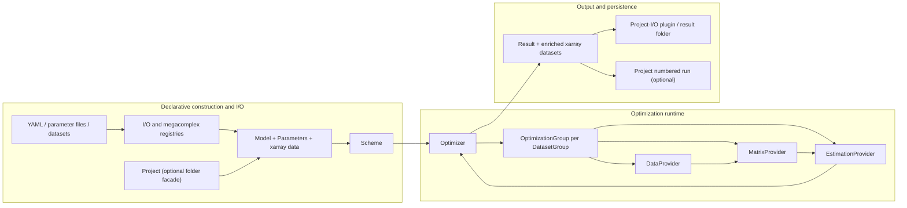
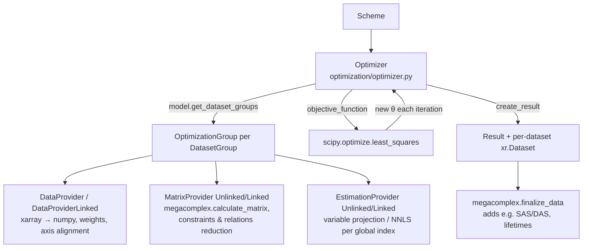

# pyglotaran architecture guide — v0.7.4

This document describes how pyglotaran (version `0.7.4`, package `glotaran`; the changelog
also contains an unreleased `0.7.5` section, [changelog.md](changelog.md)) works. It is written
for engineers and coding agents who need to decide **where** a change
belongs. Implementation code is the primary evidence; tests and documentation are linked
where they clarify contracts. Statements that are inferred rather than directly visible in
code are marked **(inferred)**.

> **Canonical document.** This guide is self-contained. Claims are based on the v0.7.4
> implementation and its tests; inferred claims are identified explicitly.

## Table of contents

- [1. System purpose and scope](#1-system-purpose-and-scope)
- [2. Architectural center of gravity](#2-architectural-center-of-gravity)
- [3. Main execution paths](#3-main-execution-paths)
  - [3.1 Construction and loading](#31-construction-and-loading)
  - [3.2 Validation and runtime model composition](#32-validation-and-runtime-model-composition)
  - [3.3 Optimization](#33-optimization)
  - [3.4 Matrix generation and conditional-linear estimation](#34-matrix-generation-and-conditional-linear-estimation)
  - [3.5 Simulation](#35-simulation)
  - [3.6 Result creation and persistence](#36-result-creation-and-persistence)
- [4. Core concepts and boundaries](#4-core-concepts-and-boundaries)
- [5. Extension architecture](#5-extension-architecture)
- [6. Persistence and compatibility](#6-persistence-and-compatibility)
- [7. Repository map](#7-repository-map)
- [8. Change guidance and risks](#8-change-guidance-and-risks)

---

## 1. System purpose and scope

pyglotaran is a fitting engine for **global and target analysis** of multi-dimensional
scientific data, most commonly time-resolved spectroscopy (see [README.md](README.md),
[docs/source/introduction.rst](docs/source/introduction.rst), and [setup.cfg](setup.cfg),
`description = The Glotaran fitting engine.`).

The mathematical problem it solves is **separable non-linear least squares**:

- Data is a 2-D matrix per dataset with a **model dimension** (e.g. `time`) and a
  **global dimension** (e.g. `spectral`).
- A user-defined model produces, for a set of non-linear parameters (rate constants,
  IRF widths, ...), a matrix `A(θ)` along the model dimension.
- The amplitudes along the global dimension — called **conditionally linear parameters
  (CLPs)**, physically e.g. spectra — are *not* optimized by the non-linear optimizer.
  They are solved per global-axis index by linear least squares (variable projection or
  NNLS), see [glotaran/optimization/estimation_provider.py](glotaran/optimization/estimation_provider.py).
- Only the non-linear parameters `θ` are optimized, by `scipy.optimize.least_squares`
  ([glotaran/optimization/optimizer.py](glotaran/optimization/optimizer.py)).

The engine produces fitted data, residuals, CLPs, matrices, uncertainty information, and
model-specific derived quantities.

**Primary abstractions**: `Model` (declarative model specification), `Megacomplex`
(pluggable matrix generator, the "lego brick" of the model), `Parameters` (named, bounded,
optionally expression-linked non-linear parameters), labeled 2-D data in `xarray.Dataset`
objects, `Scheme` (model + parameters + data + optimizer settings for one run),
`optimize()` (the engine entry point), `Result` (everything produced by a fit), and
`Project` (a folder-on-disk convenience workflow).

**Intentionally out of scope**:

- **Plotting/visualization** — delegated to the separate `pyglotaran-extras` package
  (listed only as an extra in [setup.cfg](setup.cfg), `options.extras_require`).
- **GUI** — the documented user environment is Jupyter notebooks
  ([docs/source/introduction.rst](docs/source/introduction.rst)). The bundled CLI is
  deprecated and scheduled for removal in 0.8.0
  ([glotaran/cli/main.py](glotaran/cli/main.py) prints a deprecation notice at startup).
- **Instrument control, experiment management, and general data cleaning** — data
  ingestion is limited to registered data-I/O formats, and only a minimal pydantic-based
  pre-processing pipeline exists ([glotaran/io/preprocessor/](glotaran/io/preprocessor/)).
  **(inferred** from the implemented interfaces and package boundaries rather than a
  single exhaustive scope statement**)**
- **Scientific reference-result validation** — maintained as a separate workflow around
  the pyglotaran-examples repository; this repository contains unit and integration tests
  plus the [validation/](validation/) CI submodule
  ([.github/workflows/integration-tests.yml](.github/workflows/integration-tests.yml)).

---

## 2. Architectural center of gravity

### The runtime spine

The true spine of the system is:

```
Scheme (model, parameters, data, options)
  → optimize(scheme)                      # glotaran/optimization/optimize.py
    → Optimizer → scipy.least_squares
      → per DatasetGroup: OptimizationGroup
        → DataProvider / MatrixProvider / EstimationProvider
  → Result
```

Evidence: [glotaran/optimization/optimize.py](glotaran/optimization/optimize.py) is a
3-line function `optimize(scheme) -> Result`; the engine tests build `Scheme` objects
directly and call `optimize()` without any `Project`, covering linked/unlinked, weighted,
full-model, and multiple-group cases
([glotaran/optimization/test/test_optimization.py](glotaran/optimization/test/test_optimization.py),
[glotaran/optimization/test/test_multiple_goups.py](glotaran/optimization/test/test_multiple_goups.py)).
The bundled test fixtures do the same
([glotaran/testing/simulated_data/sequential_spectral_decay.py](glotaran/testing/simulated_data/sequential_spectral_decay.py)).
`Project.optimize()` merely loads inputs, delegates to `optimize()`, and saves the result
([glotaran/project/project.py](glotaran/project/project.py)) — concrete evidence that
`Project` is a convenience workflow, not the runtime spine.

The public surface is layered rather than re-exported from the package root: the root
import loads plugins and defines the version ([glotaran/__init__.py](glotaran/__init__.py));
`glotaran.project` re-exports `Project`, `Scheme`, `Result`; `glotaran.model` re-exports
the model-building vocabulary; `glotaran.io` re-exports plugin-backed I/O.

### Role of each candidate "center"

| Object | Actual role | Architectural conclusion |
|---|---|---|
| `Model` | **Declarative schema, not runtime engine.** A `Model` *class* is generated dynamically from the set of megacomplex types used (`Model.create_class_from_megacomplexes` in [glotaran/model/model.py](glotaran/model/model.py)). Instances hold labeled item dictionaries, validate references, and generate parameter labels. The model never computes matrices itself; megacomplexes do. | Central domain schema and component-composition mechanism, but not the numerical loop. |
| `Megacomplex` | **The core computational plugin.** Subclasses implement `calculate_matrix()` and `finalize_data()` ([glotaran/model/megacomplex.py](glotaran/model/megacomplex.py)). All physics lives here (builtin ones in [glotaran/builtin/megacomplexes/](glotaran/builtin/megacomplexes/)). | Where scientific behavior is added. |
| `Scheme` | **The unit of work.** A dataclass bundling model, parameters, data mapping, CLP-link settings, least-squares tolerances/method, result path, and SVD option ([glotaran/project/scheme.py](glotaran/project/scheme.py)). Accepts objects or file paths through file-loadable dataclass fields. | The public boundary between construction/I/O and optimization. Configuration, not the engine. |
| `optimize()` | Constructs `Optimizer`, runs it, returns `Optimizer.create_result()` ([glotaran/optimization/optimize.py](glotaran/optimization/optimize.py)). | The small, stable public runtime entry point. |
| `Optimizer` | Adapts `Parameters` to SciPy, owns evaluation history and optimization groups, concatenates penalties, handles failures, computes covariance/error statistics, constructs the `Result` ([glotaran/optimization/optimizer.py](glotaran/optimization/optimizer.py)). | Top-level runtime orchestrator. |
| Plugin registration | Process-global registries filled at import time from entry points ([glotaran/plugin_system/base_registry.py](glotaran/plugin_system/base_registry.py); `load_plugins()` is called in [glotaran/__init__.py](glotaran/__init__.py)). All I/O (`load_model`, `save_result`, ...) dispatches through it. | Construction and I/O extension mechanism. Plugins do not drive the optimizer loop. |
| `Result` | A dataclass ([glotaran/project/result.py](glotaran/project/result.py)) holding the original scheme, initial/optimized parameters, histories, statistics, and one enriched `xarray.Dataset` per dataset. Can save, recreate, verify, or derive a new scheme. | The output contract and reproducibility container. |
| `Project` | Manages a folder layout (`data/`, `models/`, `parameters/`, `results/`) via filesystem-scanning registries and composes the core API: `Project.optimize()` builds a `Scheme` and calls `optimize()` ([glotaran/project/project.py](glotaran/project/project.py)). Nothing in `glotaran/optimization` or `glotaran/model` imports `Project`. | **Convenience workflow, not core.** Do not treat it as the central abstraction. |

### Layering (who may depend on whom)

```
glotaran/parameter        (no glotaran deps except utils/io loader indirection)
glotaran/model            → parameter
glotaran/optimization     → model, parameter, project.Scheme/Result
glotaran/simulation       → model, optimization.MatrixProvider
glotaran/project          → model, parameter, io  (Scheme/Result are here)
glotaran/io + plugin_system  (interfaces + registries; used by everything for load/save)
glotaran/builtin          (plugins: megacomplexes + io formats; depends on all of the above)
```

Note one deliberate inversion: `Scheme` and `Result` live in `glotaran/project` but are
consumed by `glotaran/optimization` — the "project" package is both the convenience layer
(`Project`) and the home of the core data contracts (`Scheme`, `Result`). Keep that in
mind when adding imports; `glotaran/model` must not import from `glotaran/optimization`
or `glotaran/project`.

### Runtime architecture at a glance



The providers are runtime objects. They cache normalized data layouts, matrices, CLPs,
and residuals for the current parameter vector. They must not leak into persisted model
schemas.

---

## 3. Main execution paths

### 3.1 Construction and loading

There are three supported construction styles:

1. Construct `Model`, `Parameters`, datasets, and `Scheme` in Python. Tests use this path
   to exercise the core without persistence
   ([glotaran/optimization/test/test_optimization.py](glotaran/optimization/test/test_optimization.py)).
2. Load them through the functions exported by [glotaran.io](glotaran/io/__init__.py).
   These infer a format from the file suffix unless a format is explicit, then dispatch
   through a plugin registry
   ([glotaran/plugin_system/data_io_registration.py](glotaran/plugin_system/data_io_registration.py),
   [glotaran/plugin_system/project_io_registration.py](glotaran/plugin_system/project_io_registration.py)).
3. Use `Project` to scan a conventional `data/`, `models/`, `parameters/`, `results/`
   folder, then call `create_scheme()` or `optimize()`
   ([glotaran/project/project.py](glotaran/project/project.py),
   [glotaran/project/project_registry.py](glotaran/project/project_registry.py)).

At the I/O boundary, datasets become `xarray.Dataset` instances with a `data` variable and
a `source_path` attribute; a loaded `DataArray` is converted to a dataset. `DatasetMapping`
accepts a path, object, sequence, or mapping and normalizes them into a label-keyed
mapping ([glotaran/utils/io.py](glotaran/utils/io.py)). `Scheme.__post_init__()` resolves
file paths for its model, parameters, and datasets through dataclass field metadata
([glotaran/project/dataclass_helpers.py](glotaran/project/dataclass_helpers.py)).

**YAML model loading is more than deserialization.** There is no static `Model` schema;
the set of attributes a model accepts depends on which megacomplex types it uses:

1. `YmlProjectIo.load_model` reads the spec, applies deprecation rewrites and
   sanitization, resolves each megacomplex `type` string through the plugin registry
   (`get_megacomplex`), and calls `Model.create_class_from_megacomplexes(...)`(**spec)
   ([glotaran/builtin/io/yml/yml.py](glotaran/builtin/io/yml/yml.py)).
2. `create_class_from_megacomplexes` ([glotaran/model/model.py](glotaran/model/model.py))
   scans each megacomplex class for attributes typed as `ModelItemType[X]` and adds a
   `dict[str, X]` attribute to the model class for each item type (e.g. `DecayMegacomplex`
   has `k_matrix: list[ModelItemType[KMatrix]]`, so the generated model class gets a
   `k_matrix` dict). It also merges megacomplex-specific `DatasetModel` subclasses
   (e.g. `DecayDatasetModel` adds `irf` and `initial_concentration`,
   [glotaran/builtin/megacomplexes/decay/decay_megacomplex.py](glotaran/builtin/megacomplexes/decay/decay_megacomplex.py))
   into one dataset type via `attrs.make_class` with multiple bases.
3. attrs converters on each attribute turn nested dicts into `Item` instances
   (`_load_model_items_from_dict` in [glotaran/model/model.py](glotaran/model/model.py)).
   `TypedItem` subclasses (constraints, penalties, IRFs, ...) are discriminated by their
   `type` field ([glotaran/model/item.py](glotaran/model/item.py), `TypedItem.get_item_type_class`).

Persisted YAML therefore describes structure and type names; it does not persist the
generated Python class identity.

Inside items, references are **strings (labels)** at rest. They are only resolved to real
objects ("filled") at optimization/simulation time by `fill_item()`
([glotaran/model/item.py](glotaran/model/item.py)), which recursively replaces model-item
labels with filled copies and parameter labels with `Parameter` instances.

### 3.2 Validation and runtime model composition

`Model.get_issues()` / `Model.validate()` iterate all items and collect `ItemIssue`s:

- referenced model-item labels exist;
- referenced parameter labels exist when parameters were supplied;
- per-attribute validator functions attached via `attribute(validator=...)` metadata,
  including megacomplex exclusivity/uniqueness rules on `DatasetModel.megacomplex`
  ([glotaran/model/model.py](glotaran/model/model.py),
  [glotaran/model/item.py](glotaran/model/item.py),
  [glotaran/model/dataset_model.py](glotaran/model/dataset_model.py)).

`Scheme.validate()` just delegates to `model.validate(parameters)`.

**Validation is advisory: `optimize()` does not call it.** `Optimizer.__init__` checks
only that every model dataset has data, parameters are present, and the SciPy method is
supported ([glotaran/optimization/optimizer.py](glotaran/optimization/optimizer.py)).
Callers that build a scheme programmatically should call `scheme.validate()` before
optimization when they need a complete user-facing error list; otherwise unresolved
references fail later during matrix construction.

The declarative `Model` is never mutated into an executable model. For every parameter
vector, `DatasetGroup.set_parameters()` calls `fill_item()` for each dataset model,
producing evolved copies with labels resolved against the current `Parameters`
([glotaran/model/dataset_group.py](glotaran/model/dataset_group.py)). The filled dataset
models, provider caches, and the group itself form the executable runtime graph.

### 3.3 Optimization



Ownership and data transformation at each boundary:

- **`Optimizer.__init__`** copies `scheme.parameters`, builds one `OptimizationGroup` per
  `DatasetGroup` (grouping comes from `DatasetModel.group` and `Model.dataset_groups`,
  [glotaran/model/model.py](glotaran/model/model.py) `get_dataset_groups`), and starts a
  `ParameterHistory`. It maps the public method names `TrustRegionReflection`, `Dogbox`,
  and `Levenberg-Marquardt` to SciPy's `trf`, `dogbox`, and `lm`.
- **`DataProvider`** ([glotaran/optimization/data_provider.py](glotaran/optimization/data_provider.py))
  owns the numeric views of the data: it infers the model dimension from the filled
  megacomplexes and treats the other `data` dimension as global, copies each dataset's
  `data` (and `weight`) into numpy arrays oriented `(model, global)`, and multiplies data
  by weights once up front. Model-defined `Weight` items are rasterized here
  (`add_model_weight`). For a full model it also stores transposed, flattened data and
  weights. `DataProviderLinked` additionally merges the global axes of all datasets in
  the group into one aligned axis using `scheme.clp_link_tolerance`/`clp_link_method` and
  precomputes, per aligned index, which datasets contribute (`group_definitions`).
- **`MatrixProvider`** ([glotaran/optimization/matrix_provider.py](glotaran/optimization/matrix_provider.py))
  owns the model matrices. Per dataset it calls each megacomplex's `calculate_matrix`,
  scales and sums them by CLP-label union (`combine_megacomplex_matrices`), then applies
  CLP constraints (column removal) and CLP relations (column merge via a relation matrix)
  in `reduce_matrix`, then dataset scale and weights. Matrices are 2-D `(model, clp)` or
  3-D `(global, model, clp)` when index dependent (`MatrixContainer.is_index_dependent`
  is literally `ndim == 3`).
- **`EstimationProvider`** ([glotaran/optimization/estimation_provider.py](glotaran/optimization/estimation_provider.py))
  owns CLPs and residuals. Per global-axis index it solves the linear problem with the
  group's `residual_function` (`variable_projection` default, or
  `non_negative_least_squares`; map `SUPPORTED_RESIUDAL_FUNCTIONS` — the misspelling is
  part of the current internal symbol name), back-fills constrained/related CLPs
  (`retrieve_clps`), and computes `EqualAreaPenalty` terms that are appended to the
  residual vector.
- **`Optimizer.objective_function`** writes the optimizer's parameter vector back into
  the labeled `Parameters` object and returns the concatenated penalty vector of all
  groups.

**Optimization orchestration (pseudocode)** —
[glotaran/optimization/optimizer.py](glotaran/optimization/optimizer.py)

```
optimize(scheme):
    assert every model dataset has input data
    parameters = copy(scheme.parameters)
    groups = [OptimizationGroup(scheme, g) for g in scheme.model.get_dataset_groups()]

    θ_labels, θ0, lower, upper = parameters.free_parameters()
        # only vary=True parameters are exposed to SciPy;
        # non_negative parameters enter log-transformed:
        #   Parameter.get_value_and_bounds_for_optimization  (parameter.py)

    def objective(θ):
        parameters.set_from(θ_labels, θ)
            # inverse log-transform applied here; expressions recomputed
        for group in groups:
            group.calculate(parameters)     # fill items, matrices, then estimation
        record parameter history
        return concat(group.full_penalty for group in groups)
            # full_penalty = weighted residuals ++ clp penalties, one flat vector

    result = scipy.least_squares(objective, θ0, bounds=(lower, upper),
                                 method=scheme.optimization_method, tol=scheme.*tol)
    return create_result(result)
        # statistics, covariance via SVD of Jacobian, one final objective
        # evaluation at best parameters, per-dataset result datasets
```

**Inputs:** a `Scheme` whose datasets cover `model.dataset`, and initialized parameters.
**Output:** a `Result`, or `InitialParameterError` if even the initial vector could not
be evaluated; other runtime exceptions are raised or converted to an unsuccessful result
depending on `raise_exception`.

**Invariants:** the residual vector layout (ordering of datasets/indices) must be stable
across iterations; `objective` must be deterministic in `θ`; every objective return is
one flat residual/penalty vector; each call refills all dataset models from the same
`Parameters` instance (`DatasetGroup.set_parameters`,
[glotaran/model/dataset_group.py](glotaran/model/dataset_group.py)).

### 3.4 Matrix generation and conditional-linear estimation

`OptimizationGroup` selects linked or unlinked provider families. If
`DatasetGroupModel.link_clp` is `None`, linkability is inferred: full/global models cannot
link, model dimensions must match, and all data must expose one global dimension; explicit
`True`/`False` overrides the inference
([glotaran/model/dataset_group.py](glotaran/model/dataset_group.py),
[glotaran/optimization/optimization_group.py](glotaran/optimization/optimization_group.py)).

**Residual construction per dataset group (pseudocode)** —
[glotaran/optimization/matrix_provider.py](glotaran/optimization/matrix_provider.py),
[glotaran/optimization/estimation_provider.py](glotaran/optimization/estimation_provider.py)

```
# Unlinked group (each dataset independent):
for dataset in group:
    A = Σ_megacomplex scale_m * calculate_matrix(m, dataset_model, axes)
        # columns unioned by clp label, duplicate-label columns added;
        # 3-D if any megacomplex is index dependent
    for i, x_i in enumerate(global_axis):
        A_i = A[i] if index_dependent else A
        A_i = apply_relations(apply_constraints(A_i, x_i), x_i)   # column reduce
        A_i = weight_i * dataset_scale * A_i
        reduced_clp_i, residual_i = residual_function(A_i, data[:, i])
        clp_i = retrieve_clps(reduced_clp_i)   # re-insert constrained/related columns
penalty = concat(all residual_i) ++ equal_area_penalties(clps)

# Linked group: same idea, but per aligned global index the matrices of all
# contributing datasets are stacked block-wise into one matrix whose columns are
# the union of their clp labels (MatrixProviderLinked.align_matrices), and the
# data vectors are concatenated (DataProviderLinked). One linear solve per index
# yields shared clps across datasets.

# Full-model dataset (has global_megacomplex): no per-index solve; instead
# full_matrix = kron(global_matrix, matrix) (row-wise kron when index dependent)
# and one linear solve against the flattened data
# (MatrixProviderUnlinked.calculate_full_matrices,
#  EstimationProviderUnlinked.calculate_full_model_estimation).
```

**Invariant: label order is part of the numerical contract.** Every matrix column and
estimated CLP value is interpreted through the adjacent ordered CLP-label list. Matrix
composition, relation/constraint reduction, CLP reconstruction, linked alignment,
full-model reshape, and finalized result arrays all share these ordered lists.

**Variable projection kernel** —
[glotaran/optimization/variable_projection.py](glotaran/optimization/variable_projection.py)

```
residual_variable_projection(A (n×k), y (n)):
    QR-factorize A                       (LAPACK dgeqrf)
    z = Qᵀ y                             (dormqr)
    clp = solve R·clp = z[:k]            (dtrtrs)
    z[:k] = 0                            # project out the range of A
    residual = Q z                       (dormqr)
    return clp, residual                 # residual ⟂ range(A), length n
```

The returned residual is the orthogonal projection of the data onto the complement of the
matrix column space; its norm equals the least-squares residual norm, so the non-linear
optimizer sees a smooth function of `θ` only. The NNLS variant
([glotaran/optimization/nnls.py](glotaran/optimization/nnls.py)) instead solves
`min ||A·clp − data||` with `clp ≥ 0` and returns `data − A·clp` —
inequality-constrained, not a projection.

### 3.5 Simulation

`simulate(model, dataset_label, parameters, coordinates, ...)`
([glotaran/simulation/simulation.py](glotaran/simulation/simulation.py)) reuses model
composition and the same megacomplex matrix contract, but not `Optimizer` or the provider
stack: it fills one dataset model, calls `MatrixProvider.calculate_dataset_matrix` for
the model axis, and multiplies with CLPs supplied either explicitly (`clp=` DataArray) or
generated from the dataset's `global_megacomplex`. Optional Gaussian noise is added at
the end. Global index-dependent matrices are rejected for full-model simulation
([glotaran/simulation/test/test_simulation.py](glotaran/simulation/test/test_simulation.py)).

This reuse is an important boundary: model components must express their numerical
contribution through `Megacomplex.calculate_matrix()` so simulation and optimization stay
consistent. Simulation is the basis of engine tests and the bundled example data
([glotaran/testing/simulated_data/](glotaran/testing/simulated_data/)).

### 3.6 Result creation and persistence

`Optimizer.create_result()` computes fit statistics (`chi_square`,
`degrees_of_freedom = n_residuals − n_free_params − n_clps`, RMSE), the covariance matrix
via an SVD-based pseudoinverse of the Jacobian, and standard errors (with a special
branch for log-transformed non-negative parameters).

Two behaviors deserve attention:

- **Failure and history behavior.** If the initial parameter vector could not be
  evaluated (only one history record), `InitialParameterError` is raised. If optimization
  fails after at least one evaluation, the last evaluable parameter state is restored
  from history (index `-2`) and an unsuccessful `Result` can still be returned
  ([glotaran/optimization/optimizer.py](glotaran/optimization/optimizer.py)).
- **`Result.success` is not SciPy convergence status.** It is set from whether a SciPy
  `OptimizeResult` object was returned (`self._optimization_result is not None`), not
  from that object's `success` field. A run stopped by an evaluation limit can therefore
  follow the "successful result construction" path even when SciPy did not report
  convergence. Treat any change here as a public behavior change.

Then each `OptimizationGroup.create_result_data()` starts from a copy of the input
dataset and attaches: `matrix` (and optional `global_matrix`), `clp`, weighted and/or
unweighted `residual`, optional SVD diagnostics, dataset-level RMSE attributes and scale,
and `fitted_data = data − residual`. Finally it calls each participating megacomplex's
`finalize_data()` hook, which adds model-specific coordinates and derived arrays such as
decay/species-associated spectra
([glotaran/optimization/optimization_group.py](glotaran/optimization/optimization_group.py),
[glotaran/model/dataset_model.py](glotaran/model/dataset_model.py) `finalize_dataset_model`).
Result dataset shape and variable contracts are asserted in
[glotaran/optimization/test/test_optimization.py](glotaran/optimization/test/test_optimization.py).

The `Result` keeps both the original `Scheme` and the optimized `Parameters`;
`Result.get_scheme()` returns a dataclass replacement of the original scheme with
optimized parameters — it retains the original scheme data, not the enriched result
datasets ([glotaran/project/test/test_result.py](glotaran/project/test/test_result.py)).

Saving: `Result.save(path)` → `save_result(..., format_name="yml")` →
`YmlProjectIo.save_result` writes `result.yml`, `scheme.yml`, `model.yml` and delegates
the data files to the `folder` plugin (`result.md`, `initial_parameters.csv`,
`optimized_parameters.csv`, `parameter_history.csv`, `optimization_history.csv`, one
`{dataset}.nc` per dataset)
([glotaran/builtin/io/yml/yml.py](glotaran/builtin/io/yml/yml.py),
[glotaran/builtin/io/folder/folder_plugin.py](glotaran/builtin/io/folder/folder_plugin.py)).
`Project` adds a separate convention: every save creates
`results/<name>_run_NNNN/result.yml`
([glotaran/project/project_result_registry.py](glotaran/project/project_result_registry.py)).

---

## 4. Core concepts and boundaries

### Object kinds and lifecycles

| Kind | Objects | Responsibility and lifecycle |
|---|---|---|
| Declarative domain schema | `Model`, `DatasetModel`, `DatasetGroupModel`, `Megacomplex`, other `Item`/`ModelItem` subclasses | Usually loaded or constructed once. Keeps labels and parameter references serializable. Validates the graph. A dynamic `Model` subclass exposes the fields required by selected components. |
| Run configuration | `Scheme`, `Parameters`, input `xarray.Dataset` mapping | Binds a model to initial values, concrete data, linking policy, and optimizer options. Crosses into the runtime at `optimize()`. |
| Executable runtime | `Optimizer`, `DatasetGroup`, `OptimizationGroup`, `DataProvider`, `MatrixProvider`, `EstimationProvider`, `MatrixContainer` | Created per run. Holds current filled items and mutable numerical caches, recalculated for each objective evaluation. Not serialized. |
| Output record | `Result`, parameter/optimization histories, enriched result datasets | Created after optimization. Contains enough input and output state for saving, reporting, recreation, and verification. |
| Disk workflow | `Project` and `Project*Registry` | Optional facade over filesystem discovery, imports, run naming, and save/load. Its registries scan the filesystem on access. |

### The item system (declarative schema mini-framework)

Everything model-side is built on [glotaran/model/item.py](glotaran/model/item.py):

- `@item` turns a class into an attrs class; `Item` (plain), `ModelItem` (has `label`,
  stored in model dicts), `TypedItem` (discriminated union via `type` field, subclasses
  self-register in `__item_types__`), `ModelItemTyped` (both).
- Attribute types carry semantics: `ParameterType` (= `Parameter | str`) marks values
  that get resolved from `Parameters`; `ModelItemType[X]` (= `X | str`) marks label
  references into the model's item dictionary for `X`.
- Field metadata from `attribute()` provides aliases and validators. The same
  annotations drive dynamic model-class creation, filling, and validation — changing an
  annotation is simultaneously a schema and a runtime change.
- Items are **declarative and label-based at rest**; `fill_item()` produces resolved
  copies at run time. An unfilled item still contains strings.

Concrete item families: `DatasetModel`, `Megacomplex`, `Weight` (data weighting),
`ClpConstraint` (`zero`/`only`), `ClpRelation` (`target = parameter · source`),
`EqualAreaPenalty`, `DatasetGroupModel` — all in [glotaran/model/](glotaran/model/).

Runtime counterparts: `DatasetGroup` (attrs class holding *filled* dataset models plus
`residual_function`/`link_clp`, [glotaran/model/dataset_group.py](glotaran/model/dataset_group.py))
and the provider triple in [glotaran/optimization/](glotaran/optimization/). Providers
are created once per `optimize()` call and are stateful across iterations (they cache
matrices/residuals keyed by dataset).

### Parameters

`Parameters` ([glotaran/parameter/parameters.py](glotaran/parameter/parameters.py)) is a
flat, dot-namespaced label → `Parameter` map with loaders from lists/dicts/DataFrames and
conversion to/from flat optimization arrays. `Parameter`
([glotaran/parameter/parameter.py](glotaran/parameter/parameter.py)) carries `value`,
bounds, `vary`, `non_negative` (log-transform for optimization) and `expression`.
Expressions (`$other.label` syntax) are evaluated with `asteval`; a parameter with an
expression is forced to `vary=False` and recomputed in `update_parameter_expression()`
whenever values change. Labels must be unique and valid; expressions must evaluate to
numbers. `ParameterHistory` records the parameter vector per iteration.

**CLPs are not `Parameter` objects.** They are solved conditionally for each matrix/data
slice. Relations reduce one CLP to a scaled form of another; constraints remove CLP
columns on selected intervals; equal-area penalties add scalar residual terms; weights
multiply data and matrices before estimation
([glotaran/model/clp_relation.py](glotaran/model/clp_relation.py),
[glotaran/model/clp_constraint.py](glotaran/model/clp_constraint.py),
[glotaran/model/clp_penalties.py](glotaran/model/clp_penalties.py),
[glotaran/model/weight.py](glotaran/model/weight.py)). These features cross the
model/numerics boundary through `MatrixProvider`, `EstimationProvider`, and
`DataProvider`, respectively.

### Separation of concerns (summary)

| Concern | Location | Must not know about |
|---|---|---|
| Orchestration | `optimization/optimizer.py`, `optimize.py`, `optimization_group.py` | file formats, YAML, project folders |
| Model logic / physics | `Megacomplex` subclasses in `builtin/megacomplexes/` | scipy optimizer, project registries, I/O |
| Numerical algorithms | `optimization/{variable_projection,nnls}.py` | model items entirely (they see only `(matrix, data)`) |
| Data marshalling | `optimization/data_provider.py` | megacomplex internals |
| I/O / serialization | `plugin_system/*_registration.py`, `builtin/io/` | optimization internals; must not enter objective evaluation |
| Diagnostics/statistics | `Optimizer.create_result`, `OptimizationGroup.create_result_data`, `Megacomplex.finalize_data` | — (split: generic run/dataset diagnostics vs. model-specific derived data) |
| Workflow convenience | `project/project.py` + registries | (uses only public core API; core must stay usable without it) |

---

## 5. Extension architecture

### Discovery and registration

- At `import glotaran`, `load_plugins()` loads every installed entry point whose group
  starts with `glotaran.plugins`
  ([glotaran/plugin_system/base_registry.py](glotaran/plugin_system/base_registry.py)).
  Built-ins register through the package's own entry points in [setup.cfg](setup.cfg)
  (`glotaran.plugins.data_io`, `glotaran.plugins.megacomplexes`,
  `glotaran.plugins.project_io`). Set env var `DEACTIVATE_GTA_PLUGINS` to skip loading.
- Three process-global mutable maps live in the private class `__PluginRegistry`:
  `megacomplex` (classes), `data_io` and `project_io` (instances, one per format name).
  Registration stores both a short access name and a fully qualified import-path name.
- Registration happens as a side effect of decorators: `@megacomplex(...)`
  ([glotaran/model/megacomplex.py](glotaran/model/megacomplex.py)),
  `@register_data_io("fmt")`
  ([glotaran/plugin_system/data_io_registration.py](glotaran/plugin_system/data_io_registration.py)),
  `@register_project_io("fmt")`
  ([glotaran/plugin_system/project_io_registration.py](glotaran/plugin_system/project_io_registration.py)).
- Name collisions do not fail: the later implementation is kept under its full
  import-path name and a `PluginOverwriteWarning` is raised; the existing short-name
  binding is not silently replaced. Users can pin a winner with
  `set_megacomplex_plugin` / `set_data_plugin` / `set_project_plugin`
  (`set_plugin` in [glotaran/plugin_system/base_registry.py](glotaran/plugin_system/base_registry.py)).
  Conflict and pinning behavior is tested under
  [glotaran/plugin_system/test/](glotaran/plugin_system/test/).
- Convenience functions (`load_dataset`, `save_result`, ...) infer the format from the
  file extension (`infer_file_format` in
  [glotaran/plugin_system/io_plugin_utils.py](glotaran/plugin_system/io_plugin_utils.py))
  unless `format_name=` is passed.
- Tests can sandbox registries with the context managers in
  [glotaran/testing/plugin_system.py](glotaran/testing/plugin_system.py)
  (`monkeypatch_plugin_registry*`).

**Not every extension point is a plugin.** Residual algorithms, non-linear optimizer
methods, preprocessors, and result diagnostics are closed, in-repository extension points
(hardcoded maps or unions). Treating them as dynamically discoverable without adding a
registry would be an architectural change.

**Model-item type registration is a separate mechanism.** The `@item` decorator gives
each direct `TypedItem` hierarchy its own `__item_types__` map; decorated typed
subclasses register their default `type` string there, and `_load_item_from_dict()` uses
that map for CLP constraints, penalties, IRFs, and other typed items
([glotaran/model/item.py](glotaran/model/item.py),
[glotaran/model/model.py](glotaran/model/model.py)). Megacomplex types instead use the
process-global plugin registry because they must be discovered *before* a dynamic
`Model` class can be constructed. A new typed model item must have a stable `type`
default and be imported before deserialization; exposing it through a megacomplex
annotation makes the dynamic model schema own its item dictionary.

### Minimal changes per extension type

**a) New model component (megacomplex)**
1. Define any supporting schema nodes as `@item` classes using `ParameterType` and
   `ModelItemType[X]` annotations (sub-items become model-level dictionaries
   automatically).
2. Subclass `Megacomplex` with `@megacomplex(...)`; give `type: str = "my_type"` a
   default and a stable `dimension`. Optionally pass `dataset_model_type=` to add
   dataset-level fields (see `DecayDatasetModel`), and `exclusive=`/`unique=` for
   composition rules.
3. Implement `calculate_matrix(dataset_model, global_axis, model_axis) -> (clp_labels, matrix)`
   (return 3-D `(global, model, clp)` for index-dependent matrices) and
   `finalize_data(...)` for result decoration. The matrix row count must match the model
   axis, and returned labels must match its columns.
4. Register: built-in → new subpackage under
   [glotaran/builtin/megacomplexes/](glotaran/builtin/megacomplexes/) plus an entry-point
   line in [setup.cfg](setup.cfg); external package → an equivalent entry point in its
   own metadata that imports the module containing the decorator.
5. Tests: schema/composition tests like
   [glotaran/model/test/test_megacomplex.py](glotaran/model/test/test_megacomplex.py),
   colocated matrix/finalization unit tests (pattern:
   [glotaran/builtin/megacomplexes/decay/test/](glotaran/builtin/megacomplexes/decay/test/)),
   and a simulate → optimize round trip as in
   [glotaran/optimization/test/test_optimization.py](glotaran/optimization/test/test_optimization.py).

Do not add component-specific branches to `MatrixProvider`; its contract is already
expressed by the matrix and labels returned from `calculate_matrix()`. A change to the
common contract belongs in `Megacomplex`, `MatrixProvider`, simulation, and their shared
tests together.

**b) New residual/optimization algorithm** — no plugin registry; these are hardcoded maps:
- Conditional-linear residual solver: add a `(matrix, data) -> (clp, residual)` function
  beside [glotaran/optimization/nnls.py](glotaran/optimization/nnls.py) and
  [glotaran/optimization/variable_projection.py](glotaran/optimization/variable_projection.py),
  register it in `SUPPORTED_RESIUDAL_FUNCTIONS` in
  [glotaran/optimization/estimation_provider.py](glotaran/optimization/estimation_provider.py),
  and extend the `Literal` on `DatasetGroupModel.residual_function` and `DatasetGroup`
  ([glotaran/model/dataset_group.py](glotaran/model/dataset_group.py)). Test both linked
  and unlinked provider paths
  ([glotaran/optimization/test/test_estimation_provider.py](glotaran/optimization/test/test_estimation_provider.py));
  if the solver changes CLP counts or residual length, update degrees-of-freedom and
  result tests too.
- Non-linear method: extend `SUPPORTED_METHODS` in
  [glotaran/optimization/optimizer.py](glotaran/optimization/optimizer.py) and the
  `Literal` on `Scheme.optimization_method`
  ([glotaran/project/scheme.py](glotaran/project/scheme.py)). A method compatible with
  `scipy.least_squares` needs only mapping, schema, and tests. A different backend
  requires an adapter that preserves the objective callback, bounds, the result fields
  used by `create_result()`, failure semantics, histories, Jacobian availability, and
  covariance behavior.

**c) New file format / serializer** — choose the boundary first:
- `DataIoInterface` ([glotaran/io/interface.py](glotaran/io/interface.py)) is for
  `xarray` data files: implement `load_dataset` and/or `save_dataset`, decorate with
  `@register_data_io("ext")`.
- `ProjectIoInterface` is for one or more of `Model`, `Parameters`, `Scheme`, `Result`:
  implement the relevant subset of `load_model/save_model/.../save_result`, decorate with
  `@register_project_io("ext")`. Reference implementations:
  [glotaran/builtin/io/yml/yml.py](glotaran/builtin/io/yml/yml.py) (broadest),
  [glotaran/builtin/io/pandas/](glotaran/builtin/io/pandas/) (parameters only).
- Unimplemented base methods are allowed and are reported as unsupported (a friendly
  `ValueError`). Preserve overwrite protection, format inference, `source_path`, and the
  convention that loaded data is normalized to a dataset. Add the entry point in
  [setup.cfg](setup.cfg) if built-in.
- Tests: registry/dispatch/round-trip/overwrite tests modeled on
  [glotaran/plugin_system/test/test_data_io_registration.py](glotaran/plugin_system/test/test_data_io_registration.py)
  or [test_project_io_registration.py](glotaran/plugin_system/test/test_project_io_registration.py);
  for a result serializer also a complete directory round trip like
  [glotaran/builtin/io/yml/test/test_save_result.py](glotaran/builtin/io/yml/test/test_save_result.py).
  Do not serialize provider/runtime objects.

**d) New result diagnostic** — no registry; placement decides:
- Global scalars/statistics from the final optimizer state → `Optimizer.create_result()`
  plus a typed field on the `Result` dataclass
  ([glotaran/project/result.py](glotaran/project/result.py)); check the YAML round trip,
  since `Result` fields serialize into `result.yml` unless marked with
  `exclude_from_dict_field`.
- Per-dataset, model-agnostic arrays (like SVD, RMSE) →
  `OptimizationGroup.create_result_data`
  ([glotaran/optimization/optimization_group.py](glotaran/optimization/optimization_group.py)).
- Per-dataset, model-specific quantities → the owning megacomplex's `finalize_data`, with
  a guard against duplicate work when several components of the same kind participate.
- A diagnostic that does not need persistence can remain a standalone helper that accepts
  `Result` or `xarray.Dataset`; do not expand the runtime pipeline for presentation.

**e) New preprocessing step** — a small pydantic pipeline, not a plugin:
Add a `PreProcessor` subclass with a unique literal `action` in
[glotaran/io/preprocessor/preprocessor.py](glotaran/io/preprocessor/preprocessor.py),
implement `apply(DataArray) -> DataArray`, add the class to the discriminated
`PipelineAction` union and (optionally) a fluent builder method on
`PreProcessingPipeline` ([glotaran/io/preprocessor/pipeline.py](glotaran/io/preprocessor/pipeline.py)).
Test the numerical transform and the `model_dump()`/`model_validate()` round trip
([glotaran/io/preprocessor/test/](glotaran/io/preprocessor/test/)). The pipeline is
standalone; nothing in `Scheme`/`Project`/`Optimizer` invokes it automatically — pass its
output as scheme data or use `Project.create_scheme(data_lookup_override=...)`.

**f) New high-level workflow helper** — place it by what it coordinates:
- `Project` ([glotaran/project/project.py](glotaran/project/project.py)) only when it
  depends on the project folder, live registries, conventional names, or numbered runs;
- the public `glotaran.io` functions for format-driven load/save helpers;
- a focused utility (pattern: `create_clp_guide_dataset` in
  [glotaran/utils/io.py](glotaran/utils/io.py)) for object-based workflows that must work
  without a disk layout;
- an external notebook/`pyglotaran-extras` helper for plotting or application-specific
  orchestration.

A workflow wrapper must delegate to `optimize()` rather than duplicate provider
orchestration, and must never import optimization internals (providers). Do not put new
workflows in the deprecated CLI ([glotaran/cli/main.py](glotaran/cli/main.py)).

---

## 6. Persistence and compatibility

### Supported built-in formats

The actual capability is determined by which interface methods a registered class
overrides, not only by its extension.

| Format | Boundary | Current built-in capability |
|---|---|---|
| `nc` | Data I/O | Load and save `xarray` datasets through netCDF ([glotaran/builtin/io/netCDF/netCDF.py](glotaran/builtin/io/netCDF/netCDF.py)). |
| `ascii` | Data I/O | Load and save the legacy wavelength/time-explicit matrix format ([glotaran/builtin/io/ascii/wavelength_time_explicit_file.py](glotaran/builtin/io/ascii/wavelength_time_explicit_file.py)). |
| `sdt` | Data I/O | Load Becker & Hickl SDT measurement data; no saver is implemented ([glotaran/builtin/io/sdt/sdt_file_reader.py](glotaran/builtin/io/sdt/sdt_file_reader.py)). |
| `yml`, `yaml` | Project I/O | Load/save models and schemes; load parameters (no parameter saver); load/save complete results. The structural persistence format ([glotaran/builtin/io/yml/yml.py](glotaran/builtin/io/yml/yml.py)). |
| `yml_str` | Project I/O | YAML content supplied as a string for supported load operations; not a normal file extension. |
| `csv`, `tsv`, `xlsx`, `ods` | Project I/O | Load/save `Parameters` only ([glotaran/builtin/io/pandas/](glotaran/builtin/io/pandas/); `ods` is registered by the xlsx plugin). |
| `folder` | Project I/O | Internal result-file writer used by the YAML result saver; intentionally does not serialize a reloadable `Result` by itself ([glotaran/builtin/io/folder/folder_plugin.py](glotaran/builtin/io/folder/folder_plugin.py)). |
| `legacy` | Project I/O | Deprecated compatibility wrapper for the old result-folder call shape. |

Project file registries derive the suffixes they scan from plugins that implement the
required load method
([glotaran/project/project_model_registry.py](glotaran/project/project_model_registry.py),
[glotaran/project/project_parameter_registry.py](glotaran/project/project_parameter_registry.py),
[glotaran/project/project_data_registry.py](glotaran/project/project_data_registry.py)).
Installing a plugin can therefore change what files a `Project` discovers.

### Serialization boundary: runtime state vs. persisted state

- `Scheme` and `Result` are dataclasses whose heavyweight fields are declared with
  `file_loadable_field` ([glotaran/project/dataclass_helpers.py](glotaran/project/dataclass_helpers.py)).
  On save, `asdict()` replaces those fields with **relative file paths** derived from each
  object's `source_path`; on load, `fromdict()` re-loads them from those paths, resolved
  relative to the containing file. A saved `result.yml` therefore references `model.yml`,
  parameter CSVs and per-dataset `.nc` files rather than embedding them — persistence is
  a graph of files glued together by paths.
- `source_path` and `loader` are runtime metadata on file-loadable objects: datasets get
  a `source_path` attr on load
  ([glotaran/plugin_system/data_io_registration.py](glotaran/plugin_system/data_io_registration.py)),
  and saving through the public I/O wrappers normally *updates* `source_path` — saving is
  not observationally pure. `DatasetMapping` ([glotaran/utils/io.py](glotaran/utils/io.py))
  keeps the mapping for `Scheme.data`.
- Runtime and persisted state differ in several intentional ways:
  - the generated dynamic `Model` class identity is not saved; component `type` strings
    rebuild it on load;
  - filled item graphs, provider caches, weighted numerical arrays, and SciPy objects are
    never saved;
  - `Result` fields such as `jacobian` and `covariance_matrix` are excluded from the YAML
    via `exclude_from_dict_field` and are unavailable after a structural round trip;
  - result datasets are separate netCDF files referenced by the YAML manifest;
  - `SavingOptions.data_filter` can deliberately persist only a subset of result data
    variables ([glotaran/io/interface.py](glotaran/io/interface.py),
    [glotaran/builtin/io/folder/folder_plugin.py](glotaran/builtin/io/folder/folder_plugin.py)).

### Versioning and compatibility behavior

- Model spec: `model_spec_deprecations()` rewrites old YAML keys (e.g.
  `clp_area_penalties` → `clp_penalties`) with a warning before parsing
  ([glotaran/deprecation/modules/builtin_io_yml.py](glotaran/deprecation/modules/builtin_io_yml.py)).
- Result spec: `YmlProjectIo.load_result` renames legacy keys
  (`number_of_data_points` → `number_of_residuals`, `number_of_parameters` →
  `number_of_free_parameters`).
- `Result.glotaran_version` records the producing version; `Project` writes a `version`
  into `project.gta` and preserves it on open, but performs no version dispatch,
  rejection, or migration based on it
  ([glotaran/project/project.py](glotaran/project/project.py)). These fields are
  provenance markers, not a schema-version negotiation mechanism; no migration machinery
  exists beyond the key renames above **(inferred)**.
- A structured deprecation framework
  ([glotaran/deprecation/deprecation_utils.py](glotaran/deprecation/deprecation_utils.py))
  enforces removal deadlines (`check_overdue`); many APIs (CLI, `glotaran.analysis.*`,
  `Project.generate_*`, the `legacy` result format) are scheduled for removal in 0.8.0.
- This is not a promise that arbitrary old schemas will load; [NOTICE.md](NOTICE.md)
  warns that model and analysis specifications may be refactored. Any persisted field
  rename, `type`-string rename, CLP-label change, dataset variable/dimension rename, or
  default change is a compatibility change and needs a loader shim or a documented
  breaking change plus round-trip and reference-result testing.

**Project folder layout** (owned by the `Project*Registry` classes in
[glotaran/project/](glotaran/project/)): `project.gta` at the root; `data/` (imported
datasets, saved as `.nc`), `models/`, `parameters/`, `results/{name}_run_NNNN/`. Result
runs are auto-numbered; `load_latest_result` resolves the newest run.

---

## 7. Repository map

| Path | Architectural role |
|---|---|
| [glotaran/__init__.py](glotaran/__init__.py) | Package root; triggers plugin loading at import time; defines the version. |
| [glotaran/model/](glotaran/model/) | Declarative domain language: item framework (`item.py`: schema introspection, reference filling, validation), dynamic `Model` class factory (`model.py`), `Megacomplex` base + decorator (the numerical component contract), `DatasetModel`, CLP constraints/relations/penalties, `Weight`, dataset groups. |
| [glotaran/parameter/](glotaran/parameter/) | `Parameter`/`Parameters` containers, expression evaluation (asteval), bounds and non-negative log-transform, flat-array conversion, `ParameterHistory`. |
| [glotaran/optimization/](glotaran/optimization/) | The runtime spine: `optimize.py` (entry), `optimizer.py` (SciPy adapter, statistics, result assembly), `optimization_group.py` (provider-family selection + result datasets), `data_provider.py` / `matrix_provider.py` / `estimation_provider.py` (data layout / matrix logic / conditional-linear estimation), `variable_projection.py` and `nnls.py` (leaf numerical solvers), `optimization_history.py` (parses SciPy stdout). |
| [glotaran/simulation/](glotaran/simulation/) | Forward simulation reusing the filled model and megacomplex matrix contract, without the optimizer or provider stack. |
| [glotaran/project/](glotaran/project/) | Core contracts `Scheme` and `Result`; convenience `Project` + filesystem registries; `dataclass_helpers.py` connects object graphs to path-based manifests; model YAML generators (`generators/`, used by `glotaran.testing.simulated_data`; the `Project.generate_*` wrappers are deprecated). |
| [glotaran/io/](glotaran/io/) | I/O facade: `DataIoInterface`/`ProjectIoInterface`, `SavingOptions`, re-exports of registry-dispatching functions; dataset preparation/SVD helpers (`prepare_dataset.py`); standalone pre-processing pipeline (`preprocessor/`). |
| [glotaran/plugin_system/](glotaran/plugin_system/) | Process-global discovery, conflict handling, and registration/dispatch machinery for megacomplexes, data I/O and project I/O. Depends on interfaces, not numerical providers. |
| [glotaran/builtin/](glotaran/builtin/) | Built-in plugins: `megacomplexes/` (decay, spectral, baseline, coherent_artifact, damped_oscillation, pfid, clp_guide — where component equations and result finalization live) and `io/` (yml, folder, pandas, netCDF, ascii, sdt). Heavy math kernels use numba (e.g. [glotaran/builtin/megacomplexes/decay/decay_matrix_gaussian_irf.py](glotaran/builtin/megacomplexes/decay/decay_matrix_gaussian_irf.py)). |
| [glotaran/deprecation/](glotaran/deprecation/) | Deprecation framework with enforced deadlines and per-module shims (`glotaran.analysis` → `glotaran.optimization`/`simulation`). |
| [glotaran/testing/](glotaran/testing/) | Public test utilities: registry monkeypatch context managers, simulated datasets/schemes used in docs and tests. |
| [glotaran/cli/](glotaran/cli/) | Deprecated click CLI (removal planned for 0.8.0). Not a target for new architecture. |
| [glotaran/utils/](glotaran/utils/), [glotaran/typing/](glotaran/typing/) | Cross-cutting helpers (io path handling, ipython markdown rendering, sanitization, regex for stdout parsing) and typing protocols. |
| [tests/](tests/) | Repo-level integration-ish tests, mirroring the package; most unit tests are colocated in `glotaran/**/test/`. |
| [docs/](docs/) | Sphinx docs and executable notebooks ([docs/source/notebooks](docs/source/notebooks)) — they confirm public workflows but do not override implementation and tests when behavior differs. |
| [benchmark/](benchmark/), [validation/](validation/) | ASV benchmarks; CI submodule cross-checking results against reference examples from pyglotaran-examples. Use the validation layer for scientific-output compatibility checks. |

Note: `glotaran/builtin/elements/` and `glotaran/builtin/items/` currently exist in the
working tree but contain only untracked `__pycache__` leftovers (from work on a future
version); they are not part of the 0.7.x codebase.

---

## 8. Change guidance and risks

### Where to put new behavior

- Physics/matrix math and its derived result variables → a `Megacomplex` package (never
  in providers). Keep generic column alignment, constraints, linking, and weighting in
  providers.
- New declarative fields → the narrowest `Item` or `DatasetModel` subtype that owns them.
  Remember that annotations drive persistence, validation, filling, and dynamic class
  shape at once.
- Anything about *how* the linear solve happens → `estimation_provider.py` +
  `variable_projection.py`/`nnls.py`.
- Anything about *what data* enters the solve (weights, alignment, orientation) →
  `data_provider.py`.
- Parameter transformation or expression rules → `Parameter`/`Parameters`, not an
  optimizer callback branch.
- New model vocabulary (constraints, penalties, …) → new `Item` type in
  `glotaran/model/` + handling in the relevant provider.
- New file formats → an I/O plugin; never add format parsing or suffix branching to core
  classes.
- User convenience → `Project` or `glotaran/utils`, composed from the public API. Keep
  `Project` optional: a new core feature must remain accessible through object-based APIs.

### Dependencies that must not be introduced

- `glotaran/model` must not depend on `Project`, `glotaran/optimization`, or concrete
  serializer plugins.
- Megacomplex implementations must not depend on `Optimizer`, project registries, or
  SciPy's non-linear result type.
- Providers must not perform file I/O, parse YAML, scan folders, or mutate persisted
  schemas.
- `Project` may depend on public model/I/O/optimization APIs, but those layers must not
  depend on a project folder.
- Result formatting and plotting must not enter the objective function.

### Stable abstractions (change with great care)

- The `Megacomplex.calculate_matrix` contract (`(clp_labels, 2-D or 3-D matrix)`),
  including the 3-D-means-index-dependent convention — every plugin, both matrix
  providers, and simulation depend on it.
- The residual-function contract `(matrix, data) -> (clp, residual)`.
- The `Result`/`Scheme` field names — they are the YAML schema on disk.
- The registry function names re-exported from `glotaran.io` — external plugins and
  `pyglotaran-extras` use them **(inferred from the re-export layer design)**.
- The wider compatibility surface: plugin short names and full names, megacomplex `type`
  strings, YAML keys, parameter option names, dataset dimension/variable names, CLP
  labels, project folder conventions, and result manifest fields. Deprecation utilities
  only cover changes for which an explicit shim is added.

### Known hazards and hidden coupling

- **Import-time side effects**: importing `glotaran` loads all installed entry-point
  plugins into process-global mutable registries. Short-name conflicts depend on which
  implementation registered first (enumeration order of installed packages), while full
  names remain available. Pin with `set_*_plugin` in reproducible applications; isolate
  registries in tests with [glotaran/testing/plugin_system.py](glotaran/testing/plugin_system.py).
- **Matrix/CLP label ordering**: matrix columns, relation/constraint reduction, CLP
  reconstruction, linked alignment, full-model reshape, and finalized result arrays all
  share ordered label lists. Changing component iteration order or label deduplication
  can produce numerically plausible but mislabelled results; the changelog records a
  prior matrix-ordering bug ([changelog.md](changelog.md)). Cover changes with provider
  and end-to-end result-label tests.
- **Dynamically generated classes**: each loaded model gets a fresh uuid-named attrs
  class (`Model.create_class_from_megacomplexes`), and dataset models may be uuid-named
  merged classes. Identity checks (`type(a) is type(b)`), pickling, and
  isinstance-against-a-specific-generated-class are unreliable across loads
  **(inferred)**. Conflicting field names, incompatible dataset-model bases, aliases, or
  annotations can break loading far from the component being added — test
  mixed-component models, not only isolated components.
- **Stdout parsing**: iteration numbers and `OptimizationHistory` are extracted by
  regex-parsing SciPy's verbose stdout through `TeeContext`
  ([glotaran/optimization/optimizer.py](glotaran/optimization/optimizer.py),
  [glotaran/utils/regex.py](glotaran/utils/regex.py)). A SciPy upgrade that changes its
  progress table silently breaks history (guarded by returning 0 on no-match).
- **Mutable and shared state**: `Optimizer._parameters` is mutated in place every
  objective call and refilled into every dataset model (`fill_item` creates copies via
  `attrs.evolve`, but the `Parameter` objects inside are shared) — do not cache filled
  items across iterations. Expression parameters are recomputed via asteval on every
  update. `Scheme`, `Model`, and datasets remain referenced (not copied) by the
  optimizer; with `add_svd=True`, `OptimizationGroup` adds SVD variables to scheme
  datasets *in place* (`add_svd_to_dataset` is idempotent by variable name). Saving
  updates `source_path`. Code that assumes optimization and persistence are entirely
  side-effect free will be wrong.
- **Residual vector layout and statistics**: `number_of_clps`, `degrees_of_freedom`,
  chi-square, RMSE, and covariance scaling assume the penalty layout produced by
  `get_full_penalty` (residuals ++ penalties) and provider-specific CLP counting, which
  differs for linked, unlinked, and full models. Any new residual term, solver, or
  ordering change must update `Optimizer.create_result` and result/report tests together.
- **Weights alter the objective, not only reporting**: providers multiply both data and
  matrices by weights once up front; result assembly exposes a weighted residual and
  reconstructs the unweighted one (`OptimizationGroup.add_weight_to_result_data`). A
  change on one side corrupts the other. Test both dataset-supplied and model-declared
  weights.
- **Two-dimensional data assumption**: `DataProvider` infers the global dimension as
  "the first data dimension unequal to the model dimension" and silently transposes to
  `(model, global)`; simulation shares the two-axis assumption. Higher-dimensional data
  needs an explicit layout contract across providers, linking, flattening, result
  coordinates, SVD, and simulation — changing only a loader is insufficient.
- **Linked versus unlinked behavior**: automatic CLP linking depends on the filled model,
  dimensions, and data coordinates; tolerance-based alignment can merge coordinates and
  rejects ambiguous duplicates. Test dimension-inference, tolerance, or ordering changes
  in both provider families and with partially overlapping axes.
- **Failure/success semantics**: `Result.success` reflects whether SciPy returned a
  result object, not SciPy's own `success` flag; failure after the first evaluation
  restores parameters from history and still builds a `Result`, while an unevaluable
  initial vector raises `InitialParameterError`. Backend changes must preserve or
  deliberately revise this distinction, testing `termination_reason`, counts, statistics,
  and saved results together.
- **Index-dependence warning path**: interval constraints on index-independent matrices
  currently warn and apply everywhere (`MatrixProvider.does_interval_item_apply`) —
  scheduled to become an error in 0.9.0; don't "fix" silently.
- **Deprecation deadlines**: `check_overdue` makes deprecated APIs raise once the version
  reaches the announced removal version, and
  [glotaran/deprecation/test/](glotaran/deprecation/test/) fails builds when cleanups are
  overdue. Any new deprecation must follow this framework.
- **Persistence is a graph of files**: `result.yml`/`scheme.yml` are read back by
  `fromdict` with relative paths — renaming saved file names (e.g.
  `optimized_parameters.csv`), changing save order, or breaking `source_path` bookkeeping
  breaks loading of previously saved results. Always test saving into nested directories
  and loading from the manifest
  ([glotaran/project/test/test_result.py](glotaran/project/test/test_result.py)).

### Before changing X, inspect Y

| Before changing… | Inspect… |
|---|---|
| `Megacomplex.calculate_matrix` signature or matrix shape convention | `MatrixProvider.calculate_dataset_matrix` / `combine_megacomplex_matrices`, [glotaran/simulation/simulation.py](glotaran/simulation/simulation.py), `finalize_data` hooks, linked alignment, full-model Kronecker construction, saved result variable names, every class under `builtin/megacomplexes/` |
| Residual functions or adding an algorithm | `EstimationProvider.__init__` (`SUPPORTED_RESIUDAL_FUNCTIONS`), both estimation providers, `DatasetGroupModel.residual_function` Literal, CLP penalties, degrees-of-freedom calculation, failure behavior, `test_estimation_provider.py` |
| `Scheme` fields | `YmlProjectIo.save_scheme/load_scheme`, `dataclass_helpers.asdict/fromdict`, `Optimizer.__init__` (which fields it reads), CLI/notebook construction sites, result recreation |
| `Result` fields | `YmlProjectIo.save_result/load_result` (legacy key mapping), `exclude_from_dict_field` usage, `folder_plugin.py`, result rendering tests |
| `Model` or an item annotation | `item.py` introspection/filling, `Model.create_class_from_megacomplexes`, YAML loading, mixed-megacomplex tests |
| Parameter handling (bounds, non_negative, expressions) | `Parameter.get_value_and_bounds_for_optimization` / `set_value_from_optimization`, `Optimizer.calculate_covariance_matrix_and_standard_errors` (log-space error branch), `Parameters.update_parameter_expression`, CSV/YAML serialization |
| CLP constraints/relations/penalties | Both `MatrixProvider.reduce_matrix` (matrix side) **and** `EstimationProvider.retrieve_clps`/`calculate_clp_penalties` (CLP side) — they must stay consistent |
| Dataset linking/alignment | `DataProviderLinked.create_aligned_global_axes`, `MatrixProviderLinked.align_matrices`, `Scheme.clp_link_tolerance/clp_link_method`, `test_data_provider.py`, `test_multiple_goups.py` |
| Data dimensions or weights | `DataProvider`, `DataProviderLinked`, SVD preparation ([glotaran/io/prepare_dataset.py](glotaran/io/prepare_dataset.py)), simulation, result reconstruction, netCDF round trips |
| Plugin registration/dispatch | `plugin_system/base_registry.py` (collision behavior), package-root import timing, entry points in `setup.cfg`, project suffix discovery, `glotaran/testing/plugin_system.py` |
| Saved-result folder layout / persistence | `FolderProjectIo.save_result`, `ProjectResultRegistry` (run-numbering, `result.yml` lookup), `source_path` mutation, relative-path conversion, `SavingOptions`, YAML compatibility shims, nested-directory round trips, the [validation/](validation/) CI |
| `Project` | `Project*Registry`, public I/O dispatch, numbered result naming ([glotaran/project/project_result_registry.py](glotaran/project/project_result_registry.py)), project tests |
| Anything scheduled for 0.8.0 removal | [glotaran/deprecation/](glotaran/deprecation/) (utils + tests), grep for `to_be_removed_in_version` |
| A new convenience API | Verify it delegates to `Scheme`, `optimize()`, simulation, or public I/O rather than creating a second runtime path; keep it outside the deprecated CLI |

### Testing expectations

Unit tests are colocated (`glotaran/**/test/`), with a mirrored suite under
[tests/](tests/). Run the smallest relevant colocated tests while developing, then the
full package suite (`pytest ... glotaran`, [tox.ini](tox.ini)) for cross-layer changes;
notebook and external reference validation run as separate CI jobs
([.github/workflows/CI_CD_actions.yml](.github/workflows/CI_CD_actions.yml)). In
particular:

- schema changes need construction, validation, fill, YAML load/save, and
  mixed-component tests;
- engine changes should exercise the simulate → optimize round trip parameterized over
  `link_clp`, index dependence, weights, and both residual functions, as in
  [glotaran/optimization/test/test_optimization.py](glotaran/optimization/test/test_optimization.py)
  and [glotaran/optimization/test/suites.py](glotaran/optimization/test/suites.py);
- simulation-affecting matrix changes need simulation/optimization consistency tests;
- result changes need result-dataset, rendering, save/load, recreate, and minimal-save
  tests;
- I/O plugins get registry-conflict, full-name pinning, method-capability,
  format-inference, overwrite, and round-trip tests per format;
- scientifically meaningful numerical changes should run the external
  [validation/](validation/) workflow against reference results from the
  pyglotaran-examples repository.
