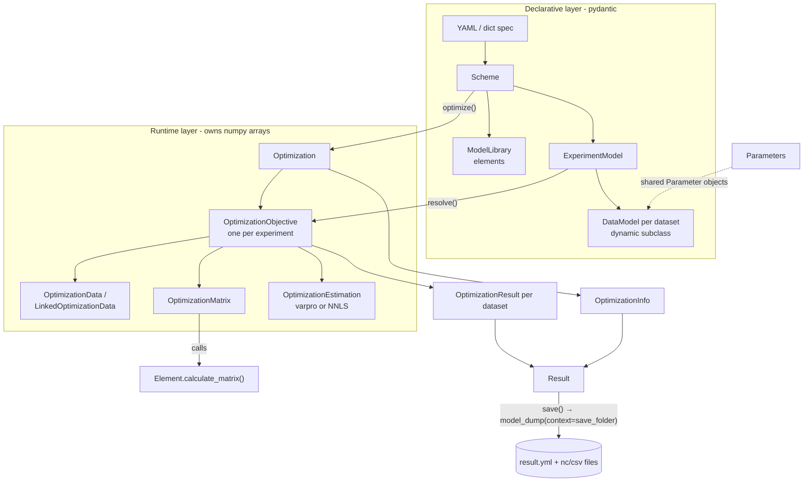

# pyglotaran architecture guide — v0.8.0 rewrite

This document describes the pyglotaran rewrite on branch `staging`, version `0.8.0.dev0`, after
the internal rewrite merged in
[PR #1562](https://github.com/glotaran/pyglotaran/pull/1562). It is written for engineers and
coding agents who need to decide **where** a change belongs before making it.

**Canonical document.** This guide is self-contained. All claims are grounded in the v0.8.0
rewrite implementation and its tests. File paths are repository-relative. Statements that are
inferred rather than directly established are marked **[inferred]**.

> **Important:** This branch differs substantially from the released 0.7.x line. Several classes
> that older documentation and tutorials treat as central — `Project`, `Model`, `Megacomplex`,
> a standalone `optimize()` function, and the CLI — **do not exist in this codebase**. See
> [Architectural center of gravity](#2-architectural-center-of-gravity).

## Table of contents

1. [System purpose and scope](#1-system-purpose-and-scope)
2. [Architectural center of gravity](#2-architectural-center-of-gravity)
3. [Main execution paths](#3-main-execution-paths)
4. [Core concepts and boundaries](#4-core-concepts-and-boundaries)
5. [Extension architecture](#5-extension-architecture)
6. [Persistence and compatibility](#6-persistence-and-compatibility)
7. [Repository map](#7-repository-map)
8. [Change guidance and risks](#8-change-guidance-and-risks)
9. [Consolidated implementation contracts](#9-consolidated-implementation-contracts)

---

## 1. System purpose and scope

pyglotaran is a fitting engine for **global and target analysis** of time-resolved spectroscopy
data. The scientific problem: a measured dataset is a 2-D array over a *model dimension*
(usually `time`) and a *global dimension* (usually `spectral`/wavelength). The data are modeled
as a product of two factor matrices:

```
data(model_axis, global_axis) ≈ C(model_axis, k) · A(k, global_axis)
```

- `C` (the "matrix" / concentrations) is a **nonlinear** function of a small set of named
  parameters (rate constants, IRF center/width, ...). It is produced by *elements*
  (kinetic schemes, spectral shapes, oscillations, ...).
- `A` (the "clps" — conditionally linear parameters, e.g. spectra or amplitudes) is **linear**
  and is not optimized directly. For every candidate nonlinear parameter set, `A` is computed by
  linear least squares (variable projection or NNLS) and only the residual is returned to the
  nonlinear optimizer.

The primary abstractions are therefore:

- a declarative **model specification** (elements, data models, experiments, parameters),
- a **separable nonlinear least squares** solver built on `scipy.optimize.least_squares`,
- a **result object** with per-dataset diagnostics, and
- a **plugin system** for elements and file formats.

### Intentionally out of scope

- **Plotting/visualization.** No plotting code exists in the package. Result datasets carry an
  `element_uid` attribute "needed for plotting" ([glotaran/model/element.py:124](glotaran/model/element.py))
  precisely so that the external `pyglotaran-extras` package (optional dependency
  `optional-dependencies.extras` in [pyproject.toml](pyproject.toml)) can plot them.
- **General-purpose optimization.** Only the three `scipy.optimize.least_squares` methods are
  exposed (`SUPPORTED_OPTIMIZATION_METHODS` in
  [glotaran/optimization/optimization.py:27](glotaran/optimization/optimization.py)).
- **A command-line interface.** The CLI was deprecated and removed (git history: "Remove cli.").
  Note the stale console-script entry `scripts.glotaran = "glotaran.cli.main:main"` still present
  in [pyproject.toml](pyproject.toml) — see [Risks](#8-change-guidance-and-risks).
- **Project/workspace management.** The 0.7 `Project` class (folder-based workspace helper) was
  removed in the rewrite.

---

## 2. Architectural center of gravity

### The runtime spine

The true spine of the system is this chain:

```
Scheme.optimize()                      glotaran/project/scheme.py
  └─ Optimization                      glotaran/optimization/optimization.py
       └─ scipy.optimize.least_squares
            └─ objective_function
                 └─ OptimizationObjective.calculate()   glotaran/optimization/objective.py
                      ├─ OptimizationMatrix             glotaran/optimization/matrix.py
                      │    └─ Element.calculate_matrix()  (plugin code)
                      ├─ OptimizationEstimation         glotaran/optimization/estimation.py
                      │    ├─ residual_variable_projection  glotaran/optimization/variable_projection.py
                      │    └─ residual_nnls                 glotaran/optimization/nnls.py
                      └─ calculate_clp_penalties        glotaran/optimization/penalty.py
```

The single abstract method every model component must implement —
`Element.calculate_matrix(model, global_axis, model_axis) -> (clp_labels, matrix)`
([glotaran/model/element.py:71](glotaran/model/element.py)) — is the contract the whole
numerical layer is built on. If you remember one interface from this document, remember that one.

### Roles of the names the ecosystem uses

| Name | Status in this repository | Evidence |
|---|---|---|
| `Project` | **Does not exist.** Removed in the rewrite. The `glotaran.project` package now only exports `Scheme` and `Result` ([glotaran/project/__init__.py](glotaran/project/__init__.py)). | `grep "class Project"` matches only `ProjectIoInterface` in [glotaran/io/interface.py](glotaran/io/interface.py). |
| `Scheme` | **The user-facing entry point.** A pydantic model bundling `experiments: dict[str, ExperimentModel]` and `library: ModelLibrary`. Its `optimize()` method is the only public optimization API. It is a thin orchestrator: it loads data, constructs `Optimization`, runs it, computes parameter errors, and wraps everything in a `Result` ([glotaran/project/scheme.py:68-116](glotaran/project/scheme.py)). | Canonical usage in [glotaran/testing/simulated_data/sequential_spectral_decay.py:45-47](glotaran/testing/simulated_data/sequential_spectral_decay.py) and [tests/project/test_scheme.py](tests/project/test_scheme.py). |
| `Model` | **No monolithic `Model` class exists.** The old single "model" was split into `ModelLibrary` (reusable element definitions), `ExperimentModel` (an optimization group of datasets), and `DataModel` (per-dataset composition of elements). [glotaran/model/__init__.py](glotaran/model/__init__.py) exports nothing. | Files under `glotaran/model/`. |
| `optimize()` | **No standalone function.** The only `def optimize` in the package is the `Scheme.optimize` method ([glotaran/project/scheme.py:68](glotaran/project/scheme.py)). The engine class behind it is `Optimization` in `glotaran/optimization/`. | `grep "def optimize"`. |
| Plugin registration | Load-bearing at **import time**. `import glotaran` calls `load_plugins()` ([glotaran/__init__.py:8](glotaran/__init__.py)), and the `ModelLibrary` type union is *built from the registry when `glotaran/project/library.py` is imported* — see [Risks](#8-change-guidance-and-risks). | [glotaran/project/library.py:21](glotaran/project/library.py). |
| Result objects | Two layers: `Result` (top-level: scheme + parameters + `OptimizationInfo` + per-dataset results, [glotaran/project/result.py](glotaran/project/result.py)) and `OptimizationResult` (per-dataset xarray payloads, [glotaran/optimization/objective.py:145](glotaran/optimization/objective.py)). Both are pydantic models whose serializers *are* the persistence layer. | See [Persistence](#6-persistence-and-compatibility). |

### Convenience vs. core

`Scheme.optimize()` is a convenience wrapper: tests exercise `Optimization`,
`OptimizationObjective`, `OptimizationMatrix`, and `OptimizationEstimation` directly
([tests/optimization/test_objective.py](tests/optimization/test_objective.py),
[tests/optimization/test_matrix.py](tests/optimization/test_matrix.py)). A change to fitting
behavior belongs in `glotaran/optimization/`; a change to how users describe a fit belongs in
`glotaran/model/` or `glotaran/project/`.

---

## 3. Main execution paths

### 3.1 Construction and loading

Text specification path (YAML):

1. `load_scheme(path)` dispatches through the project-IO registry to `YmlProjectIo.load_scheme`
   ([glotaran/builtin/io/yml/yml.py:47](glotaran/builtin/io/yml/yml.py)), which sanitizes the
   YAML dict and calls `Scheme.from_dict`.
2. `Scheme.from_dict` ([glotaran/project/scheme.py:40](glotaran/project/scheme.py)) builds the
   `ModelLibrary` first, then each `ExperimentModel`, then eagerly loads any dataset given as a
   path string via `load_dataset`.
3. `ModelLibrary.from_dict` injects each mapping key as the element `label` and lets pydantic
   discriminate the element class by its `type` field
   ([glotaran/project/library.py:56](glotaran/project/library.py)). The `ModelLibrary`
   constructor then resolves `extends:` chains between `ExtendableElement`s, failing on cycles
   ([glotaran/project/library.py:28-46](glotaran/project/library.py)).
4. `ExperimentModel.from_dict` → `DataModel.from_dict`
   ([glotaran/model/data_model.py:224](glotaran/model/data_model.py)): looks up the element
   *types* used by the dataset and **creates a dataset-specific `DataModel` subclass at runtime**
   (`DataModel.create_class_for_elements`, using `pydantic.create_model` with a uuid-suffixed
   name). This is how element-specific dataset fields (e.g. `activations` from
   `ActivationDataModel`, [glotaran/builtin/items/activation/data_model.py:43](glotaran/builtin/items/activation/data_model.py))
   become available on a dataset only when an element that needs them is used.

Programmatic construction skips YAML: users instantiate element classes and `Scheme` /
`ModelLibrary` directly (see [tests/optimization/library.py](tests/optimization/library.py)).

### 3.2 Validation and parameter resolution

There is no separate "validate" API; validation happens in two stages inside
`Optimization.__init__` ([glotaran/optimization/optimization.py:51-97](glotaran/optimization/optimization.py)):

1. **Resolution** — `ExperimentModel.resolve(library, parameters, initial)`
   ([glotaran/model/experiment_model.py:75](glotaran/model/experiment_model.py)) replaces element
   label strings with element instances from the library and replaces parameter label strings
   with `Parameter` objects (`resolve_item_parameters`,
   [glotaran/model/item.py:331](glotaran/model/item.py)). Resolution walks the pydantic field
   annotations generically (`iterate_parameter_fields` / `iterate_item_fields`), so any new item
   field typed as `Parameter | float | str` (`ParameterType`) participates automatically.
2. **Issue collection** — `ExperimentModel.get_issues` walks the same fields and collects
   `ItemIssue`s (missing parameters, exclusive/unique element violations, element-specific
   issues attached with `Attribute(validator=...)`). Any issue raises `GlotaranModelIssues`
   before optimization starts.

**Key invariant (shared mutable parameters):** `Optimization` creates an empty `Parameters`
container (`self._parameters`) and passes it into `resolve`. `resolve_parameter`
([glotaran/model/item.py:323](glotaran/model/item.py)) copies each *used* parameter (plus its
expression dependencies) from the user's input into that container and stores **the same
`Parameter` object** in the resolved item field. During optimization,
`Parameters.set_from_label_and_value_arrays` mutates those shared objects in place and
re-evaluates expression parameters ([glotaran/parameter/parameters.py:380](glotaran/parameter/parameters.py)).
This object sharing — not any explicit data flow — is how new parameter values reach
`Element.calculate_matrix`. The returned "optimized parameters" are this container, i.e. only
the parameters the model actually used.

### 3.3 The optimization loop (core algorithm)

Language-agnostic pseudocode, derived from
[glotaran/optimization/optimization.py](glotaran/optimization/optimization.py) and
[glotaran/optimization/objective.py](glotaran/optimization/objective.py):

```
OPTIMIZE(experiments, user_parameters):
    params        ← empty container
    experiments   ← [resolve(e, library, params, initial=user_parameters) for e in experiments]
    assert no issues(experiments, user_parameters)
    objectives    ← [OptimizationObjective(e) for e in experiments]   # one per experiment
    free          ← labels of params where vary=True and no expression

    def objective_function(x):                      # x: values of free parameters
        write x into params by label                # mutates shared Parameter objects
        re-evaluate expression parameters (asteval)
        return concat(o.calculate() for o in objectives)   # full residual vector

    ls_result ← scipy.least_squares(objective_function, x0=values(free),
                                    bounds, method ∈ {trf, dogbox, lm})
    # afterwards: one more calculate() + get_result() per objective
    return params, per-dataset OptimizationResults, OptimizationInfo
```

Per-experiment residual (`OptimizationObjective.calculate`,
[glotaran/optimization/objective.py:559](glotaran/optimization/objective.py)):

```
CALCULATE(experiment):
    if single dataset with global_elements:         # "full/global model" branch
        K ← kron(global_matrix, matrix)             # from_global_data
        return residual(K, flattened weighted data)

    matrices ← model matrices                       # one 2-D matrix per global index
    for each global index i:
        reduced_i ← matrices[i] minus zero/only-constrained columns,
                    with clp relations folded in (target col ← source col · parameter)
        clp_i, residual_i ← RESIDUAL_FN(reduced_i, data_column_i)
    penalties ← [residual_i ...]
    if clp_penalties defined:
        restore full clp vectors from reduced ones (resolve_clp)
        penalties += equal-area penalty terms       # |Σ|source| − p·Σ|target|| · weight
    return concat(penalties)
```

`RESIDUAL_FN` is chosen per experiment (`residual_function` field): either variable projection or
NNLS ([glotaran/optimization/estimation.py:16](glotaran/optimization/estimation.py)).

Inputs/outputs and invariants worth knowing:

- The residual returned to scipy is the **weighted** residual; weights are multiplied into both
  the data (in `OptimizationData.__init__`,
  [glotaran/optimization/data.py:70-76](glotaran/optimization/data.py)) and the matrix
  (`OptimizationMatrix.weight`). Result datasets are un-weighted afterwards
  (`unweight_result_dataset`).
- A matrix is *index dependent* iff its array is 3-D `(global, model, clp)`
  ([glotaran/optimization/matrix.py:39](glotaran/optimization/matrix.py)). Reduction
  (constraints/relations) only operates on 2-D per-index matrices.
- Constraint/relation applicability is interval-based on the global axis value
  (`IntervalItem.applies`, [glotaran/model/interval_item.py](glotaran/model/interval_item.py)).

### 3.4 Variable projection (core numerical kernel)

From [glotaran/optimization/variable_projection.py](glotaran/optimization/variable_projection.py)
(Kaufman's simplification; LAPACK calls `dgeqrf`/`dormqr`/`dtrtrs`):

```
RESIDUAL_VARPRO(A[m×n], y[m]):        # m ≥ n; A = model matrix, y = data column
    QR ← qr_decomposition(A)          # A = Q·R
    z  ← Qᵀ·y
    clp ← solve_triangular(R, z[0:n]) # the conditionally linear parameters
    z[0:n] ← 0                        # project out the model space
    residual ← Q·z                    # = (I − A·A⁺)·y, in the original basis
    return clp[0:n], residual
```

Invariant: `‖residual‖` equals the least-squares misfit, but the residual vector lives in the
full m-dimensional data space, which is what scipy needs for its Jacobian.

### 3.5 Matrix generation and multi-dataset linking

- `OptimizationMatrix.from_data_model` evaluates every element of a dataset and **adds**
  overlapping clp columns (`combine`), aligning columns by clp label
  ([glotaran/optimization/matrix.py:72-107](glotaran/optimization/matrix.py)).
- For multiple datasets in one experiment, `LinkedOptimizationData`
  ([glotaran/optimization/data.py:254](glotaran/optimization/data.py)) aligns the datasets'
  global axes within `clp_link_tolerance` (methods `nearest|backward|forward`), then
  `OptimizationMatrix.link` **stacks** the per-dataset matrices vertically per global index so
  that datasets sharing a clp label share one linear coefficient. Dataset scales
  (`ExperimentModel.scale`) multiply the stacked blocks.

### 3.6 Result creation

After the optimizer terminates, each `OptimizationObjective.get_result()` recomputes matrices and
estimations once at the final parameters and builds per-dataset `OptimizationResult` objects
([glotaran/optimization/objective.py:957](glotaran/optimization/objective.py)):

- `input_data`, `residuals` (+ SVD of data and residual, `add_svd_to_result_dataset`),
- `fit_decomposition` (`clp` + `matrix` DataArrays — the two factors of the fit),
- `elements`: one `xr.Dataset` per element, produced by `Element.create_result` (element-specific
  physics, e.g. the kinetic element emits k-matrix, a-matrix, lifetimes —
  [glotaran/builtin/elements/kinetic/element.py:147](glotaran/builtin/elements/kinetic/element.py)),
- `activations`: produced per `data_model_type` class via `DataModel.create_result`
  ([glotaran/builtin/items/activation/data_model.py:52](glotaran/builtin/items/activation/data_model.py)),
- `meta`: dimensions, RMSE, scale (`OptimizationResultMetaData`).

`OptimizationInfo.from_least_squares_result` ([glotaran/optimization/info.py:137](glotaran/optimization/info.py))
computes χ², degrees of freedom (subtracting the **number of clps**), RMSE, and the covariance
matrix via SVD of the Jacobian; `calculate_parameter_errors` then writes standard errors back
into the optimized `Parameters` (called by `Scheme.optimize`,
[glotaran/project/scheme.py:107](glotaran/project/scheme.py)).

Control-flow/ownership diagram:



### 3.7 Simulation

`simulate(data_model, library, parameters, coordinates, ...)`
([glotaran/simulation/simulation.py:22](glotaran/simulation/simulation.py)) reuses the exact same
resolution and matrix machinery: it builds the model matrix, obtains clps either from the
dataset's `global_elements` or from a user-supplied `clp` DataArray, multiplies them per global
index, and optionally adds Gaussian noise. It is the mechanism behind the test fixtures in
[glotaran/testing/simulated_data/](glotaran/testing/simulated_data/shared_decay.py).

---

## 4. Core concepts and boundaries

### Declarative configuration objects (pydantic, serializable)

| Object | Responsibility | Key invariants / lifecycle |
|---|---|---|
| `Parameter` ([glotaran/parameter/parameter.py](glotaran/parameter/parameter.py)) | One named scalar with bounds, `vary`, optional asteval `expression`. | An expression forces `vary=False`. Labels are dot-namespaced (`rates.species_1`). |
| `Parameters` ([glotaran/parameter/parameters.py](glotaran/parameter/parameters.py)) | Container + asteval interpreter for expressions; array conversion for the optimizer. | Mutable; `set_from_label_and_value_arrays` re-evaluates expressions. Not a pydantic model. |
| `Item` / `TypedItem` ([glotaran/model/item.py](glotaran/model/item.py)) | Base for all spec objects. `TypedItem` subclasses register into `__item_types__` via `__init_subclass__` and are discriminated by their `type: Literal[...]` field. | Field introspection (`iterate_parameter_fields`) drives generic resolution and validation. `Attribute(validator=...)` attaches issue-validators to fields. |
| `Element` ([glotaran/model/element.py](glotaran/model/element.py)) | Abstract model component: `calculate_matrix` + `create_result`. Class-level knobs: `dimension`, `data_model_type`, `is_exclusive`, `is_unique`, `register_as` (auto-registration). Carries per-element `clp_constraints`. | `ExtendableElement` adds `extends:` merging (e.g. `KineticElement.extend` merges rate dicts) and keeps a `_original` copy for round-trip serialization. |
| `DataModel` ([glotaran/model/data_model.py](glotaran/model/data_model.py)) | Per-dataset composition: `elements`, optional `global_elements`, scales, `weights`, `residual_function`, and the `data` itself (excluded from serialization). | Concrete classes are created dynamically per element combination; two loads of the same spec produce *different* classes with equal fields. |
| `ExperimentModel` ([glotaran/model/experiment_model.py](glotaran/model/experiment_model.py)) | A group of datasets optimized together: clp linking options, `clp_relations`, `clp_penalties`, dataset scales. | `resolve()` returns a copy with strings replaced by objects; the original stays declarative. |
| `ModelLibrary` ([glotaran/project/library.py](glotaran/project/library.py)) | Label → element mapping; resolves `extends` at construction. | The value union type is frozen at import time (see Risks). Serializes the *pre-extension* originals. |
| `Scheme` ([glotaran/project/scheme.py](glotaran/project/scheme.py)) | Library + experiments; entry point `optimize()`. | Round-trips: `Scheme.from_dict(d).model_dump(exclude_unset=True) == d` ([tests/project/test_scheme.py:81](tests/project/test_scheme.py)). |
| Constraint/relation/penalty items ([glotaran/model/clp_constraint.py](glotaran/model/clp_constraint.py), [clp_relation.py](glotaran/model/clp_relation.py), [clp_penalties.py](glotaran/model/clp_penalties.py), [weight.py](glotaran/model/weight.py)) | Declarative modifiers of the linear problem: zero/only constraints (per element), `target = parameter · source` relations and equal-area penalties (per experiment), interval weights (per dataset). | All interval-scoped via `IntervalItem`. |

### Executable runtime objects (plain Python/dataclasses, own numpy arrays)

| Object | Responsibility |
|---|---|
| `OptimizationData` / `LinkedOptimizationData` ([glotaran/optimization/data.py](glotaran/optimization/data.py)) | Extract numpy arrays from the xarray dataset once, apply weights, infer global dimension, slice per global index; align/group multiple datasets. |
| `OptimizationMatrix` ([glotaran/optimization/matrix.py](glotaran/optimization/matrix.py)) | clp labels + array; combine/link/reduce/weight/scale operations. **Mutating**: `weight`, `scale`, and `reduce(copy=False)` modify `self`. |
| `OptimizationEstimation` ([glotaran/optimization/estimation.py](glotaran/optimization/estimation.py)) | One linear solve: clp + residual; `resolve_clp` re-inflates reduced clp vectors. |
| `OptimizationObjective` ([glotaran/optimization/objective.py](glotaran/optimization/objective.py)) | Per-experiment residual computation and result building. Holds the resolved `ExperimentModel`. |
| `Optimization` ([glotaran/optimization/optimization.py](glotaran/optimization/optimization.py)) | Wraps scipy; owns parameter history, stdout capture (`TeeContext` → `OptimizationHistory`), error handling (`raise_exception=False` degrades to a warning + partial result). |

### Separation of concerns

- **Orchestration**: `glotaran/project/` (`Scheme`, `Result`) — no numerics.
- **Model logic** (what to compute): `glotaran/model/` + element plugins under
  `glotaran/builtin/elements/`.
- **Numerical algorithms** (how to compute): `glotaran/optimization/`. Depends on `model`, never
  the other way around. Fast kernels use numba (`glotaran/builtin/elements/kinetic/matrix.py`).
- **I/O**: `glotaran/io/` (interfaces + convenience functions) and
  `glotaran/plugin_system/` (registries); concrete formats under `glotaran/builtin/io/`.
- **Diagnostics**: `OptimizationInfo` (fit statistics) and element/`DataModel` `create_result`
  hooks (domain diagnostics).

---

## 5. Extension architecture

### Discovery and registration

Three registries live on the module-private class `__PluginRegistry`
([glotaran/plugin_system/base_registry.py:38](glotaran/plugin_system/base_registry.py)):
`element`, `data_io`, `project_io`.

Two registration paths, both idempotent-with-warning (`PluginOverwriteWarning`; every plugin is
also registered under its full dotted import path so conflicts can be resolved with
`set_plugin`):

1. **Entry points**: `import glotaran` runs `load_plugins()`, which imports every module
   registered under the entry-point groups `glotaran.plugins.elements`,
   `glotaran.plugins.data_io`, `glotaran.plugins.project_io` (see the `entry-points` tables in
   [pyproject.toml](pyproject.toml)). Set env var `DEACTIVATE_GTA_PLUGINS` to skip.
2. **Import side effects**: element classes self-register when *defined* if they set
   `register_as: ClassVar[str]` (`Element.__init_subclass__` →
   `register_element`, [glotaran/model/element.py:65](glotaran/model/element.py)); IO classes use
   the decorators `@register_data_io([...])` / `@register_project_io([...])`, which register one
   *instance per format name*.

Test isolation: `glotaran.testing.plugin_system.monkeypatch_plugin_registry*` (note: partially
stale, see Risks).

### Minimal change recipes

**a) New model component (element)** — the most common extension.
Subclass `Element` (or `ExtendableElement` if `extends:` should work):
set `type: Literal["my-type"]`, `register_as = "my-type"`, optionally `dimension`,
`data_model_type`, `is_exclusive`/`is_unique`; implement `calculate_matrix` and `create_result`.
Reference implementations: minimal — [glotaran/builtin/elements/baseline/element.py](glotaran/builtin/elements/baseline/element.py);
full-featured — [glotaran/builtin/elements/kinetic/element.py](glotaran/builtin/elements/kinetic/element.py);
test doubles — [tests/optimization/elements.py](tests/optimization/elements.py).
If shipping as a separate package, add an entry point under `glotaran.plugins.elements`; inside
this repo, add it to that table in [pyproject.toml](pyproject.toml) *and* import it in the
subpackage `__init__`. Tests: `tests/builtin/elements/`, plus `tests/optimization/test_objective.py`
patterns for fitting round trips. If the element needs per-dataset input (like IRFs), define a
`DataModel` subclass and point `data_model_type` at it (pattern:
[glotaran/builtin/items/activation/data_model.py](glotaran/builtin/items/activation/data_model.py)).

**b) New residual/optimization algorithm** — **not pluggable**; requires core edits.
Residual functions: add to `SUPPORTED_RESIDUAL_FUNCTIONS`
([glotaran/optimization/estimation.py:16](glotaran/optimization/estimation.py)) *and* extend the
`Literal` type on `ExperimentModel.residual_function` and `DataModel.residual_function`.
Optimizer methods: `SUPPORTED_OPTIMIZATION_METHODS` and the `Literal` in `Scheme.optimize`
([glotaran/optimization/optimization.py:27](glotaran/optimization/optimization.py),
[glotaran/project/scheme.py:77](glotaran/project/scheme.py)). Tests:
[tests/optimization/test_estimation.py](tests/optimization/test_estimation.py).

**c) New file format / serializer.**
Data format: subclass `DataIoInterface`, implement `load_dataset`/`save_dataset`, decorate with
`@register_data_io(["myfmt"])` (example: [glotaran/builtin/io/netCDF/netCDF.py](glotaran/builtin/io/netCDF/netCDF.py)).
Project format (parameters/scheme/result): subclass `ProjectIoInterface`, implement any subset of
`load_parameters`/`save_parameters`/`load_scheme`/`save_scheme`/`load_result`/`save_result`
(examples: [glotaran/builtin/io/yml/yml.py](glotaran/builtin/io/yml/yml.py),
[glotaran/builtin/io/pandas/csv.py](glotaran/builtin/io/pandas/csv.py)). Unimplemented methods
raise `NotImplementedError` from the base ([glotaran/io/interface.py](glotaran/io/interface.py)).
Register the module as an entry point. Format is chosen by file extension unless `format_name` is
passed. Tests: `tests/builtin/io/`, `tests/plugin_system/`.

**d) New result diagnostic.**
Fit-statistics level: extend `OptimizationInfo` ([glotaran/optimization/info.py](glotaran/optimization/info.py)) —
mind JSON serialization (arrays are excluded from JSON). Per-dataset level: extend
`OptimizationResult`/`OptimizationResultMetaData` in
[glotaran/optimization/objective.py](glotaran/optimization/objective.py) — every new
xarray-valued field needs serializer/validator pairs and an entry in
`extract_paths_from_serialization`. Element-specific: put it in that element's `create_result`.
Tests: [tests/optimization/test_info.py](tests/optimization/test_info.py),
[tests/project/test_result.py](tests/project/test_result.py).

**e) New preprocessing step.**
Add a pydantic action class with a `action: Literal[...]` discriminator in
[glotaran/io/preprocessor/preprocessor.py](glotaran/io/preprocessor/preprocessor.py), add it to
the `PipelineAction` union and a builder method on `PreProcessingPipeline`
([glotaran/io/preprocessor/pipeline.py](glotaran/io/preprocessor/pipeline.py)). Note
**[inferred]**: the pipeline is currently self-contained — nothing in the optimization path calls
it; it is a user-side utility. Tests: `tests/io/` (`test_preprocessor.py`).

**f) New high-level workflow helper.**
Belongs in `glotaran/project/` (pattern: `Scheme.optimize`) or, if it is analysis/plotting sugar,
in the external `pyglotaran-extras` package. Keep it a thin composition of `load_*`,
`Optimization`, and `Result`; do not put numerics there.

---

## 6. Persistence and compatibility

### Formats

- **Data IO** (registry `data_io`): `nc` (netCDF4, the only writer used for results), `ascii`
  (wavelength/time-explicit), `sdt` (Becker & Hickl hardware format, read-only). Loaders stamp
  `source_path` and `io_plugin_name` into `dataset.attrs`
  ([glotaran/plugin_system/data_io_registration.py:206-207](glotaran/plugin_system/data_io_registration.py));
  these attrs are what later allow a saved result to reference the *original* data file instead
  of copying it.
- **Project IO** (registry `project_io`): `yml`/`yaml`/`yml_str` for scheme + result; `csv`,
  `tsv`, `xlsx`, `ods` for parameters. Parameters also load from YAML
  (list or dict form, [glotaran/builtin/io/yml/yml.py:29](glotaran/builtin/io/yml/yml.py)).

### Serialization mechanism (the important part)

Persistence of `Scheme`/`Result` **is** pydantic serialization. There is no separate writer:
`Result.save` → `save_result` → `YmlProjectIo.save_result` → `result.model_dump(mode="json",
context={"save_folder": ..., "saving_options": ...})`. Field serializers on `Result`,
`OptimizationResult`, and `OptimizationInfo` intercept xarray/`Parameters` fields, write them to
files under `save_folder`, and put the *relative file name* into the JSON
([glotaran/project/result.py](glotaran/project/result.py),
[glotaran/optimization/objective.py:175-429](glotaran/optimization/objective.py)). Deserialization
is the mirror image: `Result.model_validate(spec, context={"save_folder": ...})` loads files back.
Consequence: **dumping a `Result` in JSON mode without a `save_folder` context raises** — these
models cannot be JSON-serialized "in memory".

On-disk layout of a saved result (documented in
[glotaran/builtin/io/yml/yml.py:107-137](glotaran/builtin/io/yml/yml.py)):

```
result.yml
scheme.yml
initial_parameters.csv        optimized_parameters.csv
parameter_history.csv         optimization_history.csv
optimization_results/<dataset>/{input_data,residuals,fitted_data}.nc
optimization_results/<dataset>/elements/<label>.nc
optimization_results/<dataset>/activations/<label>.nc
optimization_results/<dataset>/fit_decomposition/{clp,matrix}.nc
```

`SavingOptions` ([glotaran/io/interface.py:39](glotaran/io/interface.py)) controls formats and a
`data_filter`; `SAVING_OPTIONS_MINIMAL` skips all bulk data (a minimally saved result reloads
with `residuals=None` etc. — validated in
[tests/project/test_result.py:119](tests/project/test_result.py)).

### Runtime state vs persisted state

They differ deliberately:

- `DataModel.data` is `Field(..., exclude=True)`; schemes persist dataset *paths*
  (`Scheme.dataset_paths`), not data.
- `ModelLibrary` serializes the `_original` (pre-`extends`) elements
  ([glotaran/project/library.py:67](glotaran/project/library.py)), so extension is re-resolved on
  load.
- `Scheme` dumps with `exclude_unset=True` for spec round-trip fidelity; `YmlProjectIo.save_scheme`
  even copies the original file verbatim when the scheme is unchanged from `source_path`.
- `OptimizationInfo.jacobian`/`covariance_matrix` exist at runtime but are dropped from JSON.
- `fitted_data` is a computed field (`input_data - residuals`) — saved as a file for consumers
  but never read back as state.

### Versioning / compatibility

There is **no schema version field or migration mechanism** for saved schemes/results; the only
version stamp is the computed `glotaran_version` on `OptimizationInfo`
([glotaran/optimization/info.py:98](glotaran/optimization/info.py)). Compatibility with 0.7-era
files is **not** maintained on this branch (spec keys changed: `megacomplex` → `elements`,
`irf` → `activations`, etc.). A JSON schema for editor support can be generated from the pydantic
models ([glotaran/utils/json_schema.py](glotaran/utils/json_schema.py)). The
`glotaran/deprecation/` machinery predates the rewrite and currently backs only the
`glotaran.examples` → `glotaran.testing.simulated_data` module move
([glotaran/__init__.py:13](glotaran/__init__.py)).

---

## 7. Repository map

Only architecturally relevant paths; the package root is `glotaran/`.

| Path | Role |
|---|---|
| `glotaran/__init__.py` | Triggers plugin loading at import; version string. |
| `glotaran/parameter/` | `Parameter`, `Parameters`, `ParameterHistory`. Foundation layer; depends on almost nothing (but note: `Parameters.loader` pulls in `glotaran.io`). |
| `glotaran/model/` | Declarative layer: item/field metadata system (`item.py`), `Element` contract (`element.py`), `DataModel` + dynamic class factory (`data_model.py`), `ExperimentModel`, clp constraint/relation/penalty/weight items, error types (`errors.py`). |
| `glotaran/project/` | Public API layer: `Scheme` (entry point), `Result` (persistence-aware container), `ModelLibrary`. |
| `glotaran/optimization/` | Numerical engine: `optimization.py` (scipy wrapper), `objective.py` (residual + result assembly; also defines `OptimizationResult`), `matrix.py`, `data.py`, `estimation.py`, `variable_projection.py`, `nnls.py`, `penalty.py`, `info.py` (fit statistics), `optimization_history.py` (parsed optimizer stdout). |
| `glotaran/simulation/` | Forward simulation reusing the matrix machinery. |
| `glotaran/plugin_system/` | Registries and the convenience functions (`load_dataset`, `save_result`, plugin tables) that `glotaran.io` re-exports. |
| `glotaran/io/` | IO interfaces, `SavingOptions`, preprocessor pipeline, `prepare_dataset.py` helper; mostly re-exports from `plugin_system`. |
| `glotaran/builtin/elements/` | Element plugins: `kinetic` (with numba kernels + compartmental math in `kinetic.py`), `spectral`, `baseline`, `clp_guide`, `coherent_artifact`, `damped_oscillation`. |
| `glotaran/builtin/items/activation/` | The `Activation` item family (instant/Gaussian IRF) and `ActivationDataModel` shared by time-resolved elements. |
| `glotaran/builtin/io/` | Format plugins: `yml`, `netCDF`, `ascii`, `sdt`, `pandas` (csv/tsv/xlsx). |
| `glotaran/utils/` | `pydantic_serde.py` (shared context-aware serializer helpers — read this before touching persistence), `io.py` (`load_datasets`), `json_schema.py`, `sanitize.py` (YAML spec cleanup), `tee.py`. |
| `glotaran/testing/` | Simulated-data fixtures (used widely in tests and docs) and registry monkeypatch helpers. |
| `tests/` | Mirrors the package. `tests/optimization/` contains the reference test elements and library. |
| `docs/` | Sphinx docs. Some pages predate the rewrite **[inferred from removed CLI/`Project` references in the ecosystem]** — verify against code before trusting them. |
| `pyproject.toml` | Package metadata **and the plugin entry-point tables** — part of the architecture, not just packaging. |

Empty leftover directories `glotaran/analysis/` and `glotaran/cli/` contain only `__pycache__`
(untracked residue of the removed 0.7 modules).

---

## 8. Change guidance and risks

### Where new behavior goes

- New physics/model math → an element under `glotaran/builtin/elements/` (or an external plugin
  package). Never inside `glotaran/optimization/`.
- New fit-time behavior (penalties, linking, solvers) → `glotaran/optimization/`, exposed
  declaratively through fields on `ExperimentModel`/`DataModel`.
- New file formats → an IO plugin; never format-specific branches in core code.
- New user-facing workflow → `glotaran/project/` or `pyglotaran-extras`.

### Layering rules (keep these dependencies one-way)

- `model` must not import `optimization` (currently true; `optimization` imports `model`).
- `optimization/objective.py` already imports IO (`load_dataset`/`save_dataset`) because
  `OptimizationResult` lives there — accepted in this architecture, but do not add further IO into the
  numerical modules (`matrix.py`, `estimation.py`, `data.py`).
- `plugin_system/base_registry.py` must stay import-light (it runs during `import glotaran`);
  its module docstring says so explicitly.
- The `Element.calculate_matrix` signature and the clp-label alignment convention
  (columns matched by label across elements and datasets) are the stable contracts almost
  everything depends on. Change them last.

### Known hazards and hidden coupling

1. **Frozen element union (plugin-ordering).**
   `ElementType: TypeAlias = Union[tuple(__PluginRegistry.element.values())]` is evaluated **once,
   when `glotaran/project/library.py` is first imported**
   ([glotaran/project/library.py:21](glotaran/project/library.py)). An element class defined or
   registered *after* anything imports `glotaran.project` (which happens via `glotaran.io` ↔
   `Result` imports very early) will not validate inside `ModelLibrary`. Entry-point plugins are
   safe because `load_plugins()` runs first; ad-hoc elements defined in a notebook after import
   are not **[inferred from the import-time evaluation; no test covers late registration]**.
2. **Shared mutable `Parameter` objects** are the channel between the optimizer and element code
   (section 3.2). Copying items (`model_copy(deep=True)`) or "defensively" copying parameters in
   an element breaks fitting silently — matrices would stop seeing parameter updates. Only
   `resolve_item_parameters` may decide what is shared.
3. **In-place `OptimizationMatrix` mutation.** `weight()`, `scale()`, and `reduce(copy=False)`
   mutate the instance; `at_index()` on an index-independent matrix returns a *view-holder* whose
   array is copied only because relations mutate it
   ([glotaran/optimization/matrix.py:292-310](glotaran/optimization/matrix.py)). When adding a
   code path, be explicit about ownership or you will corrupt matrices across global indices.
4. **Dynamically created `DataModel` classes** have uuid-based names
   ([glotaran/model/data_model.py:213](glotaran/model/data_model.py)). Do not rely on class
   identity or pickling of data models; compare by field values. `utils/json_schema.py` documents
   the interactive-session pitfalls.
5. **Persistence is spread across pydantic hooks.** Adding a field to `Result`,
   `OptimizationResult`, or `OptimizationInfo` usually requires: a serializer, a validator, an
   update to `extract_paths_from_serialization`, and a round-trip test in
   [tests/project/test_result.py](tests/project/test_result.py). Missing one produces results
   that save fine but fail to load.
6. **Stale artifacts to be aware of** (do not "fix" silently while doing something else;
   they are candidates for their own cleanup):
   - [pyproject.toml](pyproject.toml) still declares the console script
     `glotaran = "glotaran.cli.main:main"`, but `glotaran/cli/` was removed — the installed
     script is broken.
   - [glotaran/testing/plugin_system.py](glotaran/testing/plugin_system.py) still patches a
     `megacomplex` registry that no longer exists on `__PluginRegistry`
     (`monkeypatch_plugin_registry_megacomplex` would `KeyError`).
   - `DataModel` has a commented-out `extra_data` field marked "Seems unused"
     ([glotaran/model/data_model.py:184](glotaran/model/data_model.py)).
7. **Multi-experiment dataset-name collisions.** `Optimization.run` merges per-experiment results
   with a `ChainMap` and carries a TODO about identical dataset names across experiments
   ([glotaran/optimization/optimization.py:137](glotaran/optimization/optimization.py)) — later
   experiments' results silently shadow earlier ones **[behavior inferred from `ChainMap`
   semantics]**.
8. **Error swallowing by default.** `Scheme.optimize(raise_exception=False)` converts optimizer
   exceptions into a warning plus a "successful-looking" partial `Result`
   ([glotaran/optimization/optimization.py:130-135](glotaran/optimization/optimization.py)).
   Check `result.optimization_info.success` in any automated pipeline.
9. **Testing expectations.** Numerical changes need assertions against the simulated-data
   fixtures (`glotaran/testing/simulated_data/`) and the benchmark suite (`benchmark/`);
   IO changes need round-trip tests; element changes need both a matrix-shape/clp-label test and
   a full `Scheme.optimize` recovery test (pattern:
   [tests/optimization/test_optimization.py](tests/optimization/test_optimization.py)).

### Before changing X, inspect Y

| Before changing... | Inspect... |
|---|---|
| `Element.calculate_matrix` signature or clp-label conventions | `OptimizationMatrix.combine`/`link`/`from_global_data` ([glotaran/optimization/matrix.py](glotaran/optimization/matrix.py)); every element in `glotaran/builtin/elements/`; `simulate()`. |
| Parameter resolution / `Parameters` | The shared-object invariant in `resolve_item_parameters` ([glotaran/model/item.py](glotaran/model/item.py)) and `Optimization.objective_function`. |
| Anything on `Result`/`OptimizationResult` fields | The serializer/validator pairs and `extract_paths_from_serialization` in [glotaran/project/result.py](glotaran/project/result.py) / [glotaran/optimization/objective.py](glotaran/optimization/objective.py); helpers in [glotaran/utils/pydantic_serde.py](glotaran/utils/pydantic_serde.py). |
| YAML spec keys | `sanitize_yaml` ([glotaran/utils/sanitize.py](glotaran/utils/sanitize.py)), `Scheme.from_dict`, the round-trip test [tests/project/test_scheme.py:81](tests/project/test_scheme.py), and JSON-schema generation ([glotaran/utils/json_schema.py](glotaran/utils/json_schema.py)). |
| Plugin registration or registry keys | Import-time evaluation of `ElementType` in [glotaran/project/library.py](glotaran/project/library.py); entry-point tables in [pyproject.toml](pyproject.toml). |
| Residual functions / solver options | The `Literal` types duplicated on `ExperimentModel`, `DataModel`, and `Scheme.optimize` — they must stay in sync with the `SUPPORTED_*` dicts. |
| Weight handling | Both application sites: `OptimizationData.__init__` (data) and `OptimizationMatrix.weight` (matrix), plus `unweight_result_dataset`. |
| Multi-dataset linking | `LinkedOptimizationData.align_*` ([glotaran/optimization/data.py](glotaran/optimization/data.py)) and `get_dataset_residual` offset logic in [glotaran/optimization/objective.py:836](glotaran/optimization/objective.py). |

---

## 9. Consolidated implementation contracts

This section records implementation contracts that refine the architecture above rather than
define a separate design.

### Public-looking import surfaces

The package root bootstraps plugins and exposes the version, but does not re-export the analysis
API. The current stable-looking surfaces are `glotaran.project` (`Scheme`, `Result`),
`glotaran.parameter` (`Parameter`, `Parameters`, `ParameterHistory`), `glotaran.simulation`
(`simulate`), `glotaran.io` (plugin-routed load/save/registration helpers), and
`glotaran.optimization` (the direct numerical runtime). The repository does not state that every
exported runtime class has a formal compatibility guarantee; treat these as observed surfaces,
not a complete stability policy.

### Runtime ownership boundaries

| Boundary | Owner after crossing it | Contract |
|---|---|---|
| Specification parsing | `Scheme` aggregate | Registered element types must already exist; labels join experiments and the library. |
| Dataset attachment | Nested `DataModel` | `Scheme._load_data()` mutates the scheme; loaders may add provenance attributes. |
| Model resolution | `Optimization` and its private `Parameters` | Only referenced parameters and expression dependencies are copied; resolved items share those mutable `Parameter` objects. |
| Data preparation | `OptimizationData` / `LinkedOptimizationData` | Internal numeric orientation is `(model, global)`; linked data also own alignment groups, offsets, and scales. |
| Matrix generation | `OptimizationMatrix` | Row shape must match prepared data; CLP labels, not column position, are the semantic identity. |
| Conditional estimation | `OptimizationEstimation` | One CLP per matrix column and one residual per row. |
| Outer objective | `OptimizationObjective`, then SciPy | Residual length and ordering must remain stable across evaluations. |
| Result reconstruction | `OptimizationResult`, `OptimizationInfo`, then `Result` | Final matrices and CLPs are recalculated; persistence later externalizes or omits runtime-only state. |

### Validation is a sequence, not one preflight API

An executable analysis crosses several gates: pydantic parsing, library-extension resolution,
element and parameter reference resolution, recursive item-issue collection, data orientation and
weighting, matrix/CLP shape checks, and finally solver requirements. There is no public call that
aggregates all static and data-dependent findings without beginning optimization. Put a new rule
at the earliest boundary that owns enough information to decide it, and preserve the distinction
between schema errors, model issues, data errors, and numerical failures.

### Additional high-risk contracts

The following findings supplement the hazards in section 8:

1. `DataModel` mixin order, typed unions, and cached JSON Schema depend on which subclasses and
   plugins were present when dynamic types were constructed. Make ordering deterministic before
   relying on overlapping mixin fields or late registration.
2. The final parameter state is implicit: final reconstruction relies on the last objective
   callback having left the private parameter graph at the solver solution. A solver refactor
   should explicitly apply `solver_result.x` and compute all final statistics from one evaluation.
3. Ordinary and full/global execution are parallel paths. The full/global branch bypasses normal
   constraints, relations, CLP penalties, and element/DataModel result hooks. Every feature needs
   an explicit support or rejection decision for that branch.
4. `residual_function` has two configuration sites (`ExperimentModel` and `DataModel`), consulted
   by different paths. They can disagree unless consolidated or validated.
5. Several diagnostic names over-promise current behavior: `ParameterHistory` contains only its
   initial sample; `OptimizationHistory` is parsed from SciPy stdout; `OptimizationInfo.success`
   does not directly mirror SciPy convergence; and `add_svd` is stored but does not control result
   construction.
6. Saving is multi-file, mutable, and non-atomic. A failed save can leave a partial bundle, while
   plugin pinning is not applied uniformly to every sidecar. Test full and minimal bundles as
   complete artifacts, including third-party plugin references.
7. Labels are structural keys. Dataset labels must be unique across experiments, and consumers
   must align CLPs by label because union construction does not promise stable column ordering.

These contracts reinforce one architectural rule: keep declarative composition, numerical
evaluation, result assembly, and persistence as distinct responsibilities even where the current
implementation still co-locates them.
