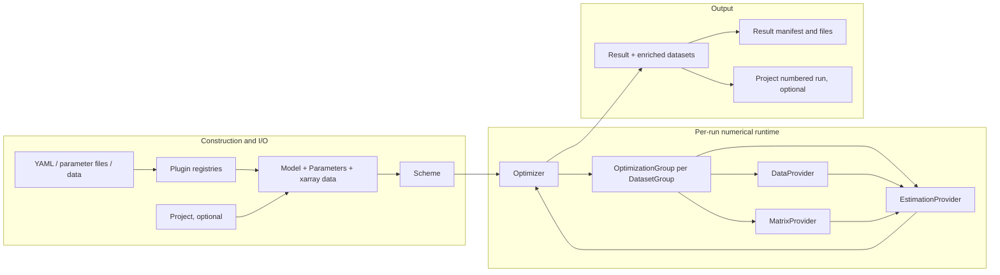

# pyglotaran architecture guide

This guide describes the architecture in this checkout as it works today. It combines the two
independent architecture analyses in this repository and resolves differences against implementation
code and tests. It is written for engineers and coding agents deciding where a change belongs.
Inferences are marked explicitly.

The package version is `0.7.4`; the changelog also contains an unreleased `0.7.5` section
([`glotaran/__init__.py`](glotaran/__init__.py), [`changelog.md`](changelog.md)).

## Table of contents

- [How the two analyses combine](#how-the-two-analyses-combine)
- [Purpose and scope](#purpose-and-scope)
- [Architectural center of gravity](#architectural-center-of-gravity)
- [Runtime architecture](#runtime-architecture)
- [Main execution paths](#main-execution-paths)
- [Core concepts and boundaries](#core-concepts-and-boundaries)
- [Extension architecture](#extension-architecture)
- [Persistence and compatibility](#persistence-and-compatibility)
- [Repository map](#repository-map)
- [Change guidance and risks](#change-guidance-and-risks)
- [Before changing X, inspect Y](#before-changing-x-inspect-y)

## How the two analyses combine

The two source documents agree on the architectural conclusions that matter most:

- `Scheme -> optimize() -> Optimizer -> OptimizationGroup -> providers -> Result` is the runtime
  spine, while `Project` is an optional convenience workflow.
- `Model` is a declarative, dynamically composed schema. Filled dataset models and providers are
  per-run executable state.
- `Megacomplex.calculate_matrix()` is the scientific component boundary shared by optimization
  and simulation.
- data layout, matrix preparation, conditional-linear estimation, orchestration, I/O, and
  diagnostics are separate responsibilities.
- extension is mixed: megacomplexes and I/O use plugin registries, while residual solvers,
  optimizer methods, preprocessors, and diagnostics are closed in-repository extension points.
- persistence is a path-linked graph of manifests and data files, not a dump of runtime state.

Their useful differences are mostly differences of emphasis. The Fable analysis gives the clearest
compact explanation of separable nonlinear least squares, dynamic item composition, variable
projection, registry operations, and several operational hazards. The GPT-5.6 analysis more fully
documents public API layering, validation behavior, link inference, format capabilities, result
recreation, mutation during SVD and saving, two-dimensional data assumptions, failure semantics,
and the wider compatibility surface. This guide keeps both sets of strengths while removing
duplication.

Where statements differed, implementation decides:

- plugin short-name conflicts are **first-writer-wins**, not last-writer-wins; the later plugin is
  retained under its fully qualified name
  ([`glotaran/plugin_system/base_registry.py`](glotaran/plugin_system/base_registry.py));
- `ods`, `yaml`, `yml_str`, and `legacy` are real aliases registered by decorators even though the
  entry-point list imports their modules under another name
  ([`glotaran/builtin/io`](glotaran/builtin/io), [`setup.cfg`](setup.cfg));
- validation is available but is not automatically invoked by `Optimizer`;
- `Result.success` currently reflects the presence of a SciPy result object, not that object's
  convergence flag; and
- broad claims about unsupported preprocessing have been narrowed to what the implemented I/O and
  standalone preprocessing boundaries establish directly.

## Purpose and scope

pyglotaran is a modeling and fitting engine for global and target analysis of multidimensional
scientific data, most often time-resolved spectroscopy. The central mathematical problem is
separable nonlinear least squares ([`README.md`](README.md), [`setup.cfg`](setup.cfg)):

- each dataset contains a two-dimensional `data` matrix with a model dimension, such as time, and
  a global dimension, such as wavelength;
- a model evaluated at nonlinear parameters `theta` produces a matrix `A(theta)` along the model
  dimension;
- conditionally linear parameters (CLPs), such as amplitudes or spectra, are estimated from
  `A(theta)` and the data at each global coordinate, or once for a full model; and
- only the nonlinear parameters are passed to `scipy.optimize.least_squares`.

The primary abstractions are `Model`, `Megacomplex`, `Parameters`, labeled `xarray.Dataset` data,
`Scheme`, `optimize()`, and `Result`. `Project` is an optional folder-based workflow around those
objects.

The package does not provide a GUI. Plotting and overview diagnostics are primarily delegated to
the optional `pyglotaran-extras` package. Acquisition control, experiment management, and
arbitrary instrument-specific ingestion or data cleaning are outside the numerical engine;
preprocessing support is a small standalone pipeline and registered data loaders cover selected
formats ([`docs/source/introduction.rst`](docs/source/introduction.rst), [`glotaran/io`](glotaran/io),
[`setup.cfg`](setup.cfg)). The bundled CLI is a deprecated compatibility surface, not a target for
new workflows ([`glotaran/cli/main.py`](glotaran/cli/main.py)).

## Architectural center of gravity

The runtime spine is:

```text
Scheme -> optimize() -> Optimizer -> OptimizationGroup
       -> DataProvider / MatrixProvider / EstimationProvider -> Result
```

`Project` is not the runtime center. Core tests construct `Scheme` directly and call `optimize()`;
`Project.optimize()` loads objects, constructs a scheme, delegates to the same function, and saves
the result ([`glotaran/optimization/test/test_optimization.py`](glotaran/optimization/test/test_optimization.py),
[`glotaran/project/project.py`](glotaran/project/project.py)).

| Object or API | Actual responsibility | Architectural conclusion |
| --- | --- | --- |
| [`Model`](glotaran/model/model.py) | Declarative graph of datasets, typed items, megacomplexes, CLP rules, groups, and weights. Its concrete attrs class is generated from the selected megacomplex types. | Central domain schema, not the executing engine. |
| [`Megacomplex`](glotaran/model/megacomplex.py) | Pluggable scientific component that produces labeled matrices and finalizes model-specific result data. | Computational extension contract for model physics. |
| [`Scheme`](glotaran/project/scheme.py) | Binds model, parameters, data, CLP-link settings, optimizer settings, and result options for one run. | Public unit-of-work boundary; configuration, not runtime state. |
| [`optimize()`](glotaran/optimization/optimize.py) | Creates an `Optimizer`, runs it, and returns a result. | Small public runtime entry point. |
| [`Optimizer`](glotaran/optimization/optimizer.py) | Adapts parameters to SciPy, coordinates groups, records history, handles failure, computes statistics, and assembles `Result`. | Top-level runtime orchestrator. |
| Plugin registration | Discovers megacomplex and I/O implementations through process-global registries loaded at import time. | Construction and persistence extension mechanism, not the optimization loop. |
| [`Result`](glotaran/project/result.py) | Records inputs, optimized parameters, histories, aggregate statistics, and enriched result datasets. | Output and reproducibility boundary. |
| [`Project`](glotaran/project/project.py) | Scans a conventional folder tree, loads named inputs, creates schemes, and saves numbered runs. | Optional disk-workflow facade. |

One package-name trap matters: `Scheme` and `Result` live under `glotaran.project`, but they are
core public contracts consumed by optimization. The same package also contains the higher-level
`Project` facade. Do not infer layer position from that directory name alone.

## Runtime architecture



The provider objects are created per run. They own normalized arrays, prepared matrices, CLPs,
residuals, and caches for the current parameter vector. They are executable state and must not be
added to the persisted schema ([`glotaran/optimization/optimization_group.py`](glotaran/optimization/optimization_group.py),
[`glotaran/optimization/data_provider.py`](glotaran/optimization/data_provider.py),
[`glotaran/optimization/matrix_provider.py`](glotaran/optimization/matrix_provider.py),
[`glotaran/optimization/estimation_provider.py`](glotaran/optimization/estimation_provider.py)).

## Main execution paths

### Construction and loading

Users can construct objects directly, call the plugin-backed functions exported by `glotaran.io`,
or use `Project` to resolve named files in `data/`, `models/`, `parameters/`, and `results/`
([`glotaran/io/__init__.py`](glotaran/io/__init__.py), [`glotaran/project/project.py`](glotaran/project/project.py)).

I/O wrappers infer a format from the path unless one is explicit, dispatch through a registry,
normalize loaded `DataArray` values to `Dataset`, and maintain `source_path`. `DatasetMapping` and
file-loadable dataclass fields normalize paths, sequences, mappings, and objects at the public
boundary ([`glotaran/plugin_system/io_plugin_utils.py`](glotaran/plugin_system/io_plugin_utils.py),
[`glotaran/plugin_system/data_io_registration.py`](glotaran/plugin_system/data_io_registration.py),
[`glotaran/utils/io.py`](glotaran/utils/io.py),
[`glotaran/project/dataclass_helpers.py`](glotaran/project/dataclass_helpers.py)).

YAML model loading is composition, not plain deserialization. `YmlProjectIo.load_model()` applies
compatibility rewrites, resolves every megacomplex `type` through the registry, asks
`Model.create_class_from_megacomplexes()` to create a concrete model schema, and instantiates it.
That factory adds model-item dictionaries implied by `ModelItemType[...]` annotations and combines
component-specific `DatasetModel` types ([`glotaran/builtin/io/yml/yml.py`](glotaran/builtin/io/yml/yml.py),
[`glotaran/model/model.py`](glotaran/model/model.py)). Persisted YAML records stable type strings and
fields, not the generated Python class identity.

At rest, references inside model items are labels. During optimization or simulation,
`fill_item()` creates evolved copies and recursively replaces item labels and parameter labels
with the current objects ([`glotaran/model/item.py`](glotaran/model/item.py),
[`glotaran/model/dataset_group.py`](glotaran/model/dataset_group.py)).

### Validation

`Scheme.validate()` delegates to `Model.validate(parameters)`. `Model.get_issues()` traverses the
declarative graph and reports missing items, missing parameters, and field-specific validator
failures, including megacomplex uniqueness and exclusivity rules
([`glotaran/model/model.py`](glotaran/model/model.py), [`glotaran/model/item.py`](glotaran/model/item.py),
[`glotaran/model/dataset_model.py`](glotaran/model/dataset_model.py)).

Validation is not automatically called by `Optimizer`. Its constructor performs narrower runtime
checks, such as dataset coverage and supported method names. Programmatic callers should validate
explicitly when they need a complete user-facing issue list; otherwise unresolved references can
fail later during filling or matrix construction ([`glotaran/optimization/optimizer.py`](glotaran/optimization/optimizer.py)).

### Optimization orchestration

Only `vary=True` parameters enter SciPy. Expression parameters are recalculated when values change,
and non-negative nonlinear parameters use a log-space optimization representation
([`glotaran/parameter/parameter.py`](glotaran/parameter/parameter.py),
[`glotaran/parameter/parameters.py`](glotaran/parameter/parameters.py)). Every objective evaluation
must return one stable, flat residual-plus-penalty vector.

```text
OPTIMIZE(scheme):
    assert model dataset labels are covered by scheme data
    working_parameters := copy of scheme.parameters
    groups := OptimizationGroup for each model DatasetGroup
    labels, x0, lower, upper := free parameter arrays

    OBJECTIVE(x):
        update working_parameters from x
        for group in groups:
            fill group dataset models from working_parameters
            calculate and reduce matrices
            estimate CLPs and residuals
        record parameter history
        return concatenate(group.full_penalty for group in groups)

    scipy_result := least_squares(OBJECTIVE, x0, bounds, configured method and tolerances)
    restore final or last evaluable parameter state
    compute statistics and covariance from the Jacobian when available
    recalculate groups at the selected parameter state
    return Result(inputs, parameters, histories, metrics, enriched datasets)
```

This contract comes from [`glotaran/optimization/optimizer.py`](glotaran/optimization/optimizer.py).
The public method names map to SciPy `trf`, `dogbox`, and `lm`. An unevaluable initial vector raises
`InitialParameterError`; later evaluation failures may produce an unsuccessful result unless
`raise_exception=True`.

### Data, matrices, and conditional-linear estimation

`OptimizationGroup` chooses linked or unlinked provider families. When `link_clp` is unspecified,
linking is inferred from full-model status, model-dimension compatibility, and available global
dimensions. An explicit value overrides inference ([`glotaran/model/dataset_group.py`](glotaran/model/dataset_group.py),
[`glotaran/optimization/optimization_group.py`](glotaran/optimization/optimization_group.py)).

`DataProvider` owns array layout. It infers the model dimension from the filled megacomplexes,
treats the other `data` dimension as global, normalizes arrays to `(model, global)`, and applies
dataset or model weights to the numerical data. The linked provider aligns coordinates using the
scheme tolerance and direction, then records which datasets contribute to each aligned slice
([`glotaran/optimization/data_provider.py`](glotaran/optimization/data_provider.py)).

`MatrixProvider` asks each megacomplex for labels and a 2-D `(model, clp)` matrix or a 3-D
`(global, model, clp)` index-dependent matrix. It scales components, unions columns by label,
adds duplicate-label contributions, applies CLP relations and constraints, applies dataset scale
and weights, and aligns linked datasets. A full model combines model- and global-dimension
matrices with a Kronecker product ([`glotaran/optimization/matrix_provider.py`](glotaran/optimization/matrix_provider.py)).

```text
BUILD_AND_ESTIMATE(group, filled_models, data):
    for each dataset:
        labels, A := merge(scale * megacomplex.calculate_matrix(...)) by CLP label
        if full model:
            global_labels, G := build global matrix
            solve weighted kron(G, A) once against flattened data
        else:
            for each global coordinate:
                A_i := indexed slice of A, or A itself
                fold active relations into source columns
                remove active constrained columns
                apply scale and weight

    if linked:
        for each aligned coordinate:
            union columns by label and vertically stack participating matrices and data
            solve once to obtain shared CLPs
    else:
        solve every dataset slice independently

    restore relation-derived and constrained CLPs
    append equal-area CLP penalties to the residual vector
```

Ordered CLP labels are part of the numerical contract: matrix columns, reduced columns, estimated
values, reconstructed values, and result coordinates must stay aligned.

The configured linear solver is selected from `SUPPORTED_RESIUDAL_FUNCTIONS` (the misspelling is
the current symbol name). The default variable-projection kernel uses QR factorization:

```text
VARIABLE_PROJECT(A, data):
    factor A as Q and R
    transformed := transpose(Q) * data
    clp := triangular_solve(R, first_columns(transformed))
    zero the range-of-A portion of transformed
    residual := Q * transformed
    return clp, residual
```

The residual is orthogonal to the column space of `A`. The alternative NNLS path constrains CLPs
to be non-negative and returns `data - A * clp`
([`glotaran/optimization/variable_projection.py`](glotaran/optimization/variable_projection.py),
[`glotaran/optimization/nnls.py`](glotaran/optimization/nnls.py),
[`glotaran/optimization/estimation_provider.py`](glotaran/optimization/estimation_provider.py)).

### Simulation

`simulate()` fills one dataset model and reuses the megacomplex matrix contract without constructing
an `Optimizer`. It multiplies the model matrix by caller-supplied CLPs, or creates CLPs from a
global megacomplex, and can add Gaussian noise afterward. Full-model simulation rejects globally
index-dependent matrices ([`glotaran/simulation/simulation.py`](glotaran/simulation/simulation.py),
[`glotaran/simulation/test/test_simulation.py`](glotaran/simulation/test/test_simulation.py)).
This shared matrix boundary keeps forward simulation and fitting consistent.

### Result creation and saving

`Optimizer.create_result()` owns aggregate fit statistics, histories, failure information,
Jacobian storage, covariance calculation through an SVD-based pseudoinverse, and standard errors.
`OptimizationGroup.create_result_data()` copies input datasets and adds matrices, CLPs, residuals,
fitted data, optional SVD diagnostics, weights, scale, and dataset-level RMSE. It then invokes each
megacomplex's `finalize_data()` for component-specific derived values
([`glotaran/optimization/optimizer.py`](glotaran/optimization/optimizer.py),
[`glotaran/optimization/optimization_group.py`](glotaran/optimization/optimization_group.py),
[`glotaran/model/dataset_model.py`](glotaran/model/dataset_model.py)).

`Result` keeps the original scheme and separate optimized parameters. `Result.get_scheme()` replaces
the original parameters with the optimized set but retains the original scheme data, not enriched
result datasets ([`glotaran/project/result.py`](glotaran/project/result.py),
[`glotaran/project/test/test_result.py`](glotaran/project/test/test_result.py)).

YAML result saving writes a manifest plus `model.yml`, `scheme.yml`, parameter and history tables,
reports, and one NetCDF file per dataset. `Project` adds numbered directories of the form
`results/<name>_run_NNNN/` ([`glotaran/builtin/io/yml/yml.py`](glotaran/builtin/io/yml/yml.py),
[`glotaran/builtin/io/folder/folder_plugin.py`](glotaran/builtin/io/folder/folder_plugin.py),
[`glotaran/project/project_result_registry.py`](glotaran/project/project_result_registry.py)).

## Core concepts and boundaries

| Kind | Objects | Responsibility and lifecycle |
| --- | --- | --- |
| Declarative schema | `Model`, `DatasetModel`, `DatasetGroupModel`, `Megacomplex`, `Item` and `ModelItem` subclasses | Serializable labeled graph, validation, component composition. Usually constructed once. |
| Run input | `Scheme`, `Parameters`, input datasets | Initial values, concrete data, linking policy, and optimizer options. Crosses the runtime boundary at `optimize()`. |
| Executable runtime | `Optimizer`, `DatasetGroup`, `OptimizationGroup`, providers, `MatrixContainer` | Mutable per-run state recalculated for objective evaluations. Never persisted. |
| Output | `Result`, histories, enriched datasets | Reproducibility record, generic statistics, and model-specific derived data. |
| Disk workflow | `Project`, `Project*Registry` | Optional discovery, naming, import, and numbered-run conventions. |

Important invariants and ownership rules:

- `Parameter` owns one nonlinear value, bounds, variation, expression, and log-transform semantics;
  `Parameters` owns unique labels, expression evaluation, copying, and flat-array conversion
  ([`glotaran/parameter`](glotaran/parameter)). CLPs are not `Parameter` objects.
- `@item` annotations and metadata drive loading, validation, filling, aliases, and dynamic model
  shape. Changing an annotation is both a schema change and a runtime change
  ([`glotaran/model/item.py`](glotaran/model/item.py)).
- `Megacomplex.calculate_matrix()` must return labels matching matrix columns and rows matching its
  declared model dimension. Component-specific equations belong here, not in providers.
- `DatasetGroupModel` declares residual and linking policy; runtime `DatasetGroup` objects contain
  the filled dataset models for a parameter state.
- CLP relations reduce columns, constraints remove columns, equal-area penalties add residual
  terms, and weights change both data and matrices. Their implementations cross the declarative/
  numerical boundary through the relevant provider modules.
- `Scheme.result_path` is serialized input but core `optimize()` does not save automatically.
- Generic global diagnostics belong to `Optimizer`, generic dataset diagnostics to
  `OptimizationGroup`, and component-specific diagnostics to `Megacomplex.finalize_data()`.

Dependency guidance follows those responsibilities: model code must not call the optimizer or
concrete serializers; providers must not parse files; I/O must not enter the objective function;
and core APIs must remain usable without a `Project` folder.

## Extension architecture

### Discovery and registration

Importing `glotaran` loads installed entry points whose group starts with `glotaran.plugins`, unless
`DEACTIVATE_GTA_PLUGINS` is set. Built-ins use the data-I/O, megacomplex, and project-I/O groups in
[`setup.cfg`](setup.cfg) ([`glotaran/__init__.py`](glotaran/__init__.py),
[`glotaran/plugin_system/base_registry.py`](glotaran/plugin_system/base_registry.py)).

The private process-global registry stores megacomplex classes and instantiated data/project I/O
plugins. Decorators perform registration as import side effects. Both short names and fully
qualified names are stored. On a short-name collision, the existing short-name binding remains;
the newcomer is stored under its fully qualified name and a `PluginOverwriteWarning` is emitted.
Call `set_megacomplex_plugin()`, `set_data_plugin()`, or `set_project_plugin()` to pin a chosen
implementation. Tests should isolate mutations with helpers in
[`glotaran/testing/plugin_system.py`](glotaran/testing/plugin_system.py).

Typed model items have a separate per-hierarchy `type` registry in `item.py`. Megacomplexes need
the process-global registry because their types determine the dynamic `Model` class. Residual
solvers, nonlinear optimizer methods, preprocessors, and result diagnostics do not have plugin
registries today.

### Minimal changes by extension type

**Model component:** define supporting `@item` types; define an optional component-specific
`DatasetModel`; implement and decorate a `Megacomplex` with stable `type` and `dimension`,
`calculate_matrix()`, and `finalize_data()`; expose built-ins or third-party modules through a
megacomplex entry point. Test schema composition, validation, matrix labels/shapes, finalization,
mixed components, simulation, and optimization
([`glotaran/model/megacomplex.py`](glotaran/model/megacomplex.py),
[`glotaran/builtin/megacomplexes`](glotaran/builtin/megacomplexes)).

**Conditional-linear residual solver:** add a `(matrix, data) -> (clp, residual)` function; add a
stable key to `SUPPORTED_RESIUDAL_FUNCTIONS`; extend the literal in `DatasetGroupModel`; test linked,
unlinked, weighted, constrained, and full-model paths as applicable
([`glotaran/optimization/estimation_provider.py`](glotaran/optimization/estimation_provider.py),
[`glotaran/model/dataset_group.py`](glotaran/model/dataset_group.py)).

**Nonlinear optimizer:** a SciPy-compatible method needs a `SUPPORTED_METHODS` mapping, a `Scheme`
literal, and tests. Another backend needs an adapter preserving the objective, bounds, failure
semantics, histories, result fields, Jacobian availability, and covariance behavior. There is no
optimizer plugin interface ([`glotaran/optimization/optimizer.py`](glotaran/optimization/optimizer.py),
[`glotaran/project/scheme.py`](glotaran/project/scheme.py)).

**File format:** use `DataIoInterface` for datasets and `ProjectIoInterface` for models, parameters,
schemes, or results. Implement only supported methods, decorate the class, expose its module through
an entry point, preserve format inference and `source_path`, and add capability, conflict, dispatch,
and round-trip tests ([`glotaran/io/interface.py`](glotaran/io/interface.py),
[`glotaran/plugin_system/test`](glotaran/plugin_system/test)).

**Result diagnostic:** add global optimizer/Jacobian scalars to `Optimizer` and `Result`; generic
per-dataset arrays to `OptimizationGroup`; component-specific derived arrays to `finalize_data()`.
A presentation-only diagnostic can remain a standalone helper accepting `Result` or `Dataset`.

**Preprocessor:** add a `PreProcessor` subtype with a unique `action` literal, add it to the
`PipelineAction` discriminated union, and test numerical behavior plus Pydantic round trips.
Preprocessing remains standalone; pass its output into a scheme
([`glotaran/io/preprocessor`](glotaran/io/preprocessor)).

**High-level workflow:** put folder- and run-name-dependent behavior on `Project`; use public I/O
for format workflows; keep object-only fitting or simulation helpers near those APIs. Delegate to
`optimize()` and do not duplicate provider orchestration or extend the deprecated CLI.

## Persistence and compatibility

| Format | Boundary and current capability |
| --- | --- |
| `nc` | Load/save `xarray` datasets through NetCDF. |
| `ascii` | Load/save the legacy wavelength/time-explicit matrix format. |
| `sdt` | Load SDT measurement data; no saver is implemented. |
| `yml`, `yaml` | Load/save model and scheme structures, load parameters, and load/save result manifests. |
| `yml_str` | Load supported YAML objects from string content; not a normal suffix. |
| `csv`, `tsv`, `xlsx`, `ods` | Load/save parameters through pandas-backed plugins. |
| `folder` | Internal result-file writer; not independently a reloadable result serializer. |
| `legacy` | Deprecated compatibility wrapper for the former result-folder API. |

Registrations are in [`setup.cfg`](setup.cfg) and decorators under
[`glotaran/builtin/io`](glotaran/builtin/io). Capability is determined by implemented interface
methods, not only a registered suffix. Installing plugins can change the suffixes a `Project`
discovers.

`Scheme` and `Result` use file-loadable dataclass fields. Serialization replaces heavyweight
objects with relative paths where possible; loading resolves paths relative to the manifest.
Result datasets are separate NetCDF files. Generated model class identity, filled item graphs,
provider caches, weighted work arrays, and SciPy state are not persisted. Jacobian, covariance,
cost, and additional-penalty arrays are excluded from the result dictionary by field metadata.
`SavingOptions.data_filter` can intentionally save only selected result variables
([`glotaran/project/dataclass_helpers.py`](glotaran/project/dataclass_helpers.py),
[`glotaran/project/result.py`](glotaran/project/result.py), [`glotaran/io/interface.py`](glotaran/io/interface.py)).

Saving through public wrappers normally updates `source_path`; persistence is therefore not fully
side-effect free. Relative paths make a saved result a graph of coupled files, not a standalone
YAML record.

`project.gta` and `Result.glotaran_version` store provenance. `Project.open()` exposes the stored
version but does not negotiate or migrate a schema from it. **Inference:** these are provenance
markers, not a complete schema-version system. Compatibility relies on targeted shims, including
the model-key rewrite from `clp_area_penalties` to `clp_penalties` and result-field rewrites from
`number_of_data_points` and `number_of_parameters`
([`glotaran/deprecation/modules/builtin_io_yml.py`](glotaran/deprecation/modules/builtin_io_yml.py),
[`glotaran/builtin/io/yml/yml.py`](glotaran/builtin/io/yml/yml.py)).

Stable persisted identifiers include item and megacomplex type strings, YAML field names,
parameter option names, plugin names, CLP labels, dataset variables/dimensions, and project/result
folder conventions. Changing any of them needs a loader shim or a documented breaking change.

## Repository map

| Path | Architectural role |
| --- | --- |
| [`glotaran/model`](glotaran/model) | Declarative language, dynamic model composition, validation, reference filling, dataset/CLP semantics, and the megacomplex contract. |
| [`glotaran/parameter`](glotaran/parameter) | Nonlinear values, bounds, expressions, transformations, flat-array conversion, and parameter history. |
| [`glotaran/optimization`](glotaran/optimization) | Runtime spine: SciPy adapter, group coordination, providers, statistics, variable projection, and NNLS. |
| [`glotaran/simulation`](glotaran/simulation) | Forward evaluation through the same filled-model and matrix contracts. |
| [`glotaran/project`](glotaran/project) | Core `Scheme`/`Result` contracts plus optional folder-oriented `Project` and live registries. |
| [`glotaran/plugin_system`](glotaran/plugin_system) | Discovery, conflict handling, registries, format inference, and public dispatch. |
| [`glotaran/io`](glotaran/io) | I/O interfaces and exports, dataset preparation/SVD, and standalone preprocessing. |
| [`glotaran/builtin/megacomplexes`](glotaran/builtin/megacomplexes) | Scientific equations, component schemas, matrix generation, and model-specific finalization. |
| [`glotaran/builtin/io`](glotaran/builtin/io) | Built-in dataset and project serializers. |
| [`glotaran/testing`](glotaran/testing), colocated `test` directories | Simulated fixtures, registry isolation, and contract/unit tests. |
| [`glotaran/deprecation`](glotaran/deprecation) | Deprecation shims, deadline checks, and compatibility redirects. |
| [`glotaran/cli`](glotaran/cli), [`glotaran/analysis`](glotaran/analysis) | Deprecated or compatibility surfaces; do not place new architecture here. |
| [`docs/source/notebooks`](docs/source/notebooks) | Executable public workflows; confirm intent but do not override code and tests. |
| [`validation`](validation), CI workflows | External scientific reference-result validation and broader integration checks. |

## Change guidance and risks

Place behavior at the narrowest owning boundary:

- scientific equations and component-derived data -> megacomplex package;
- parameter transforms and expressions -> `Parameter` or `Parameters`;
- input orientation, coordinate alignment, and weights -> `DataProvider`;
- matrix composition, CLP relations, and constraints -> `MatrixProvider`;
- linear solving and CLP reconstruction -> `EstimationProvider` and leaf solvers;
- nonlinear iteration and aggregate statistics -> `Optimizer`;
- generic dataset result arrays -> `OptimizationGroup`;
- serialization -> I/O interface and plugin;
- folder discovery and numbered runs -> `Project`.

The main risks are:

- **CLP label and residual ordering.** Labels connect matrix columns, reductions, linked alignment,
  reconstruction, statistics, and result coordinates. Residual layout must remain fixed across
  objective evaluations. Plausible numbers can still be attached to the wrong labels.
- **Dynamic class composition.** Mixed megacomplexes can introduce conflicting fields, aliases, or
  dataset-model bases. Generated class identity is not stable across loads. **Inference:** type
  identity checks and relying on generated classes for pickling are unsafe.
- **Global plugin state.** Registration is import-time, process-global, and mutable. Conflict
  outcomes depend on which plugin first acquired the short name; use fully qualified names or pin
  explicitly and isolate registry changes in tests.
- **Shared mutable state and side effects.** Optimizer parameters are mutated for every objective
  call. Filled copies may reference current `Parameter` objects, so do not cache them across
  iterations. `add_svd=True` can add SVD variables to scheme datasets, and saving can update
  `source_path` ([`glotaran/optimization/optimization_group.py`](glotaran/optimization/optimization_group.py),
  [`glotaran/io/prepare_dataset.py`](glotaran/io/prepare_dataset.py)).
- **Two-dimensional layout assumptions.** Loading higher-dimensional data does not make the engine
  support it. Providers, linking, flattening, SVD, result coordinates, and simulation all assume
  one model and one global dimension.
- **Weights affect estimation.** Both data and matrices are weighted; result construction derives
  reporting forms afterward. Orientation changes or zero weights can break both fitting and
  residual reconstruction.
- **Linked/unlinked divergence.** Coordinate tolerance, partial overlap, dataset ordering, and
  inferred dimensions affect provider choice and aligned slices. Test both families.
- **Full-model divergence.** Kronecker construction, flattening, CLP counting, and reshape logic are
  separate from per-index solving. A normal unlinked test does not cover this path.
- **Failure and success semantics.** An initial evaluation failure raises, while a later failure can
  return an unsuccessful result using the last evaluable state. Separately, `Result.success` is
  currently based on whether an `OptimizeResult` object exists, not its `.success` flag. Backend
  changes must test termination reason, statistics, histories, and saved output together.
- **Statistics depend on residual shape.** Additional CLP penalties enter the residual vector;
  degrees of freedom also subtract provider-specific CLP counts. A new residual term changes
  chi-square, RMSE, covariance scaling, and reports.
- **SciPy stdout parsing.** Optimization iteration history is derived from verbose output with
  `TeeContext` and regular expressions. A SciPy output-format change can degrade history parsing
  ([`glotaran/optimization/optimizer.py`](glotaran/optimization/optimizer.py),
  [`glotaran/optimization/optimization_history.py`](glotaran/optimization/optimization_history.py)).
- **Compatibility and deprecation.** A result is a coupled file graph. Rename and save-order changes
  can break reloadability. Deprecation deadlines are enforced by utilities and tests, so new shims
  must use the existing framework ([`glotaran/deprecation`](glotaran/deprecation)).
- **Index-dependent interval behavior.** Interval constraints on an index-independent matrix warn
  and currently apply everywhere; this path has a scheduled behavior change. Do not alter it
  without its warning/deprecation and provider tests.

Testing should start with colocated unit tests, then expand according to the boundary crossed.
Schema changes need construction, fill, validation, mixed-component, and YAML tests. Matrix and
residual changes need linked, unlinked, weighted, constrained, index-dependent, and full-model
coverage as applicable. Result and I/O changes need nested-directory save/load, minimal-save, and
recreation tests. Scientifically meaningful numerical changes should run external reference
validation ([`tox.ini`](tox.ini), [`.github/workflows/CI_CD_actions.yml`](.github/workflows/CI_CD_actions.yml)).

## Before changing X, inspect Y

| Before changing... | Inspect... |
| --- | --- |
| `Project` | `Project*Registry`, public I/O dispatch, project tests, and numbered result naming. |
| `Scheme` fields | Dataclass conversion, YAML load/save, `Optimizer.__init__()`, result recreation, and notebook/CLI construction sites. |
| `Model` or an item annotation | `item.py` introspection/filling, dynamic class creation, YAML loading, and mixed-megacomplex tests. |
| `Megacomplex.calculate_matrix()` or CLP labels | Both matrix providers, simulation, `finalize_data()`, linking, full-model Kronecker construction, and saved result variables. |
| Parameter semantics | Flat-array conversion, expression updates, log transforms, covariance/error handling, and table serialization. |
| CLP constraints, relations, or penalties | Matrix reduction and CLP reconstruction/penalty calculation together; they must remain inverse-compatible. |
| Residual functions | Both estimation providers, residual literals/maps, CLP counts, degrees of freedom, histories, and failure paths. |
| Dimensions, linking, or weights | Both data providers, SVD preparation, simulation, result reconstruction, and NetCDF round trips. |
| Plugin loading | Package import timing, entry points, collision and pinning behavior, project suffix discovery, and test isolation helpers. |
| Result fields or folder layout | `Result` field metadata, YAML shims, folder writer, `source_path`, `SavingOptions`, and nested save/load tests. |
| A convenience API | Verify it delegates to `Scheme`, `optimize()`, simulation, or public I/O and does not create another runtime path. |
