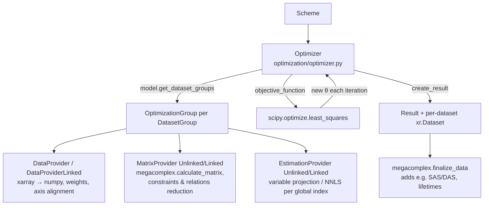

# pyglotaran Architecture Guide

This document describes how pyglotaran (version `0.7.4`, package `glotaran`) actually works today.
It is written for engineers and coding agents who need to decide **where** a change belongs.
Every important claim links to the implementation. Statements that are inferred rather than
directly visible in code are marked **(inferred)**.

## Table of contents

- [1. System purpose and scope](#1-system-purpose-and-scope)
- [2. Architectural center of gravity](#2-architectural-center-of-gravity)
- [3. Main execution paths](#3-main-execution-paths)
  - [3.1 Model construction and loading](#31-model-construction-and-loading)
  - [3.2 Validation](#32-validation)
  - [3.3 Optimization](#33-optimization)
  - [3.4 Core algorithms (pseudocode)](#34-core-algorithms-pseudocode)
  - [3.5 Simulation](#35-simulation)
  - [3.6 Result creation and persistence](#36-result-creation-and-persistence)
- [4. Core concepts and boundaries](#4-core-concepts-and-boundaries)
- [5. Extension architecture](#5-extension-architecture)
- [6. Persistence and compatibility](#6-persistence-and-compatibility)
- [7. Repository map](#7-repository-map)
- [8. Change guidance and risks](#8-change-guidance-and-risks)

---

## 1. System purpose and scope

pyglotaran is a fitting engine for **global and target analysis** of multi-dimensional
scientific data, most commonly time-resolved spectroscopy (see [README.md](README.md) and
[setup.cfg](setup.cfg), `description = The Glotaran fitting engine.`).

The mathematical problem it solves is **separable non-linear least squares**:

- Data is a 2-D matrix per dataset with a **model dimension** (e.g. `time`) and a
  **global dimension** (e.g. `spectral`).
- A user-defined model produces, for a set of non-linear parameters (rate constants,
  IRF widths, ...), a matrix `A(θ)` along the model dimension.
- The amplitudes along the global dimension — called **conditionally linear parameters
  (clp)**, physically e.g. spectra — are *not* optimized by the non-linear optimizer.
  They are solved per global-axis index by linear least squares (variable projection or
  NNLS), see [glotaran/optimization/estimation_provider.py](glotaran/optimization/estimation_provider.py).
- Only the non-linear parameters `θ` are optimized, by `scipy.optimize.least_squares`
  ([glotaran/optimization/optimizer.py](glotaran/optimization/optimizer.py)).

**Primary abstractions**: `Model` (declarative model specification), `Megacomplex`
(pluggable matrix generator, the "lego brick" of the model), `Parameters` (named,
bounded, optionally expression-linked parameters), `Scheme` (model + parameters + data +
optimizer settings), `optimize()` (the engine entry point), `Result` (everything produced
by a fit), and `Project` (a folder-on-disk convenience workflow).

**Intentionally out of scope**:

- **Plotting/visualization** — delegated to the separate `pyglotaran-extras` package
  (listed only as an extra in [setup.cfg](setup.cfg), `options.extras_require`).
- **GUI** — the ecosystem's GUIs live elsewhere; the recommended interface is Jupyter
  notebooks. The bundled CLI is deprecated and scheduled for removal in 0.8.0
  ([glotaran/cli/main.py](glotaran/cli/main.py) prints a deprecation notice at startup).
- **Instrument-specific pre-processing beyond baseline correction** — only a minimal
  pydantic-based pre-processing pipeline exists
  ([glotaran/io/preprocessor/](glotaran/io/preprocessor/)).

---

## 2. Architectural center of gravity

### The runtime spine

The true spine of the system is:

```
Scheme (model, parameters, data, options)
  → optimize(scheme)                      # glotaran/optimization/optimize.py
    → Optimizer → scipy.least_squares
      → per DatasetGroup: OptimizationGroup
        → DataProvider / MatrixProvider / EstimationProvider
  → Result
```

Evidence: [glotaran/optimization/optimize.py](glotaran/optimization/optimize.py) is a
3-line function `optimize(scheme) -> Result`; the engine tests build `Scheme` objects
directly and call `optimize()` without any `Project`
([glotaran/optimization/test/test_optimization.py](glotaran/optimization/test/test_optimization.py)).
The bundled test fixtures do the same
([glotaran/testing/simulated_data/sequential_spectral_decay.py](glotaran/testing/simulated_data/sequential_spectral_decay.py)).

### Role of each candidate "center"

| Object | Actual role |
|---|---|
| `Model` | **Declarative schema, not runtime engine.** A `Model` *class* is generated dynamically from the set of megacomplex types used (`Model.create_class_from_megacomplexes` in [glotaran/model/model.py](glotaran/model/model.py)). Instances hold labeled item dictionaries. The model never computes matrices itself; megacomplexes do. |
| `Megacomplex` | **The core computational plugin.** Subclasses implement `calculate_matrix()` and `finalize_data()` ([glotaran/model/megacomplex.py](glotaran/model/megacomplex.py)). All physics lives here (builtin ones in [glotaran/builtin/megacomplexes/](glotaran/builtin/megacomplexes/)). |
| `Scheme` | **The unit of work.** A plain dataclass bundling model, parameters, data and optimizer options ([glotaran/project/scheme.py](glotaran/project/scheme.py)). It has no behavior beyond validation delegation and (de)serialization support. |
| `optimize()` | **The engine entry point.** Everything under [glotaran/optimization/](glotaran/optimization/) is the numerical core. |
| `Result` | **The output contract.** A dataclass ([glotaran/project/result.py](glotaran/project/result.py)) holding statistics, parameter/optimization history, and one `xarray.Dataset` per dataset. |
| Plugin registration | **The backbone for extensibility and IO.** A process-global registry filled at import time from entry points ([glotaran/plugin_system/base_registry.py](glotaran/plugin_system/base_registry.py); `load_plugins()` is called in [glotaran/__init__.py](glotaran/__init__.py)). All IO (`load_model`, `save_result`, ...) dispatches through it. |
| `Project` | **Convenience workflow, not core.** `Project` ([glotaran/project/project.py](glotaran/project/project.py)) manages a folder layout (`data/`, `models/`, `parameters/`, `results/`) via registries and merely composes the core API: `Project.optimize()` builds a `Scheme` and calls `glotaran.optimization.optimize.optimize()`. Nothing in `glotaran/optimization` or `glotaran/model` imports `Project`. Do **not** treat `Project` as the central abstraction. |

### Layering (who may depend on whom)

```
glotaran/parameter        (no glotaran deps except utils/io loader indirection)
glotaran/model            → parameter
glotaran/optimization     → model, parameter, project.Scheme/Result
glotaran/simulation       → model, optimization.MatrixProvider
glotaran/project          → model, parameter, io  (Scheme/Result are here)
glotaran/io + plugin_system  (interfaces + registries; used by everything for load/save)
glotaran/builtin          (plugins: megacomplexes + io formats; depends on all of the above)
```

Note one deliberate inversion: `Scheme` and `Result` live in `glotaran/project` but are
consumed by `glotaran/optimization` — the "project" package is both the convenience layer
(`Project`) and the home of the core data contracts (`Scheme`, `Result`). Keep that in
mind when adding imports; `glotaran/model` must not import from `glotaran/optimization`
or `glotaran/project`.

---

## 3. Main execution paths

### 3.1 Model construction and loading

There is no static `Model` schema. The set of attributes a model accepts depends on which
megacomplex types it uses:

1. The YAML project-IO plugin reads the spec, applies deprecation rewrites and
   sanitization, resolves each megacomplex `type` string through the plugin registry
   (`get_megacomplex`), and calls
   `Model.create_class_from_megacomplexes(...)`(**spec)
   ([glotaran/builtin/io/yml/yml.py](glotaran/builtin/io/yml/yml.py), `YmlProjectIo.load_model`).
2. `create_class_from_megacomplexes` ([glotaran/model/model.py](glotaran/model/model.py))
   scans each megacomplex class for attributes typed as `ModelItemType[X]` and adds a
   `dict[str, X]` attribute to the model class for each item type (e.g. `DecayMegacomplex`
   has `k_matrix: list[ModelItemType[KMatrix]]`, so the generated model class gets a
   `k_matrix` dict). It also merges megacomplex-specific `DatasetModel` subclasses
   (e.g. `DecayDatasetModel` adds `irf` and `initial_concentration`,
   [glotaran/builtin/megacomplexes/decay/decay_megacomplex.py](glotaran/builtin/megacomplexes/decay/decay_megacomplex.py))
   into one dataset type via `attrs.make_class` with multiple bases.
3. attrs converters on each attribute turn nested dicts into `Item` instances
   (`_load_model_items_from_dict` in [glotaran/model/model.py](glotaran/model/model.py)).
   `TypedItem` subclasses (constraints, penalties, IRFs, ...) are discriminated by their
   `type` field ([glotaran/model/item.py](glotaran/model/item.py), `TypedItem.get_item_type_class`).

Inside items, references are **strings (labels)** at rest. They are only resolved to real
objects ("filled") at optimization/simulation time by `fill_item()`
([glotaran/model/item.py](glotaran/model/item.py)), which recursively replaces model-item
labels with filled copies and parameter labels with `Parameter` instances.

### 3.2 Validation

`Model.get_issues()` / `Model.validate()` iterate all items and collect `ItemIssue`s:
missing model items, missing parameters, and per-attribute validator functions attached
via `attribute(validator=...)` metadata
([glotaran/model/model.py](glotaran/model/model.py), [glotaran/model/item.py](glotaran/model/item.py)).
Example validator: exclusive/unique megacomplex checks on `DatasetModel.megacomplex`
([glotaran/model/dataset_model.py](glotaran/model/dataset_model.py)).
`Scheme.validate()` just delegates to `model.validate(parameters)`.
Validation is advisory: `optimize()` does **not** call it automatically **(inferred from
absence of any `validate` call in [glotaran/optimization/optimizer.py](glotaran/optimization/optimizer.py))**.

### 3.3 Optimization



Ownership and data transformation at each boundary:

- **`Optimizer.__init__`** copies `scheme.parameters`, builds one `OptimizationGroup` per
  `DatasetGroup` (grouping comes from `DatasetModel.group` and `Model.dataset_groups`,
  [glotaran/model/model.py](glotaran/model/model.py) `get_dataset_groups`), and starts a
  `ParameterHistory`.
- **`DataProvider`** ([glotaran/optimization/data_provider.py](glotaran/optimization/data_provider.py))
  owns the numeric views of the data: it copies each dataset's `data` (and `weight`) into
  numpy arrays oriented `(model, global)`, multiplies data by weights once up front, and
  infers the global dimension as "the other dimension". Model-defined `Weight` items are
  rasterized here (`add_model_weight`). `DataProviderLinked` additionally merges the
  global axes of all datasets in the group into one aligned axis using
  `scheme.clp_link_tolerance`/`clp_link_method` and precomputes, per aligned index, which
  datasets contribute (`group_definitions`).
- **`MatrixProvider`** ([glotaran/optimization/matrix_provider.py](glotaran/optimization/matrix_provider.py))
  owns the model matrices. Per dataset it calls each megacomplex's `calculate_matrix`,
  scales and sums them by clp-label union (`combine_megacomplex_matrices`), then applies
  clp constraints (column removal) and clp relations (column merge via a relation matrix)
  in `reduce_matrix`, then dataset scale and weights. Matrices are 2-D
  `(model, clp)` or 3-D `(global, model, clp)` when index dependent
  (`MatrixContainer.is_index_dependent` is literally `ndim == 3`).
- **`EstimationProvider`** ([glotaran/optimization/estimation_provider.py](glotaran/optimization/estimation_provider.py))
  owns clps and residuals. Per global-axis index it solves the linear problem with the
  group's `residual_function` (`variable_projection` default, or
  `non_negative_least_squares`; map `SUPPORTED_RESIUDAL_FUNCTIONS` — note the typo in the
  constant name), back-fills constrained/related clps (`retrieve_clps`), and computes
  `EqualAreaPenalty` terms that are appended to the residual vector.
- **`Optimizer.objective_function`** writes the optimizer's parameter vector back into the
  labeled `Parameters` object and returns the concatenated penalty vector of all groups.

### 3.4 Core algorithms (pseudocode)

These are contracts derived from the implementation; they intentionally omit bookkeeping.

**Optimization orchestration** — [glotaran/optimization/optimizer.py](glotaran/optimization/optimizer.py)

```
optimize(scheme):
    θ_labels, θ0, lower, upper = scheme.parameters.free_parameters()
        # non_negative parameters enter log-transformed:
        #   Parameter.get_value_and_bounds_for_optimization  (parameter.py)
    groups = [OptimizationGroup(scheme, g) for g in scheme.model.get_dataset_groups()]

    def objective(θ):
        parameters.set_from(θ_labels, θ)        # inverse log-transform applied here
        for group in groups:
            group.calculate(parameters)          # matrices then estimation (below)
        return concat(group.full_penalty for group in groups)
            # full_penalty = weighted residuals ++ clp penalties

    result = scipy.least_squares(objective, θ0, bounds=(lower, upper),
                                 method=scheme.optimization_method, tol=scheme.*tol)
    return create_result(result)   # statistics, covariance via SVD of Jacobian,
                                   # one final objective evaluation, per-dataset datasets
```

Invariants: the residual vector layout (ordering of datasets/indices) must be stable
across iterations; `objective` must be deterministic in `θ`; each call refills all
dataset models from the same `Parameters` instance (`DatasetGroup.set_parameters`,
[glotaran/model/dataset_group.py](glotaran/model/dataset_group.py)).

**Residual construction per dataset group** —
[glotaran/optimization/matrix_provider.py](glotaran/optimization/matrix_provider.py),
[glotaran/optimization/estimation_provider.py](glotaran/optimization/estimation_provider.py)

```
# Unlinked group (each dataset independent):
for dataset in group:
    A = Σ_megacomplex scale_m * calculate_matrix(m, dataset_model, axes)
        # columns unioned by clp label; 3-D if any megacomplex is index dependent
    for i, x_i in enumerate(global_axis):
        A_i = A[i] if index_dependent else A
        A_i = apply_relations(apply_constraints(A_i, x_i), x_i)   # column reduce
        A_i = weight_i * dataset_scale * A_i
        reduced_clp_i, residual_i = residual_function(A_i, data[:, i])
        clp_i = retrieve_clps(reduced_clp_i)   # re-insert constrained/related columns
penalty = concat(all residual_i) ++ equal_area_penalties(clps)

# Linked group: same idea, but per aligned global index the matrices of all
# contributing datasets are stacked block-wise into one matrix whose columns are
# the union of their clp labels (MatrixProviderLinked.align_matrices), and the
# data vectors are concatenated (DataProviderLinked). One linear solve per index
# yields shared clps across datasets.

# Full-model dataset (has global_megacomplex): no per-index solve; instead
# full_matrix = kron(global_matrix, matrix) and one linear solve against the
# flattened data (MatrixProviderUnlinked.calculate_full_matrices,
# EstimationProviderUnlinked.calculate_full_model_estimation).
```

**Variable projection kernel** —
[glotaran/optimization/variable_projection.py](glotaran/optimization/variable_projection.py)

```
residual_variable_projection(A (n×k), y (n)):
    QR-factorize A                       (LAPACK dgeqrf)
    z = Qᵀ y                             (dormqr)
    clp = solve R·clp = z[:k]            (dtrtrs)
    z[:k] = 0                            # project out the range of A
    residual = Q z                       (dormqr)
    return clp, residual                 # residual ⟂ range(A), length n
```

The returned residual is the orthogonal projection of the data onto the complement of the
matrix column space; its norm equals the least-squares residual norm, so the non-linear
optimizer sees a smooth function of `θ` only. The NNLS variant
([glotaran/optimization/nnls.py](glotaran/optimization/nnls.py)) instead returns
`data − A·clp` with `clp ≥ 0` — inequality-constrained, not a projection.

### 3.5 Simulation

`simulate(model, dataset_label, parameters, coordinates, ...)`
([glotaran/simulation/simulation.py](glotaran/simulation/simulation.py)) reuses the
optimization machinery in reverse: it fills the dataset model, calls
`MatrixProvider.calculate_dataset_matrix` for the model axis, and multiplies with clps
supplied either explicitly (`clp=` DataArray) or generated from the dataset's
`global_megacomplex`. Optional Gaussian noise is added at the end. Simulation is the
basis of engine tests and the bundled example data
([glotaran/testing/simulated_data/](glotaran/testing/simulated_data/)).

### 3.6 Result creation and persistence

`Optimizer.create_result()` computes fit statistics (`chi_square`,
`degrees_of_freedom = n_residuals − n_free_params − n_clps`, RMSE), the covariance matrix
via an SVD of the Jacobian, and standard errors (with a special branch for
log-transformed non-negative parameters). Then each `OptimizationGroup.create_result_data()`
copies the input datasets and attaches `residual`, `matrix`, `clp`, `fitted_data`,
optional SVDs and weights, and finally calls each megacomplex's `finalize_data` so plugins
can add domain quantities (e.g. decay-associated spectra)
([glotaran/optimization/optimization_group.py](glotaran/optimization/optimization_group.py),
[glotaran/model/dataset_model.py](glotaran/model/dataset_model.py) `finalize_dataset_model`).

Saving: `Result.save(path)` → `save_result(..., format_name="yml")` →
`YmlProjectIo.save_result` writes `result.yml`, `scheme.yml`, `model.yml` and delegates
the data files to the `folder` plugin (`result.md`, `initial_parameters.csv`,
`optimized_parameters.csv`, `parameter_history.csv`, `optimization_history.csv`, one
`{dataset}.nc` per dataset)
([glotaran/builtin/io/yml/yml.py](glotaran/builtin/io/yml/yml.py),
[glotaran/builtin/io/folder/folder_plugin.py](glotaran/builtin/io/folder/folder_plugin.py)).

---

## 4. Core concepts and boundaries

### Declarative items vs. runtime objects

The item system ([glotaran/model/item.py](glotaran/model/item.py)) is the schema
mini-framework everything model-side is built on:

- `@item` turns a class into an attrs class; `Item` (plain), `ModelItem` (has `label`,
  stored in model dicts), `TypedItem` (discriminated union via `type` field, subclasses
  self-register in `__item_types__`), `ModelItemTyped` (both).
- Attribute types carry semantics: `ParameterType` (= `Parameter | str`) marks values that
  get resolved from `Parameters`; `ModelItemType[X]` (= `X | str`) marks label references
  into the model's item dictionary for `X`.
- Items are **declarative and label-based at rest**; `fill_item()` produces resolved
  copies at run time. An unfilled item still contains strings.

Concrete item families: `DatasetModel`, `Megacomplex`, `Weight` (data weighting),
`ClpConstraint` (`zero`/`only`), `ClpRelation` (`target = parameter · source`),
`EqualAreaPenalty`, `DatasetGroupModel` — all in [glotaran/model/](glotaran/model/).

Runtime counterparts: `DatasetGroup` (attrs class holding *filled* dataset models plus
`residual_function`/`link_clp`, [glotaran/model/dataset_group.py](glotaran/model/dataset_group.py))
and the provider triple in [glotaran/optimization/](glotaran/optimization/). Providers are
created once per `optimize()` call and are stateful across iterations (they cache
matrices/residuals keyed by dataset).

### Parameters

`Parameters` ([glotaran/parameter/parameters.py](glotaran/parameter/parameters.py)) is a
flat, dot-namespaced label → `Parameter` map with loaders from lists/dicts/DataFrames.
`Parameter` ([glotaran/parameter/parameter.py](glotaran/parameter/parameter.py)) carries
`value`, bounds, `vary`, `non_negative` (log-transform for optimization) and `expression`.
Expressions (`$other.label` syntax) are evaluated with `asteval`; a parameter with an
expression is forced to `vary=False` and recomputed in
`update_parameter_expression()` whenever values change. `ParameterHistory` records the
parameter vector per iteration.

### Separation of concerns (summary)

| Concern | Location | Must not know about |
|---|---|---|
| Orchestration | `optimization/optimizer.py`, `optimize.py` | file formats, YAML |
| Model logic / physics | `Megacomplex` subclasses in `builtin/megacomplexes/` | scipy optimizer, IO |
| Numerical algorithms | `optimization/{variable_projection,nnls}.py` | model items entirely (they see only `(matrix, data)`) |
| Data marshalling | `optimization/data_provider.py` | megacomplex internals |
| IO / serialization | `plugin_system/*_registration.py`, `builtin/io/` | optimization internals |
| Diagnostics/statistics | `Optimizer.create_result`, `OptimizationGroup.create_result_data`, `Megacomplex.finalize_data` | — |
| Workflow convenience | `project/project.py` + registries | (uses only public core API) |

---

## 5. Extension architecture

### Discovery and registration

- At `import glotaran`, `load_plugins()` loads every installed entry point whose group
  starts with `glotaran.plugins` ([glotaran/plugin_system/base_registry.py](glotaran/plugin_system/base_registry.py)).
  Built-ins register through the package's own entry points in [setup.cfg](setup.cfg)
  (`glotaran.plugins.data_io`, `glotaran.plugins.megacomplexes`, `glotaran.plugins.project_io`).
  Set env var `DEACTIVATE_GTA_PLUGINS` to skip loading.
- Three process-global registries live in the private class `__PluginRegistry`:
  `megacomplex` (classes), `data_io` and `project_io` (instances, one per format name).
- Registration happens as a side effect of decorators: `@megacomplex(...)`
  ([glotaran/model/megacomplex.py](glotaran/model/megacomplex.py)),
  `@register_data_io("fmt")`
  ([glotaran/plugin_system/data_io_registration.py](glotaran/plugin_system/data_io_registration.py)),
  `@register_project_io("fmt")`
  ([glotaran/plugin_system/project_io_registration.py](glotaran/plugin_system/project_io_registration.py)).
- Name collisions do not fail: the newcomer is parked under its full import path and a
  `PluginOverwriteWarning` is raised; users can pin a winner with
  `set_megacomplex_plugin` / `set_data_plugin` / `set_project_plugin`
  (`set_plugin` in [glotaran/plugin_system/base_registry.py](glotaran/plugin_system/base_registry.py)).
- Convenience functions (`load_dataset`, `save_result`, ...) infer the format from the
  file extension (`infer_file_format` in
  [glotaran/plugin_system/io_plugin_utils.py](glotaran/plugin_system/io_plugin_utils.py))
  unless `format_name=` is passed.
- Tests can sandbox registries with the context managers in
  [glotaran/testing/plugin_system.py](glotaran/testing/plugin_system.py)
  (`monkeypatch_plugin_registry*`).

### Minimal changes per extension type

**a) New model component (megacomplex)**
1. Subclass `Megacomplex` with `@megacomplex(...)`; give `type: str = "my_type"` a
   default; declare parameters as `ParameterType` fields and sub-items as
   `ModelItemType[MyItem]` fields (sub-items become model-level dictionaries
   automatically).
2. Optionally pass `dataset_model_type=` to add dataset-level fields (see
   `DecayDatasetModel`), and `exclusive=`/`unique=` for composition rules.
3. Implement `calculate_matrix(dataset_model, global_axis, model_axis) -> (clp_labels, matrix)`
   (return 3-D `(global, model, clp)` for index-dependent matrices) and
   `finalize_data(...)` for result decoration.
4. Register: built-in → new subpackage under
   [glotaran/builtin/megacomplexes/](glotaran/builtin/megacomplexes/) plus an entry point
   line in [setup.cfg](setup.cfg); external package → entry point in its own metadata.
5. Tests: colocated `test/` dir (pattern: [glotaran/builtin/megacomplexes/decay/test/](glotaran/builtin/megacomplexes/decay/test/));
   engine-level coverage via `simulate` → `optimize` round trip as in
   [glotaran/optimization/test/test_optimization.py](glotaran/optimization/test/test_optimization.py).

**b) New residual/optimization algorithm**
There is **no plugin registry** for these; they are hardcoded maps:
- Residual function: add a `(matrix, data) -> (clp, residual)` function next to
  [glotaran/optimization/nnls.py](glotaran/optimization/nnls.py), register it in
  `SUPPORTED_RESIUDAL_FUNCTIONS` in
  [glotaran/optimization/estimation_provider.py](glotaran/optimization/estimation_provider.py),
  and extend the `Literal` on `DatasetGroupModel.residual_function` and `DatasetGroup`
  ([glotaran/model/dataset_group.py](glotaran/model/dataset_group.py)).
  Tests: [glotaran/optimization/test/test_estimation_provider.py](glotaran/optimization/test/test_estimation_provider.py).
- Non-linear method: extend `SUPPORTED_METHODS` in
  [glotaran/optimization/optimizer.py](glotaran/optimization/optimizer.py) and the
  `Literal` on `Scheme.optimization_method`
  ([glotaran/project/scheme.py](glotaran/project/scheme.py)). Anything beyond
  `scipy.least_squares` methods requires changing `Optimizer.optimize` itself.

**c) New file format / serializer**
- Dataset format: subclass `DataIoInterface`
  ([glotaran/io/interface.py](glotaran/io/interface.py)), implement `load_dataset` and/or
  `save_dataset`, decorate with `@register_data_io("ext")`. Unimplemented methods
  automatically raise a friendly `ValueError`.
- Model/parameters/scheme/result format: subclass `ProjectIoInterface`, implement the
  subset of `load_model/save_model/load_parameters/.../save_result`, decorate with
  `@register_project_io("ext")`. Reference implementations:
  [glotaran/builtin/io/yml/yml.py](glotaran/builtin/io/yml/yml.py) (full),
  [glotaran/builtin/io/pandas/](glotaran/builtin/io/pandas/) (parameters only).
- Add the entry point in [setup.cfg](setup.cfg) if built-in. Tests:
  [glotaran/plugin_system/test/](glotaran/plugin_system/test/) and per-plugin `test/` dirs.

**d) New result diagnostic**
- Per-dataset, model-specific quantities → the owning megacomplex's `finalize_data`.
- Per-dataset, model-agnostic arrays (like SVD, RMSE) →
  `OptimizationGroup.create_result_data`
  ([glotaran/optimization/optimization_group.py](glotaran/optimization/optimization_group.py)).
- Global scalars/statistics → `Optimizer.create_result` plus a new field on the `Result`
  dataclass ([glotaran/project/result.py](glotaran/project/result.py)); check YAML
  round-trip since `Result` fields serialize into `result.yml` unless marked with
  `exclude_from_dict_field`.

**e) New preprocessing step**
Add a pydantic `PreProcessor` subclass with a unique `action` literal in
[glotaran/io/preprocessor/preprocessor.py](glotaran/io/preprocessor/preprocessor.py),
add it to the `PipelineAction` union and a fluent builder method on
`PreProcessingPipeline` ([glotaran/io/preprocessor/pipeline.py](glotaran/io/preprocessor/pipeline.py)).
Tests: [glotaran/io/preprocessor/test/](glotaran/io/preprocessor/test/). Note: the
pipeline is standalone; nothing in `Scheme`/`Project` invokes it automatically.

**f) New high-level workflow helper**
Compose the public API (`load_model`, `Scheme`, `optimize`, `save_result`) in
[glotaran/project/project.py](glotaran/project/project.py) (folder-based workflows,
backed by the registries in `project_*_registry.py`) or as a utility in
[glotaran/utils/io.py](glotaran/utils/io.py) (pattern: `create_clp_guide_dataset`).
Never import optimization internals (providers) from here.

---

## 6. Persistence and compatibility

**Formats** (from [setup.cfg](setup.cfg) entry points):
- Data IO: `ascii` (time/wavelength-explicit legacy format), `sdt` (Becker & Hickl),
  `nc` (netCDF via xarray).
- Project IO: `yml`/`yaml`/`yml_str` (model, parameters, scheme, result), `csv`/`tsv`/`xlsx`
  (parameters via pandas), `folder`/`legacy` (result folders).

**Serialization boundaries**
- `Scheme` and `Result` are dataclasses whose heavyweight fields are declared with
  `file_loadable_field` ([glotaran/project/dataclass_helpers.py](glotaran/project/dataclass_helpers.py)).
  On save, `asdict()` replaces those fields with **relative file paths** derived from each
  object's `source_path`; on load, `fromdict()` re-loads them from those paths. A saved
  `result.yml` therefore references `model.yml`, parameter CSVs and per-dataset `.nc`
  files rather than embedding them. Runtime state and persisted state differ: in-memory
  `Result.data` holds full `xr.Dataset`s (and fields like `jacobian`/`covariance_matrix`
  which are excluded from the YAML via `exclude_from_dict_field`), while on disk they are
  separate files glued together by paths.
- `source_path` bookkeeping is pervasive: datasets get a `source_path` attr on load
  ([glotaran/plugin_system/data_io_registration.py](glotaran/plugin_system/data_io_registration.py))
  and `save_dataset` updates it; `DatasetMapping`
  ([glotaran/utils/io.py](glotaran/utils/io.py)) keeps the mapping for `Scheme.data`.

**Versioning / compatibility behavior**
- Model spec: `model_spec_deprecations()` rewrites old YAML keys before parsing
  ([glotaran/deprecation/modules/builtin_io_yml.py](glotaran/deprecation/modules/builtin_io_yml.py)).
- Result spec: `YmlProjectIo.load_result` renames legacy keys
  (`number_of_data_points` → `number_of_residuals`, `number_of_parameters` →
  `number_of_free_parameters`).
- `Result.glotaran_version` records the producing version; `Project` writes a `version`
  into `project.gta` and preserves it on open ([glotaran/project/project.py](glotaran/project/project.py)).
  No migration machinery exists beyond these key renames **(inferred)**.
- A structured deprecation framework ([glotaran/deprecation/deprecation_utils.py](glotaran/deprecation/deprecation_utils.py))
  enforces removal deadlines (`check_overdue`); many APIs (CLI, `glotaran.analysis.*`,
  `Project.generate_*`) are scheduled for removal in 0.8.0.

**Project folder layout** (owned by the `Project*Registry` classes in
[glotaran/project/](glotaran/project/)): `project.gta` at the root; `data/` (imported
datasets, saved as `.nc`), `models/`, `parameters/`, `results/{name}_run_NNNN/`. Result
runs are auto-numbered; `load_latest_result` resolves the newest run.

---

## 7. Repository map

| Path | Architectural role |
|---|---|
| [glotaran/__init__.py](glotaran/__init__.py) | Package root; triggers plugin loading at import time. |
| [glotaran/model/](glotaran/model/) | Declarative schema layer: item framework (`item.py`), dynamic `Model` class factory (`model.py`), `Megacomplex` base + decorator, `DatasetModel`, clp constraints/relations/penalties, `Weight`, dataset groups. |
| [glotaran/parameter/](glotaran/parameter/) | `Parameter`/`Parameters` containers, expression evaluation (asteval), bounds and non-negative log-transform, `ParameterHistory`. |
| [glotaran/optimization/](glotaran/optimization/) | The numerical engine: `optimize.py` (entry), `optimizer.py` (scipy wrapper, statistics), `optimization_group.py` (per-group wiring + result datasets), `data_provider.py`, `matrix_provider.py`, `estimation_provider.py`, `variable_projection.py`, `nnls.py`, `optimization_history.py` (parses scipy stdout). |
| [glotaran/simulation/](glotaran/simulation/) | Forward simulation reusing `MatrixProvider`. |
| [glotaran/project/](glotaran/project/) | Core contracts `Scheme` and `Result`; convenience `Project` + folder registries; dataclass (de)serialization helpers; model YAML generators (`generators/`, used by `glotaran.testing.simulated_data`; the `Project.generate_*` wrappers around them are deprecated). |
| [glotaran/io/](glotaran/io/) | IO facade: `DataIoInterface`/`ProjectIoInterface`, `SavingOptions`, re-exports of registry-dispatching functions; dataset preparation helpers (`prepare_dataset.py`); standalone pre-processing pipeline (`preprocessor/`). |
| [glotaran/plugin_system/](glotaran/plugin_system/) | Registries and registration/dispatch machinery for megacomplexes, data IO and project IO. |
| [glotaran/builtin/](glotaran/builtin/) | Built-in plugins: `megacomplexes/` (decay, spectral, baseline, coherent_artifact, damped_oscillation, pfid, clp_guide) and `io/` (yml, folder, pandas, netCDF, ascii, sdt). Heavy math kernels use numba (e.g. [glotaran/builtin/megacomplexes/decay/decay_matrix_gaussian_irf.py](glotaran/builtin/megacomplexes/decay/decay_matrix_gaussian_irf.py)). |
| [glotaran/deprecation/](glotaran/deprecation/) | Deprecation framework and per-module shims (`glotaran.analysis` → `glotaran.optimization`/`simulation`). |
| [glotaran/testing/](glotaran/testing/) | Public test utilities: registry monkeypatch context managers, simulated datasets/schemes used in docs and tests. |
| [glotaran/cli/](glotaran/cli/) | Deprecated click CLI (removal planned for 0.8.0). |
| [glotaran/utils/](glotaran/utils/), [glotaran/typing/](glotaran/typing/) | Cross-cutting helpers (io path handling, ipython markdown rendering, sanitization, regex for stdout parsing) and typing protocols. |
| [tests/](tests/) | Repo-level integration-ish tests, mirroring the package; most unit tests are colocated in `glotaran/**/test/`. |
| [docs/](docs/) | Sphinx docs and notebooks. [benchmark/](benchmark/) ASV benchmarks; [validation/](validation/) is a CI submodule for cross-checking results against reference examples. |

Note: `glotaran/builtin/elements/` and `glotaran/builtin/items/` currently exist in the
working tree but contain only untracked `__pycache__` leftovers (from work on a future
version); they are not part of the 0.7.x codebase.

---

## 8. Change guidance and risks

### Where to put new behavior

- Physics/matrix math → a `Megacomplex` (never in providers).
- Anything about *how* the linear solve happens → `estimation_provider.py` +
  `variable_projection.py`/`nnls.py`.
- Anything about *what data* enters the solve (weights, alignment, orientation) →
  `data_provider.py`.
- New model vocabulary (constraints, penalties, …) → new `Item` type in
  `glotaran/model/` + handling in the relevant provider.
- New file formats → IO plugin; never add format parsing to core classes.
- User convenience → `Project` or `glotaran/utils`; keep it composed from public API.

### Stable abstractions (change with great care)

- The `Megacomplex.calculate_matrix` contract (`(clp_labels, 2-D or 3-D matrix)`),
  including the 3-D-means-index-dependent convention — every plugin and both matrix
  providers depend on it.
- The residual-function contract `(matrix, data) -> (clp, residual)`.
- The `Result`/`Scheme` field names — they are the YAML schema on disk.
- The registry function names re-exported from `glotaran.io` — external plugins and
  `pyglotaran-extras` use them **(inferred from re-export layer design)**.

### Known hazards and hidden coupling

- **Import-time side effects**: importing `glotaran` loads all installed entry-point
  plugins into process-global mutable registries. Plugin name collisions produce warnings
  and last-writer-wins registration order that depends on installed-package enumeration;
  use `set_*_plugin` to pin, and the `glotaran.testing.plugin_system` context managers in
  tests.
- **Dynamically generated classes**: each loaded model gets a fresh uuid-named attrs
  class (`Model.create_class_from_megacomplexes`), and dataset models may be uuid-named
  merged classes. Identity checks (`type(a) is type(b)`), pickling, and
  isinstance-against-a-specific-generated-class are all unreliable across loads
  **(inferred)**.
- **Stdout parsing**: iteration numbers and `OptimizationHistory` are extracted by
  regex-parsing scipy's verbose stdout through `TeeContext`
  ([glotaran/optimization/optimizer.py](glotaran/optimization/optimizer.py),
  [glotaran/utils/regex.py](glotaran/utils/regex.py)). A scipy upgrade that changes its
  progress table silently breaks history (already guarded by returning 0 on no-match).
- **Shared mutable `Parameters`**: `Optimizer._parameters` is mutated in place every
  objective call and refilled into every dataset model (`fill_item` creates copies via
  `attrs.evolve`, but the `Parameter` objects inside are shared). Expression parameters
  are recomputed via asteval on every `set_from_label_and_value_arrays`. Do not cache
  filled items across iterations.
- **Residual vector layout**: statistics (`number_of_clps`, `degrees_of_freedom`) and the
  additional-penalty concatenation assume the penalty layout produced by
  `get_full_penalty`. If you change ordering or add penalty terms, update
  `Optimizer.create_result` accordingly.
- **Data orientation**: `DataProvider` silently transposes input to `(model, global)` and
  multiplies weights into the data once. Weighted results are un-weighted again in
  `OptimizationGroup.add_weight_to_result_data`; a change in one place corrupts the other.
- **Index-dependence warning path**: interval constraints on index-independent matrices
  currently warn and apply everywhere (`MatrixProvider.does_interval_item_apply`) —
  scheduled to become an error in 0.9.0; don't "fix" silently.
- **Deprecation deadlines**: `check_overdue` makes deprecated APIs raise once the version
  reaches the announced removal version, and
  [glotaran/deprecation/test/](glotaran/deprecation/test/) fails builds when cleanups are
  overdue. Any new deprecation must follow this framework.
- **Compatibility surface**: `result.yml`/`scheme.yml` are read back by `fromdict` with
  relative paths — renaming saved file names (e.g. `optimized_parameters.csv`) breaks
  loading of previously saved results.

### Before changing X, inspect Y

| Before changing… | Inspect… |
|---|---|
| `Megacomplex.calculate_matrix` signature or matrix shape convention | `MatrixProvider.calculate_dataset_matrix` / `combine_megacomplex_matrices`, `simulation/simulation.py`, every class under `builtin/megacomplexes/` |
| Residual functions or adding an algorithm | `EstimationProvider.__init__` (`SUPPORTED_RESIUDAL_FUNCTIONS`), `DatasetGroupModel.residual_function` Literal, `test_estimation_provider.py` |
| `Scheme` fields | `YmlProjectIo.save_scheme/load_scheme`, `dataclass_helpers.asdict/fromdict`, `Optimizer.__init__` (which fields it reads) |
| `Result` fields | `YmlProjectIo.save_result/load_result` (legacy key mapping), `exclude_from_dict_field` usage, `folder_plugin.py` |
| Parameter handling (bounds, non_negative, expressions) | `Parameter.get_value_and_bounds_for_optimization` / `set_value_from_optimization`, `Optimizer.calculate_covariance_matrix_and_standard_errors` (log-space error branch), `Parameters.update_parameter_expression` |
| clp constraints/relations/penalties | Both `MatrixProvider.reduce_matrix` (matrix side) **and** `EstimationProvider.retrieve_clps`/`calculate_clp_penalties` (clp side) — they must stay consistent |
| Dataset linking/alignment | `DataProviderLinked.create_aligned_global_axes`, `MatrixProviderLinked.align_matrices`, `Scheme.clp_link_tolerance/clp_link_method`, `test_data_provider.py`, `test_multiple_goups.py` |
| Plugin registration/dispatch | `plugin_system/base_registry.py`, entry points in `setup.cfg`, `glotaran/testing/plugin_system.py` |
| Saved-result folder layout | `FolderProjectIo.save_result`, `ProjectResultRegistry` (run-numbering, `result.yml` lookup), pyglotaran-examples-based `validation/` CI |
| Anything scheduled for 0.8.0 removal | `glotaran/deprecation/` (utils + tests), grep for `to_be_removed_in_version` |

### Testing expectations

Unit tests are colocated (`glotaran/**/test/`), with a mirrored suite under
[tests/](tests/). Engine changes should exercise the simulate→optimize round trip
parameterized over `link_clp`, index dependence, weights and both residual functions, as
in [glotaran/optimization/test/test_optimization.py](glotaran/optimization/test/test_optimization.py)
and the suites in [glotaran/optimization/test/suites.py](glotaran/optimization/test/suites.py).
IO plugins get round-trip tests per format. CI additionally runs the
[validation](validation/) submodule against reference results from the
pyglotaran-examples repository **(inferred from the check-manifest note in
[pyproject.toml](pyproject.toml) and the `comparison-results/` folder)**.
