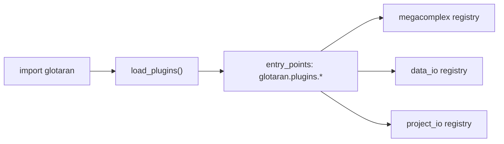
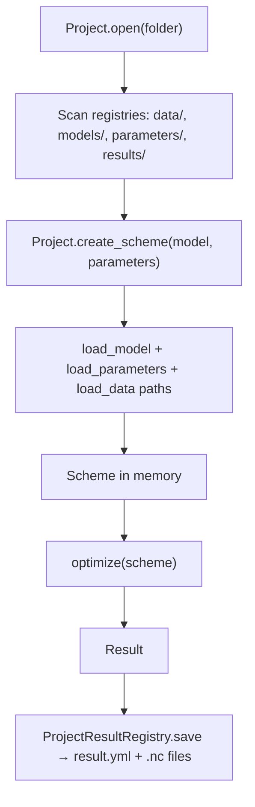
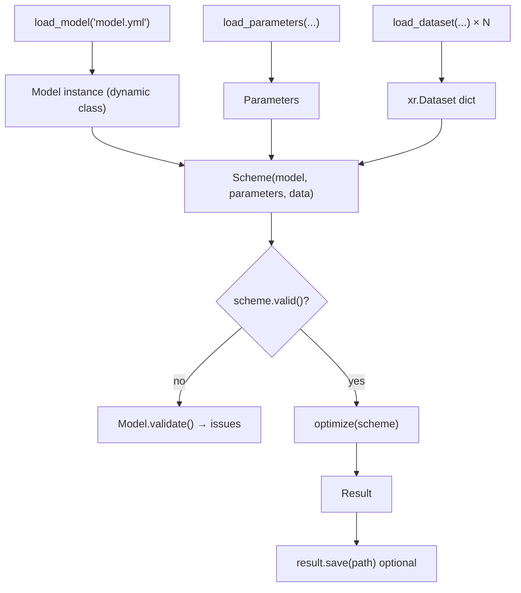
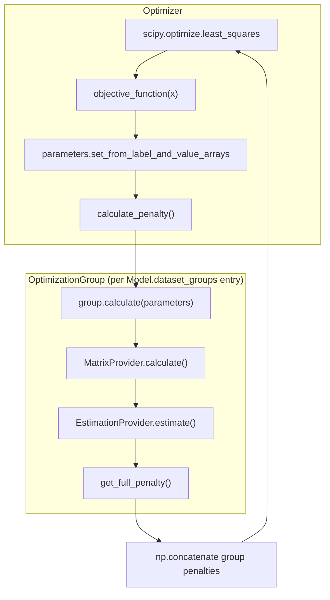

# pyglotaran Architecture Guide

A decision-oriented guide for engineers and coding agents working on [pyglotaran](https://github.com/glotaran/pyglotaran) (v0.7.4 at time of writing). Claims below are grounded in the current implementation; inferred conclusions are labeled **(inferred)**.

## Table of contents

1. [System purpose and scope](#1-system-purpose-and-scope)
2. [Architectural center of gravity](#2-architectural-center-of-gravity)
3. [Main execution paths](#3-main-execution-paths)
4. [Core concepts and boundaries](#4-core-concepts-and-boundaries)
5. [Extension architecture](#5-extension-architecture)
6. [Persistence and compatibility](#6-persistence-and-compatibility)
7. [Repository map](#7-repository-map)
8. [Change guidance and risks](#8-change-guidance-and-risks)
9. [Before changing X, inspect Y](#9-before-changing-x-inspect-y)

---

## 1. System purpose and scope

### What pyglotaran solves

pyglotaran is a Python framework for **global and target analysis** of time-resolved spectroscopy (and related multi-dimensional measurement) data. It fits parametric physical/kinetic models to experimental datasets and returns optimized parameters, residuals, conditionally linear component profiles (CLPs), and diagnostic arrays.

Primary abstractions:

| Abstraction | Role |
|---|---|
| **Megacomplex** | Pluggable model physics unit; produces a model matrix from parameters and axes |
| **Model** | Declarative composition of megacomplexes, datasets, constraints, relations, and penalties |
| **Parameters** | Nonlinear fit variables (with expressions, bounds, vary flags) |
| **Scheme** | Runnable optimization problem: model + parameters + data + solver options |
| **Result** | Post-fit artifact: optimized parameters, per-dataset xarray diagnostics, fit statistics |

Evidence: project description in `README.md`; `Megacomplex.calculate_matrix` contract in `glotaran/model/megacomplex.py`; optimization orchestration in `glotaran/optimization/optimizer.py`.

### Intentionally outside scope

- **Plotting and rich visualization** — delegated to the separate `pyglotaran-extras` package (`README.md`, `pyproject.toml` extras).
- **GUI** — notebook/CLI workflows; CLI is deprecated for removal in 0.8.0 (`glotaran/cli/main.py`).
- **Instrument-specific acquisition** — pyglotaran reads already-formed datasets; it does not control hardware.
- **General-purpose ML/statistics** — optimization is nonlinear least squares via SciPy `least_squares`, with analytical CLP projection per iteration (`glotaran/optimization/optimizer.py`, `glotaran/optimization/variable_projection.py`).
- **End-user example workflows** — maintained in the external `pyglotaran-examples` repository (`README.md`).

---

## 2. Architectural center of gravity

### The runtime spine

The true execution spine is **not** `Project`. `Project` is a disk-backed workflow helper. The spine is:

```
Scheme → Optimizer → OptimizationGroup(s) → DataProvider + MatrixProvider + EstimationProvider
```

Entry point for fitting:

```python
from glotaran.optimization.optimize import optimize
result = optimize(scheme)
```

Source: `glotaran/optimization/optimize.py` — a thin wrapper around `Optimizer`.

`Project.optimize()` is a convenience that builds a `Scheme`, calls the same `optimize()`, and saves via the result registry (`glotaran/project/project.py` lines 679–725).

### Role of each major type

#### `Scheme` — the runnable optimization unit

`Scheme` (`glotaran/project/scheme.py`) binds:

- `model: Model`
- `parameters: Parameters`
- `data: Mapping[str, xr.Dataset]`
- Solver options (`optimization_method`, tolerances, `maximum_number_function_evaluations`, CLP linking options)

It validates via `scheme.validate()` / `scheme.valid()`, which delegate to `Model.validate()`. A `Scheme` can be constructed in memory or loaded from YAML (`load_scheme` via `file_loadable_field`).

**Conclusion:** `Scheme` is the minimal input to the fitting engine. Tests and library code should prefer `optimize(scheme)` over `Project.optimize()` when persistence is not needed (`glotaran/optimization/test/test_optimization.py`).

#### `Model` — declarative schema, dynamically compiled

`Model` (`glotaran/model/model.py`) is an **attrs-based declarative schema**, not a single fixed class. At load time:

1. YAML specifies megacomplex `type` strings.
2. `get_megacomplex()` resolves registered megacomplex classes (`glotaran/plugin_system/megacomplex_registration.py`).
3. `Model.create_class_from_megacomplexes()` builds a **new Model subclass** whose fields come from megacomplex and dataset-model item definitions (`glotaran/model/model.py` lines 262–301; `glotaran/builtin/io/yml/yml.py` lines 80–81).

The model describes *what* to fit. It does not run optimization itself. Runtime evaluation happens after `fill_item()` resolves string references to live objects and parameter values (`glotaran/model/item.py`).

#### `optimize()` — public fitting API

`optimize(scheme)` (`glotaran/optimization/optimize.py`) is the stable public fitting function. The deprecated alias `glotaran.analysis.optimize` re-exports it (`glotaran/analysis/__init__.py`).

#### Plugin registration — boot-time wiring

On `import glotaran`, `load_plugins()` scans `importlib.metadata` entry points under `glotaran.plugins.*` and loads them (`glotaran/__init__.py`, `glotaran/plugin_system/base_registry.py`). This registers:

- Megacomplex classes → `__PluginRegistry.megacomplex`
- Data I/O plugins → `__PluginRegistry.data_io`
- Project I/O plugins → `__PluginRegistry.project_io`

Builtin entry points are declared in `setup.cfg` (`[options.entry_points]`).

Plugins must be loaded before model YAML can resolve megacomplex types. **(inferred)** Third-party packages should register via their own `pyproject.toml` / `setup.cfg` entry points, not by importing pyglotaran internals.

#### `Result` — post-fit container, not part of the fit loop

`Result` (`glotaran/project/result.py`) stores:

- Fit statistics (`chi_square`, `degrees_of_freedom`, `root_mean_square_error`, …)
- `optimized_parameters`, `parameter_history`, `optimization_history`
- Per-dataset `xr.Dataset` objects with `residual`, `fitted_data`, `matrix`, `clp`, optional SVD decompositions
- A copy of the input `scheme` (with paths for reload)

`Result.recreate()` re-runs `optimize(self.scheme)` for verification (`glotaran/project/result.py` lines 344–354). Result construction is owned by `Optimizer.create_result()`, not by megacomplexes.

### Public API layers (outside-in)

| Layer | Examples | Stability |
|---|---|---|
| **Fitting** | `glotaran.optimization.optimize.optimize` | Core, stable |
| **Schema objects** | `Model`, `Parameters`, `Scheme`, `Result` | Core, stable |
| **I/O** | `glotaran.io.load_model`, `load_dataset`, `save_result` | Plugin-extensible |
| **Simulation** | `glotaran.simulation.simulate` | Stable helper |
| **Project workflow** | `Project.open`, `Project.optimize` | Convenience; ties to folder layout |
| **CLI** | `glotaran` command | Deprecated |
| **Generators** | `glotaran.project.generators.generate_model` | Helper for YAML scaffolding |

### What is *not* the center

- **`Project`** — folder/registry orchestration over the same core types (`glotaran/project/project.py`).
- **Individual megacomplex modules** — physics plugins; important but swappable.
- **`MatrixProvider.calculate_dataset_matrix`** — shared numerical primitive also used by simulation (`glotaran/simulation/simulation.py`), but optimization orchestration lives in `Optimizer` / `OptimizationGroup`.

---

## 3. Main execution paths

### 3.1 Startup and plugin loading



At import, `glotaran/__init__.py` calls `load_plugins()`. Set environment variable `DEACTIVATE_GTA_PLUGINS` to skip loading **(documented in code comment; useful for isolated tests)**.

### 3.2 Project-based workflow (convenience)



Registry layout (`glotaran/project/project.py`):

- `project.gta` — version stamp only
- `data/` — dataset files (format inferred by extension)
- `models/` — model YAML
- `parameters/` — CSV/TSV/XLSX/YAML
- `results/{name}_run_NNNN/` — result folder

`Project.optimize()` always persists the result (`glotaran/project/project_result_registry.py`).

### 3.3 Direct library workflow (core)



Tests follow this path (`glotaran/optimization/test/test_optimization.py`).

### 3.4 Optimization inner loop

**Ownership at boundaries:**

| Stage | Input | Output | Owner |
|---|---|---|---|
| Parameter projection | SciPy vector `x` | Updated `Parameters` copy | `Optimizer.objective_function` |
| Matrix build | Filled `DatasetModel`, axes | `MatrixContainer` (labels + ndarray) | `MatrixProvider` |
| CLP + residual | Matrix, data column/slice | CLPs, residual vector | `EstimationProvider` + residual function |
| Penalty assembly | Per-group residuals + CLP penalties | 1D residual vector for SciPy | `Optimizer.calculate_penalty` |
| Result materialization | Final parameters | `xr.Dataset` per dataset label | `OptimizationGroup.create_result_data` |



`Optimizer` creates one `OptimizationGroup` per `DatasetGroup` from `scheme.model.get_dataset_groups()` (`glotaran/optimization/optimizer.py` lines 122–125).

#### Pseudocode: optimization orchestration

Derived from `glotaran/optimization/optimizer.py`, `glotaran/optimization/optimization_group.py`.

```
function optimize(scheme):
    optimizer = Optimizer(scheme)
    labels, x0, lb, ub = scheme.parameters.get_label_value_and_bounds_arrays(exclude_non_vary=True)
    groups = [OptimizationGroup(scheme, g) for g in scheme.model.get_dataset_groups().values()]

    result = least_squares(
        objective = λ x: optimizer.objective_function(x),
        x0, bounds=(lb, ub), method=map_method(scheme.optimization_method), ...
    )

    return optimizer.create_result()

function objective_function(x):
    parameters.set_from_label_and_value_arrays(free_labels, x)
    for group in groups:
        group.calculate(parameters)          # matrices + CLP estimation
    record parameter_history
    return concatenate([group.get_full_penalty() for group in groups])
```

**Invariants:**

- Nonlinear variables are only `Parameters` with `vary=True`.
- CLPs are re-estimated on every residual evaluation; they are not passed to SciPy.
- `degrees_of_freedom = N_residuals - N_free_params - N_clps` (`glotaran/optimization/optimizer.py` lines 243–246).

#### Pseudocode: model matrix generation

Derived from `glotaran/optimization/matrix_provider.py`.

```
function calculate_dataset_matrix(dataset_model, global_axis, model_axis, global_matrix=False):
  clp_labels = []
  matrix = None
  for scale, megacomplex in iterate_megacomplexes(dataset_model, global=global_matrix):
      labels_i, matrix_i = megacomplex.calculate_matrix(dataset_model, global_axis, model_axis)
      if scale: matrix_i *= scale
      clp_labels, matrix = combine_megacomplex_matrices(matrix, matrix_i, clp_labels, labels_i)
  return MatrixContainer(clp_labels, matrix)

function combine_megacomplex_matrices(left, right, labels_left, labels_right):
  # Union CLP labels; sum contributions for shared labels
  # Supports 2D (index-independent) and 3D (index-dependent) matrices
```

Megacomplex combination is additive on shared CLP columns (`glotaran/optimization/matrix_provider.py` lines 201–259).

#### Pseudocode: variable projection (default residual solver)

Derived from `glotaran/optimization/variable_projection.py`, `glotaran/optimization/estimation_provider.py`.

```
function residual_variable_projection(matrix A, data y):
    # Solve min ||A·c - y|| for CLPs c analytically (QR-based)
    Q, R = qr_factorize(A)
    c = back_substitute(R, Q^T · y)
    residual = y - A·c   # via orthogonal complement of column space
    return c, residual

function estimate_unlinked_dataset(dataset_model):
    for each global_index:
        M = prepared_matrix_at_index          # after scale, weight, constraints, relations
        c_reduced, r = residual_function(M, data[:, index])
        c_full = retrieve_clps(expand relations)
    append CLP penalty terms (e.g. equal-area) to residual vector
```

Alternative: `non_negative_least_squares` via `scipy.optimize.nnls` (`glotaran/optimization/nnls.py`). Selected per `DatasetGroupModel.residual_function` (`glotaran/model/dataset_group.py`).

#### Pseudocode: CLP linking (global analysis)

When `DatasetGroup.link_clp` is true (explicitly or auto-detected via `is_linkable()`), `DataProviderLinked` + `MatrixProviderLinked` + `EstimationProviderLinked` align datasets on a shared global axis and estimate **one shared CLP vector per aligned index** across datasets (`glotaran/optimization/data_provider.py`, `glotaran/optimization/matrix_provider.py` `MatrixProviderLinked`, `glotaran/optimization/estimation_provider.py` `EstimationProviderLinked`).

Auto-linking requires: no global megacomplex on any dataset, identical model dimension across datasets, exactly one shared global dimension across data (`glotaran/model/dataset_group.py` `is_linkable`).

#### Result post-processing

After SciPy returns, `Optimizer.create_result()`:

1. Updates free parameters from `result.x`
2. Computes covariance from Jacobian SVD (`calculate_covariance_matrix_and_standard_errors`)
3. Re-runs `group.calculate()` and `group.create_result_data()` to populate xarray outputs
4. Calls `finalize_dataset_model()` → each megacomplex's `finalize_data()` for model-specific diagnostics (`glotaran/model/dataset_model.py` lines 301–320)

### 3.5 Simulation path

`simulate(model, dataset_label, parameters, coordinates)` (`glotaran/simulation/simulation.py`):

- Uses the same `MatrixProvider.calculate_dataset_matrix` as optimization.
- For models with `global_megacomplex`, simulates full target analysis via Kronecker product of global and local matrices.
- Without global megacomplex, caller must supply CLP `xr.DataArray`.

Simulation does **not** use `Optimizer` or `EstimationProvider`.

### 3.6 Validation path

`Model.get_issues()` aggregates per-item validator and reference issues (`glotaran/model/model.py`). `Scheme.validate(parameters)` renders a markdown report. CLI `glotaran validate` loads a model file and prints validation (`glotaran/cli/commands/validate.py`).

Validation is structural (missing references, incompatible megacomplex combinations) plus parameter presence checks. It does not verify numerical convergence.

---

## 4. Core concepts and boundaries

### Declarative vs executable

| Declarative (serialized, edited by user) | Executable (runtime, derived) |
|---|---|
| `Model` YAML / attrs instance with string refs | `fill_item()`-resolved `DatasetModel`, `Megacomplex` objects |
| `Parameters` with expressions | Evaluated numeric values (`update_parameter_expression`) |
| `Scheme` YAML | In-memory `Scheme` with loaded `xr.Dataset` objects |
| Megacomplex registry keys (`type: decay`) | `Megacomplex.calculate_matrix()` ndarray |
| `ClpConstraint`, `ClpRelation`, `ClpPenalty` specs | Matrix column reduction / CLP recovery / penalty scalars |

### `Model` and model items

- Built with `@item` decorator → attrs class with optional validators (`glotaran/model/item.py`).
- `ModelItem` / `ModelItemTyped` — labeled, typed nested components (e.g. `KMatrix`, `Irf`).
- `attribute(..., validator=...)` attaches per-field validation.
- `Model.iterate_items()` yields all `__glotaran_items__` metadata fields (`glotaran/model/model.py`).

`Model.create_class_from_megacomplexes` merges item fields from all megacomplex types used in a file. **(inferred)** Two megacomplex types defining conflicting item field names in the same model are not supported by design.

### `DatasetModel` and `DatasetGroup`

- Each `dataset` entry references megacomplex labels, optional `global_megacomplex`, `group`, `scale`, weights.
- `DatasetGroupModel` (in `model.dataset_groups`) configures `residual_function` and `link_clp` for datasets sharing a group label.
- `DatasetGroup` (runtime, `glotaran/model/dataset_group.py`) holds filled `dataset_models` dict and is the unit passed to providers.

### `Megacomplex`

Contract (`glotaran/model/megacomplex.py`):

- `calculate_matrix(dataset_model, global_axis, model_axis) → (clp_labels, matrix)`
- `finalize_data(dataset_model, dataset, ...)` — add model-specific arrays to result datasets
- Optional flags via `@megacomplex(exclusive=..., unique=..., dataset_model_type=...)`

Matrix shape:

- 2D `(n_model_axis, n_clp)` — index-independent
- 3D `(n_global_axis, n_model_axis, n_clp)` — index-dependent (e.g. wavelength-dependent kinetics)

### `Parameters`

- Container of `Parameter` objects with `vary`, bounds, `expression`, `non_negative`, etc.
- `asteval` evaluates expressions after each value update (`glotaran/parameter/parameters.py`).
- Only `vary=True` parameters enter SciPy; expressions are re-evaluated each iteration.

### Layer separation

| Layer | Package | Must not depend on |
|---|---|---|
| Model schema | `glotaran/model/` | Optimization internals, xarray datasets in model definitions |
| Parameters | `glotaran/parameter/` | Specific megacomplex implementations |
| Optimization orchestration | `glotaran/optimization/` | Project folder layout, YAML serializers |
| I/O plugins | `glotaran/builtin/io/`, `glotaran/io/` | Specific megacomplex physics (only generic types) |
| Project workflow | `glotaran/project/` | *(uses all above via public APIs)* |
| Builtin physics | `glotaran/builtin/megacomplexes/` | Project registries |

**Exception:** `optimization` imports `Scheme` from `project` and `MatrixProvider` is reused by `simulation` — acceptable shared numerical layer.

### Diagnostics ownership

- **Generic fit diagnostics** (`residual`, `fitted_data`, `matrix`, `clp`, SVD): `OptimizationGroup.create_result_data` (`glotaran/optimization/optimization_group.py`).
- **Model-specific diagnostics** (e.g. species concentrations, EADS): megacomplex `finalize_data` implementations (e.g. `glotaran/builtin/megacomplexes/decay/decay_megacomplex.py`).

---

## 5. Extension architecture

### 5.1 Add a model component (megacomplex or nested item)

**Megacomplex (new physics model):**

1. Subclass `Megacomplex`; implement `calculate_matrix` and `finalize_data`.
2. Optionally define a `DatasetModel` subclass with extra fields (`@item`).
3. Decorate with `@megacomplex(dataset_model_type=..., exclusive=..., unique=...)`.
4. Register entry point in packaging metadata:
   ```ini
   [options.entry_points]
   glotaran.plugins.megacomplexes =
       my_type = my_package.my_module
   ```
   The module import must trigger `@megacomplex` registration (see builtin pattern in `glotaran/builtin/megacomplexes/decay/__init__.py`).

**Files to study:** `glotaran/model/megacomplex.py`, `glotaran/builtin/megacomplexes/decay/decay_megacomplex.py`, `glotaran/plugin_system/megacomplex_registration.py`, `setup.cfg` entry points.

**Tests:** co-located under `glotaran/builtin/megacomplexes/*/test/`; integration suites in `glotaran/optimization/test/suites.py`.

**Nested typed item (e.g. new IRF shape):**

1. `@item` class inheriting `ModelItemTyped` with `type: str = "my_type"`.
2. Reference from megacomplex fields via `ModelItemType[MyItem]`.
3. Add validators with `attribute(validator=...)`.

**Files:** `glotaran/model/item.py`, existing items in `glotaran/builtin/megacomplexes/decay/irf.py`.

### 5.2 Add a residual / optimization algorithm

Current residual functions are hard-coded:

```python
SUPPORTED_RESIUDAL_FUNCTIONS = {
    "variable_projection": residual_variable_projection,
    "non_negative_least_squares": residual_nnls,
}
```

(`glotaran/optimization/estimation_provider.py`)

**To add a new residual solver:**

1. Implement `fn(matrix, data) -> (clps, residual)` with same signature as `residual_variable_projection`.
2. Register in `SUPPORTED_RESIUDAL_FUNCTIONS`.
3. Allow selection via `dataset_groups.{group}.residual_function` in model YAML (`DatasetGroupModel.residual_function`).

**To replace the nonlinear optimizer** (e.g. not SciPy TRF): modify `Optimizer.optimize()` — there is no plugin hook today. This is a core change.

**Tests:** `glotaran/optimization/test/test_estimation_provider.py`, `test_optimization.py`.

### 5.3 Add a file format or serializer

**Dataset I/O:**

1. Subclass `DataIoInterface` (`glotaran/io/interface.py`).
2. Implement `load_dataset` and/or `save_dataset`.
3. Decorate: `@register_data_io("myfmt")` (`glotaran/plugin_system/data_io_registration.py`).
4. Add `glotaran.plugins.data_io` entry point.

**Project I/O (model, parameters, scheme, result):**

1. Subclass `ProjectIoInterface`.
2. Implement subset of load/save methods.
3. `@register_project_io("myfmt")`.
4. Entry point: `glotaran.plugins.project_io`.

Format inference for paths uses file extension (`glotaran/plugin_system/io_plugin_utils.py` `infer_file_format`). Plugins can register multiple aliases (see `yml`/`yaml`/`yml_str`).

**Tests:** `glotaran/plugin_system/test/test_data_io_registration.py`, `test_project_io_registration.py`; format-specific tests under `glotaran/builtin/io/*/test/`.

### 5.4 Add a result diagnostic

Preferred path: implement `Megacomplex.finalize_data()` to add arrays/attrs to the result `xr.Dataset`. Called from `finalize_dataset_model()` after generic arrays are written.

For **global** (non-megacomplex-specific) diagnostics, you would extend `OptimizationGroup.create_result_data()` — affects all models; prefer megacomplex `finalize_data` when possible.

**Tests:** `glotaran/optimization/test/test_optimization.py` `test_result_data`; megacomplex-specific tests.

### 5.5 Add a preprocessing step

1. Subclass `PreProcessor` in `glotaran/io/preprocessor/preprocessor.py` (Pydantic `BaseModel` + `apply(data) -> xr.DataArray`).
2. Add to `PipelineAction` union in `glotaran/io/preprocessor/pipeline.py` with a unique `action` discriminator literal.
3. Apply via `PreProcessingPipeline.apply()` before building a `Scheme`.

Preprocessing is **not** integrated into `Project.load_data()` automatically — callers compose pipelines explicitly.

**Tests:** `glotaran/io/preprocessor/test/test_preprocessor.py`.

### 5.6 Add a high-level workflow helper

Patterns in-repo:

- **`Project` methods** — for disk-backed workflows (`glotaran/project/project.py`).
- **`glotaran.project.generators`** — YAML model scaffolding from Python (`glotaran/project/generators/generator.py`).
- **Thin wrappers** like `optimize()` — only when wrapping the true spine without hiding `Scheme`.

Avoid putting numerical logic in project/generator layers.

---

## 6. Persistence and compatibility

### Supported formats (builtin)

| Artifact | Formats | Plugin / loader |
|---|---|---|
| Project marker | `project.gta` (YAML, version only) | `glotaran/project/project.py` |
| Model | `.yml`/`.yaml` | `YmlProjectIo` (`glotaran/builtin/io/yml/yml.py`) |
| Parameters | `.yml`, `.csv`, `.tsv`, `.xlsx` | `yml`, `csv`, `tsv`, `xlsx` project_io plugins |
| Scheme | `.yml` | `YmlProjectIo.load_scheme` via `fromdict(Scheme, ...)` |
| Result spec | `result.yml` | `YmlProjectIo.load_result` |
| Result arrays | `.nc` (NetCDF) | `SavingOptions.data_format` default `nc` |
| Raw data | `.ascii`, `.sdt`, `.nc`, … | data_io plugins (`setup.cfg`) |

`save_result` default bundle (`glotaran/builtin/io/yml/yml.py` docstring): `result.yml`, `scheme.yml`, `model.yml`, parameter CSVs, history CSVs, `result.md`, per-dataset `.nc`.

### Schema / versioning

- `project.gta` stores `version: {pyglotaran_version}` at project creation.
- `Result.glotaran_version` records the version used for the fit.
- Deprecation layer (`glotaran/deprecation/`) handles renamed APIs and YAML keys (`model_spec_deprecations` in YML loader).
- Renamed result fields on load: `number_of_data_points` → `number_of_residuals`, `number_of_parameters` → `number_of_free_parameters` (`glotaran/builtin/io/yml/yml.py` lines 170–173).

### Serialization boundaries

- **Serialized:** declarative dicts via `Model.as_dict()`, `asdict(Scheme)`, `asdict(Result)` with relative paths (`glotaran/project/dataclass_helpers.py`).
- **Not serialized:** Jacobian (excluded by default), in-memory filled items, computed matrices, plugin registry state.
- **Dynamic Model classes:** identity is not preserved; YAML stores megacomplex `type` strings and item dicts. Reload reconstructs a new Python class via `create_class_from_megacomplexes`.

### Runtime vs persisted state

| Persisted | Runtime-only |
|---|---|
| Model YAML structure | Filled `DatasetModel` with resolved references |
| Parameter values/expressions | Evaluated floats per iteration |
| Scheme options | `OptimizationGroup` provider graph |
| Result `.nc` arrays | SciPy `OptimizeResult`, live Jacobian |
| `parameter_history.csv` | `ParameterHistory` in memory during fit |

`Result.get_scheme()` builds a new `Scheme` with optimized parameters but reuses original data weight references from result datasets (`glotaran/project/result.py` lines 198–214).

### Compatibility hazards

- Plugin name collisions warn and prefer full import path keys (`PluginOverwriteWarning` in `glotaran/plugin_system/base_registry.py`). Use `set_megacomplex_plugin` / `set_data_plugin` / `set_project_plugin` to pin implementations.
- Loading results from older pyglotaran versions may fail if YAML schema or megacomplex types changed.
- `legacy` folder save format deprecated for 0.8.0 (`glotaran/builtin/io/folder/folder_plugin.py`).

---

## 7. Repository map

Top-level layout (architecturally relevant paths only):

```
glotaran/
├── __init__.py              # load_plugins() on import; version
├── model/                   # Declarative schema system (core)
│   ├── model.py             # Model class, get_dataset_groups, validation
│   ├── item.py              # @item, fill_item, validators
│   ├── megacomplex.py       # Megacomplex ABC, @megacomplex
│   ├── dataset_model.py     # Per-dataset composition, finalize_dataset_model
│   ├── dataset_group.py     # Group config + runtime DatasetGroup
│   ├── clp_*.py             # CLP constraints, relations, penalties
│   └── weight.py            # Dataset weighting specs
├── parameter/               # Nonlinear parameters, history, expressions
├── optimization/            # Fitting engine (core runtime)
│   ├── optimize.py          # Public optimize()
│   ├── optimizer.py         # SciPy orchestration, Result creation
│   ├── optimization_group.py
│   ├── data_provider.py     # Data/weight extraction, CLP linking alignment
│   ├── matrix_provider.py   # Megacomplex matrix assembly, CLP reduction
│   ├── estimation_provider.py # CLP estimation + penalties
│   ├── variable_projection.py # Default residual algorithm
│   └── nnls.py
├── simulation/              # Forward model without optimizer
├── project/                 # Scheme, Result, Project workflow
│   ├── scheme.py
│   ├── result.py
│   ├── project.py           # Folder workflow (convenience)
│   ├── project_*_registry.py
│   ├── dataclass_helpers.py # YAML round-trip for Scheme/Result
│   └── generators/          # Model YAML builders
├── io/                      # Public I/O facade → plugin_system
│   ├── interface.py         # DataIoInterface, ProjectIoInterface, SavingOptions
│   ├── prepare_dataset.py   # SVD helpers, dataset prep
│   └── preprocessor/        # Optional data preprocessing pipeline
├── plugin_system/           # Registries, entry-point loading, infer format
├── builtin/
│   ├── megacomplexes/       # Reference physics implementations (decay, spectral, …)
│   └── io/                  # Builtin format plugins (yml, pandas, netCDF, sdt, ascii, folder)
├── cli/                     # Deprecated CLI
├── deprecation/             # API/YAML migration warnings
├── testing/                 # Test helpers and simulated data (not runtime)
└── utils/                   # IO paths, regex, IPython markdown helpers
```

### Role summary

| Area | Role |
|---|---|
| `model/` | Defines *what* can be expressed; compiles YAML into typed attrs objects |
| `optimization/` | Defines *how* fitting runs; owns numerical iteration |
| `builtin/megacomplexes/` | Reference library of physical models; primary extension examples |
| `plugin_system/` + `builtin/io/` | Extensibility and serialization |
| `project/` | User-facing workflow objects and disk layout |
| `simulation/` | Generate synthetic data using same matrix path as fitting |
| `testing/` | Support code for tests/examples — not imported at runtime |

Docs (`docs/`), validation submodule (`validation/`), and benchmarks are out-of-band for runtime architecture.

---

## 8. Change guidance and risks

### Where to place new behavior

| If you are adding… | Put it in… |
|---|---|
| New physical kinetic/spectral model | New megacomplex under `builtin/megacomplexes/` or external plugin package |
| New matrix assembly rule | `MatrixProvider` (if cross-megacomplex) or megacomplex `calculate_matrix` (if local) |
| New CLP constraint type | `glotaran/model/clp_constraint.py` + `MatrixProvider.apply_constraints` |
| New CLP relation semantics | `glotaran/model/clp_relation.py` + `apply_relations` and `retrieve_clps` |
| New penalty on CLPs | `glotaran/model/clp_penalties.py` + `EstimationProvider.calculate_clp_penalties` |
| New file format | I/O plugin + entry point |
| New project convenience | `glotaran/project/project.py` or generators — keep thin |
| New fit statistic on Result | `Optimizer.create_result` (generic) or `finalize_data` (model-specific) |

### Layer dependency rules

- Megacomplexes **must not** import `Optimizer` or `Project`.
- I/O plugins **should** only construct schema objects; defer validation to `Model.validate`.
- Do not add scipy calls inside `model/` — keep model declarative.
- Prefer extending `EstimationProvider` residual registry over forking `Optimizer` unless changing the outer loop.

### Abstractions that should stay stable

- `optimize(scheme) -> Result` signature
- `Megacomplex.calculate_matrix` / `finalize_data` contracts
- `Scheme` fields used in YAML (`glotaran/project/scheme.py`)
- Plugin entry point group names (`glotaran.plugins.*`)
- `Parameters.get_label_value_and_bounds_arrays` / `set_from_label_and_value_arrays` — SciPy integration depends on these

### Risky refactors

| Risk | Why |
|---|---|
| Changing `MatrixContainer` shape conventions | Breaks megacomplexes, linking, full-model Kronecker path |
| Renaming CLP label merging in `combine_megacomplex_matrices` | Silent wrong fits if labels collide differently |
| Auto-`link_clp` heuristics (`is_linkable`) | Changes global vs target analysis classification |
| Dynamic `Model` class generation | Subtle bugs if item field names collide across megacomplex types |
| `fill_item` reference resolution | String→object resolution is pervasive; breaks YAML models if changed |
| Covariance calculation (`Optimizer.calculate_covariance_matrix_and_standard_errors`) | Sensitive to Jacobian scaling and CLP projection |
| Removing plugin load on import | Breaks `load_model` without manual plugin registration |

### Hidden coupling

- **Weight handling:** applied in `DataProvider` (data scaling) and again unwrapped in result datasets (`OptimizationGroup.add_weight_to_result_data`).
- **Index-dependent megacomplexes:** matrix rank and CLP count vary per global index — affects `number_of_clps` and DOF.
- **Global megacomplex + local megacomplex:** special `full_matrix` Kronecker path (`MatrixProviderUnlinked.calculate_full_matrices`) — separate from standard per-index estimation.
- **`MatrixProvider.calculate_dataset_matrix` shared by simulation and optimization** — changes affect both.

### Plugin ordering

Entry points load in metadata iteration order; duplicate short names warn and register under full module path (`add_plugin_to_registry`). Do not rely on load order for correctness — use explicit `set_*_plugin` if two plugins register the same key.

### Testing expectations

- Optimization regressions: `glotaran/optimization/test/test_optimization.py` (parametrized suites, methods, link_clp, weights).
- Provider unit tests: `test_matrix_provider.py`, `test_estimation_provider.py`, `test_data_provider.py`.
- I/O round-trip: `glotaran/builtin/io/yml/test/test_save_result.py`, `test_save_scheme.py`.
- Megacomplex physics: under each `builtin/megacomplexes/*/test/`.
- Plugin registration: `glotaran/plugin_system/test/`.

New megacomplexes should add: matrix shape tests, optimization integration (can use `simulate` → `optimize` round trip), and YAML load test.

---

## 9. Before changing X, inspect Y

| Before changing… | Inspect… |
|---|---|
| `Optimizer.objective_function` / penalty shape | `EstimationProvider.get_full_penalty`, `test_optimization.py`, CLP penalty tests (`test_penalties.py`) |
| `MatrixProvider.combine_megacomplex_matrices` | All megacomplex `calculate_matrix` return shapes; `test_matrix_provider.py` |
| `DatasetGroup.is_linkable` / linking | `DataProviderLinked`, `EstimationProviderLinked`, `test_data_provider.py`, `test_multiple_goups.py` |
| `fill_item` or `@item` | YAML loaders (`yml.py`), all `ModelItemType` references, `test_parameter.py` |
| `Model.create_class_from_megacomplexes` | Every builtin megacomplex `__init__.py` entry point; model YAML in `docs/source/notebooks/getting_started/` |
| Residual function registry | `DatasetGroupModel.residual_function`, `test_estimation_provider.py` |
| `Scheme` / `Result` dataclass fields | `dataclass_helpers.py`, `fromdict`/`asdict`, save/load tests |
| Result `finalize_data` | Consumers in pyglotaran-extras **(external)**; existing decay/spectral finalize tests |
| Plugin entry points | `setup.cfg`, `plugin_system/test/`, `DEACTIVATE_GTA_PLUGINS` behavior |
| `Parameters` expression evaluation | `asteval` usage, `update_parameter_expression`, bounds for `non_negative` parameters |
| Covariance / standard errors | PR #706 comment in `optimizer.py`; log-scale error branch for `non_negative` |
| `Project` registries | `project_registry.py` ambiguous filename warnings, `project_result_registry.py` run numbering |
| Simulation output | `simulation.py` and optimization matrix path consistency |

---

## Quick reference: minimal fit in code

```python
from glotaran.io import load_model, load_parameters, load_dataset
from glotaran.project import Scheme
from glotaran.optimization.optimize import optimize

model = load_model("models/my_model.yml")
parameters = load_parameters("parameters/initial.csv")
data = {"dataset_1": load_dataset("data/measurement.nc")}

scheme = Scheme(model=model, parameters=parameters, data=data)
assert scheme.valid()

result = optimize(scheme)
result.save("results/my_run")
```

This uses the same spine as `Project.optimize()` without project folder coupling.
