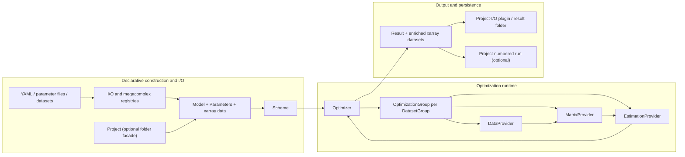

# pyglotaran architecture guide

This document describes the architecture in this repository as it exists today. It is a guide
for deciding where a change belongs. Implementation code is the primary evidence. Tests and
documentation are linked where they clarify contracts or intended use.

The package version in this checkout is `0.7.4`; the changelog also contains an unreleased
`0.7.5` section ([`glotaran/__init__.py`](glotaran/__init__.py),
[`changelog.md`](changelog.md)).

## Table of contents

- [Purpose and limits](#purpose-and-limits)
- [Architectural center of gravity](#architectural-center-of-gravity)
- [Runtime architecture at a glance](#runtime-architecture-at-a-glance)
- [Main execution paths](#main-execution-paths)
  - [Construction and loading](#construction-and-loading)
  - [Validation and runtime model composition](#validation-and-runtime-model-composition)
  - [Optimization](#optimization)
  - [Matrix generation and conditional-linear estimation](#matrix-generation-and-conditional-linear-estimation)
  - [Simulation](#simulation)
  - [Result construction and persistence](#result-construction-and-persistence)
- [Core concepts and boundaries](#core-concepts-and-boundaries)
- [Extension architecture](#extension-architecture)
- [Persistence and compatibility](#persistence-and-compatibility)
- [Repository map](#repository-map)
- [Change guidance and risks](#change-guidance-and-risks)
- [Before changing X, inspect Y](#before-changing-x-inspect-y)

## Purpose and limits

pyglotaran is a fitting engine and modeling framework for global and target analysis, most often
of time-resolved spectroscopy data. A user declares a model, supplies nonlinear parameters and
one or more two-dimensional datasets, and the engine separates nonlinear optimization from the
estimation of conditionally linear parameters (CLPs). The implementation produces fitted data,
residuals, CLPs, matrices, uncertainty information, and model-specific derived quantities. The
project description and scientific scope are stated in [`README.md`](README.md),
[`docs/source/introduction.rst`](docs/source/introduction.rst), and package metadata in
[`setup.cfg`](setup.cfg).

The primary abstractions are:

- a declarative [`Model`](glotaran/model/model.py), built from model items and `Megacomplex`
  components;
- a [`Parameters`](glotaran/parameter/parameters.py) collection that owns nonlinear values,
  bounds, expressions, and variation flags;
- labeled two-dimensional scientific data in `xarray.Dataset` objects;
- a [`Scheme`](glotaran/project/scheme.py), which binds model, parameters, data, and optimizer
  settings for one run;
- the [`optimize()`](glotaran/optimization/optimize.py) runtime entry point and its provider-based
  numerical pipeline; and
- a [`Result`](glotaran/project/result.py), which records the run and contains enriched result
  datasets.

The project intentionally does **not** provide a GUI. Its documentation describes Jupyter as the
current user environment and limits pyglotaran itself to modeling and optimization
([`docs/source/introduction.rst`](docs/source/introduction.rst)). General plotting is also outside
the core package: the README points to `pyglotaran-extras` for overview plots, and that package is
an optional extra rather than a runtime dependency ([`README.md`](README.md),
[`setup.cfg`](setup.cfg)). Measurement-specific ingestion is limited to registered data I/O
formats; arbitrary acquisition control, experiment management, and general-purpose data cleaning
are not responsibilities of the optimizer. **Architectural inference:** these exclusions follow
from the implemented interfaces and package boundaries rather than a single exhaustive scope
statement ([`glotaran/io`](glotaran/io), [`glotaran/optimization`](glotaran/optimization)).
Scientific reference-result validation is maintained
as a separate validation workflow/repository, while this repository contains unit and integration
tests ([`NOTICE.md`](NOTICE.md), [`.github/workflows/integration-tests.yml`](.github/workflows/integration-tests.yml)).

## Architectural center of gravity

The center of gravity is the path `Scheme -> optimize() -> Optimizer -> OptimizationGroup ->
DataProvider/MatrixProvider/EstimationProvider -> Result`. `Project` is useful, but it is not the
central runtime abstraction.

The public surface is layered rather than re-exported from the package root. The root import loads
plugins and defines the version ([`glotaran/__init__.py`](glotaran/__init__.py));
[`glotaran.project`](glotaran/project/__init__.py) re-exports `Project`, `Scheme`, and `Result`;
[`glotaran.model`](glotaran/model/__init__.py) re-exports the model-building vocabulary; and
[`glotaran.io`](glotaran/io/__init__.py) re-exports plugin-backed I/O. The optimization function is
defined in [`glotaran/optimization/optimize.py`](glotaran/optimization/optimize.py), which is also
the import path used by core tests and the current CLI.

| API or object | Actual role | Architectural conclusion |
| --- | --- | --- |
| [`Project`](glotaran/project/project.py) | Manages a conventional folder layout, discovers files through project registries, loads inputs, creates a `Scheme`, calls `optimize()`, and saves numbered result runs. | High-level disk workflow and convenience facade. It is not required for modeling, simulation, or optimization. |
| [`Scheme`](glotaran/project/scheme.py) | Run input bundle: `Model`, `Parameters`, dataset mapping, CLP-link settings, least-squares tolerances/method, result path, and SVD option. It accepts objects or file paths through file-loadable dataclass fields. | The public boundary between construction/I/O and optimization. It is configuration, not the executing engine. |
| [`Model`](glotaran/model/model.py) | Declarative graph of datasets, megacomplexes, typed model items, CLP relations/constraints/penalties, groups, and weights. It validates references and generates parameter labels. YAML loading creates a dynamic `Model` subclass from the megacomplex types in the specification. | The central domain schema and component composition mechanism, but not the numerical loop. |
| [`optimize()`](glotaran/optimization/optimize.py) | Constructs `Optimizer`, runs it, and returns `Optimizer.create_result()`. | The small, stable public runtime entry point. |
| [`Optimizer`](glotaran/optimization/optimizer.py) | Adapts `Parameters` to SciPy, owns evaluation history and optimization groups, concatenates penalties, handles failures, computes covariance/error statistics, and constructs the `Result`. | Top-level runtime orchestrator. |
| Plugin registration | Importing [`glotaran`](glotaran/__init__.py) loads `glotaran.plugins*` entry points. Global registries select megacomplex, data-I/O, and project-I/O implementations. | Construction and I/O extension mechanism. Plugins do not drive the optimizer loop. |
| [`Result`](glotaran/project/result.py) | Structured run record containing the original scheme, initial and optimized parameters, histories, aggregate metrics, and enriched per-dataset `xarray` data. It can save, recreate, verify, or derive a new scheme. | Output boundary and reproducibility container, not merely a display object. |

The direct core API is demonstrated repeatedly by tests that construct `Scheme` and call
`optimize()` without a `Project`, including linked/unlinked, weighted, full-model, and multiple
group cases ([`glotaran/optimization/test/test_optimization.py`](glotaran/optimization/test/test_optimization.py),
[`glotaran/optimization/test/test_multiple_goups.py`](glotaran/optimization/test/test_multiple_goups.py)).
`Project.optimize()` is also tested, but its implementation delegates directly after loading and
then saves the result ([`glotaran/project/project.py`](glotaran/project/project.py),
[`glotaran/project/test/test_project.py`](glotaran/project/test/test_project.py)). This is concrete
evidence that `Project` is a convenience workflow rather than the runtime spine.

## Runtime architecture at a glance



The providers are runtime objects. They cache normalized data layouts, matrices, CLPs, and
residuals for the current parameter vector. They must not leak into persisted model schemas.
Their collaboration is implemented in
[`glotaran/optimization/optimization_group.py`](glotaran/optimization/optimization_group.py),
[`glotaran/optimization/data_provider.py`](glotaran/optimization/data_provider.py),
[`glotaran/optimization/matrix_provider.py`](glotaran/optimization/matrix_provider.py), and
[`glotaran/optimization/estimation_provider.py`](glotaran/optimization/estimation_provider.py).

## Main execution paths

### Construction and loading

There are three supported construction styles:

1. Construct `Model`, `Parameters`, datasets, and `Scheme` in Python. Tests use this path to
   exercise the core without persistence ([`glotaran/optimization/test/test_optimization.py`](glotaran/optimization/test/test_optimization.py)).
2. Load them through the functions exported by [`glotaran.io`](glotaran/io/__init__.py). These
   functions infer a format from the path unless a format is explicit, then dispatch through a
   plugin registry ([`glotaran/plugin_system/data_io_registration.py`](glotaran/plugin_system/data_io_registration.py),
   [`glotaran/plugin_system/project_io_registration.py`](glotaran/plugin_system/project_io_registration.py)).
3. Use `Project` to scan a conventional `data/`, `models/`, `parameters/`, and `results/` folder,
   then call `create_scheme()` or `optimize()` ([`glotaran/project/project.py`](glotaran/project/project.py),
   [`glotaran/project/project_registry.py`](glotaran/project/project_registry.py)).

At the I/O boundary, datasets become `xarray.Dataset` instances with a `data` variable and a
`source_path` attribute. A loaded `DataArray` is converted to a dataset. `DatasetMapping` accepts
a path, object, sequence, or mapping and normalizes these into a mapping keyed by labels
([`glotaran/plugin_system/data_io_registration.py`](glotaran/plugin_system/data_io_registration.py),
[`glotaran/utils/io.py`](glotaran/utils/io.py)). `Scheme.__post_init__()` similarly resolves file
paths for its model, parameters, and datasets through dataclass field metadata
([`glotaran/project/scheme.py`](glotaran/project/scheme.py),
[`glotaran/project/dataclass_helpers.py`](glotaran/project/dataclass_helpers.py)).

YAML model loading is more than deserialization. `YmlProjectIo.load_model()` reads and sanitizes
the specification, resolves every megacomplex `type` through the megacomplex registry, creates a
dynamic `Model` subclass for those component types, and then instantiates it
([`glotaran/builtin/io/yml/yml.py`](glotaran/builtin/io/yml/yml.py),
[`glotaran/model/model.py`](glotaran/model/model.py)). The dynamic class contains model-item
dictionaries required by the selected megacomplexes and a composed dataset-model type containing
their dataset fields. Persisted YAML therefore describes structure and type names; it does not
persist the generated Python class identity.

### Validation and runtime model composition

`Scheme.validate()` and `Scheme.valid()` delegate to `Model`. `Model.get_issues()` walks every
declared item and checks:

- referenced model-item labels exist;
- referenced parameter labels exist when parameters were supplied; and
- field-specific validators, including megacomplex exclusivity/uniqueness rules.

The implementation is in [`glotaran/model/model.py`](glotaran/model/model.py),
[`glotaran/model/item.py`](glotaran/model/item.py), and
[`glotaran/model/dataset_model.py`](glotaran/model/dataset_model.py), with composition and
validation examples in [`glotaran/model/test/test_model.py`](glotaran/model/test/test_model.py).

Validation is **not** automatically invoked by `Optimizer`. Its constructor checks that all model
dataset labels have data, parameters are present, and the selected SciPy method is supported, but
it does not call `Model.validate()` ([`glotaran/optimization/optimizer.py`](glotaran/optimization/optimizer.py)).
Callers that build a scheme programmatically should call `scheme.validate()` or `scheme.valid()`
before optimization when they need a complete, user-facing error list. Otherwise unresolved
references can fail later during matrix construction.

The declarative `Model` stores references as labels. It is not globally mutated into an executable
model. For every parameter vector, `DatasetGroup.set_parameters()` calls `fill_item()` for each
dataset model. `fill_item()` creates an evolved copy, recursively replaces model-item labels with
item instances, and replaces parameter labels with `Parameter` objects from the current
`Parameters` collection ([`glotaran/model/dataset_group.py`](glotaran/model/dataset_group.py),
[`glotaran/model/item.py`](glotaran/model/item.py)). The filled dataset models, provider caches, and
the group itself form the executable runtime graph.

### Optimization

The public wrapper is deliberately small. The important control flow is in `Optimizer.optimize()`,
`objective_function()`, `calculate_penalty()`, and `create_result()`
([`glotaran/optimization/optimize.py`](glotaran/optimization/optimize.py),
[`glotaran/optimization/optimizer.py`](glotaran/optimization/optimizer.py)).

**Inputs:** a `Scheme` whose datasets cover `model.dataset`, and initialized parameters.

**Output:** a `Result`, or an `InitialParameterError` if even the initial vector could not be
evaluated. Other runtime exceptions are either raised or converted to an unsuccessful result,
depending on `raise_exception`.

**Invariants:** only `vary=True` parameters are passed to SciPy; expressions are recalculated after
parameter changes; non-negative nonlinear parameters are optimized in log space; every objective
return is one flat residual/penalty vector.

Language-agnostic pseudocode derived from `Optimizer`:

```text
OPTIMIZE(scheme):
    assert every model dataset has input data
    working_parameters := deep-enough copy of scheme.parameters
    groups := one OptimizationGroup for each model DatasetGroup

    labels, x0, lower, upper := free parameter optimization arrays

    OBJECTIVE(x):
        update working_parameters[labels] from x
        # This also reverses log transforms and updates expressions.
        group_penalties := []
        for group in groups:
            group.fill_runtime_model(working_parameters)
            group.recalculate_matrices()
            group.estimate_CLPs_and_residuals()
            append group.full_penalty to group_penalties
        record parameter history
        return concatenate(group_penalties)

    scipy_result := least_squares(
        OBJECTIVE, x0, bounds=(lower, upper), configured method/tolerances
    )

    restore best/final parameter vector
    compute counts, chi-square, reduced chi-square, RMSE
    estimate covariance and parameter standard errors from Jacobian SVD
    recalculate every group at final parameters
    build enriched result datasets
    return Result(original scheme, initial/final parameters, histories, metrics, datasets)
```

The `Parameters` transformations in that pseudocode are implemented in
[`glotaran/parameter/parameters.py`](glotaran/parameter/parameters.py) and
[`glotaran/parameter/parameter.py`](glotaran/parameter/parameter.py). `Optimizer` maps the public
method names `TrustRegionReflection`, `Dogbox`, and `Levenberg-Marquardt` to SciPy's `trf`,
`dogbox`, and `lm` ([`glotaran/optimization/optimizer.py`](glotaran/optimization/optimizer.py)).

### Matrix generation and conditional-linear estimation

`OptimizationGroup` selects linked or unlinked provider families. If `DatasetGroupModel.link_clp`
is `None`, linkability is inferred: full/global models cannot link; model dimensions must match;
and all data must expose one global dimension. Explicit `True` or `False` overrides the inference
([`glotaran/model/dataset_group.py`](glotaran/model/dataset_group.py),
[`glotaran/optimization/optimization_group.py`](glotaran/optimization/optimization_group.py)).

The data boundary is owned by `DataProvider`:

- it infers the model dimension from the filled megacomplexes and treats the other `data`
  dimension as global;
- it copies data into `(model, global)` numerical arrays;
- it applies dataset-provided or model-declared weights to the numerical data;
- for a full model, it also stores transposed, flattened data and weights; and
- the linked subtype aligns global coordinates across datasets using the scheme tolerance and
  direction, then creates concatenated data/weight slices.

See [`glotaran/optimization/data_provider.py`](glotaran/optimization/data_provider.py) and its
layout/linking tests in
[`glotaran/optimization/test/test_data_provider.py`](glotaran/optimization/test/test_data_provider.py).

`MatrixProvider` owns matrix composition and reduction. Each filled `Megacomplex` returns CLP
labels plus a 2-D matrix, or a 3-D matrix when it varies along the global axis. Matrices from
multiple megacomplexes are combined by the union of CLP labels; columns with the same label are
added. Dataset and component scales are applied, then CLP relations collapse target columns and
constraints remove columns. Weights are applied to the prepared matrix. Full models combine a
model-dimension matrix and a global-dimension matrix with a Kronecker product. Linked groups align
columns by CLP label and vertically concatenate the participating datasets
([`glotaran/optimization/matrix_provider.py`](glotaran/optimization/matrix_provider.py),
[`glotaran/optimization/test/test_matrix_provider.py`](glotaran/optimization/test/test_matrix_provider.py)).

**Inputs:** a filled `DatasetModel`, model/global axes, current parameter values, optional weights,
and CLP constraints/relations.

**Outputs:** prepared matrix slices and their reduced CLP-label lists, or one flattened full-model
matrix.

**Invariant:** every matrix column and estimated CLP value is interpreted through the adjacent
ordered CLP-label list. Label order is part of the numerical contract.

```text
BUILD_MATRICES(dataset_model, axes, weights, linked):
    component_matrices := []
    for (scale, megacomplex) in dataset_model.megacomplexes:
        labels, A := megacomplex.calculate_matrix(dataset_model, axes)
        append (labels, scale * A) to component_matrices

    labels, A := merge columns by label, adding duplicate-label contributions

    if dataset has a global model:
        global_labels, G := repeat composition for global megacomplexes with axes swapped
        full_A := kron(G, A), or row-wise kron when A is index-dependent
        return weighted(full_A), labels x global_labels

    slices := split A by global index when index-dependent, otherwise reuse A
    for slice at global coordinate g:
        fold active CLP relations into source columns
        remove actively constrained columns
        apply dataset scale and weight for g

    if linked:
        align participating dataset slices on g
        union CLP labels and vertically concatenate their rows

    return prepared slices with ordered reduced labels
```

`EstimationProvider` selects the conditional-linear residual function from
`SUPPORTED_RESIUDAL_FUNCTIONS` (the misspelling is part of the current internal symbol name). The
choices are variable projection and non-negative least squares
([`glotaran/optimization/estimation_provider.py`](glotaran/optimization/estimation_provider.py)).
Unlinked datasets are solved independently at every global coordinate, except full models, which
are solved once against the flattened matrix. Linked datasets are solved once per aligned global
coordinate against a shared, vertically concatenated matrix. Reduced CLPs are expanded back to
the full label set, including relation-derived values. Equal-area CLP penalties are appended to
the residual vector ([`glotaran/optimization/estimation_provider.py`](glotaran/optimization/estimation_provider.py),
[`glotaran/optimization/test/test_estimation_provider.py`](glotaran/optimization/test/test_estimation_provider.py)).

The central variable-projection contract is:

```text
VARIABLE_PROJECT(A, data):
    Q, R := QR factorization of A
    transformed := transpose(Q) * data
    clp := solve triangular(R, transformed)
    set the first number_of_columns(A) values of transformed to zero
    residual := Q * transformed
    return first number_of_columns(A) values of clp, residual
```

This pseudocode follows the LAPACK QR/orthogonal-transform/triangular-solve sequence in
[`glotaran/optimization/variable_projection.py`](glotaran/optimization/variable_projection.py).
The alternative NNLS path solves `min ||A*clp-data||` with `clp >= 0` and returns
`data - A*clp` ([`glotaran/optimization/nnls.py`](glotaran/optimization/nnls.py)).

### Simulation

Simulation reuses model composition and the same megacomplex matrix contract, but does not use
`Optimizer` or the provider stack. `simulate()` fills one dataset model from a `Model` and
`Parameters`, infers its model/global axes, and then either:

- multiplies the model matrix by caller-supplied CLPs at each global coordinate; or
- constructs CLPs from the dataset's global megacomplex matrix and performs the same multiplication.

Optional Gaussian noise is applied afterward. Global index-dependent matrices are rejected for
full-model simulation. The implementation and contract tests are in
[`glotaran/simulation/simulation.py`](glotaran/simulation/simulation.py) and
[`glotaran/simulation/test/test_simulation.py`](glotaran/simulation/test/test_simulation.py).

This reuse is an important boundary: model components must express their numerical contribution
through `Megacomplex.calculate_matrix()` so simulation and optimization remain consistent.

### Result construction and persistence

After SciPy terminates, `Optimizer.create_result()` owns aggregate run statistics. It stores the
Jacobian, calculates covariance through an SVD-based pseudoinverse, writes standard errors back to
the working parameters, and records histories and failure information
([`glotaran/optimization/optimizer.py`](glotaran/optimization/optimizer.py)).

Each `OptimizationGroup.create_result_data()` starts with a copy of its input `xarray.Dataset`,
then adds:

- `matrix` and optional `global_matrix`;
- `clp`;
- weighted and/or unweighted `residual`;
- optional SVD diagnostics;
- dataset-level RMSE attributes and dataset scale; and
- `fitted_data = data - residual`.

Finally it calls every participating megacomplex's `finalize_data()` hook, which adds
model-specific coordinates and derived arrays such as species-associated data
([`glotaran/optimization/optimization_group.py`](glotaran/optimization/optimization_group.py),
[`glotaran/model/dataset_model.py`](glotaran/model/dataset_model.py),
[`glotaran/model/megacomplex.py`](glotaran/model/megacomplex.py)). Result dataset shape and variable
contracts are asserted in
[`glotaran/optimization/test/test_optimization.py`](glotaran/optimization/test/test_optimization.py).

The resulting `Result` keeps both the original `Scheme` and the optimized `Parameters` rather than
mutating the scheme's initial parameters. `Result.get_scheme()` currently returns a dataclass
replacement of the original scheme with optimized parameters; it therefore retains the original
scheme data, not the enriched result datasets. This behavior is tested in
[`glotaran/project/test/test_result.py`](glotaran/project/test/test_result.py) and implemented in
[`glotaran/project/result.py`](glotaran/project/result.py).

Saving a result through YAML first uses the internal folder writer to write reports, histories,
parameters, and NetCDF datasets. It also writes `model.yml`, `scheme.yml`, and the top-level result
manifest. Loading follows the paths in that manifest and reconstructs the nested objects
([`glotaran/builtin/io/yml/yml.py`](glotaran/builtin/io/yml/yml.py),
[`glotaran/builtin/io/folder/folder_plugin.py`](glotaran/builtin/io/folder/folder_plugin.py),
[`glotaran/project/dataclass_helpers.py`](glotaran/project/dataclass_helpers.py)). `Project` adds a
separate convention: every save creates `results/<name>_run_NNNN/result.yml`
([`glotaran/project/project_result_registry.py`](glotaran/project/project_result_registry.py)).

## Core concepts and boundaries

### Declarative objects versus runtime objects

| Kind | Objects | Responsibility and lifecycle |
| --- | --- | --- |
| Declarative domain schema | `Model`, `DatasetModel`, `DatasetGroupModel`, `Megacomplex`, other `Item`/`ModelItem` subclasses | Usually loaded or constructed once. Keeps labels and parameter references serializable. Validates the graph. A dynamic `Model` subclass exposes the fields required by selected components. |
| Run configuration | `Scheme`, `Parameters`, input `xarray.Dataset` mapping | Binds a model to initial values, concrete data, linking policy, and nonlinear optimizer options. Crosses into the runtime at `optimize()`. |
| Executable runtime | `Optimizer`, `DatasetGroup`, `OptimizationGroup`, `DataProvider`, `MatrixProvider`, `EstimationProvider`, `MatrixContainer` | Created per run. Holds current filled items and mutable numerical caches. Recalculated for each objective evaluation. Not serialized. |
| Output record | `Result`, parameter/optimization histories, enriched result datasets | Created after optimization. Contains enough input and output state for saving, reporting, recreation, and verification. |
| Disk workflow | `Project` and `Project*Registry` | Optional facade over filesystem discovery, imports, run naming, and save/load. Its registries are recreated around a project folder and scan the filesystem on access. |

### Domain responsibilities and invariants

**`Parameter` and `Parameters`.** `Parameter` owns one nonlinear value and its bound/expression/
variation semantics. A `non_negative` parameter is log-transformed for optimization; an expression
forces `vary=False`. `Parameters` owns label lookup, copying, expression evaluation, and conversion
to/from flat optimization arrays ([`glotaran/parameter/parameter.py`](glotaran/parameter/parameter.py),
[`glotaran/parameter/parameters.py`](glotaran/parameter/parameters.py)). Labels must be unique and
valid, and expressions must evaluate to numbers.

**`Item` and `ModelItem`.** These attrs-based schema nodes are declared with `@item`. Type
annotations identify references to parameters and other model items. Field metadata from
`attribute()` provides aliases and validators. The same annotations drive dynamic model-class
creation, filling, and validation, so changing an annotation is a schema and runtime change
([`glotaran/model/item.py`](glotaran/model/item.py)).

**`Megacomplex`.** A typed, labeled component that contributes a matrix and post-processes result
data. The `@megacomplex` decorator converts it to an item, attaches its optional dataset-model
type plus `exclusive`/`unique` rules, and registers its non-default `type` string
([`glotaran/model/megacomplex.py`](glotaran/model/megacomplex.py)). Its matrix row count must match
the model axis and its returned labels must match its columns. All megacomplexes selected for a
dataset must agree on the model dimension
([`glotaran/model/dataset_model.py`](glotaran/model/dataset_model.py)).

**`DatasetModel`.** Selects ordered model-dimension and optional global-dimension megacomplexes,
scales, dataset group, and index-dependence policy. Component-specific subclasses add fields such
as IRF or spectral settings ([`glotaran/model/dataset_model.py`](glotaran/model/dataset_model.py),
[`glotaran/builtin/megacomplexes/decay/decay_megacomplex.py`](glotaran/builtin/megacomplexes/decay/decay_megacomplex.py),
[`glotaran/builtin/megacomplexes/spectral/spectral_megacomplex.py`](glotaran/builtin/megacomplexes/spectral/spectral_megacomplex.py)).

**`DatasetGroupModel` and `DatasetGroup`.** The model object declares residual-function and linking
policy. `Model.get_dataset_groups()` creates runtime `DatasetGroup` instances and assigns each
dataset model to its named group. Groups are independent in the nonlinear objective; their flat
penalties are concatenated ([`glotaran/model/dataset_group.py`](glotaran/model/dataset_group.py),
[`glotaran/model/model.py`](glotaran/model/model.py)).

**CLPs, relations, constraints, penalties, and weights.** CLPs are not `Parameter` objects. They
are solved conditionally for each matrix/data slice. Relations reduce one CLP to a scaled form of
another; constraints remove CLP columns on selected intervals; equal-area penalties add scalar
residual terms; weights multiply data and matrices before estimation
([`glotaran/model/clp_relation.py`](glotaran/model/clp_relation.py),
[`glotaran/model/clp_constraint.py`](glotaran/model/clp_constraint.py),
[`glotaran/model/clp_penalties.py`](glotaran/model/clp_penalties.py),
[`glotaran/model/weight.py`](glotaran/model/weight.py)). These features cross the model/numerics
boundary through `MatrixProvider`, `EstimationProvider`, and `DataProvider`, respectively.

**`Scheme`.** Owns references to the run's original objects and settings. It does not own provider
caches or optimized parameters. Its `result_path` field is serialized configuration but is not
used by the core `optimize()` function; result persistence is explicitly triggered by `Result`,
I/O functions, or `Project` ([`glotaran/project/scheme.py`](glotaran/project/scheme.py),
[`glotaran/optimization/optimize.py`](glotaran/optimization/optimize.py)).

**`Result`.** Owns aggregate diagnostics and a mapping of enriched result datasets. Model-specific
diagnostics live in those datasets. Histories are separate objects to keep their CSV persistence
and formatting concerns out of the numerical providers
([`glotaran/project/result.py`](glotaran/project/result.py),
[`glotaran/parameter/parameter_history.py`](glotaran/parameter/parameter_history.py),
[`glotaran/optimization/optimization_history.py`](glotaran/optimization/optimization_history.py)).

### Layer boundaries

- **Model logic** defines items, validation, dimensions, and component matrices. It may depend on
  parameters and `xarray`, but should not invoke SciPy least-squares or project registries.
- **Numerical algorithms** consume filled model objects and arrays. Providers must not parse YAML,
  scan folders, or choose file formats.
- **Orchestration** in `Optimizer` and `OptimizationGroup` coordinates parameter iteration,
  provider selection, statistics, and result assembly. Component-specific equations belong in
  megacomplexes, not here.
- **I/O** converts between files and public domain objects. It selects implementations by registry
  and maintains `source_path`; it must not become part of objective evaluation.
- **Diagnostics** split into generic run/dataset diagnostics in `Optimizer` or
  `OptimizationGroup`, and model-specific derived data in `Megacomplex.finalize_data()`.
- **High-level workflow** in `Project` may combine I/O, optimization, and saving, but core APIs
  must remain usable without a project folder.

## Extension architecture

### Plugin discovery and registry contracts

Importing the package calls `load_plugins()`, which loads every installed entry point whose group
starts with `glotaran.plugins` unless `DEACTIVATE_GTA_PLUGINS` is present
([`glotaran/__init__.py`](glotaran/__init__.py),
[`glotaran/plugin_system/base_registry.py`](glotaran/plugin_system/base_registry.py)). Built-ins
are exposed through `glotaran.plugins.data_io`, `glotaran.plugins.megacomplexes`, and
`glotaran.plugins.project_io` entry points in [`setup.cfg`](setup.cfg).

The process-global `__PluginRegistry` has three mutable maps: `megacomplex`, `data_io`, and
`project_io`. Registration stores a short access name and a fully qualified import-path name.
When two implementations request the same short name, the later implementation is kept under its
full name and a warning is issued; the existing short-name binding is not silently replaced.
`set_megacomplex_plugin()`, `set_data_plugin()`, and `set_project_plugin()` explicitly pin a short
name to a fully qualified registered implementation
([`glotaran/plugin_system/base_registry.py`](glotaran/plugin_system/base_registry.py),
[`glotaran/plugin_system/megacomplex_registration.py`](glotaran/plugin_system/megacomplex_registration.py),
[`glotaran/plugin_system/data_io_registration.py`](glotaran/plugin_system/data_io_registration.py),
[`glotaran/plugin_system/project_io_registration.py`](glotaran/plugin_system/project_io_registration.py)).
Registry conflict and pinning behavior is tested under
[`glotaran/plugin_system/test`](glotaran/plugin_system/test).

Not every extension below is a plugin. Residual algorithms, preprocessors, and result diagnostics
are currently closed, in-repository extension points. Treating them as dynamically discoverable
without adding a registry would be an architectural change.

Model-item type registration is a separate mechanism. The `@item` decorator gives each direct
`TypedItem` hierarchy its own `__item_types__` map; decorated typed subclasses register their
default `type` string there. `_load_item_from_dict()` uses that map for CLP constraints and
penalties and other typed items ([`glotaran/model/item.py`](glotaran/model/item.py),
[`glotaran/model/model.py`](glotaran/model/model.py),
[`glotaran/model/clp_constraint.py`](glotaran/model/clp_constraint.py),
[`glotaran/model/clp_penalties.py`](glotaran/model/clp_penalties.py)). Megacomplex types instead use
the process-global plugin registry because they must be discovered before a dynamic `Model` class
can be constructed. A new typed model item must have a stable `type` default and be imported before
deserialization; exposing it through a megacomplex annotation makes the dynamic model schema own
its item dictionary.

### Add a model component

Minimal changes:

1. Define any supporting schema nodes as `@item` classes using `ParameterType` and
   `ModelItemType` annotations in an appropriate package under
   [`glotaran/builtin/megacomplexes`](glotaran/builtin/megacomplexes), or in a third-party plugin.
2. If dataset-level fields are needed, define an `@item` subclass of `DatasetModel`.
3. Define a `Megacomplex` subclass with `@megacomplex(dataset_model_type=..., exclusive=...,
   unique=...)`, a stable `type` string, a stable `dimension`, `calculate_matrix()`, and
   `finalize_data()` ([`glotaran/model/megacomplex.py`](glotaran/model/megacomplex.py)).
4. For a built-in, expose a package import through the `glotaran.plugins.megacomplexes` entry-point
   list in [`setup.cfg`](setup.cfg). A third-party distribution should declare an equivalent entry
   point that imports the module containing the decorator.
5. Add schema/composition tests like
   [`glotaran/model/test/test_megacomplex.py`](glotaran/model/test/test_megacomplex.py), matrix and
   finalization unit tests near the component, and an optimization/simulation integration test.

Do not add component-specific branches to `MatrixProvider`. Its contract is already expressed by
the matrix and label returned from `calculate_matrix()`. A change to the common contract belongs
in `Megacomplex`, `MatrixProvider`, simulation, and their shared tests.

### Add a residual or optimization algorithm

For a new **conditional-linear residual solver**:

1. Add a function with contract `(matrix, data) -> (clp, residual)` beside
   [`glotaran/optimization/variable_projection.py`](glotaran/optimization/variable_projection.py)
   and [`glotaran/optimization/nnls.py`](glotaran/optimization/nnls.py).
2. Add its stable configuration key to `SUPPORTED_RESIUDAL_FUNCTIONS` in
   [`glotaran/optimization/estimation_provider.py`](glotaran/optimization/estimation_provider.py).
3. Extend the `DatasetGroupModel.residual_function` literal in
   [`glotaran/model/dataset_group.py`](glotaran/model/dataset_group.py).
4. Unit-test numerical behavior and test both linked and unlinked provider paths. If the solver
   changes CLP constraints or residual length, also update degrees-of-freedom and result tests.

For a new **nonlinear optimizer backend or method**, the current extension point is
`SUPPORTED_METHODS` plus the direct `scipy.optimize.least_squares` call in
[`glotaran/optimization/optimizer.py`](glotaran/optimization/optimizer.py), and the public literal
in [`glotaran/project/scheme.py`](glotaran/project/scheme.py). A method compatible with
`least_squares` needs only mapping, schema, and tests. A different backend requires an adapter that
preserves the objective callback, bounds, result fields used by `create_result()`, failure
semantics, histories, Jacobian availability, and covariance behavior. There is no optimizer plugin
registry today.

### Add a file format or serializer

Choose the boundary first:

- `DataIoInterface` is for `xarray.Dataset`/`DataArray` data files.
- `ProjectIoInterface` is for one or more of `Model`, `Parameters`, `Scheme`, and `Result`.

Implement the relevant methods from [`glotaran/io/interface.py`](glotaran/io/interface.py), decorate
the class with `@register_data_io(...)` or `@register_project_io(...)`, and ensure the module is
imported through a `glotaran.plugins.*` entry point
([`glotaran/plugin_system/data_io_registration.py`](glotaran/plugin_system/data_io_registration.py),
[`glotaran/plugin_system/project_io_registration.py`](glotaran/plugin_system/project_io_registration.py)).
Unimplemented base methods are allowed and are reported as unsupported. Preserve overwrite
protection, format inference, `source_path`, and the convention that loaded data is normalized to
a dataset. Add registry/dispatch/round-trip/overwrite tests modeled on
[`glotaran/plugin_system/test/test_data_io_registration.py`](glotaran/plugin_system/test/test_data_io_registration.py)
or [`glotaran/plugin_system/test/test_project_io_registration.py`](glotaran/plugin_system/test/test_project_io_registration.py).

For a result serializer, also test a complete directory round trip like
[`glotaran/builtin/io/yml/test/test_save_result.py`](glotaran/builtin/io/yml/test/test_save_result.py)
and [`glotaran/project/test/test_result.py`](glotaran/project/test/test_result.py). Do not serialize
provider/runtime objects.

### Add a result diagnostic

There is no result-diagnostic registry.

- A generic scalar based on the final optimizer/Jacobian belongs in `Optimizer.create_result()`
  and a typed field on `Result` ([`glotaran/optimization/optimizer.py`](glotaran/optimization/optimizer.py),
  [`glotaran/project/result.py`](glotaran/project/result.py)). Update YAML round-trip and result
  rendering tests.
- A generic per-dataset array or attribute based on data, residual, matrix, or CLPs belongs in
  `OptimizationGroup.create_result_data()`
  ([`glotaran/optimization/optimization_group.py`](glotaran/optimization/optimization_group.py)).
- A component-specific derived array belongs in that megacomplex's `finalize_data()` hook, with a
  guard against duplicate work when multiple components of the same kind participate. Examples
  are in [`glotaran/builtin/megacomplexes`](glotaran/builtin/megacomplexes).
- A diagnostic that does not need to be persisted can remain a standalone helper accepting
  `Result` or `xarray.Dataset`; avoid expanding the runtime pipeline solely for presentation.

### Add a preprocessing step

Preprocessing is a small Pydantic pipeline, not a plugin. Add a `PreProcessor` subclass with a
unique literal `action`, implement `apply(DataArray) -> DataArray`, and include the class in the
discriminated `PipelineAction` union in
[`glotaran/io/preprocessor/pipeline.py`](glotaran/io/preprocessor/pipeline.py). Add a fluent builder
method only if it improves common interactive use. Test the numerical transformation and
`model_dump()`/`model_validate()` round trip in
[`glotaran/io/preprocessor/test/test_preprocessor.py`](glotaran/io/preprocessor/test/test_preprocessor.py).
Keep preprocessing outside `Optimizer`; pass its output as scheme data or use
`Project.create_scheme(data_lookup_override=...)`.

### Add a high-level workflow helper

Place a helper according to what it coordinates:

- use `Project` only when the helper depends on the project folder, live registries, conventional
  names, or numbered result runs ([`glotaran/project/project.py`](glotaran/project/project.py));
- use the public `glotaran.io` functions for format-driven load/save helpers;
- use a focused module near `optimization` or `simulation` for an object-based workflow that must
  work without disk layout; and
- prefer an external notebook/extras helper for plotting or application-specific orchestration.

Do not put new workflows in the CLI. The CLI announces its removal in version `0.8.0` and contains
legacy assumptions ([`glotaran/cli/main.py`](glotaran/cli/main.py),
[`glotaran/cli/commands/optimize.py`](glotaran/cli/commands/optimize.py)). A workflow wrapper must
delegate to `optimize()` rather than duplicate provider orchestration.

## Persistence and compatibility

### Supported built-in formats

The actual capability is determined by which interface methods a registered class overrides, not
only by its extension.

| Format | Boundary | Current built-in capability |
| --- | --- | --- |
| `nc` | Data I/O | Load and save `xarray` datasets through NetCDF ([`glotaran/builtin/io/netCDF/netCDF.py`](glotaran/builtin/io/netCDF/netCDF.py)). |
| `ascii` | Data I/O | Load and save legacy wavelength/time-explicit matrices ([`glotaran/builtin/io/ascii/wavelength_time_explicit_file.py`](glotaran/builtin/io/ascii/wavelength_time_explicit_file.py)). |
| `sdt` | Data I/O | Load SDT measurement data; no saver is implemented ([`glotaran/builtin/io/sdt/sdt_file_reader.py`](glotaran/builtin/io/sdt/sdt_file_reader.py)). |
| `yml`, `yaml` | Project I/O | Load/save models and schemes; load parameters; load/save complete results. YAML model saving and result manifests are the structural persistence format ([`glotaran/builtin/io/yml/yml.py`](glotaran/builtin/io/yml/yml.py)). |
| `yml_str` | Project I/O | YAML content supplied as a string for supported load operations; it is not a normal file extension ([`glotaran/builtin/io/yml/yml.py`](glotaran/builtin/io/yml/yml.py)). |
| `csv`, `tsv`, `xlsx`, `ods` | Project I/O | Load/save `Parameters` only ([`glotaran/builtin/io/pandas`](glotaran/builtin/io/pandas)). |
| `folder` | Project I/O | Internal result-file writer; intentionally does not serialize a reloadable `Result` by itself ([`glotaran/builtin/io/folder/folder_plugin.py`](glotaran/builtin/io/folder/folder_plugin.py)). |
| `legacy` | Project I/O | Deprecated compatibility wrapper for the old result-folder call shape ([`glotaran/builtin/io/folder/folder_plugin.py`](glotaran/builtin/io/folder/folder_plugin.py)). |

Formats are inferred from suffixes by
[`glotaran/plugin_system/io_plugin_utils.py`](glotaran/plugin_system/io_plugin_utils.py). Project
file registries derive the suffixes they scan from plugins that implement the required load method
([`glotaran/project/project_model_registry.py`](glotaran/project/project_model_registry.py),
[`glotaran/project/project_parameter_registry.py`](glotaran/project/project_parameter_registry.py),
[`glotaran/project/project_data_registry.py`](glotaran/project/project_data_registry.py)). Installing
a plugin can therefore change what files a `Project` discovers.

### Serialization boundary and runtime differences

`source_path` and `loader` are runtime metadata on file-loadable objects. The generic dataclass
serializer excludes loaders and writes file-loadable fields as relative paths when possible;
deserialization resolves them relative to the containing file
([`glotaran/project/dataclass_helpers.py`](glotaran/project/dataclass_helpers.py)). Saving through
the public I/O wrappers normally updates `source_path`, so saving is not observationally pure
([`glotaran/plugin_system/data_io_registration.py`](glotaran/plugin_system/data_io_registration.py),
[`glotaran/plugin_system/project_io_registration.py`](glotaran/plugin_system/project_io_registration.py)).

Runtime and persisted state differ in several intentional ways:

- generated dynamic `Model` class identity is not saved; component type strings rebuild it;
- filled item graphs, provider caches, weighted numerical arrays, and SciPy objects are not saved;
- arrays excluded from the result manifest, including Jacobian/covariance/cost/additional penalty,
  are either represented elsewhere or unavailable after a simple structural round trip, according
  to `Result` field metadata ([`glotaran/project/result.py`](glotaran/project/result.py));
- result datasets are separate NetCDF files and are referenced by the YAML manifest; and
- `SavingOptions.data_filter` can deliberately persist only a subset of result data variables
  ([`glotaran/io/interface.py`](glotaran/io/interface.py),
  [`glotaran/builtin/io/folder/folder_plugin.py`](glotaran/builtin/io/folder/folder_plugin.py)).

### Versioning and compatibility behavior

`project.gta` stores a pyglotaran version string, and `Result` stores `glotaran_version`. In this
checkout, `Project.open()` reads and exposes the stored version but does not reject or migrate a
project based on it ([`glotaran/project/project.py`](glotaran/project/project.py)). **Inference:**
these fields are provenance markers rather than a complete schema-version negotiation mechanism,
because no version dispatch is performed on load.

Compatibility is handled by targeted shims:

- YAML model loading rewrites deprecated `clp_area_penalties` to `clp_penalties` with a warning
  ([`glotaran/deprecation/modules/builtin_io_yml.py`](glotaran/deprecation/modules/builtin_io_yml.py));
- YAML result loading maps old `number_of_data_points` and `number_of_parameters` fields to their
  current names ([`glotaran/builtin/io/yml/yml.py`](glotaran/builtin/io/yml/yml.py));
- deprecated imports and APIs are maintained by utilities under
  [`glotaran/deprecation`](glotaran/deprecation); and
- the legacy result format is explicitly deprecated.

This is not a promise that arbitrary old schemas will load. The usage notice warns that model and
analysis specifications may be refactored ([`NOTICE.md`](NOTICE.md)). Any persisted field rename,
type-string rename, CLP-label change, dataset variable/dimension rename, or default change is a
compatibility change and needs a loader shim or a documented breaking change plus round-trip and
reference-result testing.

## Repository map

This map lists architectural responsibilities, not every package.

- [`glotaran/model`](glotaran/model) — declarative domain language. `item.py` provides schema
  introspection, reference filling, and validation; `model.py` composes dynamic model classes;
  `megacomplex.py` defines the numerical component contract; dataset and CLP modules define shared
  model semantics.
- [`glotaran/parameter`](glotaran/parameter) — nonlinear parameter values, expressions,
  transformations, serialization shapes, and parameter history.
- [`glotaran/optimization`](glotaran/optimization) — runtime spine. `optimizer.py` adapts to SciPy;
  `optimization_group.py` chooses provider families and assembles result datasets; the three
  provider modules separate data layout, matrix logic, and conditional-linear estimation;
  `variable_projection.py` and `nnls.py` contain the leaf numerical solvers.
- [`glotaran/simulation`](glotaran/simulation) — forward evaluation using the same filled model and
  megacomplex matrix contract without nonlinear optimization.
- [`glotaran/project`](glotaran/project) — `Scheme` and `Result` public run boundaries plus the
  optional filesystem-oriented `Project` facade and its live registries. `dataclass_helpers.py`
  connects object graphs to path-based manifests.
- [`glotaran/plugin_system`](glotaran/plugin_system) — process-global discovery, conflict handling,
  format/component registries, and public dispatch helpers. It depends on interfaces, not
  numerical providers.
- [`glotaran/io`](glotaran/io) — I/O interfaces and public exports, dataset preparation/SVD, and a
  small non-plugin preprocessing pipeline.
- [`glotaran/builtin/megacomplexes`](glotaran/builtin/megacomplexes) — scientific component
  implementations. This is where component-specific equations and result finalization live.
- [`glotaran/builtin/io`](glotaran/builtin/io) — built-in data and project serializers registered
  through plugin decorators.
- [`glotaran/testing`](glotaran/testing) and colocated `test` directories — reusable simulated data,
  plugin-registry isolation helpers, and contract tests. Numerical behavior is primarily tested
  beside the implementation rather than in one top-level test package.
- [`glotaran/cli`](glotaran/cli) and [`glotaran/analysis`](glotaran/analysis) — deprecated/compatibility
  surfaces. `analysis` redirects old imports; the CLI is not a target for new architecture.
- [`docs/source/notebooks`](docs/source/notebooks) — executable usage examples. These confirm public
  workflows but should not override implementation and tests when behavior differs.
- [`validation`](validation) and CI workflows — integration with external example/reference-result
  validation. Use this layer for scientific-output compatibility checks.

## Change guidance and risks

### Where new behavior belongs

- Put a new scientific component equation and its derived result variables in a megacomplex
  package. Keep generic column alignment, constraints, linking, and weighting in providers.
- Put new declarative fields on the narrowest `Item` or `DatasetModel` subtype that owns them.
  Remember that annotations drive persistence, validation, filling, and dynamic class shape.
- Put parameter transformation or expression rules in `Parameter`/`Parameters`, not in an
  optimizer callback branch.
- Put generic objective orchestration in `Optimizer`; put per-group numerical coordination in
  `OptimizationGroup`; put array layout, matrices, and conditional-linear solving in their
  respective providers.
- Put format behavior behind an I/O interface and registry. Do not branch on suffixes in model or
  optimization code.
- Keep `Project` optional. A new core feature must remain accessible through object-based APIs.

### Dependencies that should not be introduced

- `model` must not depend on `Project` or concrete serializer plugins.
- megacomplex implementations must not depend on `Optimizer`, project registries, or SciPy's
  nonlinear result type.
- providers must not perform file I/O or mutate persisted schemas.
- `Project` may depend on public model/I/O/optimization APIs, but those layers must not depend on a
  project folder.
- result formatting and plotting must not enter the objective function.

### High-risk changes and hidden coupling

**Matrix/CLP label ordering.** Matrix columns, relation/constraint reduction, CLP reconstruction,
linked alignment, full-model reshape, and finalized result arrays all share ordered label lists.
Changing component iteration order or label deduplication can produce numerically plausible but
mislabelled results. The changelog records a prior matrix ordering bug
([`changelog.md`](changelog.md)); cover changes with provider and end-to-end result-label tests.

**Dynamic model class composition.** YAML loading collects megacomplex types, then model creation
derives extra model-item fields and composes dataset-model bases
([`glotaran/builtin/io/yml/yml.py`](glotaran/builtin/io/yml/yml.py),
[`glotaran/model/model.py`](glotaran/model/model.py)). Conflicting field names, incompatible
dataset-model bases, aliases, or type annotations can break loading far from the component being
added. Test mixed-component models, not only isolated components.

**Process-global plugin state and import order.** Registration happens as an import side effect.
Short-name conflicts depend on which implementation registered first, while full names remain
available. Tests that modify registries must isolate and restore them using
[`glotaran/testing/plugin_system.py`](glotaran/testing/plugin_system.py). Reproducible applications
should pin conflicting plugins explicitly.

**Mutable and shared state.** `Optimizer` copies the initial `Parameters`, but `Scheme`, `Model`,
and datasets remain referenced. With `add_svd=True`, `OptimizationGroup` adds SVD variables to
scheme datasets in place; `add_svd_to_dataset()` is idempotent by variable name
([`glotaran/optimization/optimization_group.py`](glotaran/optimization/optimization_group.py),
[`glotaran/io/prepare_dataset.py`](glotaran/io/prepare_dataset.py)). Saving updates `source_path` by
default. Result assembly copies datasets before adding residuals and fitted data. Code that assumes
optimization and persistence are entirely side-effect free will be wrong.

**Two-dimensional data assumptions.** `DataProvider` infers one global dimension as the first data
dimension unequal to the megacomplex model dimension, then normalizes orientation
([`glotaran/optimization/data_provider.py`](glotaran/optimization/data_provider.py)). Simulation
uses the same two-axis assumption. New support for higher-dimensional data requires an explicit
layout contract across data providers, linking, flattening, result coordinates, SVD, and
simulation; changing only the loader is insufficient.

**Weights alter the objective, not only reporting.** Providers multiply both data and matrices by
weights. Result assembly then exposes a weighted residual and reconstructs the unweighted
residual. Changes to weight orientation or zero values affect estimation and the division used for
reporting ([`glotaran/optimization/data_provider.py`](glotaran/optimization/data_provider.py),
[`glotaran/optimization/optimization_group.py`](glotaran/optimization/optimization_group.py)). Test
both dataset-supplied and model-declared weights.

**Linked versus unlinked behavior.** Automatic CLP linking depends on the filled model, dimensions,
and data coordinates. Tolerance-based alignment can merge coordinates and rejects ambiguous
duplicates ([`glotaran/optimization/data_provider.py`](glotaran/optimization/data_provider.py)). A
change to dimension inference, tolerance semantics, or dataset ordering must be tested in both
provider families and with partially overlapping axes.

**Failure and history behavior.** When optimization fails after at least one evaluation,
`create_result()` restores the last evaluable parameter state from history and can still return an
unsuccessful `Result`; an unevaluable initial vector raises instead
([`glotaran/optimization/optimizer.py`](glotaran/optimization/optimizer.py)). Backend changes must
preserve or deliberately revise this distinction.

**`Result.success` is not SciPy convergence status.** The current implementation sets success from
whether a SciPy `OptimizeResult` object was returned, rather than from that object's `success`
field. A run stopped by an evaluation limit can therefore have a returned result and follow the
"successful result construction" path even when SciPy did not report convergence. Treat any
change here as a public behavior change and test `termination_reason`, counts, statistics, and
saved results together ([`glotaran/optimization/optimizer.py`](glotaran/optimization/optimizer.py),
[`glotaran/optimization/test/test_optimization.py`](glotaran/optimization/test/test_optimization.py)).

**Statistics depend on residual shape and CLP count.** Degrees of freedom are computed as residual
count minus free nonlinear parameters minus conditionally linear parameters. Additional penalties
are part of the residual vector, and provider-specific CLP counting differs for linked, unlinked,
and full models. Any new residual term or solver can affect chi-square, RMSE, covariance scaling,
and persisted reports.

**Persistence is a graph of files.** A result manifest points to model, scheme, parameter/history,
and dataset files. `source_path` and relative-path logic couple these files. Renaming a result file
or changing save order can break reloadability. Always test saving into nested directories and
loading from the manifest, as existing tests do
([`glotaran/project/test/test_result.py`](glotaran/project/test/test_result.py),
[`glotaran/plugin_system/test/test_project_io_registration.py`](glotaran/plugin_system/test/test_project_io_registration.py)).

**Compatibility surfaces are wider than Python imports.** Stable identifiers include plugin
short names and full names, megacomplex `type` strings, YAML keys, parameter option names, dataset
dimension/variable names, CLP labels, project folder conventions, and result manifest fields.
Deprecation utilities only cover changes for which an explicit shim is added.

### Testing expectations

Run the smallest relevant colocated tests while developing, then the full package suite for
cross-layer changes. The configured suite is `pytest ... glotaran`, with notebook and external
reference validation as separate CI jobs ([`tox.ini`](tox.ini),
[`.github/workflows/CI_CD_actions.yml`](.github/workflows/CI_CD_actions.yml)). In particular:

- schema changes need construction, validation, fill, YAML load/save, and mixed-component tests;
- matrix or residual changes need provider unit tests plus linked, unlinked, weighted, and
  full-model optimization tests as applicable;
- simulation-affecting matrix changes need simulation/optimization consistency tests;
- result changes need result dataset, rendering, save/load, recreate, and minimal-save tests;
- plugin changes need conflict, full-name pinning, method-capability, format-inference, and
  overwrite tests; and
- scientifically meaningful numerical changes should run the external validation workflow.

## Before changing X, inspect Y

- **Before changing `Project`:** inspect `Project*Registry`, public I/O dispatch, project tests, and
  numbered result naming in [`glotaran/project/project_result_registry.py`](glotaran/project/project_result_registry.py).
- **Before changing `Scheme`:** inspect YAML dataclass conversion, `Optimizer.__init__()`, CLI or
  notebook construction sites, and result recreation.
- **Before changing `Model` or an item annotation:** inspect `item.py` introspection/filling,
  `Model.create_class_from_megacomplexes()`, YAML loading, and mixed megacomplex tests.
- **Before changing a megacomplex matrix or CLP label:** inspect `MatrixProvider`, simulation,
  `finalize_data()`, linked alignment, full-model Kronecker construction, and saved result variable
  names.
- **Before changing parameter semantics:** inspect flat array conversion, expression evaluation,
  non-negative log transforms, covariance/standard-error handling, and CSV/YAML serialization.
- **Before changing residual construction:** inspect both estimation providers, additional CLP
  penalties, degrees-of-freedom calculation, histories, failure behavior, and result RMSE tests.
- **Before changing data dimensions or weights:** inspect `DataProvider`, `DataProviderLinked`, SVD
  preparation, simulation, result reconstruction, and NetCDF round trips.
- **Before changing plugin loading:** inspect package-root import timing, entry points in
  `setup.cfg`, collision behavior in `base_registry.py`, project suffix discovery, and registry
  isolation helpers used by tests.
- **Before changing persistence:** inspect `source_path` mutation, relative path conversion, folder
  writer side effects, YAML compatibility shims, `SavingOptions`, and nested-directory round trips.
- **Before adding a convenience API:** verify that it delegates to `Scheme`, `optimize()`,
  simulation, or public I/O rather than creating a second runtime path; keep it outside the
  deprecated CLI.
