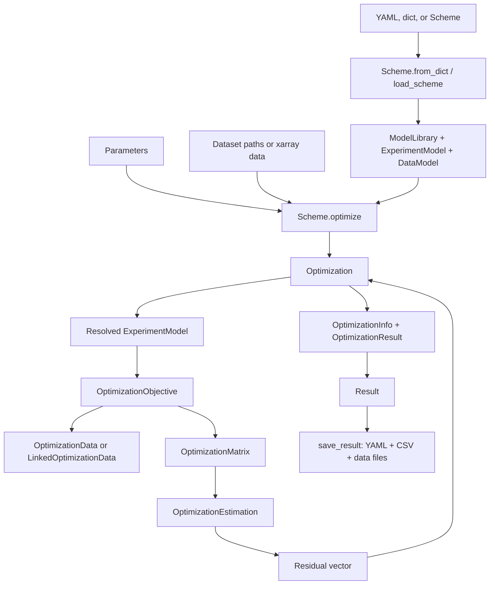

# Current architecture guide

This document describes the architecture in the current source tree. It uses implementation code as the primary evidence, and tests and package metadata as confirmation. Some older documentation still uses an older `Model` vocabulary and legacy megacomplex terminology that are not the current runtime API. Where documentation and code disagree, this guide follows the code. See [`glotaran/project/__init__.py`](glotaran/project/__init__.py), [`glotaran/model/__init__.py`](glotaran/model/__init__.py), and [`docs/source/user_documentation/using_plugins.md`](docs/source/user_documentation/using_plugins.md).

## Table of contents

- [1. Purpose and scope](#1-purpose-and-scope)
- [2. Architectural center of gravity](#2-architectural-center-of-gravity)
- [3. Main execution paths](#3-main-execution-paths)
  - [3.1 Construction and loading](#31-construction-and-loading)
  - [3.2 Validation and model composition](#32-validation-and-model-composition)
  - [3.3 Optimization](#33-optimization)
  - [3.4 Simulation](#34-simulation)
  - [3.5 Result creation and diagnostics](#35-result-creation-and-diagnostics)
  - [3.6 Persistence](#36-persistence)
- [4. Core concepts and boundaries](#4-core-concepts-and-boundaries)
- [5. Extension architecture](#5-extension-architecture)
  - [5.1 Plugin discovery and registration](#51-plugin-discovery-and-registration)
  - [5.2 Add a model component](#52-add-a-model-component)
  - [5.3 Add a residual or optimization algorithm](#53-add-a-residual-or-optimization-algorithm)
  - [5.4 Add a file format or serializer](#54-add-a-file-format-or-serializer)
  - [5.5 Add a result diagnostic](#55-add-a-result-diagnostic)
  - [5.6 Add a preprocessing step](#56-add-a-preprocessing-step)
  - [5.7 Add a high-level workflow helper](#57-add-a-high-level-workflow-helper)
- [6. Persistence and compatibility](#6-persistence-and-compatibility)
- [7. Repository map](#7-repository-map)
- [8. Change guidance and risks](#8-change-guidance-and-risks)
  - [8.1 Where new behavior belongs](#81-where-new-behavior-belongs)
  - [8.2 Risk areas](#82-risk-areas)
  - [8.3 Before changing X, inspect Y](#83-before-changing-x-inspect-y)

## 1. Purpose and scope

`pyglotaran` is a fitting engine for global and target analysis of multidimensional, time-resolved measurements. The central numerical problem is to represent a dataset as a combination of model-generated concentration or basis functions and conditionally linear parameters (CLPs), then vary nonlinear parameters to minimize the residual. The package uses `xarray` for labeled data and coordinates, `numpy`/SciPy for numerical work, Pydantic models for declarative specifications, and plugins for model elements and file I/O. The package metadata states the fitting-engine purpose, and the model/optimization code establishes the concrete contract: elements produce matrices, optimization estimates CLPs, and SciPy varies the remaining parameters. See [`pyproject.toml`](pyproject.toml), [`glotaran/model/element.py`](glotaran/model/element.py), [`glotaran/optimization/estimation.py`](glotaran/optimization/estimation.py), and [`glotaran/optimization/optimization.py`](glotaran/optimization/optimization.py).

The project is responsible for:

- representing parameterized model elements and dataset models;
- resolving declarative references such as an element label or parameter label into runtime objects;
- loading and normalizing input datasets into `xarray.Dataset` objects;
- generating model matrices and solving the supported CLP residual problems;
- orchestrating SciPy least-squares optimization over free nonlinear parameters;
- creating structured fit results, optimization metadata, histories, decompositions, and model-specific diagnostics;
- serializing schemes, parameters, results, and data through registered I/O plugins;
- providing a small simulation API that uses the same model-matrix path as fitting.

The project is not responsible for instrument acquisition, instrument calibration, domain-specific preprocessing beyond the small built-in preprocessing pipeline, plotting, or a user-interface application. Plotting is an optional `pyglotaran-extras` dependency in [`pyproject.toml`](pyproject.toml), while preprocessing is a separate caller-controlled API in [`glotaran/io/preprocessor`](glotaran/io/preprocessor). There is no code in this repository for acquisition, calibration, or a general plotting layer. These boundaries are direct observations from the current package contents; the statement about intended external ownership is an architectural inference from the package and dependency layout.

## 2. Architectural center of gravity

The center of gravity is the numerical path from a resolved `ExperimentModel` to an `OptimizationObjective`, then to `OptimizationMatrix`, `OptimizationEstimation`, and a residual vector. `Scheme.optimize()` is the public workflow entry point that assembles this path, but it is a convenience orchestrator. The lower-level `Optimization` class and `OptimizationObjective` are the core runtime APIs used directly by many tests and built-in element tests. See [`glotaran/project/scheme.py`](glotaran/project/scheme.py), [`glotaran/optimization/optimization.py`](glotaran/optimization/optimization.py), [`glotaran/optimization/objective.py`](glotaran/optimization/objective.py), and [`tests/optimization/test_optimization.py`](tests/optimization/test_optimization.py).

| Name | Current role | Architectural interpretation |
| --- | --- | --- |
| `Project` | No `Project` class is defined or exported in this checkout. | Treat this as legacy terminology, not as a stable current abstraction. The current in-memory study specification is `Scheme`. Evidence: [`glotaran/project/__init__.py`](glotaran/project/__init__.py), [`glotaran/project/scheme.py`](glotaran/project/scheme.py), and the repository-wide search confirmed no `class Project`. |
| `Scheme` | Pydantic object containing a `ModelLibrary`, named `ExperimentModel` objects, and an optional source path. It loads data into its data models and exposes `.optimize(...)`. | Declarative project specification plus workflow façade. It owns configuration and the experiment grouping, but it does not implement matrix generation or residual mathematics. Evidence: [`glotaran/project/scheme.py`](glotaran/project/scheme.py). |
| `Model` | No single current `Model` class is exported. | The word “model” is split across `ModelLibrary`, `Element`, `DataModel`, and `ExperimentModel`. `DataModel` is the dataset-level declarative composition; `Element` is the executable model component. Evidence: [`glotaran/model/data_model.py`](glotaran/model/data_model.py), [`glotaran/model/element.py`](glotaran/model/element.py), and [`glotaran/model/experiment_model.py`](glotaran/model/experiment_model.py). |
| `optimize()` | No module-level `optimize()` function exists. `Scheme.optimize()` delegates to `Optimization`; tests also instantiate `Optimization` directly. | `Scheme.optimize()` is a convenience workflow. `Optimization.run()` and `Optimization.objective_function()` are the numerical orchestration boundary. Evidence: [`glotaran/project/scheme.py`](glotaran/project/scheme.py), [`glotaran/optimization/optimization.py`](glotaran/optimization/optimization.py), and [`tests/builtin/elements/spectral/test_spectral_element.py`](tests/builtin/elements/spectral/test_spectral_element.py). |
| Plugin registration | Import-time discovery loads element, data-I/O, and project-I/O entry points into three registries. | A cross-cutting extension mechanism, not the numerical center. Plugin registration makes model types and serializers available to schema validation and persistence. Evidence: [`glotaran/__init__.py`](glotaran/__init__.py), [`glotaran/plugin_system/base_registry.py`](glotaran/plugin_system/base_registry.py), and [`pyproject.toml`](pyproject.toml). |
| `Result` | Contains the `Scheme`, initial and optimized `Parameters`, `OptimizationInfo`, and per-dataset `OptimizationResult` objects. It delegates saving to project-I/O plugins. | Analysis bundle and persistence façade. It is downstream of optimization and does not drive optimization. Evidence: [`glotaran/project/result.py`](glotaran/project/result.py) and [`tests/project/test_result.py`](tests/project/test_result.py). |

The stable runtime contracts are therefore:

1. `Element.calculate_matrix(...)` converts a resolved model component and axes into CLP labels plus a numeric matrix; `Element.create_result(...)` converts fitted amplitudes/concentrations into model-specific result data. See [`glotaran/model/element.py`](glotaran/model/element.py).
2. `DataModel` declares which elements and optional global elements contribute to a dataset, weights, scales, and the residual-function name. It is dynamically specialized with element-provided data-model types during loading. See [`glotaran/model/data_model.py`](glotaran/model/data_model.py).
3. `OptimizationObjective` converts one `ExperimentModel` into prepared optimization data and a residual/result producer. See [`glotaran/optimization/objective.py`](glotaran/optimization/objective.py).
4. `Optimization` resolves parameters, validates model issues, calls `scipy.optimize.least_squares`, and packages the final objective state. See [`glotaran/optimization/optimization.py`](glotaran/optimization/optimization.py).

## 3. Main execution paths

The following diagram shows the ownership and control flow for the main fit path. It omits format-specific plugin internals and the separate simulation path.



### 3.1 Construction and loading

There are two supported construction styles:

- Build Pydantic/domain objects directly, for example `Scheme(...)`, `ExperimentModel(...)`, `DataModel(...)`, and `Parameters(...)`.
- Load a serialized specification through the plugin façade, usually `load_scheme(...)` or `load_parameters(...)`. The façade chooses an explicit plugin or infers a format from the path extension. See [`glotaran/plugin_system/project_io_registration.py`](glotaran/plugin_system/project_io_registration.py).

For a dictionary or YAML scheme, `Scheme.from_dict(...)` first constructs the `ModelLibrary`, then constructs every `ExperimentModel` through `ExperimentModel.from_dict(...)`. Each dataset definition is passed to `DataModel.from_dict(...)`. That method resolves the referenced element labels from the library, creates a Pydantic `DataModel` subclass from the `data_model_type` classes supplied by those elements, and rejects a dataset with no elements. If a dataset's `data` field is a path string, `Scheme.from_dict(...)` loads it immediately through the data-I/O façade. The transformed boundary is:

```text
serialized mapping
    -> library labels and typed element instances
    -> experiment objects
    -> dataset configuration with element labels
    -> dynamic DataModel subclass
    -> optional xarray.Dataset loaded from a path
```

The `Scheme` owns the resulting library and experiment objects. `source_path` records where a scheme came from, but is excluded from `Scheme` serialization. See [`glotaran/project/scheme.py`](glotaran/project/scheme.py), [`glotaran/project/library.py`](glotaran/project/library.py), and [`glotaran/model/data_model.py`](glotaran/model/data_model.py).

Input datasets passed to `Scheme.optimize(...)` are normalized by `load_datasets(...)`. The function accepts a path, an `xarray.Dataset`/`DataArray`, a sequence, or a mapping. `DataArray` values become datasets named `data`; in-memory datasets receive a default `source_path` when they do not already have one. The resulting `DatasetMapping` is keyed by the supplied mapping key or the source-file stem. See [`glotaran/utils/io.py`](glotaran/utils/io.py) and [`glotaran/typing/types.py`](glotaran/typing/types.py).

### 3.2 Validation and model composition

`Scheme.optimize(...)` calls `_load_data(...)`, which writes the normalized datasets into the matching `DataModel.data` fields by dataset label. Missing labels raise `GlotaranUserError`. This is a mutable binding step: the scheme's data models are updated in place. See [`glotaran/project/scheme.py`](glotaran/project/scheme.py).

`Optimization.__init__(...)` creates a separate empty `Parameters` container and resolves every experiment against the initial parameters. `ExperimentModel.resolve(...)` copies the experiment, resolves each `DataModel` through `resolve_data_model(...)`, resolves CLP relations and penalties, and resolves scale parameters. `resolve_data_model(...)` replaces element strings with library objects and recursively replaces parameter labels with parameter objects. Parameter dependencies are copied from the initial set into the optimization set in dependency order. The resolved experiment is executable; the original scheme remains the declarative source, except for the data binding performed earlier. See [`glotaran/optimization/optimization.py`](glotaran/optimization/optimization.py), [`glotaran/model/experiment_model.py`](glotaran/model/experiment_model.py), [`glotaran/model/data_model.py`](glotaran/model/data_model.py), and [`glotaran/model/item.py`](glotaran/model/item.py).

Validation is split into two stages:

- Pydantic validation checks field types, discriminators, and `extra="forbid"` on the core models.
- Domain validation runs after resolution. `ExperimentModel.get_issues(...)` recursively checks missing parameters and element-specific issues. `DataModel` enforces exclusive and unique element rules, and `get_data_model_dimension(...)` enforces resolved elements with one common model dimension. Any collected issues cause `Optimization` construction to raise `GlotaranModelIssues`. See [`glotaran/model/item.py`](glotaran/model/item.py), [`glotaran/model/data_model.py`](glotaran/model/data_model.py), [`glotaran/model/errors.py`](glotaran/model/errors.py), and [`glotaran/optimization/optimization.py`](glotaran/optimization/optimization.py).

The `ModelLibrary` is also a composition boundary. `ExtendableElement` instances are copied when created, then the library resolves their `extends` relationships in dependency order. The runtime library contains merged elements; serialization uses each element's saved `_original` copy so that the declarative extension remains round-trippable. Cyclic extensions raise `GlotaranModelError`. See [`glotaran/project/library.py`](glotaran/project/library.py) and [`glotaran/model/element.py`](glotaran/model/element.py).

### 3.3 Optimization

`Optimization.run()` is the main numerical orchestrator. It uses only free parameters (`vary=True`), applies bounds and the log transform for non-negative parameters, and maps the user-facing method names to SciPy methods `trf`, `dogbox`, and `lm`. Each objective evaluation updates the mutable optimization `Parameters` object and concatenates the residual vectors from all experiments. See [`glotaran/optimization/optimization.py`](glotaran/optimization/optimization.py) and [`glotaran/parameter/parameter.py`](glotaran/parameter/parameter.py).

At the experiment level, `OptimizationObjective` selects `OptimizationData` for one dataset and `LinkedOptimizationData` for multiple datasets. The latter aligns global axes using the experiment's tolerance and method, groups datasets that overlap at each global coordinate, and applies per-dataset scales. A failed or ambiguous alignment raises `AlignDatasetError`. See [`glotaran/optimization/objective.py`](glotaran/optimization/objective.py) and [`glotaran/optimization/data.py`](glotaran/optimization/data.py).

#### Optimization orchestration contract

The following is language-agnostic pseudocode derived from `Optimization.__init__`, `run`, `dry_run`, and `objective_function`. Inputs are resolved experiment models, initial parameters, a model library, and SciPy options. The normal output is optimized `Parameters`, a dataset-label-to-`OptimizationResult` map, and `OptimizationInfo`. A dry run skips SciPy but still calculates objective results and metadata. See [`glotaran/optimization/optimization.py`](glotaran/optimization/optimization.py).

```text
input: experiment_models, initial_parameters, model_library, optimizer_options

optimization_parameters := empty Parameters
resolved_models :=
    for each experiment in experiment_models:
        resolve experiment against model_library
        copy required parameter dependencies from initial_parameters
validate all resolved_models against initial_parameters
objectives := one OptimizationObjective per resolved model
free_labels, x0, lower, upper := optimization_parameters.free_parameter_arrays()

function objective(x):
    optimization_parameters.set_free_values(free_labels, x)
    return concatenate(objective.calculate() for objective in objectives)

if dry_run:
    penalty := concatenate(objective.calculate() for objective in objectives)
else:
    scipy_result := least_squares(objective, x0, bounds=(lower, upper), optimizer_options)
    penalty := concatenate(objective.calculate() for objective in objectives)

per_dataset_results := merge(objective.get_result() for objective in objectives)
optimization_info := build metadata from scipy_result or dry-run state,
                     penalty, histories, free_labels, CLP count, and termination reason
return optimization_parameters, per_dataset_results, optimization_info
```

The implementation intentionally retains the mutable `optimization_parameters` object across SciPy calls. Do not assume that an objective evaluation is pure when changing this path. `ParameterHistory` currently records the initial state; `OptimizationInfo` also records SciPy's parsed optimization history. See [`glotaran/parameter/parameter_history.py`](glotaran/parameter/parameter_history.py) and [`glotaran/optimization/info.py`](glotaran/optimization/info.py).

#### Matrix generation and linked datasets

`OptimizationMatrix.from_data_model(...)` asks each resolved element for a matrix, combines matrices by CLP label, applies the element scale and optional weights, and keeps the element's CLP constraints. For an index-independent element the matrix has shape `(model_axis, clp)`; for an index-dependent element it has shape `(global_axis, model_axis, clp)`. Global elements swap the axes for global-matrix construction. `OptimizationMatrix.from_global_data(...)` combines global and model matrices with a Kronecker product and labels the resulting CLPs as `global_label@model_label`. See [`glotaran/optimization/matrix.py`](glotaran/optimization/matrix.py) and [`tests/optimization/test_matrix.py`](tests/optimization/test_matrix.py).

```text
input: resolved DataModel, global_axis, model_axis, optional weights/scales

for each element in the selected element list:
    labels, element_matrix := element.calculate_matrix(model, global_axis, model_axis)
    apply element scale if present
combine all element matrices into one CLP axis by label
apply data weights when requested
if global elements are present:
    build model matrix and global matrix
    combine them with a Kronecker product
return OptimizationMatrix objects with labels, arrays, and constraints
```

For linked datasets, the data provider aligns the global axes first. At each aligned global index, `from_linked_data(...)` selects the participating dataset matrices, applies dataset scales, and vertically links their model rows. This creates the matrix that corresponds to the concatenated data slice at that index. The grouping and index maps remain owned by `LinkedOptimizationData`; the numerical matrix does not own the original datasets. See [`glotaran/optimization/data.py`](glotaran/optimization/data.py) and [`glotaran/optimization/matrix.py`](glotaran/optimization/matrix.py).

#### Residual construction and variable projection

`OptimizationObjective.calculate(...)` builds matrices, reduces them for CLP relations and interval constraints at each global index, estimates CLPs, collects residuals, and appends CLP penalties. For a normal non-global data model, the residual is a list of per-global-index residual slices. For a global data model, the full matrix and flattened data are used. The result is one vector suitable for SciPy least squares. See [`glotaran/optimization/objective.py`](glotaran/optimization/objective.py), [`glotaran/optimization/matrix.py`](glotaran/optimization/matrix.py), and [`glotaran/optimization/penalty.py`](glotaran/optimization/penalty.py).

```text
input: prepared data provider, resolved experiment, residual_function

if one global model:
    full_matrix := construct global/model Kronecker matrix
    clp, residual := residual_function(full_matrix, flattened_data)
    return residual

matrices := construct one matrix per global index
reduced_matrices := apply active CLP relations and zero constraints at each index
estimations :=
    for each reduced matrix and data slice:
        estimate CLP and residual using residual_function
if relations were applied:
    expand each estimated CLP back to the original CLP axis
penalties := residuals plus active equal-area or other CLP penalties
return concatenate(penalties)
```

The default `variable_projection` implementation uses QR factorization. It applies the orthogonal factor to the data, solves the upper-triangular system for the first `number_of_clps` entries, zeros those entries in the transformed temporary vector, and applies the orthogonal factor again to obtain the residual. Its contract is `(matrix, data) -> (clp, residual)`. The alternative `non_negative_least_squares` calls SciPy NNLS and returns `data - matrix @ clp`. See [`glotaran/optimization/variable_projection.py`](glotaran/optimization/variable_projection.py), [`glotaran/optimization/nnls.py`](glotaran/optimization/nnls.py), and [`glotaran/optimization/estimation.py`](glotaran/optimization/estimation.py).

```text
input: matrix A with rows = observations and columns = CLPs, data y

Q, R := QR(A)
z := Q_transpose * y
c := solve(R, z) for the first number_of_columns(A) entries
set the solved entries of z to zero
r := Q * z
return c, r
```

The residual-function choice is currently a closed mapping in `SUPPORTED_RESIDUAL_FUNCTIONS`, not a plugin registry. The accepted names are also constrained by `Literal` fields in `ExperimentModel` and `DataModel`. This is a direct implementation fact and is important when adding algorithms. See [`glotaran/optimization/estimation.py`](glotaran/optimization/estimation.py), [`glotaran/model/experiment_model.py`](glotaran/model/experiment_model.py), and [`glotaran/model/data_model.py`](glotaran/model/data_model.py).

### 3.4 Simulation

`simulate(...)` is a separate, thin numerical path. It resolves the `DataModel`, determines the model and global dimensions, obtains CLPs either from the caller or from the model's global elements, creates the same `OptimizationMatrix` representation used by fitting, and computes one matrix-vector product per global coordinate. Optional Gaussian noise is added with a seeded NumPy generator. It returns an `xarray.Dataset` containing `data`. Simulation does not create a `Result` or `OptimizationInfo`. See [`glotaran/simulation/simulation.py`](glotaran/simulation/simulation.py) and [`tests/simulation/test_simulation.py`](tests/simulation/test_simulation.py).

This reuse of `OptimizationMatrix` is a significant boundary: a model component that changes matrix semantics must be checked against both optimization and simulation tests.

### 3.5 Result creation and diagnostics

After the final objective evaluation, `OptimizationObjective.get_result()` converts numerical state into domain results. It copies the original dataset, restores coordinate orientation, attaches residuals, reverses weighting for user-facing residuals, optionally adds SVD variables, builds `FitDecomposition`, and asks every element for an element-specific result. If an element has a `data_model_type`, that data-model class may also add activation or other model-level results. The final per-dataset object is `OptimizationResult`. See [`glotaran/optimization/objective.py`](glotaran/optimization/objective.py) and [`glotaran/model/element.py`](glotaran/model/element.py).

For a single non-global dataset, the result contains the original input data, residuals, fitted data as a computed property, element result datasets, optional activation/data-model results, amplitudes, concentrations, and metadata. For multiple linked datasets, shared estimations are projected back into each dataset's local coordinates and each dataset receives its own `OptimizationResult`. For a global model, the result contains the model and global concentration matrices and their combined amplitudes. These shapes are asserted in [`tests/optimization/test_objective.py`](tests/optimization/test_objective.py).

```text
input: prepared data, final matrices, CLP estimations, model metadata

for each dataset:
    result_dataset := copy source dataset and restore named axes
    result_dataset.residual := reshape the estimated residual
    undo weighting for presentation and retain weighted residual when available
    add SVD diagnostics when enabled
    element_results := element.create_result_with_uid(...)
    data_model_results := data_model_type.create_result(...) when defined
    fit_decomposition := amplitudes plus concentration matrix
    meta := dimensions, scale, RMS errors, and weighted RMS error
    emit OptimizationResult(input_data, residuals, element_results,
                            data_model_results, fit_decomposition, meta)
return per-dataset result map
```

`OptimizationResult.fitted_data` is computed as `input_data - residuals`; it is not an independent source of truth. `OptimizationInfo` stores SciPy status, objective statistics, free labels, histories, and the package version. `Result` groups all of these with the scheme and both parameter sets. See [`glotaran/optimization/objective.py`](glotaran/optimization/objective.py), [`glotaran/optimization/info.py`](glotaran/optimization/info.py), and [`glotaran/project/result.py`](glotaran/project/result.py).

### 3.6 Persistence

Persistence is deliberately outside the numerical classes. `Result.save(...)` delegates to `save_result(...)`, which selects a `ProjectIoInterface` plugin. The built-in YAML project plugin serializes the result specification with Pydantic context and writes referenced arrays and tables into a result folder. The serializer boundary converts runtime objects to relative paths; the validator boundary resolves those paths back to runtime objects. See [`glotaran/project/result.py`](glotaran/project/result.py), [`glotaran/plugin_system/project_io_registration.py`](glotaran/plugin_system/project_io_registration.py), [`glotaran/builtin/io/yml/yml.py`](glotaran/builtin/io/yml/yml.py), and [`glotaran/utils/pydantic_serde.py`](glotaran/utils/pydantic_serde.py).

The default result layout is:

```text
result.yml
scheme.yml
initial_parameters.csv
optimized_parameters.csv
parameter_history.csv
optimization_history.csv
optimization_results/<dataset>/
    input_data.nc
    residuals.nc
    fitted_data.nc
    elements/<element>.nc
    activations/<activation>.nc
    fit_decomposition/clp.nc
    fit_decomposition/matrix.nc
```

The exact files depend on `SavingOptions.data_filter`, data format, and whether input data already has a reusable source path. The expected default and minimal layouts are tested in [`tests/project/test_result.py`](tests/project/test_result.py) and [`tests/builtin/io/yml/test_yml.py`](tests/builtin/io/yml/test_yml.py).

## 4. Core concepts and boundaries

### Declarative configuration and schema objects

These objects describe a fit. They should not contain the numerical loop.

- `Scheme` owns named experiments, the shared `ModelLibrary`, and source metadata. It is a Pydantic `BaseModel` with `extra="forbid"`. Its `.optimize(...)` method is orchestration. See [`glotaran/project/scheme.py`](glotaran/project/scheme.py).
- `ModelLibrary` is a typed mapping from labels to registered `Element` instances. It resolves `ExtendableElement.extends` relationships during construction and serializes original, unextended definitions. See [`glotaran/project/library.py`](glotaran/project/library.py).
- `ExperimentModel` groups datasets and declares dataset-link tolerance/method, scales, residual-function choice, CLP relations, and CLP penalties. `.resolve(...)` returns a resolved copy. See [`glotaran/model/experiment_model.py`](glotaran/model/experiment_model.py).
- `DataModel` declares local elements, optional global elements, element scales, residual-function choice, weights, and optional dataset data. References may initially be strings; a resolved data model contains `Element` instances and `Parameter` instances. See [`glotaran/model/data_model.py`](glotaran/model/data_model.py).
- `Item` and `TypedItem` provide the Pydantic/discriminator foundation for model configuration. `Attribute(...)` stores descriptions and domain validators. Recursive helpers find and resolve nested parameter references. See [`glotaran/model/item.py`](glotaran/model/item.py).
- `Parameter` and `Parameters` hold optimization values, bounds, expressions, variation flags, and non-negative transformations. `Parameters` is a mutable container, not a Pydantic model. Expressions are evaluated through `asteval`; a parameter with an expression is made non-varying. See [`glotaran/parameter/parameter.py`](glotaran/parameter/parameter.py) and [`glotaran/parameter/parameters.py`](glotaran/parameter/parameters.py).

### Executable model objects

`Element` is the most important model extension contract. Each concrete element has a discriminating `type`, a model `dimension`, and an optional `data_model_type`. It must implement:

- `calculate_matrix(model, global_axis, model_axis) -> (clp_labels, array)`;
- `create_result(model, global_dimension, model_dimension, amplitudes, concentrations) -> xarray.Dataset`.

The base class registers subclasses whose `register_as` is not `None`. The matrix method is called by `OptimizationMatrix`; the result method is called only after fitting. `create_result_with_uid(...)` is a final wrapper that adds the fully qualified plugin name to result attributes. See [`glotaran/model/element.py`](glotaran/model/element.py).

`DataModel.create_class_for_elements(...)` dynamically combines the data-model classes declared by the selected elements. This is how an element can add configuration fields to the dataset model. The built-in spectral and activation components demonstrate both sides: `SpectralElement` supplies `SpectralDataModel`, while `KineticElement` supplies `ActivationDataModel`. See [`glotaran/builtin/elements/spectral/element.py`](glotaran/builtin/elements/spectral/element.py), [`glotaran/builtin/elements/kinetic/element.py`](glotaran/builtin/elements/kinetic/element.py), [`glotaran/builtin/items/activation/data_model.py`](glotaran/builtin/items/activation/data_model.py), and [`tests/model/test_data_model.py`](tests/model/test_data_model.py).

### Numerical runtime objects

- `OptimizationData` owns a prepared view of one `DataModel`: normalized orientation, axes, copied numeric data, weights, and slices by global coordinate. It copies the array from the `xarray.Dataset`; the source dataset remains the model's input owner. See [`glotaran/optimization/data.py`](glotaran/optimization/data.py).
- `LinkedOptimizationData` owns aligned multi-dataset views, group labels, dataset index maps, and scales. It does not replace the original datasets. See [`glotaran/optimization/data.py`](glotaran/optimization/data.py).
- `OptimizationMatrix` owns CLP labels, a numeric matrix, and constraints. Its `weight`, `scale`, and some reduction operations mutate the contained array; callers must copy when reuse matters. See [`glotaran/optimization/matrix.py`](glotaran/optimization/matrix.py).
- `OptimizationEstimation` owns a CLP vector and residual vector. `resolve_clp(...)` mutates the estimation while expanding relations back to the full CLP axis. See [`glotaran/optimization/estimation.py`](glotaran/optimization/estimation.py).
- `OptimizationObjective` owns the data provider and resolved experiment model for one experiment. It is the boundary between model/data composition and numerical residual/result construction. See [`glotaran/optimization/objective.py`](glotaran/optimization/objective.py).
- `Optimization` owns the mutable optimization parameter set, objectives, optimizer configuration, and histories. It is the boundary to SciPy. See [`glotaran/optimization/optimization.py`](glotaran/optimization/optimization.py).

### Results and diagnostics

`OptimizationResult` is a per-dataset runtime result. It contains `input_data`, optional `residuals`, a computed `fitted_data`, element result maps, data-model result maps, `FitDecomposition`, and `OptimizationResultMetaData`. `OptimizationInfo` contains optimizer status and histories. `Result` is the outer bundle and delegates persistence. Diagnostics that describe numerical quality belong near `OptimizationInfo` or result metadata; diagnostics that describe an element's decomposition belong in that element's `create_result(...)`. See [`glotaran/optimization/objective.py`](glotaran/optimization/objective.py), [`glotaran/optimization/info.py`](glotaran/optimization/info.py), and [`glotaran/project/result.py`](glotaran/project/result.py).

### Layer boundaries

The current dependency direction is:

```text
I/O plugins and serialization helpers
        -> Scheme / Result / Parameters / xarray data
Project orchestration
        -> model composition and Optimization
Model composition
        -> Element matrix/result contracts
Numerical runtime
        -> xarray/numpy/SciPy and resolved model objects
Diagnostics
        -> numerical results and metadata
```

This is a description of current dependencies, not a claim that the package enforces a strict clean-architecture rule. There are intentional cross-links: `Element` imports registration, `Result` imports I/O façades for serialization, and `Scheme` imports `Optimization`. New code should preserve the direction of responsibility even where the existing implementation has a direct import.

## 5. Extension architecture

### 5.1 Plugin discovery and registration

Importing `glotaran` calls `load_plugins()`. Unless `DEACTIVATE_GTA_PLUGINS` is set, it loads entry points from these groups, in this order: `glotaran.plugins.elements`, `glotaran.plugins.data_io`, and `glotaran.plugins.project_io`. The built-in entry points are declared in [`pyproject.toml`](pyproject.toml), and the loader is implemented in [`glotaran/plugin_system/base_registry.py`](glotaran/plugin_system/base_registry.py).

The central private registry has three maps: element classes, instantiated data-I/O plugins, and instantiated project-I/O plugins. A registered plugin gets its short key and a fully qualified key. Duplicate short keys produce `PluginOverwriteWarning`; `set_model_plugin`, `set_data_plugin`, and `set_project_plugin` can explicitly bind a short key to a fully qualified plugin. This full-name path is a reproducibility mechanism, and it is part of the persisted data/plugin metadata contract. See [`glotaran/plugin_system/base_registry.py`](glotaran/plugin_system/base_registry.py), [`glotaran/plugin_system/element_registration.py`](glotaran/plugin_system/element_registration.py), [`glotaran/plugin_system/data_io_registration.py`](glotaran/plugin_system/data_io_registration.py), [`glotaran/plugin_system/project_io_registration.py`](glotaran/plugin_system/project_io_registration.py), and [`tests/plugin_system/test_base_registry.py`](tests/plugin_system/test_base_registry.py).

The registry is order-sensitive when two packages claim the same short key. The loader order is fixed by `load_plugins`, but entry-point ordering within a group comes from import metadata. Do not rely on an accidental winner; use a full plugin name or an explicit `set_*_plugin(...)` call when reproducibility matters.

### 5.2 Add a model component

For a new executable model element:

1. Subclass `Element` or `ExtendableElement` in a model-component module.
2. Add a `type: Literal["..."]` discriminator and a `register_as: ClassVar[str]` short name.
3. Set `dimension` and, if the component needs dataset-specific fields, set `data_model_type` to a `DataModel` subclass.
4. Implement `calculate_matrix(...)` with stable CLP labels and the expected model/global axis shapes.
5. Implement `create_result(...)` and return labeled `xarray.Dataset` data derived from the fitted amplitudes and concentrations.
6. Import the module through a package entry point in `glotaran.plugins.elements` so its class is registered before a scheme is parsed. For a built-in component, add the corresponding entry point to [`pyproject.toml`](pyproject.toml); a third-party package should declare the same entry-point group in its own metadata.
7. Add element-level tests for matrix labels/shapes and result contents, and an end-to-end optimization test. Existing patterns are [`glotaran/builtin/elements/baseline/element.py`](glotaran/builtin/elements/baseline/element.py), [`glotaran/builtin/elements/spectral/element.py`](glotaran/builtin/elements/spectral/element.py), [`tests/builtin/elements/baseline/test_baseline_element.py`](tests/builtin/elements/baseline/test_baseline_element.py), and [`tests/builtin/elements/spectral/test_spectral_element.py`](tests/builtin/elements/spectral/test_spectral_element.py).

For a new typed model item such as an activation or spectral shape, subclass the relevant `TypedItem` base and add the discriminator fields and behavior. `TypedItem.__init_subclass__` collects concrete subclasses into the containing union, but the union is materialized when the containing `get_annotated_type()` is used. This is not a general runtime registry like the element registry. An external item extension therefore usually needs its own containing data-model class or an explicit import/rebuild strategy; adding a class alone is not enough to change an already-defined `ActivationDataModel`. See [`glotaran/model/item.py`](glotaran/model/item.py), [`glotaran/builtin/items/activation/activation.py`](glotaran/builtin/items/activation/activation.py), [`glotaran/builtin/items/activation/data_model.py`](glotaran/builtin/items/activation/data_model.py), and [`tests/builtin/items/activation/test_activation.py`](tests/builtin/items/activation/test_activation.py). This limitation is a direct consequence of the current class-level union construction.

### 5.3 Add a residual or optimization algorithm

The current minimal change is intentionally local, because residual algorithms are not plugins:

1. Add a function with the contract `(matrix, data) -> (clp, residual)` in a new module under [`glotaran/optimization`](glotaran/optimization).
2. Add the name/function to `SUPPORTED_RESIDUAL_FUNCTIONS` in [`glotaran/optimization/estimation.py`](glotaran/optimization/estimation.py).
3. Add the same string to the `Literal` types in [`glotaran/model/experiment_model.py`](glotaran/model/experiment_model.py) and [`glotaran/model/data_model.py`](glotaran/model/data_model.py).
4. Test numerical behavior in [`tests/optimization/test_estimation.py`](tests/optimization/test_estimation.py), and test integration through [`tests/optimization/test_objective.py`](tests/optimization/test_objective.py) or [`tests/optimization/test_optimization.py`](tests/optimization/test_optimization.py).

The invariant is that the returned residual has the same observation semantics and flattening as the input data, while the CLP result has one entry per matrix column. If the algorithm changes weighting, global-model handling, or CLP relation handling, also inspect [`glotaran/optimization/objective.py`](glotaran/optimization/objective.py), [`glotaran/optimization/matrix.py`](glotaran/optimization/matrix.py), and the linked/global tests. A future plugin registry for residual algorithms would be a design recommendation, not current architecture; implementing it would require a compatibility decision for serialized scheme values and plugin discovery.

To change the outer optimizer or add a new SciPy method, edit `SUPPORTED_OPTIMIZATION_METHODS` and the method literal/validation in [`glotaran/optimization/optimization.py`](glotaran/optimization/optimization.py), then add tests for bounds, failure handling, dry runs, and `OptimizationInfo`.

### 5.4 Add a file format or serializer

There are two separate extension points:

- Dataset format: subclass `DataIoInterface`, implement `load_dataset(...)` and/or `save_dataset(...)`, decorate with `@register_data_io("format")`, and expose the module through `glotaran.plugins.data_io`. The façade adds `source_path` and `io_plugin_name` attributes to loaded data and protects writes from accidental overwrite. See [`glotaran/io/interface.py`](glotaran/io/interface.py), [`glotaran/plugin_system/data_io_registration.py`](glotaran/plugin_system/data_io_registration.py), [`glotaran/builtin/io/netCDF/netCDF.py`](glotaran/builtin/io/netCDF/netCDF.py), and [`tests/plugin_system/test_data_io_registration.py`](tests/plugin_system/test_data_io_registration.py).
- Project format: subclass `ProjectIoInterface`, implement any relevant `load_parameters`, `save_parameters`, `load_scheme`, `save_scheme`, `load_result`, and `save_result` methods, decorate with `@register_project_io("format")`, and expose the module through `glotaran.plugins.project_io`. The façade infers the format, calls the method, and updates the runtime object's source path. See [`glotaran/io/interface.py`](glotaran/io/interface.py), [`glotaran/plugin_system/project_io_registration.py`](glotaran/plugin_system/project_io_registration.py), [`glotaran/builtin/io/yml/yml.py`](glotaran/builtin/io/yml/yml.py), and [`tests/plugin_system/test_project_io_registration.py`](tests/plugin_system/test_project_io_registration.py).

For a serializer of a new field inside `Result`, `OptimizationResult`, or `OptimizationInfo`, add a Pydantic field serializer and validator at that model boundary, pass `save_folder` and `saving_options` through nested serialization, and add path extraction/load tests. Do not make I/O plugins reach into private numerical state. The existing patterns are [`glotaran/project/result.py`](glotaran/project/result.py), [`glotaran/optimization/objective.py`](glotaran/optimization/objective.py), [`glotaran/optimization/info.py`](glotaran/optimization/info.py), [`glotaran/utils/pydantic_serde.py`](glotaran/utils/pydantic_serde.py), and [`tests/project/test_result.py`](tests/project/test_result.py).

### 5.5 Add a result diagnostic

For a diagnostic that is a derived view and does not need to be persisted, add a pure helper near the result type it consumes: `glotaran/optimization/objective.py` for fit/decomposition data, `glotaran/optimization/info.py` for optimizer statistics, or `glotaran/utils/io.py` for a user-facing extraction helper. Accept `Result` or `OptimizationResult` explicitly, preserve xarray coordinates, and do not mutate the result unless the existing API clearly treats the field as cached metadata. Add focused tests under [`tests/project`](tests/project) or [`tests/optimization`](tests/optimization).

For a diagnostic that must be part of saved results, add a typed field to `OptimizationResult` or `Result`, define its serializer/validator, include it in `SavingOptions.data_filter` only if filtering is appropriate, update `extract_paths_from_serialization(...)`, and add full and minimal round-trip tests. `fitted_data` is the current example of a computed result field; SVD fields and element-specific datasets are current examples of persisted diagnostics. See [`glotaran/optimization/objective.py`](glotaran/optimization/objective.py), [`glotaran/project/result.py`](glotaran/project/result.py), and [`tests/project/test_result.py`](tests/project/test_result.py).

### 5.6 Add a preprocessing step

Preprocessing is currently caller-controlled and is not automatically invoked by `Scheme.optimize(...)`. To add a built-in step:

1. Subclass `PreProcessor` and implement `apply(data: xarray.DataArray) -> xarray.DataArray`.
2. Add a discriminating `action: Literal["..."]` field.
3. Add the class to the `PipelineAction` discriminated union.
4. Add a fluent builder method to `PreProcessingPipeline` if the step is part of the public convenience API.
5. Ensure `PreProcessingPipeline.apply(...)` keeps the copy-then-sequential-actions behavior.
6. Add serialization and numeric tests in [`tests/io/preprocessor/test_preprocessor.py`](tests/io/preprocessor/test_preprocessor.py).

The current built-ins are baseline-value and baseline-average correction. See [`glotaran/io/preprocessor/preprocessor.py`](glotaran/io/preprocessor/preprocessor.py) and [`glotaran/io/preprocessor/pipeline.py`](glotaran/io/preprocessor/pipeline.py). If preprocessing becomes part of a persisted scheme, that is a larger schema change: it must be added to a serializable domain object and its path must be traced through `Scheme.from_dict(...)` and the project-I/O plugins.

### 5.7 Add a high-level workflow helper

Place a helper in [`glotaran/project`](glotaran/project) when it composes loading, scheme construction, optimization, or result saving. It should call existing boundaries such as `load_scheme(...)`, `load_parameters(...)`, `load_datasets(...)`, and `Scheme.optimize(...)`; it should not duplicate matrix or residual logic. A simulation workflow belongs near [`glotaran/simulation`](glotaran/simulation), while a result extraction helper belongs near [`glotaran/utils/io.py`](glotaran/utils/io.py).

Add tests at the same abstraction level as the helper. Use [`tests/project/test_scheme.py`](tests/project/test_scheme.py) for scheme/fit orchestration, [`tests/builtin/io/yml/test_yml.py`](tests/builtin/io/yml/test_yml.py) for file workflows, and the numerical tests for algorithm behavior. Keep the helper thin so `Scheme`, `Optimization`, `Result`, and plugin APIs remain the stable contracts.

## 6. Persistence and compatibility

### Supported built-in formats

| Boundary | Current built-in formats | Notes |
| --- | --- | --- |
| Dataset I/O | `nc`, `ascii`, `sdt` | NetCDF reads/writes `xarray` datasets. ASCII reads/writes the legacy explicit-axis text format, with result saving limited to a `DataArray` fallback. SDT is a reader in the current implementation. See [`pyproject.toml`](pyproject.toml), [`glotaran/builtin/io/netCDF/netCDF.py`](glotaran/builtin/io/netCDF/netCDF.py), [`glotaran/builtin/io/ascii/wavelength_time_explicit_file.py`](glotaran/builtin/io/ascii/wavelength_time_explicit_file.py), and [`glotaran/builtin/io/sdt/sdt_file_reader.py`](glotaran/builtin/io/sdt/sdt_file_reader.py). |
| Project I/O for schemes/results | `yml`, `yaml`, and `yml_str` through `YmlProjectIo` | `yml_str` is for loading YAML text; file-based YAML is used for scheme and result persistence. See [`glotaran/builtin/io/yml/yml.py`](glotaran/builtin/io/yml/yml.py). |
| Parameter I/O | `yml`, `yaml`, `yml_str`, `csv`, `tsv`, `xlsx`, `ods` | The pandas project-I/O plugins implement parameter methods. The YAML plugin also implements scheme/result methods. Unsupported methods remain the base interface and become `ValueError` through the façade. See [`glotaran/builtin/io/pandas`](glotaran/builtin/io/pandas), [`glotaran/builtin/io/yml/yml.py`](glotaran/builtin/io/yml/yml.py), and [`glotaran/io/interface.py`](glotaran/io/interface.py). |

Format support is method-specific. A plugin being registered for a format does not imply that it supports all six project-I/O methods. Use `project_io_plugin_table(...)` or `data_io_plugin_table(...)` to inspect the actual method support. See [`glotaran/plugin_system/project_io_registration.py`](glotaran/plugin_system/project_io_registration.py) and [`glotaran/plugin_system/data_io_registration.py`](glotaran/plugin_system/data_io_registration.py).

### Schema and version behavior

The serialized scheme and result shapes are defined by Pydantic fields, discriminated `type` values, plugin names, and nested relative paths. `Scheme`, `Result`, `ExperimentModel`, `DataModel`, and result models generally use `extra="forbid"`; unknown fields are therefore compatibility failures rather than silently ignored data. JSON schema generation for editor support is provided by [`glotaran/utils/json_schema.py`](glotaran/utils/json_schema.py), and the generated schema is assembled from the current registered typed models.

There is no explicit `schema_version` field or migration registry in the current scheme/result format. `OptimizationInfo.glotaran_version` is a computed record of the package version that created the result; it is not a migration selector. This means format changes to field names, discriminators, or result layout need explicit compatibility work and round-trip tests. See [`glotaran/optimization/info.py`](glotaran/optimization/info.py), [`glotaran/project/result.py`](glotaran/project/result.py), [`glotaran/model/experiment_model.py`](glotaran/model/experiment_model.py), and [`tests/utils/test_json_schema.py`](tests/utils/test_json_schema.py).

YAML loading additionally sanitizes tuple-like keys/values and scientific notation before constructing the scheme. `ModelLibrary` serializes original extendable definitions, not just the merged runtime objects. These are compatibility behaviors even though they are not versioned. See [`glotaran/builtin/io/yml/yml.py`](glotaran/builtin/io/yml/yml.py), [`glotaran/utils/sanitize.py`](glotaran/utils/sanitize.py), and [`glotaran/project/library.py`](glotaran/project/library.py).

### Runtime state versus persisted state

Runtime and persisted objects are intentionally different:

- Runtime `Scheme` and `Result` contain live Pydantic objects, `Parameters`, `xarray` arrays, and plugin-resolved classes. Persisted fields generally contain relative file names.
- Runtime `DataModel.data` contains an `xarray.Dataset` or an input path during construction. The `data` field is excluded from `DataModel` serialization, so a saved scheme contains the model configuration rather than the live dataset. See [`glotaran/model/data_model.py`](glotaran/model/data_model.py).
- `Result` serializes the scheme, parameters, optimization histories, per-dataset arrays, element/activation arrays, and fit decomposition into separate files. `Result` and nested validators reconstruct these objects from `save_folder` context. See [`glotaran/project/result.py`](glotaran/project/result.py) and [`glotaran/optimization/objective.py`](glotaran/optimization/objective.py).
- `fitted_data` is computed from `input_data - residuals`; loading removes a serialized computed field before validation and recomputes it. Covariance and Jacobian arrays are excluded in JSON mode by `OptimizationInfo`, so they are not restored by the default result round trip. See [`glotaran/optimization/objective.py`](glotaran/optimization/objective.py), [`glotaran/optimization/info.py`](glotaran/optimization/info.py), and [`tests/project/test_result.py`](tests/project/test_result.py).
- Dataset attributes `source_path` and `io_plugin_name` retain provenance. Minimal result saving may reuse an original source path and plugin; for a third-party plugin, the serialized input-data value can include both a relative path and the original full plugin name. Loading such a result requires that plugin to be available or a deliberate replacement strategy. See [`glotaran/plugin_system/data_io_registration.py`](glotaran/plugin_system/data_io_registration.py), [`glotaran/optimization/objective.py`](glotaran/optimization/objective.py), and [`tests/project/test_result.py`](tests/project/test_result.py).

The practical compatibility rule is: preserve labels, dimensions, discriminator values, plugin full names, relative result paths, and serializer context semantics unless the change includes an explicit migration strategy. The repository currently has deprecation helpers for API names, but those helpers are not a persisted schema migration mechanism. See [`glotaran/deprecation`](glotaran/deprecation).

## 7. Repository map

| Area | Files that matter | Role and change boundary |
| --- | --- | --- |
| Package bootstrap | [`glotaran/__init__.py`](glotaran/__init__.py), [`pyproject.toml`](pyproject.toml) | Version and import-time plugin loading; package entry points and dependencies. Changes here affect every import and plugin availability. |
| Project orchestration | [`glotaran/project/scheme.py`](glotaran/project/scheme.py), [`glotaran/project/result.py`](glotaran/project/result.py), [`glotaran/project/library.py`](glotaran/project/library.py) | Scheme construction, data binding, optimization façade, result bundle, model-library extension resolution, and result persistence façade. |
| Declarative model layer | [`glotaran/model/item.py`](glotaran/model/item.py), [`glotaran/model/data_model.py`](glotaran/model/data_model.py), [`glotaran/model/experiment_model.py`](glotaran/model/experiment_model.py), [`glotaran/model/element.py`](glotaran/model/element.py) | Typed fields, parameter references, dataset composition, experiment policies, element API, and domain validation. |
| Parameters | [`glotaran/parameter/parameter.py`](glotaran/parameter/parameter.py), [`glotaran/parameter/parameters.py`](glotaran/parameter/parameters.py), [`glotaran/parameter/parameter_history.py`](glotaran/parameter/parameter_history.py) | Mutable parameter values, expressions, bounds, non-negative transforms, and histories. |
| Numerical optimization | [`glotaran/optimization/optimization.py`](glotaran/optimization/optimization.py), [`glotaran/optimization/objective.py`](glotaran/optimization/objective.py), [`glotaran/optimization/data.py`](glotaran/optimization/data.py), [`glotaran/optimization/matrix.py`](glotaran/optimization/matrix.py), [`glotaran/optimization/estimation.py`](glotaran/optimization/estimation.py) | Runtime data preparation, matrix composition, residual construction, SciPy orchestration, and result creation. This is the architectural center. |
| Numerical algorithms | [`glotaran/optimization/variable_projection.py`](glotaran/optimization/variable_projection.py), [`glotaran/optimization/nnls.py`](glotaran/optimization/nnls.py), [`glotaran/optimization/penalty.py`](glotaran/optimization/penalty.py), [`glotaran/optimization/info.py`](glotaran/optimization/info.py) | CLP solvers, penalties, optimizer metadata, covariance, and standard errors. These modules should not own file-format logic. |
| Simulation | [`glotaran/simulation/simulation.py`](glotaran/simulation/simulation.py) | Uses resolved data models and `OptimizationMatrix` to generate synthetic data. |
| Data/project I/O | [`glotaran/io/interface.py`](glotaran/io/interface.py), [`glotaran/plugin_system/*_registration.py`](glotaran/plugin_system), [`glotaran/builtin/io`](glotaran/builtin/io) | Plugin interfaces, format selection, provenance attributes, overwrite protection, and built-in readers/writers. |
| Serialization helpers | [`glotaran/utils/pydantic_serde.py`](glotaran/utils/pydantic_serde.py), [`glotaran/utils/json_schema.py`](glotaran/utils/json_schema.py), [`glotaran/utils/sanitize.py`](glotaran/utils/sanitize.py) | Pydantic context propagation, CSV/path fields, editor schemas, and YAML normalization. |
| Preprocessing | [`glotaran/io/preprocessor/preprocessor.py`](glotaran/io/preprocessor/preprocessor.py), [`glotaran/io/preprocessor/pipeline.py`](glotaran/io/preprocessor/pipeline.py) | Small typed, sequential data transformations. Not automatically part of optimization. |
| Diagnostics and extraction | [`glotaran/utils/io.py`](glotaran/utils/io.py), result/optimization result classes | Dataset loading, result extraction, fit metadata, histories, and user-facing derived data. |
| Tests | [`tests/model`](tests/model), [`tests/optimization`](tests/optimization), [`tests/project`](tests/project), [`tests/plugin_system`](tests/plugin_system), [`tests/builtin`](tests/builtin) | The tests reveal the supported contracts more accurately than the sparse or older user documentation. |

## 8. Change guidance and risks

### 8.1 Where new behavior belongs

Use the narrowest boundary that owns the behavior:

- Add model mathematics or a new decomposition to an `Element` or its associated data-model type. Keep `OptimizationMatrix` generic over element classes.
- Add model composition rules, linking, or validation to `DataModel`, `ExperimentModel`, or `ModelLibrary`; do not hide them in a serializer.
- Add residual mathematics to `variable_projection.py`, `nnls.py`, or a new optimization algorithm module, then connect it through `estimation.py` and the accepted schema literal.
- Add optimizer policy, method selection, failure handling, or result orchestration to `Optimization`; keep SciPy-specific behavior there.
- Add scheme/result/parameter file behavior to a `ProjectIoInterface` plugin. Add raw dataset behavior to a `DataIoInterface` plugin.
- Add Pydantic path/context behavior to the model that owns the field, with shared mechanics in `utils/pydantic_serde.py`.
- Add preprocessing under `io/preprocessor`; call it explicitly before data is bound to a scheme unless the user-facing contract is deliberately expanded.
- Add workflow composition to `project` or `simulation`, and delegate to existing lower-level APIs.

The abstractions that should remain stable are the `Element.calculate_matrix/create_result` contract, resolved `DataModel` dimensions and element ownership, the `(matrix, data) -> (clp, residual)` contract, `Optimization.run()` outputs, and the path/plugin conventions used by result serialization. These stability recommendations are inferred from the number of layers and tests that consume these contracts; they are not formal interface declarations in the package.

### 8.2 Risk areas

- **Mutable scheme data.** `Scheme._load_data(...)` assigns datasets into the scheme's `DataModel` objects. Reusing a scheme for another fit replaces those references. Treat a scheme as stateful after optimization starts. See [`glotaran/project/scheme.py`](glotaran/project/scheme.py).
- **Mutable parameters.** `Optimization.objective_function(...)` updates the optimization `Parameters` in place. `Parameter` expressions are re-evaluated after each update, and non-negative values are represented in log space during SciPy calls. Do not share the optimization parameter container across concurrent fits. See [`glotaran/optimization/optimization.py`](glotaran/optimization/optimization.py), [`glotaran/parameter/parameters.py`](glotaran/parameter/parameters.py), and [`glotaran/parameter/parameter.py`](glotaran/parameter/parameter.py).
- **Matrix aliasing.** `OptimizationMatrix.weight(...)` and `.scale(...)` modify the underlying array. `.reduce(...)` can also mutate unless `copy=True`; objective reduction uses copies, but new callers may not. See [`glotaran/optimization/matrix.py`](glotaran/optimization/matrix.py).
- **Estimation mutation.** `OptimizationEstimation.resolve_clp(...)` rewrites its CLP array and returns itself. Do not reuse an estimation as if it were immutable. See [`glotaran/optimization/estimation.py`](glotaran/optimization/estimation.py).
- **Library extension state.** `ModelLibrary` replaces extendable entries with merged runtime elements while retaining `_original` for serialization. Refactoring this can silently change both runtime composition and round-trip files. See [`glotaran/project/library.py`](glotaran/project/library.py) and [`glotaran/model/element.py`](glotaran/model/element.py).
- **Plugin collisions and order.** Short plugin names are aliases, not globally unique identities. A later registration can trigger an overwrite warning and the full-name alias is the reproducible selector. Do not depend on discovery order. See [`glotaran/plugin_system/base_registry.py`](glotaran/plugin_system/base_registry.py) and [`tests/plugin_system/test_base_registry.py`](tests/plugin_system/test_base_registry.py).
- **Plugin availability during parsing.** Element classes must be registered before `DataModel.from_dict(...)` and `ModelLibrary.from_dict(...)` parse discriminator values. Import-order changes can cause an “unknown element type” failure even when the class exists on disk. See [`glotaran/project/library.py`](glotaran/project/library.py), [`glotaran/model/data_model.py`](glotaran/model/data_model.py), and [`glotaran/__init__.py`](glotaran/__init__.py).
- **Persistence compatibility.** Result files depend on relative paths, plugin names, dimensions, field names, and nested serializer context. Changing any of these can break older result folders. There is no schema-version migration layer. See [`glotaran/project/result.py`](glotaran/project/result.py), [`glotaran/builtin/io/yml/yml.py`](glotaran/builtin/io/yml/yml.py), and [`tests/project/test_result.py`](tests/project/test_result.py).
- **Global and linked shapes.** Index-dependent elements, global elements, weights, and linked datasets produce different matrix ranks and result dimensions. A change that passes a single index-independent test can still break global or linked fits. See [`tests/optimization/test_matrix.py`](tests/optimization/test_matrix.py) and [`tests/optimization/test_objective.py`](tests/optimization/test_objective.py).
- **Stale documentation.** Several user-documentation pages are placeholders or describe an older model vocabulary. Confirm new claims against implementation and tests. See [`docs/source/user_documentation`](docs/source/user_documentation) and [`docs/source/user_documentation/using_plugins.md`](docs/source/user_documentation/using_plugins.md).

Testing expectations are layered: unit-test a numerical function, test matrix labels/shapes and residual semantics, test model loading/validation, test a full simulation or optimization path for a model component, and test full/minimal persistence round trips for serialized fields. Existing examples are [`tests/optimization/test_estimation.py`](tests/optimization/test_estimation.py), [`tests/optimization/test_matrix.py`](tests/optimization/test_matrix.py), [`tests/optimization/test_objective.py`](tests/optimization/test_objective.py), [`tests/project/test_scheme.py`](tests/project/test_scheme.py), [`tests/project/test_result.py`](tests/project/test_result.py), and [`tests/builtin/io/yml/test_yml.py`](tests/builtin/io/yml/test_yml.py).

### 8.3 Before changing X, inspect Y

| Before changing | Inspect first | Why |
| --- | --- | --- |
| `Scheme` fields or `.optimize(...)` | [`glotaran/project/scheme.py`](glotaran/project/scheme.py), [`tests/project/test_scheme.py`](tests/project/test_scheme.py), [`glotaran/builtin/io/yml/yml.py`](glotaran/builtin/io/yml/yml.py) | Scheme construction, data binding, result ownership, and YAML round trips are coupled. |
| Element fields or matrix semantics | [`glotaran/model/element.py`](glotaran/model/element.py), [`glotaran/model/data_model.py`](glotaran/model/data_model.py), [`glotaran/optimization/matrix.py`](glotaran/optimization/matrix.py), and the relevant built-in element tests | Dynamic data-model fields, dimensions, CLP labels, simulation, and optimization all depend on the element contract. |
| Parameter resolution or bounds | [`glotaran/model/item.py`](glotaran/model/item.py), [`glotaran/parameter/parameter.py`](glotaran/parameter/parameter.py), [`glotaran/parameter/parameters.py`](glotaran/parameter/parameters.py), [`tests/model/test_item.py`](tests/model/test_item.py), [`tests/parameter/test_parameters.py`](tests/parameter/test_parameters.py) | Parameter expressions, dependency order, mutable updates, and log-space bounds are easy to break subtly. |
| Residual-function selection | [`glotaran/optimization/estimation.py`](glotaran/optimization/estimation.py), [`glotaran/model/experiment_model.py`](glotaran/model/experiment_model.py), [`glotaran/model/data_model.py`](glotaran/model/data_model.py), [`tests/optimization/test_estimation.py`](tests/optimization/test_estimation.py), [`tests/optimization/test_objective.py`](tests/optimization/test_objective.py) | The algorithm map and schema literals are separate current registration points. |
| Result fields or diagnostics | [`glotaran/optimization/objective.py`](glotaran/optimization/objective.py), [`glotaran/optimization/info.py`](glotaran/optimization/info.py), [`glotaran/project/result.py`](glotaran/project/result.py), [`tests/project/test_result.py`](tests/project/test_result.py) | Runtime fields, computed fields, Pydantic serializers, and folder paths must agree. |
| I/O plugin behavior | [`glotaran/io/interface.py`](glotaran/io/interface.py), the appropriate `*_registration.py`, [`glotaran/plugin_system/base_registry.py`](glotaran/plugin_system/base_registry.py), and plugin registration tests | Short aliases, full plugin names, method support, overwrite protection, and provenance metadata are coupled. |
| Preprocessing | [`glotaran/io/preprocessor/preprocessor.py`](glotaran/io/preprocessor/preprocessor.py), [`glotaran/io/preprocessor/pipeline.py`](glotaran/io/preprocessor/pipeline.py), [`tests/io/preprocessor/test_preprocessor.py`](tests/io/preprocessor/test_preprocessor.py) | The pipeline is a discriminated union and applies actions to a copy in order; it is not part of `Scheme.optimize(...)`. |
| Global, weighted, or linked fitting | [`glotaran/optimization/data.py`](glotaran/optimization/data.py), [`glotaran/optimization/matrix.py`](glotaran/optimization/matrix.py), [`glotaran/optimization/objective.py`](glotaran/optimization/objective.py), [`tests/optimization/test_matrix.py`](tests/optimization/test_matrix.py), [`tests/optimization/test_objective.py`](tests/optimization/test_objective.py) | Matrix rank, flattening, orientation, alignment, and unweighting change at these boundaries. |
| Plugin registration or import order | [`glotaran/__init__.py`](glotaran/__init__.py), [`glotaran/plugin_system/base_registry.py`](glotaran/plugin_system/base_registry.py), [`pyproject.toml`](pyproject.toml), [`tests/plugin_system`](tests/plugin_system) | Registration happens at import time and collisions are resolved by aliases and explicit pinning. |
