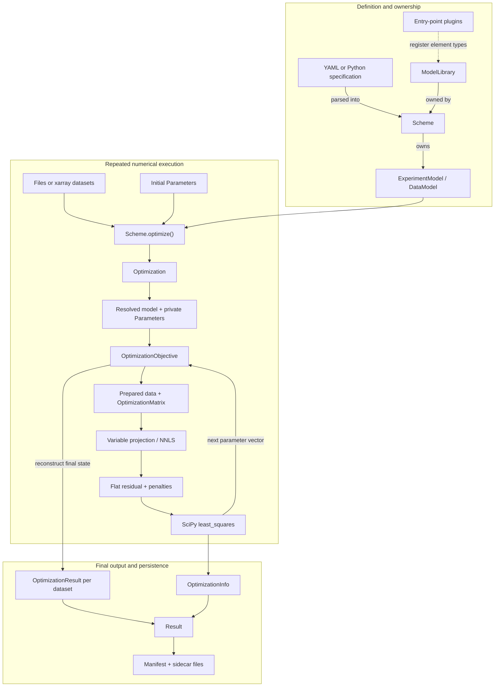

# Architecture guide

This document describes the implementation in this repository at `0.8.0.dev0`. It treats code as the primary evidence and tests as the executable contract. Some older documentation and changelog entries still use APIs that no longer exist; those are not used as the basis for this guide. The package version and plugin bootstrap are defined in [`glotaran/__init__.py`](glotaran/__init__.py), and the build metadata is in [`pyproject.toml`](pyproject.toml).

Statements marked **Inference** are conclusions from the current code rather than an explicit contract. Statements marked **Recommendation** describe where future changes should go; they are not descriptions of existing behavior.

## Table of contents

- [Purpose and scope](#purpose-and-scope)
- [Architectural center of gravity](#architectural-center-of-gravity)
- [Main execution paths](#main-execution-paths)
  - [Construction and loading](#construction-and-loading)
  - [Validation checkpoints](#validation-checkpoints)
  - [Data and ownership at runtime boundaries](#data-and-ownership-at-runtime-boundaries)
  - [Optimization](#optimization)
  - [Model-matrix and residual construction](#model-matrix-and-residual-construction)
  - [Variable projection](#variable-projection)
  - [Result post-processing](#result-post-processing)
  - [Simulation](#simulation)
- [Core concepts and boundaries](#core-concepts-and-boundaries)
  - [Domain objects and lifecycle](#domain-objects-and-lifecycle)
  - [Declarative versus executable state](#declarative-versus-executable-state)
  - [Layer boundaries](#layer-boundaries)
- [Extension architecture](#extension-architecture)
  - [Plugin discovery, registries, and ordering](#plugin-discovery-registries-and-ordering)
  - [Add a model component](#add-a-model-component)
  - [Add a typed model item](#add-a-typed-model-item)
  - [Add a residual or optimization algorithm](#add-a-residual-or-optimization-algorithm)
  - [Add a file format or serializer](#add-a-file-format-or-serializer)
  - [Add a result diagnostic](#add-a-result-diagnostic)
  - [Add a preprocessing step](#add-a-preprocessing-step)
  - [Add a high-level workflow helper](#add-a-high-level-workflow-helper)
- [Persistence and compatibility](#persistence-and-compatibility)
  - [Supported formats](#supported-formats)
  - [Result bundle](#result-bundle)
  - [Runtime state versus persisted state](#runtime-state-versus-persisted-state)
  - [Versioning and compatibility constraints](#versioning-and-compatibility-constraints)
- [Repository map](#repository-map)
- [Change guidance and risks](#change-guidance-and-risks)
  - [Where behavior belongs](#where-behavior-belongs)
  - [High-risk coupling in the current implementation](#high-risk-coupling-in-the-current-implementation)
  - [Testing expectations](#testing-expectations)
- [Before changing X, inspect Y](#before-changing-x-inspect-y)

## Purpose and scope

pyglotaran is a fitting engine for global and target analysis, especially two-dimensional time-resolved spectroscopy data. The project description and user introduction state that purpose directly ([`README.md`](README.md), [`docs/source/introduction.md`](docs/source/introduction.md), [`pyproject.toml`](pyproject.toml)).

The numerical contract is separable nonlinear least squares:

- Scientific model components generate labeled design matrices through `Element.calculate_matrix()` ([`glotaran/model/element.py`](glotaran/model/element.py)).
- Conditionally linear parameters (CLPs), such as spectra or amplitudes, are eliminated with variable projection or solved with non-negative least squares ([`glotaran/optimization/estimation.py`](glotaran/optimization/estimation.py), [`glotaran/optimization/variable_projection.py`](glotaran/optimization/variable_projection.py), [`glotaran/optimization/nnls.py`](glotaran/optimization/nnls.py)).
- The remaining parameters are optimized with SciPy `least_squares` ([`glotaran/optimization/optimization.py`](glotaran/optimization/optimization.py)).
- Multiple datasets can share CLPs inside one experiment, and residuals from multiple experiments are concatenated into one optimization ([`glotaran/model/experiment_model.py`](glotaran/model/experiment_model.py), [`glotaran/optimization/data.py`](glotaran/optimization/data.py)).

The implemented data path assumes a data variable named `data` with exactly two dimensions. Each local element declares the model dimension; the other data dimension is treated as the global dimension. Both optimization and simulation make this split ([`OptimizationData`](glotaran/optimization/data.py), [`simulate()`](glotaran/simulation/simulation.py)).

The project intentionally does not provide a GUI. The introduction defines it as a modeling and optimization framework that can be used from Python or Jupyter, not as a replacement GUI ([`docs/source/introduction.md`](docs/source/introduction.md)). Plotting is delegated to the optional `pyglotaran-extras` package ([`README.md`](README.md), [`pyproject.toml`](pyproject.toml)). Preprocessing in this repository is small and explicit; it is not an automatic part of loading or fitting ([`glotaran/io/preprocessor/pipeline.py`](glotaran/io/preprocessor/pipeline.py)).

**Inference:** instrument control, data acquisition, comprehensive visualization, and application-specific project-folder management are outside the current engine boundary. A higher-level application can compose the engine, I/O functions, plotting packages, and its own workflow state.

## Architectural center of gravity

The center of gravity is not a high-level convenience object. It is the collaboration between resolved model components, `OptimizationObjective`, `OptimizationMatrix`, and the CLP solver, driven by `Optimization`:

`Element.calculate_matrix()` → `OptimizationMatrix` → `OptimizationObjective.calculate()` → `OptimizationEstimation` → SciPy `least_squares`.

The direct optimization tests construct `DataModel`, `ExperimentModel`, and `Optimization` without a `Scheme`, then inspect the returned parameter, dataset-result, and diagnostic objects. This is concrete evidence that the numerical core is below the convenience workflow ([`tests/optimization/test_optimization.py`](tests/optimization/test_optimization.py)). The scheme test separately covers the convenience path ([`tests/project/test_scheme.py`](tests/project/test_scheme.py)).

### Current roles of the named abstractions

| Name | Role in the current code | Architectural conclusion |
| --- | --- | --- |
| `Project` | There is no current `Project` class. [`glotaran/project/__init__.py`](glotaran/project/__init__.py) exports only `Scheme` and `Result`. `ProjectIoInterface` is the historical name of the serializer interface for parameters, schemes, and results ([`glotaran/io/interface.py`](glotaran/io/interface.py)). | Do not add behavior to a presumed `Project` object. The `project` package is now the high-level aggregate boundary. Historical mentions in [`changelog.md`](changelog.md) do not establish a current API. |
| `Scheme` | Owns named experiments and a model library. `Scheme.from_dict()` builds declarative objects. `Scheme.optimize()` attaches data, creates `Optimization`, adds parameter standard errors, and wraps the output in `Result` ([`glotaran/project/scheme.py`](glotaran/project/scheme.py)). | Public workflow facade and configuration aggregate, not the numerical center. |
| `Model` | There is no monolithic `Model` class; [`glotaran/model/__init__.py`](glotaran/model/__init__.py) exports nothing. Model behavior is composed from `ModelLibrary`, `ExperimentModel`, `DataModel`, `Element`, model items, and parameters. | Treat “model” as a composition, not an object to extend. Choose the component whose contract owns the new behavior. |
| `optimize()` | There is no module-level `optimize()` function. The current entries are `Scheme.optimize()` and the `Optimization` class ([`glotaran/project/scheme.py`](glotaran/project/scheme.py), [`glotaran/optimization/__init__.py`](glotaran/optimization/__init__.py)). | Keep workflow defaults in `Scheme.optimize()` and numerical orchestration in `Optimization`. |
| Plugin registration | Importing `glotaran` loads element, data-I/O, and project-I/O entry points. The element registry determines which element types can be parsed into a library ([`glotaran/__init__.py`](glotaran/__init__.py), [`glotaran/plugin_system/base_registry.py`](glotaran/plugin_system/base_registry.py), [`glotaran/project/library.py`](glotaran/project/library.py)). | Plugins are bootstrap and schema infrastructure, not only optional adapters. Import timing is part of model construction. |
| Result objects | `OptimizationResult` is per dataset, `OptimizationInfo` is run-level solver metadata, and `project.Result` is the workflow/provenance and persistence envelope ([`glotaran/optimization/objective.py`](glotaran/optimization/objective.py), [`glotaran/optimization/info.py`](glotaran/optimization/info.py), [`glotaran/project/result.py`](glotaran/project/result.py)). | Results are downstream products. They should not acquire model evaluation responsibilities. |

### Import surfaces

The root package performs plugin bootstrap and exposes the version; it does not re-export the analysis API ([`glotaran/__init__.py`](glotaran/__init__.py)). The current subpackage import surfaces are:

- `glotaran.project`: `Scheme`, `Result` ([`glotaran/project/__init__.py`](glotaran/project/__init__.py));
- `glotaran.parameter`: `Parameter`, `Parameters`, `ParameterHistory` ([`glotaran/parameter/__init__.py`](glotaran/parameter/__init__.py));
- `glotaran.simulation`: `simulate` ([`glotaran/simulation/__init__.py`](glotaran/simulation/__init__.py));
- `glotaran.io`: plugin-routed load, save, registration, and dataset preparation functions ([`glotaran/io/__init__.py`](glotaran/io/__init__.py));
- `glotaran.optimization`: `Optimization`, `OptimizationData`, `OptimizationMatrix`, and `OptimizationInfo` ([`glotaran/optimization/__init__.py`](glotaran/optimization/__init__.py)).

**Inference:** these deliberate re-exports are the stable-looking import surfaces, but this repository does not declare a formal API-stability policy for every exported runtime class.

## Main execution paths

The following diagram shows ownership and control flow. It intentionally separates declarative construction, the numerical loop, and downstream result persistence.



### Construction and loading

1. Importing any `glotaran` submodule first executes the package initializer. Unless `DEACTIVATE_GTA_PLUGINS` is present, `load_plugins()` imports the three entry-point groups in element, data-I/O, project-I/O order ([`glotaran/__init__.py`](glotaran/__init__.py), [`load_plugins()`](glotaran/plugin_system/base_registry.py), [`pyproject.toml`](pyproject.toml)).
2. `load_scheme()` chooses a project-I/O plugin by explicit name or file extension. The YAML plugin parses and normalizes YAML, then calls `Scheme.from_dict()` ([`glotaran/plugin_system/project_io_registration.py`](glotaran/plugin_system/project_io_registration.py), [`glotaran/builtin/io/yml/yml.py`](glotaran/builtin/io/yml/yml.py), [`glotaran/utils/sanitize.py`](glotaran/utils/sanitize.py)).
3. `Scheme.from_dict()` constructs the `ModelLibrary` first. `ModelLibrary.from_dict()` injects each mapping key as the element label. Pydantic matches the element's literal `type` field against the registered element classes in the library's union ([`glotaran/project/scheme.py`](glotaran/project/scheme.py), [`glotaran/project/library.py`](glotaran/project/library.py)).
4. `ModelLibrary` resolves `ExtendableElement.extends` chains and rejects cycles. It retains each extendable element's original declaration so serialization can reproduce `extends` rather than the merged runtime element ([`ModelLibrary.__init__`](glotaran/project/library.py), [`ExtendableElement`](glotaran/model/element.py)).
5. `ExperimentModel.from_dict()` creates each dataset model. `DataModel.from_dict()` examines the referenced element classes and dynamically creates a Pydantic class that inherits every required `data_model_type` plus `DataModel`. This is how, for example, kinetic elements add activation fields to a dataset schema ([`glotaran/model/experiment_model.py`](glotaran/model/experiment_model.py), [`glotaran/model/data_model.py`](glotaran/model/data_model.py), [`glotaran/builtin/items/activation/data_model.py`](glotaran/builtin/items/activation/data_model.py)). Dynamic subtype behavior is tested directly ([`tests/model/test_data_model.py`](tests/model/test_data_model.py), [`tests/model/test_experiment_model.py`](tests/model/test_experiment_model.py)).
6. If a hand-written `DataModel.data` value is a string, `Scheme.from_dict()` loads it immediately through data I/O. It passes the string directly and does not resolve it relative to `Scheme.source_path`. Normally, callers pass datasets to `Scheme.optimize()` instead. `load_datasets()` accepts paths, `DataArray`, `Dataset`, sequences, or mappings; it normalizes them to named `Dataset` objects and adds `source_path` when missing ([`glotaran/project/scheme.py`](glotaran/project/scheme.py), [`glotaran/utils/io.py`](glotaran/utils/io.py)).

Structural validation is distributed rather than centralized. Pydantic rejects unknown fields on core configuration objects; typed items use discriminated unions; item validators report conditions such as exclusive or duplicate element types; dimension and matrix-shape failures often appear only when runtime data is prepared ([`glotaran/model/item.py`](glotaran/model/item.py), [`glotaran/model/data_model.py`](glotaran/model/data_model.py), [`glotaran/model/errors.py`](glotaran/model/errors.py)).

### Validation checkpoints

There is no single public `validate()` pass that proves an analysis is executable. Validation happens at these boundaries:

1. Pydantic validates field types, required fields, literal values, discriminated model items, and forbidden extras during library/scheme construction ([`glotaran/model/item.py`](glotaran/model/item.py), [`glotaran/project/scheme.py`](glotaran/project/scheme.py)).
2. `ModelLibrary` resolves extension dependencies and rejects a cycle that cannot make progress ([`glotaran/project/library.py`](glotaran/project/library.py)).
3. `Optimization.__init__()` resolves element and parameter labels into a private runtime graph. A missing lookup can fail here before numerical work begins ([`glotaran/optimization/optimization.py`](glotaran/optimization/optimization.py), [`glotaran/model/item.py`](glotaran/model/item.py)).
4. The resolved experiments run recursive item validators. `Optimization` aggregates returned issues and raises `GlotaranModelIssues`; current checks include element uniqueness/exclusivity and contributed fields such as required activations ([`glotaran/model/data_model.py`](glotaran/model/data_model.py), [`glotaran/builtin/items/activation/data_model.py`](glotaran/builtin/items/activation/data_model.py), [`glotaran/model/errors.py`](glotaran/model/errors.py)).
5. `OptimizationData` and `OptimizationMatrix` establish data dimensions, orientation, weights, row counts, and CLP-column labels. Mismatched dimensions or unsupported global matrices fail at this runtime boundary ([`glotaran/optimization/data.py`](glotaran/optimization/data.py), [`glotaran/optimization/matrix.py`](glotaran/optimization/matrix.py)).
6. Conditional solvers and SciPy enforce remaining numerical requirements, such as compatible array shapes and finite model output. `Scheme.optimize()` normally converts solver exceptions into warnings unless `raise_exception=True` ([`glotaran/optimization/optimization.py`](glotaran/optimization/optimization.py)).

Tests for these stages are split across [`tests/model`](tests/model), [`tests/project/test_scheme.py`](tests/project/test_scheme.py), and [`tests/optimization`](tests/optimization). A new validation rule should be placed at the earliest boundary that owns enough information to decide it.

### Data and ownership at runtime boundaries

| Boundary | Input → output | Owner after the boundary | Important invariant or mutation |
| --- | --- | --- | --- |
| Specification parsing | YAML/dict → `Scheme`, `ModelLibrary`, `ExperimentModel`, dynamic `DataModel` | `Scheme` owns the aggregate | Element labels refer to library keys; registered element types must already be available. |
| Dataset attachment | path/xarray/mapping → normalized `Dataset` mapping → `DataModel.data` | Nested `DataModel` retains the xarray object | `Scheme._load_data()` mutates the scheme. Dataset labels are the join key. Incoming xarray attributes may be updated ([`scheme.py`](glotaran/project/scheme.py), [`utils/io.py`](glotaran/utils/io.py)). |
| Model resolution | string element/parameter references → copied models with `Element` and `Parameter` objects | `Optimization` owns a private `Parameters`; resolved models reference its objects | Only referenced parameters and expression dependencies are copied. Values are shared by reference inside the resolved model ([`model/item.py`](glotaran/model/item.py), [`optimization.py`](glotaran/optimization/optimization.py)). |
| Data preparation | xarray variables → copied, oriented, optionally weighted NumPy arrays | `OptimizationData` or `LinkedOptimizationData` | Numeric data are `(model, global)` internally. Linked data also own alignment groups, offsets, and scales ([`optimization/data.py`](glotaran/optimization/data.py)). |
| Matrix generation | resolved element + axes → labeled 2-D/3-D arrays | `OptimizationMatrix` | Column position and `clp_axis` must agree. Rows must align with the prepared data vector ([`optimization/matrix.py`](glotaran/optimization/matrix.py)). |
| Conditional estimation | matrix + data slice → CLP vector + residual vector | `OptimizationEstimation` | One CLP per matrix column and one residual per row ([`optimization/estimation.py`](glotaran/optimization/estimation.py)). |
| Outer objective | per-slice residuals + optional CLP penalties → one flat vector | SciPy receives the vector; objectives retain prepared state | Vector length and ordering must remain stable across evaluations ([`optimization/objective.py`](glotaran/optimization/objective.py)). |
| Result reconstruction | final runtime state → xarray arrays, metadata, histories | `OptimizationResult`, `OptimizationInfo`, then `Result` | Reconstruction recalculates matrices and CLPs; persistence later removes or externalizes some runtime fields. |

### Optimization

`Scheme.optimize()` is the high-level entry. It attaches datasets, constructs `Optimization`, chooses `run()` or `dry_run()`, adds standard errors to the optimized parameters, and returns a top-level `Result` ([`glotaran/project/scheme.py`](glotaran/project/scheme.py)). Direct callers can construct `Optimization` after attaching xarray datasets themselves ([`tests/optimization/test_optimization.py`](tests/optimization/test_optimization.py)).

The following pseudocode is derived from [`Optimization.__init__`, `run()`, and `objective_function()`](glotaran/optimization/optimization.py). It describes the current algorithm, including its mutable-state contract.

```text
INPUT
    experiment models, model library, initial Parameters, least-squares options
OUTPUT
    optimized Parameters, map[dataset label → OptimizationResult], OptimizationInfo

private_parameters ← empty Parameters
resolved_experiments ← []
for experiment in experiments:
    resolved ← resolve element labels and parameter labels
               while copying every referenced parameter into private_parameters
    resolved_experiments.append(resolved)

reject collected model issues
objectives ← one OptimizationObjective per resolved experiment
(free_labels, x0, lower, upper) ← varying entries of private_parameters

function objective(x):
    set private_parameters[free_labels] from x
    reevaluate expression-driven parameters
    return concatenate(each objective.calculate())

try:
    solver_result ← scipy.least_squares(objective, x0, bounds, method, tolerances)
catch error:
    rethrow if raise_exception
    otherwise warn and retain no solver_result

final_penalty ← concatenate(each objective.calculate())
per_experiment_results ← each objective.get_result()
results ← merge their per-dataset maps
info ← derive statistics and histories from solver_result and final_penalty
return (private_parameters, results, info)

INVARIANTS
    free_labels, x, and bounds have identical ordering
    resolved model fields reference the same Parameter objects that callbacks mutate
    every objective evaluation returns a flat vector of stable length
    dataset labels are globally unique across experiments for lossless result merging
```

`dry_run()` skips SciPy but still evaluates the objectives and creates results. Its `OptimizationInfo` is unsuccessful with termination reason `Dry run.` ([`Optimization.dry_run()`](glotaran/optimization/optimization.py), [`OptimizationInfo.from_least_squares_result()`](glotaran/optimization/info.py)).

### Model-matrix and residual construction

`OptimizationObjective` chooses `OptimizationData` for one dataset and `LinkedOptimizationData` for multiple datasets in the same experiment. The latter aligns global coordinates by tolerance/method, concatenates the participating model-axis rows at each aligned coordinate, and remembers how to split residuals back into datasets ([`glotaran/optimization/objective.py`](glotaran/optimization/objective.py), [`glotaran/optimization/data.py`](glotaran/optimization/data.py)). Alignment behavior is covered in [`tests/optimization/test_data.py`](tests/optimization/test_data.py).

This pseudocode is derived from [`OptimizationMatrix`](glotaran/optimization/matrix.py) and [`OptimizationObjective.calculate()`](glotaran/optimization/objective.py):

```text
INPUT
    resolved DataModel(s), prepared data, global/model axes,
    CLP relations, CLP constraints, optional CLP penalties
OUTPUT
    flat residual-and-penalty vector

for each dataset:
    component_matrices ← []
    for (scale, element) in local elements:
        (labels, A) ← element.calculate_matrix(data_model, global_axis, model_axis)
        component_matrices.append(scale × labeled_matrix(labels, A))
    dataset_matrix ← combine matrices by CLP label
                      (add contributions that have the same label)
    apply the same row weights used for the data

if datasets are linked:
    for each aligned global coordinate:
        select each participating dataset matrix at its source index
        apply dataset scale
        vertically link matrices, sharing columns with equal CLP labels
else:
    split an index-dependent matrix into one matrix per global coordinate

for each global coordinate:
    reduced_matrix ← substitute active CLP relations
    reduced_matrix ← remove columns selected by active zero/only constraints
    (reduced_clp, residual) ← selected conditional solver(reduced_matrix, data_slice)

parts ← all residual vectors
if CLP penalties exist:
    expand reduced CLPs back to the full label axis
    parts.append(calculate configured area penalties)
return concatenate(parts)

INVARIANTS
    2-D matrix means index-independent; 3-D means (global, model, CLP)
    matrix rows match the corresponding weighted data slice
    matrix columns stay aligned with CLP labels through combine/link/reduce
    relations are reduced before estimation and restored before diagnostics/penalties
```

The relation and constraint transformations are label based. A relation folds the target column into the source column and removes the dependent target. A constraint removes selected CLP columns. Tests exercise these transformations and linked matrices ([`tests/optimization/test_matrix.py`](tests/optimization/test_matrix.py), [`tests/optimization/test_relations_and_constraints.py`](tests/optimization/test_relations_and_constraints.py)).

A dataset with nonempty `global_elements` takes a distinct full/global path. `OptimizationMatrix.from_global_data()` builds a local matrix `M`, a global matrix `G`, and a Kronecker-product design matrix. It flattens data in global-major order and performs one conditional solve ([`glotaran/optimization/matrix.py`](glotaran/optimization/matrix.py), [`OptimizationObjective.calculate_global_penalty()`](glotaran/optimization/objective.py)). The current early global branch bypasses ordinary per-coordinate relation/constraint reduction and `ExperimentModel.clp_penalties`; do not assume those features apply to full/global models.

### Variable projection

`OptimizationEstimation.calculate()` dispatches through the closed `SUPPORTED_RESIDUAL_FUNCTIONS` mapping. Both implementations accept a matrix and data vector and return `(clp, residual)` ([`glotaran/optimization/estimation.py`](glotaran/optimization/estimation.py)).

The central variable-projection step uses LAPACK QR operations. The following language-agnostic pseudocode is derived from [`residual_variable_projection()`](glotaran/optimization/variable_projection.py):

```text
INPUT
    design matrix A with m rows and n columns
    data vector y with m entries
OUTPUT
    conditional coefficients c with n entries
    residual r with m entries

(QR, tau) ← QR_factorization(A)
z ← Qᵀ y
c ← triangular_solve(R, z)
set z[0:n] to zero
r ← Q z
return (c[0:n], r)

INVARIANTS
    A and y already use identical weights
    A's column order is the CLP-label order
    residual length equals A's row count
```

The non-negative alternative calls SciPy NNLS and returns `y - A × c` ([`glotaran/optimization/nnls.py`](glotaran/optimization/nnls.py)). Solver-shape and CLP-restoration behavior is tested in [`tests/optimization/test_estimation.py`](tests/optimization/test_estimation.py).

### Result post-processing

Result creation is not a simple cast of SciPy output. Each objective repeats matrix construction and conditional estimation with the current nonlinear parameter state, then translates numeric arrays back into domain-labeled xarray objects ([`glotaran/optimization/objective.py`](glotaran/optimization/objective.py)).

```text
INPUT
    current resolved model state and prepared data after optimization
OUTPUT
    OptimizationResult for each dataset

rebuild full and reduced matrices
solve CLPs and residuals again
restore constrained/related CLPs to the full label axis

results ← empty map
for each dataset:
    map residual rows back to original model/global coordinates
    undo residual weighting for public output
    build labeled amplitude and concentration arrays
    element_results ← each Element.create_result_with_uid(...)
    data_model_results ← each contributed DataModel.create_result(...)
    metadata ← dimensions, RMSE, weighted RMSE if available, linked scale
    results[dataset label] ← OptimizationResult(
        input_data, residuals,
        elements=element_results,
        activations=data_model_results,
        fit_decomposition=(CLPs, matrix),
        meta=metadata
    )
return results
```

The full/global result path differs: it stores a cross-product CLP array plus local/global concentration matrices under the dataset label and does not call the normal element or data-model result hooks ([`OptimizationObjective.create_global_result()`](glotaran/optimization/objective.py)). Any diagnostic added through those hooks therefore needs an explicit global-path decision and test.

For weighted ordinary fits, public residuals are divided back by the weight and weighted RMSE can be retained in metadata. The temporary `weight` and `weighted_residual` variables are not top-level fields of `OptimizationResult`; a diagnostic that needs them must preserve or recompute them explicitly ([`OptimizationData.unweight_result_dataset()`](glotaran/optimization/data.py), [`OptimizationResult`](glotaran/optimization/objective.py)).

`Optimization.run()` returns its private optimized parameter subset, a map of per-dataset `OptimizationResult`, and `OptimizationInfo`. `Scheme.optimize()` then mutates parameter standard errors and creates the top-level `Result` with the scheme and caller's full initial parameter object ([`glotaran/optimization/optimization.py`](glotaran/optimization/optimization.py), [`glotaran/optimization/info.py`](glotaran/optimization/info.py), [`glotaran/project/scheme.py`](glotaran/project/scheme.py)).

### Simulation

Simulation is a separate forward path that deliberately reuses model resolution and `OptimizationMatrix`, but not objectives or the outer solver ([`glotaran/simulation/simulation.py`](glotaran/simulation/simulation.py)):

1. Resolve one `DataModel` against the library and parameters.
2. Split the supplied coordinates into model and global dimensions.
3. If the caller did not supply CLPs, require global elements and use their matrix as the CLP array.
4. Build the local model matrix.
5. At each global coordinate, select the matrix slice and matching CLP labels, then calculate their dot product.
6. Optionally add seeded Gaussian noise and return an xarray `Dataset` with a `data` variable.

Simulation does not apply preprocessing, create histories, calculate parameter errors, or construct `OptimizationInfo`/`Result`. Tests cover supplied CLPs and global-element-generated CLPs ([`tests/simulation/test_simulation.py`](tests/simulation/test_simulation.py)). Current edge behavior is that noise is added only when both `noise=True` and `noise_seed` is not `None`.

## Core concepts and boundaries

### Domain objects and lifecycle

| Object | Responsibility and collaborators | Lifecycle and invariants |
| --- | --- | --- |
| `Scheme` | High-level aggregate of experiments and library; convenience optimization entry; collaborator of project I/O and `Optimization` ([`scheme.py`](glotaran/project/scheme.py)). | Parsed or constructed once, then mutated when datasets are attached. Data labels must match nested dataset-model labels. |
| `ModelLibrary` | Named `Element` definitions; parses registered element subtypes; resolves extension chains ([`library.py`](glotaran/project/library.py)). | Runtime entries may be merged extended elements, while serialization emits original declarations. `extends` must be acyclic and refer to existing labels. |
| `ExperimentModel` | Groups datasets that share an aligned CLP solve; owns link tolerance/method, scales, CLP relations/penalties, and the ordinary residual solver choice ([`experiment_model.py`](glotaran/model/experiment_model.py)). | Unresolved form contains labels; `resolve()` returns a copy with concrete elements/parameters. Multiple experiments share the outer nonlinear solve but not a linked CLP system. |
| `DataModel` | Per-dataset declarative fields, local/global element references, scales, weights, and excluded runtime `data` ([`data_model.py`](glotaran/model/data_model.py)). | Concrete class can be dynamically composed from element-contributed mixins. Local elements must agree on one non-`None` model dimension. A nonempty `global_elements` list switches algorithms. |
| `Element` | Configuration-carrying executable strategy. `calculate_matrix()` defines forward behavior; `create_result()` defines element diagnostics ([`element.py`](glotaran/model/element.py)). | A `type` discriminator selects the class. Matrix labels and columns are inseparable. `ExtendableElement` additionally owns merge semantics and an original declaration. |
| `Item` / `TypedItem` | Strict Pydantic schema building blocks, parameter-field discovery, recursive issue checking, and discriminated subtypes ([`item.py`](glotaran/model/item.py)). | `ParameterType` fields may be constants, labels, or resolved `Parameter` objects. Typed unions include subclasses imported before the annotation is materialized. |
| `Parameter` / `Parameters` | Mutable nonlinear values, bounds, vary/non-negative rules, expressions, serialization, and lookup ([`parameter.py`](glotaran/parameter/parameter.py), [`parameters.py`](glotaran/parameter/parameters.py)). | Expressions force `vary=False` and are reevaluated after updates. Optimization copies only the reachable parameter graph; resolved model fields share those copies. |
| `OptimizationData` | Numeric boundary from labeled xarray to copied, oriented, weighted arrays ([`data.py`](glotaran/optimization/data.py)). | Requires two dimensions and a `data` variable. Dataset-provided weight overrides model interval weights. |
| `LinkedOptimizationData` | Aligns datasets within an experiment and owns group membership, offsets, per-dataset indices, and scales ([`data.py`](glotaran/optimization/data.py)). | Alignment is incremental and can be ambiguous. Dataset insertion order affects the alignment process. |
| `OptimizationMatrix` | Couples an array with CLP labels and constraints; combines, links, reduces, weights, scales, slices, and converts to xarray ([`matrix.py`](glotaran/optimization/matrix.py)). | Several methods mutate their array. Two-dimensional and three-dimensional shapes have different meanings. |
| `OptimizationEstimation` | Conditional solver output and restoration of reduced CLPs ([`estimation.py`](glotaran/optimization/estimation.py)). | CLP length follows the current reduced matrix; `resolve_clp()` expands it to the original axis. |
| `OptimizationObjective` | Per-experiment residual construction, data/matrix collaboration, CLP penalties, and result reconstruction ([`objective.py`](glotaran/optimization/objective.py)). | Owns prepared data and a resolved experiment. It is evaluated repeatedly against parameters mutated elsewhere. |
| `Optimization` | Outer nonlinear orchestration, solver configuration, failure policy, mutable private parameter set, and aggregation ([`optimization.py`](glotaran/optimization/optimization.py)). | Not reentrant or thread-safe. One instance is one run/dry-run lifecycle. |
| `OptimizationResult` | Structured per-dataset numeric output and serializer: input, optional residual, computed fit, decomposition, element/data-model results, metadata ([`objective.py`](glotaran/optimization/objective.py)). | `fitted_data` is derived, not authoritative. Some fields may be absent after minimal persistence. |
| `OptimizationInfo` | Run-wide solver diagnostics, statistics, covariance/Jacobian at runtime, and histories ([`info.py`](glotaran/optimization/info.py)). | Persistence intentionally discards covariance and Jacobian. Current `success` construction has semantics described under risks. |
| `Result` | Top-level provenance/workflow envelope and save entry: scheme, initial/optimized parameters, per-dataset results, diagnostics ([`result.py`](glotaran/project/result.py)). | File-backed fields require serialization/validation context. Loading reconstructs a usable scheme but not all runtime-only diagnostics. |

### Declarative versus executable state

The boundary is real but porous. There are not two completely separate class families:

- Before resolution, `ExperimentModel` and `DataModel` can contain string labels. `ExperimentModel.resolve()`, `resolve_data_model()`, and `resolve_item_parameters()` create copies containing concrete `Element` and `Parameter` objects ([`glotaran/model/experiment_model.py`](glotaran/model/experiment_model.py), [`glotaran/model/data_model.py`](glotaran/model/data_model.py), [`glotaran/model/item.py`](glotaran/model/item.py)).
- `Element` combines declarative schema with executable `calculate_matrix()` and `create_result()` methods ([`glotaran/model/element.py`](glotaran/model/element.py)).
- `DataModel` combines persisted schema with an excluded runtime xarray `data` field ([`glotaran/model/data_model.py`](glotaran/model/data_model.py)).
- The cleanest runtime-only objects are `OptimizationData`, `LinkedOptimizationData`, `OptimizationMatrix`, `OptimizationEstimation`, and `OptimizationObjective` ([`glotaran/optimization`](glotaran/optimization)).

The transition to executable state is therefore model resolution plus data preparation, not construction of a single executable `Model`.

### Layer boundaries

- **Model logic:** `glotaran.model` defines contracts and generic composition; `glotaran.builtin.elements` and `glotaran.builtin.items` own scientific component behavior.
- **Numerical runtime:** `glotaran.optimization.data`, `matrix`, `estimation`, `variable_projection`, `nnls`, `penalty`, and `optimization` own array preparation and algorithms.
- **Workflow orchestration:** `Scheme.optimize()` adapts user-facing inputs to `Optimization` and wraps outputs.
- **I/O:** public wrappers and plugins translate files to domain/xarray objects. They should not decide scientific model behavior.
- **Diagnostics:** element/data-model hooks produce domain diagnostics; `OptimizationResultMetaData` and `OptimizationInfo` produce dataset/run diagnostics.

This separation is imperfect in the current implementation. [`glotaran/optimization/objective.py`](glotaran/optimization/objective.py) contains numerical orchestration, result model definitions, result reconstruction, and file-backed Pydantic serializers. [`glotaran/optimization/info.py`](glotaran/optimization/info.py) also serializes histories. A refactor of these modules must run persistence tests even if numerical tests pass.

## Extension architecture

### Plugin discovery, registries, and ordering

The three registries are process-global mutable mappings in [`__PluginRegistry`](glotaran/plugin_system/base_registry.py). Entry-point modules register by import side effect:

- element subclasses set `register_as`; `Element.__init_subclass__()` calls `register_element()` ([`glotaran/model/element.py`](glotaran/model/element.py), [`glotaran/plugin_system/element_registration.py`](glotaran/plugin_system/element_registration.py));
- data-I/O classes use `@register_data_io(...)` ([`glotaran/plugin_system/data_io_registration.py`](glotaran/plugin_system/data_io_registration.py));
- project-I/O classes use `@register_project_io(...)` ([`glotaran/plugin_system/project_io_registration.py`](glotaran/plugin_system/project_io_registration.py)).

Every plugin is stored under a short name and a fully qualified name. On a short-name collision, the existing short binding wins; the later plugin remains addressable under its full name and emits `PluginOverwriteWarning`. `set_model_plugin()`, `set_data_plugin()`, and `set_project_plugin()` can pin a short name to a registered full name ([`glotaran/plugin_system/base_registry.py`](glotaran/plugin_system/base_registry.py), [`tests/plugin_system/test_base_registry.py`](tests/plugin_system/test_base_registry.py)). There is no priority or sort within an entry-point group, so conflict outcome can depend on discovery/import order.

Element selection has an extra constraint: [`ModelLibrary`](glotaran/project/library.py) materializes `ElementType` from the current registry at module import. Data/project I/O look up their registries on each operation, but late element registration or later `set_model_plugin()` does not rebuild that Pydantic union. Treat “load element plugins before importing/parsing model libraries” as an invariant. The package bootstrap satisfies it for installed entry-point plugins.

`TypedItem` families have a similar import-time union. Import concrete subclasses before a containing field calls `get_annotated_type()`. The activation package demonstrates this ordering ([`glotaran/builtin/items/activation/__init__.py`](glotaran/builtin/items/activation/__init__.py), [`glotaran/builtin/items/activation/data_model.py`](glotaran/builtin/items/activation/data_model.py), [`tests/model/test_item.py`](tests/model/test_item.py)). There is no separate model-item registry.

### Add a model component

Minimal implementation:

1. Subclass `Element` or `ExtendableElement` in an appropriate scientific package ([`glotaran/model/element.py`](glotaran/model/element.py)).
2. Declare `type: Literal[...]`, `register_as`, and a common `dimension`.
3. Implement `calculate_matrix(model, global_axis, model_axis) -> (clp_labels, array)`. The array must be `(model, clp)` or `(global, model, clp)`.
4. Implement `create_result(...) -> xr.Dataset`. Keep element-specific arrays here rather than adding branches to `OptimizationObjective`.
5. If the component needs dataset-level fields, define a `DataModel` subtype and assign it to `data_model_type`. Avoid overlapping field/MRO assumptions with other element mixins ([`DataModel.create_class_for_elements()`](glotaran/model/data_model.py)).
6. If it is extendable, implement `extend()` and test multi-level and cyclic behavior.
7. Ensure the entry-point target imports the class. Built-ins add a target under `glotaran.plugins.elements` in [`pyproject.toml`](pyproject.toml); third-party packages declare the same group in their own metadata.

Use a comparable built-in such as [`KineticElement`](glotaran/builtin/elements/kinetic/element.py) or [`BaselineElement`](glotaran/builtin/elements/baseline/element.py). Test direct matrix behavior, scheme parsing, result creation, and optimization/simulation as applicable. Relevant contracts are exercised by [`tests/model/test_data_model.py`](tests/model/test_data_model.py), [`tests/project/test_scheme.py`](tests/project/test_scheme.py), [`tests/optimization/test_matrix.py`](tests/optimization/test_matrix.py), [`tests/optimization/test_objective.py`](tests/optimization/test_objective.py), and [`tests/builtin/elements`](tests/builtin/elements).

Renaming the element module or class is a compatibility change: `Element.create_result_with_uid()` writes the full class path as `element_uid` for downstream plotting ([`glotaran/model/element.py`](glotaran/model/element.py)).

### Add a typed model item

For a typed model item, define a `TypedItem` family and concrete subclasses with distinct literal `type` values. Import all concrete subclasses before the containing Pydantic field calls `get_annotated_type()`; existing annotations do not automatically expand after a late import. `ParameterType` fields participate in recursive parameter resolution when their annotations expose `Parameter` to the item helpers ([`glotaran/model/item.py`](glotaran/model/item.py)). There is no entry-point registry for these items. Use the activation family and its tests as the reference contract ([`glotaran/builtin/items/activation`](glotaran/builtin/items/activation), [`tests/builtin/items/activation/test_activation.py`](tests/builtin/items/activation/test_activation.py)).

### Add a residual or optimization algorithm

#### Residual solver

Residual solvers are a closed in-process mapping, not plugins:

1. Implement `(matrix, data) -> (clp, residual)` beside [`variable_projection.py`](glotaran/optimization/variable_projection.py) and [`nnls.py`](glotaran/optimization/nnls.py).
2. Add it to `SUPPORTED_RESIDUAL_FUNCTIONS` in [`estimation.py`](glotaran/optimization/estimation.py).
3. Extend the `residual_function` `Literal` in both [`ExperimentModel`](glotaran/model/experiment_model.py) and [`DataModel`](glotaran/model/data_model.py).
4. Test one CLP per matrix column and one residual per data row in [`tests/optimization/test_estimation.py`](tests/optimization/test_estimation.py), then add ordinary, linked, and full/global objective tests.

Do not ignore the two current selector fields: ordinary objective calculation uses `ExperimentModel.residual_function`, while full/global result reconstruction uses `DataModel.residual_function` ([`glotaran/optimization/objective.py`](glotaran/optimization/objective.py)). Resolve that source-of-truth issue or keep the fields synchronized before adding another solver.

#### Outer optimizer

For another SciPy `least_squares` method, extend `SUPPORTED_OPTIMIZATION_METHODS` and the method `Literal` in [`optimization.py`](glotaran/optimization/optimization.py), plus the facade `Literal` in [`scheme.py`](glotaran/project/scheme.py). A different optimizer backend is not a small registry addition: `Optimization.run()` assumes SciPy bounds/method arguments and `OptimizeResult` fields, [`OptimizationInfo.from_least_squares_result()`](glotaran/optimization/info.py) assumes its result shape, and [`OptimizationHistory.from_stdout_str()`](glotaran/optimization/optimization_history.py) parses SciPy's printed table. Cover [`tests/optimization/test_optimization.py`](tests/optimization/test_optimization.py), [`tests/optimization/test_info.py`](tests/optimization/test_info.py), and [`tests/optimization/test_optimization_history.py`](tests/optimization/test_optimization_history.py).

### Add a file format or serializer

For measured/result array data:

1. Subclass `DataIoInterface` and implement `load_dataset()` and/or `save_dataset()` ([`glotaran/io/interface.py`](glotaran/io/interface.py)).
2. Decorate with `@register_data_io` and add a `glotaran.plugins.data_io` entry point ([`glotaran/plugin_system/data_io_registration.py`](glotaran/plugin_system/data_io_registration.py)).
3. Keep extra arguments keyword-only. Let the public wrapper own format inference, overwrite protection, `DataArray` normalization, and provenance attributes.

For parameters, schemes, or result bundles:

1. Subclass `ProjectIoInterface` and override only the supported load/save methods ([`glotaran/io/interface.py`](glotaran/io/interface.py)).
2. Decorate with `@register_project_io` and add a `glotaran.plugins.project_io` entry point ([`glotaran/plugin_system/project_io_registration.py`](glotaran/plugin_system/project_io_registration.py)).
3. A result serializer must preserve the `save_folder` Pydantic context and return every created path. Use [`YmlProjectIo`](glotaran/builtin/io/yml/yml.py) as the current multi-file contract.

Add registry tests and real round-trip tests. The core examples are [`tests/plugin_system/test_data_io_registration.py`](tests/plugin_system/test_data_io_registration.py), [`tests/plugin_system/test_project_io_registration.py`](tests/plugin_system/test_project_io_registration.py), [`tests/builtin/io`](tests/builtin/io), and [`tests/project/test_result.py`](tests/project/test_result.py).

### Add a result diagnostic

There is no diagnostic registry. Choose the narrowest owner:

- Element-specific arrays belong in `Element.create_result()`.
- Dataset-model-wide arrays, such as activation diagnostics, belong in `DataModel.create_result()` ([`glotaran/model/data_model.py`](glotaran/model/data_model.py), [`glotaran/builtin/items/activation/data_model.py`](glotaran/builtin/items/activation/data_model.py)).
- Per-dataset scalar metadata belongs in `OptimizationResultMetaData` plus `OptimizationObjective.create_result_metadata()` ([`glotaran/optimization/objective.py`](glotaran/optimization/objective.py)).
- Run/solver diagnostics belong in `OptimizationInfo` and its construction path ([`glotaran/optimization/info.py`](glotaran/optimization/info.py)).
- A pure derived diagnostic should usually be a post-hoc function accepting `Result` or `OptimizationResult`, so it does not enlarge the solver loop.

If the diagnostic adds persisted files, update the `OptimizationResult` serializer and validator, `OptimizationResult.extract_paths_from_serialization()`, `Result.extract_paths_from_serialization()`, and possibly `SavingOptions.data_filter` ([`glotaran/optimization/objective.py`](glotaran/optimization/objective.py), [`glotaran/project/result.py`](glotaran/project/result.py), [`glotaran/io/interface.py`](glotaran/io/interface.py)). Add full and minimal round-trip assertions to [`tests/optimization/test_objective.py`](tests/optimization/test_objective.py) and [`tests/project/test_result.py`](tests/project/test_result.py). Otherwise a save can create an unreported file or fail to reload it.

### Add a preprocessing step

Preprocessing is intentionally standalone today:

1. Subclass `PreProcessor` and implement `apply(DataArray) -> DataArray` in [`glotaran/io/preprocessor/preprocessor.py`](glotaran/io/preprocessor/preprocessor.py).
2. Give it a unique `action: Literal[...]`.
3. Add the class to the closed `PipelineAction` union in [`glotaran/io/preprocessor/pipeline.py`](glotaran/io/preprocessor/pipeline.py).
4. Optionally add a fluent method that returns a new pipeline with the appended action.
5. Test direct behavior and `model_dump()`/`model_validate()` round-trip in [`tests/io/preprocessor/test_preprocessor.py`](tests/io/preprocessor/test_preprocessor.py).

Callers must explicitly apply the pipeline before `Scheme.optimize()` or direct `Optimization`. Adding an action does not integrate it into loading or fitting; automatic integration would be a separate workflow-layer decision.

### Add a high-level workflow helper

There is no current `Project` class. A helper that loads artifacts, applies preprocessing, calls `Scheme.optimize()`, and saves a `Result` should compose those APIs above the numerical core.

**Recommendation:** place a thin reusable helper in `glotaran/project` and deliberately re-export it from [`glotaran/project/__init__.py`](glotaran/project/__init__.py). If it owns a catalog, folder layout, or application state, consider a separate package rather than making `Scheme`, `Optimization`, or `Result` own the filesystem. Test that the helper produces the same result as the direct `Scheme.optimize()` path using [`tests/project/test_scheme.py`](tests/project/test_scheme.py) and [`tests/optimization/test_optimization.py`](tests/optimization/test_optimization.py).

## Persistence and compatibility

### Supported formats

The plugin interfaces permit partial implementations. The operations below are the methods actually overridden by the built-ins.

| Artifact | Format | Load | Save | Implementation |
| --- | --- | ---: | ---: | --- |
| xarray data | `nc` | yes | yes | [`glotaran/builtin/io/netCDF/netCDF.py`](glotaran/builtin/io/netCDF/netCDF.py) |
| xarray data | `ascii` | yes | yes | [`glotaran/builtin/io/ascii/wavelength_time_explicit_file.py`](glotaran/builtin/io/ascii/wavelength_time_explicit_file.py) |
| instrument data | `sdt` | yes | no | [`glotaran/builtin/io/sdt/sdt_file_reader.py`](glotaran/builtin/io/sdt/sdt_file_reader.py) |
| parameters | `csv`, `tsv`, `xlsx`, `ods` | yes | yes | [`glotaran/builtin/io/pandas`](glotaran/builtin/io/pandas) |
| parameters | `yml`, `yaml` | yes | no | [`glotaran/builtin/io/yml/yml.py`](glotaran/builtin/io/yml/yml.py) |
| scheme | `yml`, `yaml` | yes | yes | [`glotaran/builtin/io/yml/yml.py`](glotaran/builtin/io/yml/yml.py) |
| result bundle | `yml`, `yaml` manifest/folder | yes | yes | [`glotaran/builtin/io/yml/yml.py`](glotaran/builtin/io/yml/yml.py) |
| YAML text | explicit `yml_str` alias | parameters and schemes | not a normal file/result format | [`glotaran/builtin/io/yml/yml.py`](glotaran/builtin/io/yml/yml.py) |

The public wrappers infer a format from a file suffix unless an explicit plugin name is supplied. A result path without a suffix is treated as a folder containing `result.yml` ([`glotaran/plugin_system/io_plugin_utils.py`](glotaran/plugin_system/io_plugin_utils.py), [`glotaran/plugin_system/project_io_registration.py`](glotaran/plugin_system/project_io_registration.py)).

### Result bundle

Default `Result.save()` is a side-effecting, multi-file serialization:

- `result.yml` manifest;
- `scheme.yml`;
- initial and optimized parameters, normally CSV;
- parameter and optimization histories as CSV;
- per-dataset input, residual, fitted data, element results, activation/data-model results, and fit decomposition, normally NetCDF.

The manifest stores relative paths and the Pydantic serializers write the sidecar files. `YmlProjectIo` supplies the required `save_folder` context ([`glotaran/project/result.py`](glotaran/project/result.py), [`glotaran/optimization/objective.py`](glotaran/optimization/objective.py), [`glotaran/builtin/io/yml/yml.py`](glotaran/builtin/io/yml/yml.py)). Full and minimal layouts are asserted in [`tests/project/test_result.py`](tests/project/test_result.py) and [`tests/builtin/io/yml/test_yml.py`](tests/builtin/io/yml/test_yml.py).

`SAVING_OPTIONS_MINIMAL` can omit residuals, fitted data, element results, activation results, and decomposition. Input data remains mandatory: if it has reusable source provenance, the manifest can reference that file; otherwise it is saved ([`glotaran/io/interface.py`](glotaran/io/interface.py), [`OptimizationResult.serialize_top_level_datasets()`](glotaran/optimization/objective.py)).

### Runtime state versus persisted state

| Runtime state | Persisted representation or difference |
| --- | --- |
| `DataModel.data` contains a path or xarray dataset. | The field is excluded from scheme serialization. Result input data are saved/referenced separately ([`glotaran/model/data_model.py`](glotaran/model/data_model.py), [`glotaran/project/result.py`](glotaran/project/result.py)). |
| Element instances contain an excluded `label`. | `ModelLibrary` uses the mapping key as the label during loading ([`glotaran/project/library.py`](glotaran/project/library.py)). |
| An `ExtendableElement` is merged for runtime use. | The original unmerged declaration with `extends` is serialized ([`glotaran/project/library.py`](glotaran/project/library.py), [`glotaran/model/element.py`](glotaran/model/element.py)). |
| Resolved models contain `Element` and live `Parameter` objects and may have generated `DataModel` classes. | Schemes store element/parameter labels and ordinary fields; generated classes and object references are reconstructed. |
| `fitted_data` is computed as `input_data - residuals`. | It may be saved as a sidecar, but its serialized field is discarded on validation and recomputed ([`OptimizationResult`](glotaran/optimization/objective.py)). |
| `OptimizationInfo` may contain NumPy covariance and Jacobian arrays. | JSON serialization writes them as `None`; they are not restored ([`glotaran/optimization/info.py`](glotaran/optimization/info.py), [`tests/project/test_result.py`](tests/project/test_result.py)). |
| Dataset and top-level objects have `source_path`/`io_plugin_name` provenance. | Data-I/O wrappers update xarray attributes during load/save. `Scheme.source_path` is excluded from its model dump; project-I/O wrappers set scheme/result source paths after operations ([`glotaran/plugin_system/data_io_registration.py`](glotaran/plugin_system/data_io_registration.py), [`glotaran/plugin_system/project_io_registration.py`](glotaran/plugin_system/project_io_registration.py), [`glotaran/project/scheme.py`](glotaran/project/scheme.py)). |
| A full `OptimizationResult` has residuals and diagnostics. | A minimal result can load with `residuals=None`, empty diagnostics, and no decomposition. |

### Versioning and compatibility constraints

There is no explicit scheme/result schema-version field and no migration dispatcher. `OptimizationInfo.glotaran_version` is a computed informational field: loading discards the serialized value and reports the currently installed version. It does not validate producer/consumer compatibility ([`glotaran/optimization/info.py`](glotaran/optimization/info.py)).

Core Pydantic objects generally use `extra="forbid"`, so unknown persisted fields fail instead of being silently ignored ([`glotaran/project/scheme.py`](glotaran/project/scheme.py), [`glotaran/model/item.py`](glotaran/model/item.py), [`glotaran/optimization/objective.py`](glotaran/optimization/objective.py)). Conversely, saved schemes/results often omit defaults and unset fields. Changing a default can therefore change the meaning of an existing file without changing its text.

Active YAML normalization repairs tuple-like keys/values and scientific notation but is not semantic version migration ([`glotaran/utils/sanitize.py`](glotaran/utils/sanitize.py)). A model-spec deprecation helper exists in [`glotaran/deprecation/modules/builtin_io_yml.py`](glotaran/deprecation/modules/builtin_io_yml.py), but repository code does not call it. **Inference:** it currently provides no automatic compatibility path.

The following are persisted or reconstruction contracts and should be treated as compatibility-sensitive:

- element `type` strings and typed-item discriminators;
- element module/class paths stored as `element_uid`;
- field names and defaults in scheme/result Pydantic models;
- CLP labels used to align matrix columns and diagnostic coordinates;
- data/project format aliases and full plugin identities;
- result folder layout and relative paths;
- parameter labels and expression syntax.

The editor JSON Schema is built from element/DataModel types loaded at the first cached call. Late plugin or DataModel registration is not reflected unless that cache/type construction is redesigned ([`glotaran/utils/json_schema.py`](glotaran/utils/json_schema.py), [`tests/utils/test_json_schema.py`](tests/utils/test_json_schema.py)).

## Repository map

This map lists only areas that define architecture or its contracts.

| Area | Architectural role |
| --- | --- |
| [`glotaran/__init__.py`](glotaran/__init__.py), [`pyproject.toml`](pyproject.toml) | Process bootstrap, package version, dependency constraints, and installed-plugin entry points. Import behavior starts here. |
| [`glotaran/project`](glotaran/project) | High-level aggregate boundary: scheme, named element library, top-level result, and convenience optimization workflow. The package name is historical; it has no `Project` class. |
| [`glotaran/model`](glotaran/model) | Domain contracts and composition: items, elements, dataset/experiment models, CLP relations/constraints/penalties, weights, validation errors. It does not own the outer optimizer. |
| [`glotaran/builtin/elements`](glotaran/builtin/elements), [`glotaran/builtin/items`](glotaran/builtin/items) | Shipped scientific strategies. These modules own domain matrix formulas, specialized dataset fields, and element-specific result interpretation. |
| [`glotaran/parameter`](glotaran/parameter) | Mutable parameter graph, expressions, bounds/transforms, and parameter history. It is shared by model resolution, optimization, and persistence. |
| [`glotaran/optimization`](glotaran/optimization) | Executable numerical runtime: xarray-to-array preparation, linked alignment, labeled matrices, conditional solvers, residuals, outer solver, result reconstruction, and diagnostics. |
| [`glotaran/simulation`](glotaran/simulation) | Forward-only execution that reuses model resolution and matrix generation without the optimization/result stack. |
| [`glotaran/plugin_system`](glotaran/plugin_system) | Process-global registries, entry-point loading, conflict handling, plugin pinning, and I/O/model lookup helpers. |
| [`glotaran/io`](glotaran/io), [`glotaran/builtin/io`](glotaran/builtin/io) | Public file-operation facade, serializer interfaces, provenance/overwrite behavior, preprocessing helpers, and built-in formats. |
| [`glotaran/utils`](glotaran/utils) | Cross-cutting dataset normalization, paths, Pydantic sidecar serialization, JSON Schema, stdout capture, and formatting. Changes here can cross multiple boundaries. |
| [`glotaran/testing`](glotaran/testing), [`tests`](tests) | Reusable simulated analyses/plugin-registry isolation and layer-specific executable contracts. Tests are more current than several user-documentation pages. |
| [`validation`](validation), [integration workflow](.github/workflows/integration-tests.yml) | External example/result consistency checks. Use these for scientific and persisted-output regressions that unit tests may miss. |
| [`docs`](docs) | Intent and scope evidence. Current API examples must be checked against code/tests because some pages and notebooks still use historical `Project`/`Model` terminology. |

## Change guidance and risks

### Where behavior belongs

| Change | Preferred owner | Avoid |
| --- | --- | --- |
| New scientific basis function, compartment model, artifact, or spectrum | An `Element` under a scientific plugin/package; optional `DataModel` mixin | Branches keyed by element type inside `OptimizationObjective` |
| New CLP relation/constraint transformation | Model item contract plus `OptimizationMatrix.reduce()` and focused tests | Encoding it in a serializer or high-level helper |
| New conditional linear solver | `optimization/estimation.py` dispatch plus a dedicated numeric module | Hiding the choice in an element |
| New outer optimizer | `Optimization` plus an adapter/generalization of `OptimizationInfo` and history capture | Making `Scheme` own solver state |
| Dataset alignment/linking change | `LinkedOptimizationData` and `OptimizationMatrix.from_linked_data()` | Applying offsets ad hoc during result serialization |
| New preprocessing | Preprocessor action and explicit workflow composition | Silent preprocessing inside `OptimizationData` |
| Element/data-model diagnostic | `Element.create_result()` or `DataModel.create_result()` | Adding every diagnostic to the top-level `Result` |
| Solver/run diagnostic | `OptimizationInfo` | Writing it into input xarray data |
| File format | Data-I/O or project-I/O plugin and entry point | Extension checks scattered through domain code |
| High-level convenience workflow | Thin project/public layer helper | Filesystem ownership in model/numerical classes |

**Recommendation:** keep model contracts independent of workflow and filesystem policy; keep built-in scientific components dependent on model contracts, not on `Scheme`; keep preprocessing explicit; and make result/persistence dependencies point downstream from computation. The current `objective.py` coupling is a reason for careful tests, not a pattern to enlarge.

### High-risk coupling in the current implementation

1. **Mutable global plugin state and import order.** Registries are process-global. Short-name conflicts are first-wins, and the element union is materialized at import time. Pin plugins for reproducibility and isolate registry changes with [`glotaran/testing/plugin_system.py`](glotaran/testing/plugin_system.py). See [`tests/plugin_system/test_base_registry.py`](tests/plugin_system/test_base_registry.py).
2. **Dynamic schema ordering.** `DataModel.create_class_for_elements()` gathers contributed base classes through a set. Multiple mixins with overlapping fields or MRO requirements have no explicit precedence. `TypedItem` and JSON Schema unions also depend on which subclasses were imported before construction ([`glotaran/model/data_model.py`](glotaran/model/data_model.py), [`glotaran/model/item.py`](glotaran/model/item.py), [`glotaran/utils/json_schema.py`](glotaran/utils/json_schema.py)).
3. **Shared mutable analysis state.** `Scheme._load_data()` overwrites nested data; dataset loaders add provenance attributes; solver callbacks mutate one private `Parameters`; standard-error calculation mutates parameters; matrix `weight()`, `scale()`, and default `reduce()` mutate arrays. For an index-dependent matrix, `at_index()` returns a view, so later scaling can also mutate the parent array ([`glotaran/project/scheme.py`](glotaran/project/scheme.py), [`glotaran/optimization/optimization.py`](glotaran/optimization/optimization.py), [`glotaran/optimization/matrix.py`](glotaran/optimization/matrix.py)). Do not reuse a scheme or optimization concurrently without explicit copying.
4. **Final solver state is implicit.** `Optimization.run()` does not explicitly assign `solver_result.x` back into private parameters before final residual/result construction. It relies on the last objective callback having left the correct values. A solver/backend refactor must make this state transition explicit and regression-test statistics and outputs ([`glotaran/optimization/optimization.py`](glotaran/optimization/optimization.py)).
5. **Labels are structural keys.** Result maps from multiple experiments are flattened with `ChainMap`; duplicate dataset labels are silently shadowed, as the adjacent TODO notes. `OptimizationMatrix.combine()` builds a CLP union through a set, so column order is not stable even though label lookup preserves numeric association. Linked group identifiers concatenate dataset labels without a separator ([`glotaran/optimization/optimization.py`](glotaran/optimization/optimization.py), [`glotaran/optimization/matrix.py`](glotaran/optimization/matrix.py), [`glotaran/optimization/data.py`](glotaran/optimization/data.py)). Require globally unique dataset labels and consume CLPs by label, not position.
6. **Residual configuration has two sources.** Ordinary objective evaluation uses the experiment field, while full/global result reconstruction uses the data-model field. Differing values can optimize and report with different conditional solvers ([`glotaran/model/experiment_model.py`](glotaran/model/experiment_model.py), [`glotaran/model/data_model.py`](glotaran/model/data_model.py), [`glotaran/optimization/objective.py`](glotaran/optimization/objective.py)).
7. **Full/global behavior is a separate branch.** It bypasses ordinary relations, constraints, CLP penalties, and normal element/data-model result hooks. Every feature added to the ordinary path needs an explicit full/global decision and test ([`glotaran/optimization/objective.py`](glotaran/optimization/objective.py), [`glotaran/optimization/matrix.py`](glotaran/optimization/matrix.py)).
8. **Diagnostics have non-obvious semantics.** `ParameterHistory` is appended only during initialization, not on every objective callback. `OptimizationHistory` parses SciPy stdout. `OptimizationInfo.success` currently means a SciPy result object exists, not `solver_result.success`. Its `cost` uses a freshly recalculated penalty, while chi-square-related values use SciPy's stored `result.fun`. The public `add_svd` option is stored but never read; result construction always computes SVD variables on a temporary dataset, and those variables are not fields of the structured `OptimizationResult` ([`glotaran/optimization/optimization.py`](glotaran/optimization/optimization.py), [`glotaran/optimization/info.py`](glotaran/optimization/info.py), [`glotaran/optimization/optimization_history.py`](glotaran/optimization/optimization_history.py), [`glotaran/optimization/objective.py`](glotaran/optimization/objective.py)). Do not promise different behavior without first fixing and testing it.
9. **Numerics and persistence are coupled.** `OptimizationResult` serializers live in `objective.py`; result creation mutates xarray attributes; top-level save walks a hard-coded file tree. A numeric refactor can break result loading, and a diagnostic field can break path enumeration ([`glotaran/optimization/objective.py`](glotaran/optimization/objective.py), [`glotaran/project/result.py`](glotaran/project/result.py)).
10. **Result serialization is mutable and not atomic.** Saving performs many writes, subordinate serializers can overwrite files with `allow_overwrite=True`, and `Result.serialize_saving_options()` merges mappings in place. `SAVING_OPTIONS_DEFAULT` is also a mutable global used in default arguments ([`glotaran/io/interface.py`](glotaran/io/interface.py), [`glotaran/project/result.py`](glotaran/project/result.py), [`glotaran/builtin/io/yml/yml.py`](glotaran/builtin/io/yml/yml.py)). A failed save can leave a partial bundle.
11. **Plugin pinning is not applied consistently to all result sidecars.** Top-level datasets and fit decomposition consult `data_plugin`, while element/activation maps infer by extension; scheme serialization does not pass `scheme_plugin`. `resolve_saving_option_plugin_names()` exists but production saving does not call it automatically. I/O registry full keys normally include a `_<format>` suffix, while `load_dataset()` stores an unsuffixed `module.Class` in xarray provenance; minimal external references can therefore require a key that normal decorator registration did not create ([`glotaran/optimization/objective.py`](glotaran/optimization/objective.py), [`glotaran/project/result.py`](glotaran/project/result.py), [`glotaran/plugin_system/io_plugin_utils.py`](glotaran/plugin_system/io_plugin_utils.py), [`glotaran/plugin_system/data_io_registration.py`](glotaran/plugin_system/data_io_registration.py)). Test the whole bundle and third-party external-reference reloads when changing plugin selection.
12. **There is no persisted schema migration.** Unknown fields can fail, omitted defaults can change meaning, plugin/class paths are embedded, and the producer version is not enforced. Treat result/schema changes as compatibility work, not local Pydantic edits.
13. **Failure handling differs by entry point.** `Scheme.optimize()` defaults to `raise_exception=False`; `Optimization.run()` warns and tries to assemble an unsuccessful result after solver errors. Direct numerical tests normally use `raise_exception=True` ([`glotaran/project/scheme.py`](glotaran/project/scheme.py), [`glotaran/optimization/optimization.py`](glotaran/optimization/optimization.py), [`tests/optimization/test_optimization.py`](tests/optimization/test_optimization.py)). Test both policies for changes that can fail during evaluation.
14. **Documentation and metadata are not uniformly current.** Some documentation uses historical `Project`, `Model`, or plugin exports. [`pyproject.toml`](pyproject.toml) also declares a console entry point for `glotaran.cli.main`, while no tracked `glotaran/cli` implementation exists. Verify behavior in implementation and tests before preserving a documented name.

### Testing expectations

Match tests to the boundary changed:

- Model schema/component: parsing, parameter resolution, matrix labels/shapes, result hooks, and round-trip scheme tests.
- Numerical algorithm: unweighted and weighted, index-independent and index-dependent, linked and full/global, constraint/relation, success/failure, and dry-run cases under [`tests/optimization`](tests/optimization).
- Result/diagnostic: in-memory fields, full/minimal serialization, path enumeration, reload, and re-optimization under [`tests/optimization/test_objective.py`](tests/optimization/test_objective.py), [`tests/project/test_result.py`](tests/project/test_result.py), and [`tests/builtin/io/yml/test_yml.py`](tests/builtin/io/yml/test_yml.py).
- Plugin: short/full names, collisions, explicit pinning, disabled discovery, and isolated process-global state under [`tests/plugin_system`](tests/plugin_system) and [`tests/testing/test_plugin_system.py`](tests/testing/test_plugin_system.py).
- Scientific or persisted-output change: run external example consistency checks in [`validation`](validation) or the [integration workflow](.github/workflows/integration-tests.yml).

The main CI runs unit tests across Python 3.10–3.12 on Linux, Windows, and macOS, plus documentation, notebooks, linting, and external examples ([`.github/workflows/CI_CD_actions.yml`](.github/workflows/CI_CD_actions.yml), [`.github/workflows/integration-tests.yml`](.github/workflows/integration-tests.yml)).

## Before changing X, inspect Y

| Before changing… | Inspect these implementation points and contracts first |
| --- | --- |
| Plugin bootstrap, naming, or ordering | [`glotaran/__init__.py`](glotaran/__init__.py), [`glotaran/plugin_system/base_registry.py`](glotaran/plugin_system/base_registry.py), the specific registration module, [`glotaran/project/library.py`](glotaran/project/library.py), [`pyproject.toml`](pyproject.toml), [`tests/plugin_system`](tests/plugin_system) |
| Element type or element schema | [`glotaran/model/element.py`](glotaran/model/element.py), [`glotaran/model/item.py`](glotaran/model/item.py), [`glotaran/model/data_model.py`](glotaran/model/data_model.py), a comparable built-in element, [`glotaran/utils/json_schema.py`](glotaran/utils/json_schema.py) |
| Scheme/model loading or fields | [`glotaran/project/scheme.py`](glotaran/project/scheme.py), [`glotaran/project/library.py`](glotaran/project/library.py), [`glotaran/model/experiment_model.py`](glotaran/model/experiment_model.py), [`glotaran/model/data_model.py`](glotaran/model/data_model.py), [`glotaran/builtin/io/yml/yml.py`](glotaran/builtin/io/yml/yml.py) |
| Parameter semantics or expressions | [`glotaran/model/item.py`](glotaran/model/item.py), [`glotaran/parameter/parameter.py`](glotaran/parameter/parameter.py), [`glotaran/parameter/parameters.py`](glotaran/parameter/parameters.py), [`tests/model/test_item.py`](tests/model/test_item.py), [`tests/parameter`](tests/parameter) |
| Dataset dimension, weighting, or orientation | [`glotaran/optimization/data.py`](glotaran/optimization/data.py), [`glotaran/model/data_model.py`](glotaran/model/data_model.py), [`tests/optimization/test_data.py`](tests/optimization/test_data.py), weighted branches in [`tests/optimization/test_objective.py`](tests/optimization/test_objective.py) |
| Multi-dataset linking, tolerance, or scale | `LinkedOptimizationData` in [`glotaran/optimization/data.py`](glotaran/optimization/data.py), `from_linked_data()` in [`glotaran/optimization/matrix.py`](glotaran/optimization/matrix.py), multi-result methods in [`glotaran/optimization/objective.py`](glotaran/optimization/objective.py) |
| Matrix, CLP labels, relations, or constraints | Every constructor/mutator in [`glotaran/optimization/matrix.py`](glotaran/optimization/matrix.py), [`glotaran/optimization/objective.py`](glotaran/optimization/objective.py), [`tests/optimization/test_matrix.py`](tests/optimization/test_matrix.py), [`tests/optimization/test_relations_and_constraints.py`](tests/optimization/test_relations_and_constraints.py) |
| Residual or CLP solver | [`glotaran/optimization/estimation.py`](glotaran/optimization/estimation.py), [`variable_projection.py`](glotaran/optimization/variable_projection.py), [`nnls.py`](glotaran/optimization/nnls.py), both residual selector fields, ordinary/linked/full result branches |
| Outer optimizer or termination behavior | [`glotaran/optimization/optimization.py`](glotaran/optimization/optimization.py), [`glotaran/optimization/info.py`](glotaran/optimization/info.py), [`glotaran/optimization/optimization_history.py`](glotaran/optimization/optimization_history.py), [`tests/optimization/test_optimization.py`](tests/optimization/test_optimization.py) |
| Simulation | [`glotaran/simulation/simulation.py`](glotaran/simulation/simulation.py), model resolution, [`glotaran/optimization/matrix.py`](glotaran/optimization/matrix.py), [`tests/simulation/test_simulation.py`](tests/simulation/test_simulation.py) |
| Result field, metadata, or diagnostic | All three result levels: [`glotaran/optimization/objective.py`](glotaran/optimization/objective.py), [`glotaran/optimization/info.py`](glotaran/optimization/info.py), [`glotaran/project/result.py`](glotaran/project/result.py); then serde/YAML and full/minimal result tests |
| Saving option, file layout, or serializer | [`glotaran/io/interface.py`](glotaran/io/interface.py), both registration wrappers, [`glotaran/utils/pydantic_serde.py`](glotaran/utils/pydantic_serde.py), [`glotaran/builtin/io/yml/yml.py`](glotaran/builtin/io/yml/yml.py), [`tests/project/test_result.py`](tests/project/test_result.py) |
| Preprocessing | Both files under [`glotaran/io/preprocessor`](glotaran/io/preprocessor), [`tests/io/preprocessor/test_preprocessor.py`](tests/io/preprocessor/test_preprocessor.py), and the intended explicit caller integration point |
| Public workflow convenience | [`glotaran/project/scheme.py`](glotaran/project/scheme.py), [`glotaran/project/result.py`](glotaran/project/result.py), direct core tests versus facade tests; confirm that no filesystem state leaks into numerical objects |
