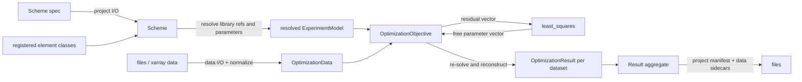

# pyglotaran architecture guide

This document describes the architecture implemented in this repository. It is a guide for deciding where a change belongs. It is not a package inventory. Implementation code is the primary evidence; tests are linked where they make a contract explicit.

## Contents

- [Purpose and scope](#purpose-and-scope)
- [Architectural center of gravity](#architectural-center-of-gravity)
- [Runtime model and ownership](#runtime-model-and-ownership)
- [Main execution paths](#main-execution-paths)
- [Core numerical contracts](#core-numerical-contracts)
- [Extension architecture](#extension-architecture)
- [Persistence and compatibility](#persistence-and-compatibility)
- [Repository map](#repository-map)
- [Change guidance and risks](#change-guidance-and-risks)
- [Before changing X, inspect Y](#before-changing-x-inspect-y)

## Purpose and scope

pyglotaran is the fitting engine for global and target analysis. Its main job is to fit one set of nonlinear parameters across one or more two-dimensional datasets while solving conditionally linear parameters (CLPs), such as spectra or amplitudes, inside each objective evaluation. It also simulates data from the same composable model matrices. The public description and scientific use cases are in [README.md](README.md); the implemented optimization split is visible in [`Optimization.objective_function`](glotaran/optimization/optimization.py) and [`OptimizationObjective.calculate`](glotaran/optimization/objective.py).

The primary abstractions are:

- a declarative `Scheme`, containing a `ModelLibrary` and named `ExperimentModel` objects ([`glotaran/project/scheme.py`](glotaran/project/scheme.py));
- reusable `Element` objects that generate model-matrix columns and element-specific result data ([`glotaran/model/element.py`](glotaran/model/element.py));
- `DataModel` objects that compose elements around one dataset, and `ExperimentModel` objects that group datasets whose CLPs may be linked ([`glotaran/model/data_model.py`](glotaran/model/data_model.py), [`glotaran/model/experiment_model.py`](glotaran/model/experiment_model.py));
- nonlinear `Parameters`, which are resolved into model items before execution and mutated in a private optimization-owned copy during fitting ([`glotaran/model/item.py`](glotaran/model/item.py), [`glotaran/parameter/parameters.py`](glotaran/parameter/parameters.py));
- `OptimizationMatrix`, `OptimizationObjective`, and `Optimization`, which implement matrix composition, residual evaluation, and SciPy least-squares orchestration respectively ([`glotaran/optimization/matrix.py`](glotaran/optimization/matrix.py), [`glotaran/optimization/objective.py`](glotaran/optimization/objective.py), [`glotaran/optimization/optimization.py`](glotaran/optimization/optimization.py));
- structured `OptimizationResult` values per dataset, wrapped with the scheme, parameters, and run information in `Result` ([`glotaran/optimization/objective.py`](glotaran/optimization/objective.py), [`glotaran/project/result.py`](glotaran/project/result.py)).

The project deliberately does not provide a GUI, domain-specific plotting, or a complete experiment-management application. Plotting is advertised as the separate `pyglotaran-extras` package in [README.md](README.md). Preprocessing is a small standalone pipeline, not part of optimization orchestration ([`glotaran/io/preprocessor/pipeline.py`](glotaran/io/preprocessor/pipeline.py)). Dataset acquisition and arbitrary file formats are delegated to I/O plugins. SciPy owns the general nonlinear least-squares algorithm; pyglotaran constructs its residual vector and post-processes its output ([`glotaran/optimization/optimization.py`](glotaran/optimization/optimization.py)).

## Architectural center of gravity

### What is central today

The runtime spine is:

`resolved model + prepared xarray data + optimization-owned Parameters`
→ `OptimizationObjective`
→ `OptimizationMatrix`
→ conditional linear estimation
→ residual vector
→ `scipy.optimize.least_squares`
→ result reconstruction.

`Optimization` is the core orchestration API. It accepts `ExperimentModel` objects, `Parameters`, and a `ModelLibrary` directly. The optimization tests exercise this lower-level API without a `Scheme`, proving that `Scheme` is not required by the numerical core ([`tests/optimization/test_optimization.py`](tests/optimization/test_optimization.py)). `OptimizationObjective` and `OptimizationMatrix` contain most domain-specific execution logic, while `Optimization` handles parameter updates, SciPy configuration, histories, failure behavior, and aggregation ([`glotaran/optimization/optimization.py`](glotaran/optimization/optimization.py)).

### `Scheme`, `Project`, `Model`, and `optimize()`

`Scheme` is the high-level declarative aggregate and workflow facade. `Scheme.from_dict()` constructs the library before data models because element types determine the dynamically composed `DataModel` class. `Scheme.optimize()` loads datasets, creates `Optimization`, calculates parameter errors, and packages `Result` ([`glotaran/project/scheme.py`](glotaran/project/scheme.py)). The end-to-end scheme test confirms this convenience workflow and round-trip serialization ([`tests/project/test_scheme.py`](tests/project/test_scheme.py)). It is important public API, but it is not the numerical center.

There is no current `Project` class. The `glotaran.project` package exports only `Scheme` and `Result` ([`glotaran/project/__init__.py`](glotaran/project/__init__.py)). “Project I/O” names the serializer category for parameters, schemes, and results; it does not imply an in-memory project aggregate ([`glotaran/io/interface.py`](glotaran/io/interface.py)). **Inference:** references to a `Project` abstraction in old documentation or external integrations describe an earlier or broader workflow, not this runtime.

There is also no current monolithic `Model` class. The executable model is composed from `ExperimentModel`, `DataModel`, library elements, item subclasses, and resolved parameters. Some docstrings and type comments still say “Model”; those names are historical and should not be treated as an architectural contract. The empty [`glotaran/model/__init__.py`](glotaran/model/__init__.py) and the concrete composition in [`glotaran/model/data_model.py`](glotaran/model/data_model.py) are stronger evidence.

There is no module-level `optimize()` function. The supported entry points are `Scheme.optimize()` and the `Optimization` class ([`glotaran/project/scheme.py`](glotaran/project/scheme.py), [`glotaran/optimization/__init__.py`](glotaran/optimization/__init__.py)). Conversely, simulation is intentionally a module-level `simulate()` function because it needs one resolved `DataModel`, coordinates, parameters, and either supplied CLPs or global elements; it does not require optimizer state ([`glotaran/simulation/simulation.py`](glotaran/simulation/simulation.py)).

### Plugin registration is a construction boundary

Importing `glotaran` calls `load_plugins()` ([`glotaran/__init__.py`](glotaran/__init__.py)). That function loads the `glotaran.plugins.elements`, `glotaran.plugins.data_io`, and `glotaran.plugins.project_io` entry-point groups. The built-in entry points are declared in [pyproject.toml](pyproject.toml). Registration populates process-global dictionaries for element classes and I/O instances ([`glotaran/plugin_system/base_registry.py`](glotaran/plugin_system/base_registry.py)).

The element registry directly affects schema construction: `ModelLibrary`'s union type is built from registered element classes at import time, and `DataModel.from_dict()` uses the selected library elements to create a dynamic multiple-inheritance Pydantic model ([`glotaran/project/library.py`](glotaran/project/library.py), [`glotaran/model/data_model.py`](glotaran/model/data_model.py)). Plugin availability and import order are therefore part of model construction, not just optional dispatch at the edge.

### Result objects are outputs, not active domain services

`OptimizationResult` owns per-dataset arrays, fit decomposition, element/activation diagnostics, and metadata. Its `fitted_data` is derived from `input_data - residuals` ([`glotaran/optimization/objective.py`](glotaran/optimization/objective.py)). `Result` aggregates these with the scheme, initial and optimized parameters, and `OptimizationInfo`; it delegates persistence to project I/O ([`glotaran/project/result.py`](glotaran/project/result.py)). Neither object participates in objective evaluation. Their custom Pydantic serializers are nevertheless an important persistence boundary.

## Runtime model and ownership

| Object | Owns | Lifecycle and invariants | Main collaborators |
|---|---|---|---|
| `Scheme` | Experiments, model library, optional source path | Declarative after loading, but `optimize()` attaches loaded datasets to nested data models. Extra fields are forbidden. | project I/O, `Optimization`, `Result` |
| `ModelLibrary` | Label → `Element` mapping | Resolves `ExtendableElement.extends` in dependency order; cycles fail. Serialization writes the pre-extension form for round trips. | element registry, `DataModel` |
| `ExperimentModel` | Dataset models, CLP linking/relations/penalties, dataset scales, residual choice | Declarative strings become resolved elements and `Parameter` references in a copied model. Issues are checked before numerical execution. | `ModelLibrary`, `OptimizationObjective` |
| `DataModel` | Dataset reference/runtime data, local/global elements, element scales, weights | Must contain elements. All local elements must agree on model dimension. Global elements switch to the full two-axis/global solve. Runtime `data` is excluded from scheme serialization. | elements, `OptimizationData`, `OptimizationMatrix` |
| `Element` | Domain parameters and matrix/result behavior | `calculate_matrix()` returns CLP labels plus a 2-D or index-dependent 3-D array. `create_result()` returns its diagnostic dataset. Optional flags enforce exclusive/unique composition. | dynamic `DataModel`, matrix/result builders |
| `Parameters` / `Parameter` | Values, bounds, vary flags, expressions, errors | Input parameters are copied selectively into an optimization-owned container as model fields resolve. Only free values are exposed to SciPy; expressions are refreshed after updates. | resolved items, `Optimization` |
| `OptimizationData` | Normalized axes, copied numeric data, weights, slice layout | Requires an xarray dataset with `data` and two dimensions. Normalizes dimension order and applies weights to a copy. | objective, matrix |
| `LinkedOptimizationData` | Aligned slices and mapping back to multiple datasets | Aligns global coordinates by tolerance/method; ambiguous many-to-one alignment fails. Dataset scaling is applied when matrices are linked. | multi-dataset objective |
| `OptimizationMatrix` | Matrix array, CLP labels, constraints | 2-D means index-independent; 3-D means global-index-dependent. Composition must preserve label/column correspondence. Most transform methods mutate the contained array. | elements, estimation |
| `OptimizationObjective` | One resolved experiment and prepared data provider | Rebuilds matrices and solves CLPs on every nonlinear evaluation. It later repeats the solve to construct outputs. | `Optimization`, estimation, result classes |
| `Optimization` | Resolved experiments, private parameters, objectives, run options and histories | One run-oriented mutable object. Updates its private parameter set on every callback. Aggregates experiment outputs by dataset label. | SciPy, `OptimizationInfo` |
| `Result` | Complete user-facing run aggregate | Runtime xarray and model objects become a manifest plus sidecar files when saved. | project/data I/O plugins |

Declarative objects are Pydantic models (`Scheme`, library items, experiment/data models, parameters). Executable objects are ordinary Python orchestration/data classes (`Optimization`, `OptimizationObjective`, `OptimizationData`, `OptimizationMatrix`, `OptimizationEstimation`). Resolution in [`ExperimentModel.resolve`](glotaran/model/experiment_model.py) and [`resolve_data_model`](glotaran/model/data_model.py) is the boundary between them.

## Main execution paths



### Construction and loading

1. Import-time plugin discovery loads entry-point modules; decorators or `Element.__init_subclass__` register implementations ([`glotaran/plugin_system/base_registry.py`](glotaran/plugin_system/base_registry.py), [`glotaran/model/element.py`](glotaran/model/element.py)).
2. Project I/O selects a plugin by an explicit format or file extension. YAML sanitizes scalar values and calls `Scheme.from_dict()` ([`glotaran/plugin_system/project_io_registration.py`](glotaran/plugin_system/project_io_registration.py), [`glotaran/builtin/io/yml/yml.py`](glotaran/builtin/io/yml/yml.py)).
3. `ModelLibrary.from_dict()` discriminates element subclasses by their `type`. It resolves inheritance-like `extends` chains. `ExperimentModel.from_dict()` then creates each data model using the library's concrete element classes ([`glotaran/project/library.py`](glotaran/project/library.py), [`glotaran/model/experiment_model.py`](glotaran/model/experiment_model.py)).
4. A dataset in a scheme may be a path, an in-memory xarray object, or absent until `Scheme.optimize()`. Dataset I/O returns xarray and records `source_path` and `io_plugin_name`; the scheme loader replaces string data references with loaded datasets ([`glotaran/project/scheme.py`](glotaran/project/scheme.py), [`glotaran/plugin_system/data_io_registration.py`](glotaran/plugin_system/data_io_registration.py)).

Ownership changes at this boundary: persisted mappings become typed Pydantic objects; the `ModelLibrary` owns element instances; each `DataModel` owns a reference to input xarray data during execution.

### Validation and resolution

`Optimization.__init__()` creates an empty private `Parameters`, resolves every experiment against the library and initial parameters, then checks item issues ([`glotaran/optimization/optimization.py`](glotaran/optimization/optimization.py)). Resolution replaces element labels with element instances and parameter-label strings with copied `Parameter` objects in the private set ([`glotaran/model/item.py`](glotaran/model/item.py)). This makes the resolved model executable and ensures one shared `Parameter` object is used wherever the same label appears.

Pydantic validates shapes and discriminated item types during construction. Domain checks are separate: missing parameter labels, exclusive/unique elements, element agreement, and cyclic extension errors come from model-specific validation paths ([`glotaran/model/data_model.py`](glotaran/model/data_model.py), [`glotaran/model/errors.py`](glotaran/model/errors.py)). Do not move all validation into file loading; programmatic construction and direct `Optimization` use must behave the same.

### Optimization and result creation

For each nonlinear parameter vector, `Optimization.objective_function()` updates free parameters and concatenates each experiment objective. Each objective prepares model matrices, applies relations/constraints, solves CLPs, and returns data residuals plus optional CLP penalties. SciPy controls iteration and termination ([`glotaran/optimization/optimization.py`](glotaran/optimization/optimization.py), [`glotaran/optimization/objective.py`](glotaran/optimization/objective.py)).

After termination, `Optimization.run()` evaluates objectives again, calls `get_result()`, merges per-experiment dataset maps, computes counts and histories, and returns optimized parameters, dataset results, and `OptimizationInfo`. `Scheme.optimize()` then calculates parameter errors and wraps them in `Result` ([`glotaran/optimization/info.py`](glotaran/optimization/info.py), [`glotaran/project/scheme.py`](glotaran/project/scheme.py)). A dry run follows the same construction and result path without calling SciPy.

Dataset result reconstruction restores original orientation and attributes, unweights residuals, optionally adds SVD data, creates per-element result datasets, invokes dynamic `DataModel.create_result()` hooks, and records dimensions/RMSE/scale metadata ([`glotaran/optimization/objective.py`](glotaran/optimization/objective.py)).

### Simulation

`simulate()` resolves one `DataModel`, infers its two axes, builds the local model matrix, obtains CLPs either from the caller or a global-element matrix, and multiplies one global slice at a time. Optional Gaussian noise is applied last ([`glotaran/simulation/simulation.py`](glotaran/simulation/simulation.py)). Simulation returns only an xarray dataset; it does not create `Result`, optimization histories, or parameter errors.

### Persistence

`Result.save()` delegates to the selected `ProjectIoInterface`. The YAML implementation writes a manifest and uses Pydantic serialization context to write the scheme, parameters, histories, input/residual/element arrays, and fit decomposition into sidecar files ([`glotaran/project/result.py`](glotaran/project/result.py), [`glotaran/builtin/io/yml/yml.py`](glotaran/builtin/io/yml/yml.py)). Loading reverses this through field validators with a `save_folder` context. Tests verify both full and minimal round trips ([`tests/project/test_result.py`](tests/project/test_result.py), [`tests/optimization/test_objective.py`](tests/optimization/test_objective.py)).

## Core numerical contracts

### Optimization orchestration

Source: [`glotaran/optimization/optimization.py`](glotaran/optimization/optimization.py).

```text
INPUT: experiment models, initial parameters, model library, least-squares options
OUTPUT: optimized parameters, results by dataset label, optimization information

private_parameters := empty set
resolved_models := resolve every model against library and initial parameters,
                   copying referenced parameters into private_parameters
reject collected model issues
objectives := one objective per resolved experiment
free_labels, x0, lower, upper := varying parameter arrays

residual(x):
    update private_parameters[free_labels] from optimizer coordinates x
    return concatenate(objective.calculate() for every objective)

run SciPy least_squares(residual, x0, bounds, tolerances, method)
evaluate every objective once more with final parameter state
reconstruct and merge per-dataset results
build OptimizationInfo from SciPy output, residuals, histories, and CLP counts
return private_parameters, results, info

INVARIANTS:
- optimizer coordinates contain varying parameters only;
- model items and callback updates refer to the same private Parameter objects;
- the objective returned to SciPy is one flat numeric vector;
- dataset labels must be unique across experiments for lossless final merging.
```

The last invariant follows from the `ChainMap` merge and its adjacent TODO; uniqueness is not currently enforced. This is an explicit inference from implementation.

### Matrix construction and conditional linear estimation

Sources: [`glotaran/optimization/matrix.py`](glotaran/optimization/matrix.py), [`glotaran/optimization/objective.py`](glotaran/optimization/objective.py), [`glotaran/optimization/variable_projection.py`](glotaran/optimization/variable_projection.py), and [`glotaran/optimization/nnls.py`](glotaran/optimization/nnls.py).

```text
INPUT: resolved DataModel, model/global axes, weighted data slices
OUTPUT: flat residual vector and, when needed, recovered CLPs

for each element in the data model:
    labels, element_matrix := element.calculate_matrix(model, axes)
    apply element scale
combine matrices by CLP label, adding columns with the same label
apply data weights

for each aligned global coordinate:
    select index-dependent matrix slice
    if datasets are linked: stack participating dataset matrices by rows and apply dataset scales
    reduce columns using active CLP relations and constraints
    clp_reduced, residual := selected residual solver(reduced_matrix, data_slice)
    append residual
    if CLP penalties need full values:
        expand reduced CLPs and reconstruct relation targets
        append calculated CLP penalties
return concatenate(all residuals and penalties)

INVARIANTS:
- a matrix column and its CLP label never separate;
- rows align with the data slice after weighting/linking;
- relations remove dependent target columns before solving and restore their CLP values later;
- index-dependent matrices have shape (global, model, clp), otherwise (model, clp).
```

Variable projection uses LAPACK QR factorization: transform the data by `Qᵀ`, triangular-solve the leading block for CLPs, zero that projected component, then transform back by `Q` to obtain a residual orthogonal to the model column space ([`glotaran/optimization/variable_projection.py`](glotaran/optimization/variable_projection.py)). The alternative NNLS solver imposes non-negative CLPs ([`glotaran/optimization/nnls.py`](glotaran/optimization/nnls.py)). `ExperimentModel.residual_function` selects between these names; it is not presently a plugin registry ([`glotaran/model/experiment_model.py`](glotaran/model/experiment_model.py), [`glotaran/optimization/estimation.py`](glotaran/optimization/estimation.py)).

Global models are a distinct path: local and global matrices are combined with Kronecker products, the entire weighted dataset is flattened, and one conditional solve produces a two-axis CLP tensor ([`OptimizationMatrix.from_global_data`](glotaran/optimization/matrix.py), [`OptimizationObjective.calculate_global_penalty`](glotaran/optimization/objective.py)). Index-dependent global matrices are explicitly unsupported.

## Extension architecture

### Add a model component

1. Implement an `Element` subclass, normally under `glotaran/builtin/elements/<name>/` for a built-in or in an external distribution. Define a unique `register_as`, `dimension`, Pydantic fields, `calculate_matrix()`, and `create_result()` ([`glotaran/model/element.py`](glotaran/model/element.py)).
2. If it adds dataset-level fields or diagnostics, define a `DataModel` subclass and assign it to `data_model_type`; implement its `create_result()` as needed. Dynamic composition will include it ([`glotaran/model/data_model.py`](glotaran/model/data_model.py)).
3. For an external plugin, expose a module in the `glotaran.plugins.elements` entry-point group. For a built-in, add the entry point in [pyproject.toml](pyproject.toml).
4. Test registration/schema and direct matrix/result contracts, then add composition and optimization tests. Existing patterns are in [`tests/builtin/elements/`](tests/builtin/elements), [`tests/model/test_data_model.py`](tests/model/test_data_model.py), and [`tests/optimization/test_matrix.py`](tests/optimization/test_matrix.py).

Do not add an element-specific branch to the optimizer. The element contract is model-matrix generation plus result interpretation.

### Add a residual or optimization algorithm

Residual algorithms are currently a closed mapping, not entry-point plugins. Add the numerical function, register it in `SUPPORTED_RESIDUAL_FUNCTIONS`, widen the `Literal` fields on both `DataModel` and `ExperimentModel`, and test the estimation and end-to-end objective paths ([`glotaran/optimization/estimation.py`](glotaran/optimization/estimation.py), [`glotaran/model/data_model.py`](glotaran/model/data_model.py), [`glotaran/model/experiment_model.py`](glotaran/model/experiment_model.py), [`tests/optimization/test_estimation.py`](tests/optimization/test_estimation.py)). Preserve the `(clp, residual)` contract and compatible row/column conventions.

Nonlinear methods are likewise a closed mapping from public names to SciPy method codes in `SUPPORTED_OPTIMIZATION_METHODS`. Add a name there, widen `Scheme.optimize()`'s `Literal`, and test bounds/tolerance/error behavior in [`tests/optimization/test_optimization.py`](tests/optimization/test_optimization.py). A fundamentally different optimizer belongs behind a new orchestration abstraction or class, not inside `Element` or I/O code. **Recommendation:** introduce a registry only if third-party algorithm extension is an actual requirement; it does not exist today.

### Add a file format or serializer

- Dataset formats implement `DataIoInterface`, use `@register_data_io(name)`, and expose an entry point in `glotaran.plugins.data_io` ([`glotaran/io/interface.py`](glotaran/io/interface.py), [`glotaran/plugin_system/data_io_registration.py`](glotaran/plugin_system/data_io_registration.py)). Test load/save, source metadata, explicit selection, extension inference, and registry conflicts using [`tests/plugin_system/test_data_io_registration.py`](tests/plugin_system/test_data_io_registration.py).
- Parameter/scheme/result formats implement the relevant `ProjectIoInterface` methods, use `@register_project_io`, and expose `glotaran.plugins.project_io` ([`glotaran/plugin_system/project_io_registration.py`](glotaran/plugin_system/project_io_registration.py)). An implementation may support only some methods; unsupported base methods are converted to user-facing errors. Test the support table and dispatch in [`tests/plugin_system/test_project_io_registration.py`](tests/plugin_system/test_project_io_registration.py).
- A new result serializer must honor overwrite protection, `SavingOptions`, relative paths, and round-trip loading. Use the YAML manifest/sidecar implementation and result serialization tests as the contract, not only the abstract base class ([`glotaran/builtin/io/yml/yml.py`](glotaran/builtin/io/yml/yml.py), [`tests/project/test_result.py`](tests/project/test_result.py)).

### Add a result diagnostic

If the diagnostic is inherent to an element, add it in `Element.create_result()` and return named xarray variables. If it depends on fields contributed by an element family, use the associated `DataModel.create_result()` hook; those outputs become `OptimizationResult.activations` ([`OptimizationObjective.create_element_results`](glotaran/optimization/objective.py), [`OptimizationObjective.create_data_model_results`](glotaran/optimization/objective.py)). If it is generic run metadata, extend `OptimizationResultMetaData` or `OptimizationInfo` and update their serialization tests. If it is optional presentation or plotting, keep it outside the fitting engine; `pyglotaran-extras` is the established boundary.

### Add a preprocessing step

The preprocessing pipeline is not plugin-driven. Add a `PreProcessor` subclass, include it in the discriminated `PipelineAction` union, and normally add a chainable method that returns a new pipeline ([`glotaran/io/preprocessor/preprocessor.py`](glotaran/io/preprocessor/preprocessor.py), [`glotaran/io/preprocessor/pipeline.py`](glotaran/io/preprocessor/pipeline.py)). Test action order, immutability of the original input, and serialization in [`tests/io/preprocessor/test_preprocessor.py`](tests/io/preprocessor/test_preprocessor.py). Keep preprocessing explicit; optimization currently does not call this pipeline.

### Add a high-level workflow helper

Place a helper next to the aggregate it coordinates: scheme construction/fit workflows in `glotaran/project`, simulation workflows in `glotaran/simulation`, and dataset normalization in `glotaran/io`. Build it from public lower-level contracts rather than teaching `OptimizationObjective` about files or user workflow state. A helper that only sequences load → optimize → save should remain optional and must not become a dependency of the numerical core.

## Persistence and compatibility

Built-in dataset formats are NetCDF (`nc`, load/save), legacy explicit ASCII (`ascii`, load/save), and SDT (`sdt`, load only), as declared by entry points and implementations in [pyproject.toml](pyproject.toml) and [`glotaran/builtin/io/`](glotaran/builtin/io). Project formats are YAML/YAML string for parameters and schemes, YAML for result manifests, plus CSV, TSV, XLSX, and ODS for parameters ([`glotaran/builtin/io/yml/yml.py`](glotaran/builtin/io/yml/yml.py), [`glotaran/builtin/io/pandas/`](glotaran/builtin/io/pandas)). A registered format name does not imply that every interface method is supported.

Scheme persistence contains the library and experiments, but excludes runtime `DataModel.data` and `source_path`. Data paths are represented separately where present. `ExtendableElement` instances serialize their original declaration rather than their merged runtime form ([`glotaran/project/library.py`](glotaran/project/library.py)). Thus persisted declarative state intentionally differs from resolved runtime state: element labels become objects, parameter labels become shared `Parameter` objects, extended elements are merged, and xarray data is attached only at runtime.

Result persistence is a manifest plus files, not one self-contained Pydantic document. Default saves use YAML for the manifest/scheme, CSV for parameters and histories, and NetCDF for arrays. `SavingOptions` can change formats or omit result arrays; a minimal save may point back to the original input file and may load with `residuals=None` ([`glotaran/io/interface.py`](glotaran/io/interface.py), [`glotaran/optimization/objective.py`](glotaran/optimization/objective.py)). Full plugin names may be persisted with input paths to disambiguate third-party loaders.

There is no persisted scheme or result schema-version field and no migration layer in the load path. `OptimizationInfo.glotaran_version` records the producing library version, but its validator explicitly tolerates/removes the serialized computed field rather than performing migration ([`glotaran/optimization/info.py`](glotaran/optimization/info.py)). **Inference:** compatibility is structural and test-based, not guaranteed by an explicit versioned persistence protocol. Renaming Pydantic fields, discriminator values, element registration names, result variables, or default formats is therefore a compatibility change even when Python APIs still type-check.

Pydantic uses `extra="forbid"` on important aggregates and items, so unknown persisted fields generally fail rather than being silently ignored ([`glotaran/project/scheme.py`](glotaran/project/scheme.py), [`glotaran/model/item.py`](glotaran/model/item.py)). The project also has explicit deprecation helpers for Python API moves, but these do not migrate saved files ([`glotaran/deprecation/deprecation_utils.py`](glotaran/deprecation/deprecation_utils.py)).

## Repository map

- [`glotaran/project/`](glotaran/project): user-facing aggregates. `Scheme` coordinates a fit; `Result` is the complete output and persistence facade; `ModelLibrary` resolves reusable elements.
- [`glotaran/model/`](glotaran/model): declarative domain contracts and resolution. This is where element composition, typed items, CLP relations/constraints/penalties, weights, and model issues belong.
- [`glotaran/parameter/`](glotaran/parameter): nonlinear parameter values, bounds, expressions, transformation to optimizer arrays, and histories.
- [`glotaran/optimization/`](glotaran/optimization): executable numerical core. Data normalization/linking, matrix algebra, conditional solvers, objective construction, SciPy orchestration, histories, diagnostics, and per-dataset result assembly live here.
- [`glotaran/simulation/`](glotaran/simulation): forward evaluation of resolved model matrices without fitting.
- [`glotaran/plugin_system/`](glotaran/plugin_system): process-global registries, entry-point discovery, collision handling, format inference, and public plugin dispatch.
- [`glotaran/io/`](glotaran/io): stable I/O interfaces and convenience functions, dataset preparation, and the standalone preprocessing pipeline. It should not contain scientific model logic.
- [`glotaran/builtin/elements/`](glotaran/builtin/elements): built-in scientific matrix generators and their result interpretation.
- [`glotaran/builtin/items/`](glotaran/builtin/items): reusable typed model items and data-model extensions that are not independently registered elements.
- [`glotaran/builtin/io/`](glotaran/builtin/io): built-in implementations of dataset and project I/O contracts.
- [`glotaran/utils/json_schema.py`](glotaran/utils/json_schema.py): editor-facing JSON Schema assembled from the runtime element/data-model type system. It is a consumer of plugin registration and dynamic models.
- [`tests/optimization/`](tests/optimization): strongest executable evidence for the core API and numerical invariants; [`tests/project/`](tests/project) covers convenience workflows and persistence; [`tests/plugin_system/`](tests/plugin_system) covers registry and dispatch behavior.
- [pyproject.toml](pyproject.toml): packaging, supported Python/dependency range, and built-in plugin entry points. It is part of the extension architecture.

## Change guidance and risks

### Dependency direction

Keep these directions:

- project workflows may depend on model, optimization, parameters, and I/O;
- optimization may depend on resolved model contracts and parameters, but not on project persistence or concrete built-in element types;
- elements may depend on model contracts and numerical helpers, but should communicate through matrices/results rather than call orchestration;
- I/O may construct public domain objects, but numerical code must not select file formats;
- diagnostics produced during fitting may use xarray, but plotting and presentation should remain outside the engine.

Do not make plugin implementations import registry internals. Use registration decorators and public lookup/selection functions. Do not make the core optimizer depend on `Scheme`; direct `Optimization` construction is tested and useful.

### Important risks

- **Global mutable registries.** Registries live for the process and tests must isolate modifications. Conflicts retain both fully qualified keys, warn, and leave short-name selection dependent on registration history until explicitly pinned with `set_*_plugin` ([`glotaran/plugin_system/base_registry.py`](glotaran/plugin_system/base_registry.py), [`tests/plugin_system/test_base_registry.py`](tests/plugin_system/test_base_registry.py)).
- **Import/type construction order.** `ModelLibrary`'s element union and dynamic data models depend on registered classes. Late registration after relevant Pydantic schemas/types are built can produce stale unions or schema caches. Test fresh-process import behavior for plugin changes.
- **In-place numeric mutation.** `OptimizationMatrix.weight()` and `.scale()` mutate arrays; `Scheme._load_data()` mutates nested data models; `Result.save()` and I/O convenience functions may update `source_path`. Avoid reusing these objects across concurrent runs without copying ([`glotaran/optimization/matrix.py`](glotaran/optimization/matrix.py), [`glotaran/project/scheme.py`](glotaran/project/scheme.py)).
- **Shared parameter identity.** Resolution deliberately reuses parameters by label. Deep-copying resolved items independently can break coordinated updates; mutating input parameters instead would break the tested distinction between initial and optimized values ([`tests/optimization/test_optimization.py`](tests/optimization/test_optimization.py)).
- **Dataset-label collisions.** Results from multiple experiments are flattened into one dictionary with `ChainMap`; equal labels can be lost. Until validation is added, callers and new workflows should enforce unique labels.
- **CLP-label ordering.** Matrix composition, relations, constraints, amplitudes, and result diagnostics all rely on label/column alignment. `combine()` currently obtains its union through a set, so do not assume stable order beyond label-based selection ([`glotaran/optimization/matrix.py`](glotaran/optimization/matrix.py)).
- **Axis and flattening conventions.** Optimization normalizes to `(model, global)`, while global fitting transposes/flattens and uses Kronecker products. A plausible transpose can pass shape checks but change the fitted meaning. Cover both orientations and global/local paths.
- **Persistence is coupled to field and variable names.** Result serializers dispatch by Pydantic field name and fixed directory layout. Changes require full/minimal round-trip tests and old-fixture tests if compatibility is promised.
- **Plugin short-name collisions.** Registration order can vary across installed distributions. Persist or configure fully qualified plugin names where reproducibility matters.
- **Error suppression policy.** By default `Optimization.run()` warns and returns an unsuccessful result after exceptions; `raise_exception=True` is needed for debugging/tests. New failures must preserve this user-visible distinction ([`glotaran/optimization/optimization.py`](glotaran/optimization/optimization.py)).
- **No thread-safety contract.** **Inference:** process-global registries and mutable run objects make concurrent mutation unsafe. Independent fits should use separate scheme/optimization instances and avoid changing plugin selection while work is running.

### Testing expectations

For model changes, test the element in isolation, dynamic `DataModel` composition, matrix shape/labels, simulation, optimization, and result variables. For numerical changes, cover index-dependent and independent matrices, weights, relations/constraints, linked datasets, global models, failure behavior, and dry runs. For I/O changes, cover explicit and inferred formats, overwrite protection, source metadata, third-party plugin names, and full/minimal round trips. For public schema changes, regenerate/test JSON Schema and add a persisted fixture if backward compatibility is intended.

## Before changing X, inspect Y

| Before changing… | Inspect… |
|---|---|
| scheme fields or loading | [`Scheme.from_dict`](glotaran/project/scheme.py), YAML loading, dynamic `DataModel.from_dict`, scheme round-trip tests |
| element fields or `type` names | element registration, `ModelLibrary`, JSON Schema generation, built-in element tests, saved YAML examples |
| parameter resolution | [`resolve_item_parameters`](glotaran/model/item.py), `Parameters` array conversion, expression/dependency tests, optimization identity behavior |
| matrix shapes or axis order | `OptimizationData`, every `OptimizationMatrix` constructor/transform, simulation, linked/global objective tests |
| residual calculation | `OptimizationObjective.calculate`, matrix reduction, both conditional solvers, CLP penalty tests |
| optimizer configuration | `Optimization.run`, `Scheme.optimize`, `OptimizationInfo`, failure and method tests |
| result fields or diagnostics | all `OptimizationObjective.create_*result*` methods, `OptimizationResult` serializers, full/minimal persistence tests |
| plugin discovery or names | [pyproject.toml](pyproject.toml), `load_plugins`, collision/pinning tests, JSON Schema cache behavior |
| file formats | both I/O interfaces, dispatch/inference helpers, overwrite rules, source-path metadata, format-specific tests |
| preprocessing | `PreProcessingPipeline`, its closed action union, and the fact that no optimization path invokes it |

