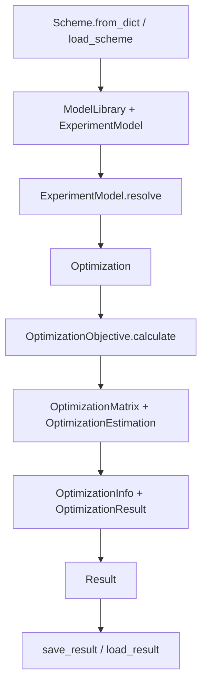

# pyglotaran architecture guide

This document is based on implementation in the repository, not on directory names or a generic package inventory. The primary evidence comes from [glotaran/project/scheme.py](glotaran/project/scheme.py), [glotaran/optimization/optimization.py](glotaran/optimization/optimization.py), [glotaran/optimization/objective.py](glotaran/optimization/objective.py), [glotaran/model/experiment_model.py](glotaran/model/experiment_model.py), [glotaran/model/data_model.py](glotaran/model/data_model.py), [glotaran/plugin_system](glotaran/plugin_system), and the behavior covered in [tests/project/test_scheme.py](tests/project/test_scheme.py), [tests/optimization/test_objective.py](tests/optimization/test_objective.py), and [tests/builtin/io/yml/test_yml.py](tests/builtin/io/yml/test_yml.py).

## Table of contents

1. [System purpose and scope](#system-purpose-and-scope)
2. [Architectural center of gravity](#architectural-center-of-gravity)
3. [Main execution paths](#main-execution-paths)
4. [Core concepts and boundaries](#core-concepts-and-boundaries)
5. [Extension architecture](#extension-architecture)
6. [Persistence and compatibility](#persistence-and-compatibility)
7. [Repository map](#repository-map)
8. [Change guidance and risks](#change-guidance-and-risks)
9. [Before changing X, inspect Y](#before-changing-x-inspect-y)

## System purpose and scope

pyglotaran is a fitting engine for global and target analysis. Its main job is to take a declared analysis specification, a parameter set, and one or more datasets, then estimate parameters that make a model fit the data. The project is centered on scientific modeling workflows, not on UI, plotting, or general-purpose data science pipelines.

The core problem it solves is:

- define a model as a library of reusable elements,
- bind those elements to datasets in an experiment specification,
- optimize the free parameters against data,
- store the fit, diagnostics, and intermediate artifacts as a result object.

The project is intentionally not responsible for:

- a graphical user interface,
- general-purpose database or service hosting,
- arbitrary machine-learning pipelines,
- plotting or report generation as a first-class runtime feature,
- domain-specific workflows outside the fitting and serialization contract.

The repository’s public surface is mostly a Python library plus CLI entry points declared in [pyproject.toml](pyproject.toml). The runtime contract is driven by data objects such as `Scheme`, `Parameters`, `OptimizationResult`, and `Result`.

## Architectural center of gravity

The true runtime spine is not a high-level convenience class such as `Project`. There is no runtime class named `Project` in the repository. The practical spine is:

`Scheme -> ExperimentModel -> Optimization -> OptimizationObjective -> OptimizationResult -> Result`

### What each object really does

- `Scheme` is the main orchestration object for a workflow. It owns the model library and the experiments, loads datasets into the experiments, and exposes `optimize()`. See [glotaran/project/scheme.py](glotaran/project/scheme.py).
- `Model` is not a single central class. The repository uses `DataModel` for dataset-level composition and `ExperimentModel` for the collection of datasets and experiment-level settings. The model library itself is represented by `ModelLibrary` in [glotaran/project/library.py](glotaran/project/library.py).
- `optimize()` on `Scheme` is a workflow convenience method, not the numerical core. It wires together data loading, optimization object construction, parameter error calculation, and result creation.
- `Plugin registration` is a structural backbone. The package does not hard-code every model element or I/O plugin. Instead, it uses entry-point discovery and registries in [glotaran/plugin_system/base_registry.py](glotaran/plugin_system/base_registry.py), [glotaran/plugin_system/element_registration.py](glotaran/plugin_system/element_registration.py), [glotaran/plugin_system/data_io_registration.py](glotaran/plugin_system/data_io_registration.py), and [glotaran/plugin_system/project_io_registration.py](glotaran/plugin_system/project_io_registration.py).
- `Result` is the durable outcome object. It contains the optimized parameters, the optimization info, the scheme, and one `OptimizationResult` per dataset. It is the object used for persistence and round-trip serialization. See [glotaran/project/result.py](glotaran/project/result.py).

### Why this matters

If a change is needed, the most likely place is not the top-level package root. It is one of these layers:

1. declarative model/spec layer: `Scheme`, `ModelLibrary`, `ExperimentModel`, `DataModel`, `Element`,
2. execution layer: `Optimization`, `OptimizationObjective`, `OptimizationMatrix`, `OptimizationEstimation`,
3. persistence layer: project I/O and data I/O plugins,
4. public convenience layer: `Scheme.optimize()`, `load_scheme()`, `save_result()`.

## Main execution paths

### 1. Construction and loading

A scheme is usually built from a dictionary or a YAML/JSON-based project file.

- `Scheme.from_dict()` converts a declarative spec into a `ModelLibrary` and `ExperimentModel` objects. It also resolves dataset paths into actual datasets if the values are strings. See [glotaran/project/scheme.py](glotaran/project/scheme.py).
- `ExperimentModel.from_dict()` creates `DataModel` objects from the experiment definition. See [glotaran/model/experiment_model.py](glotaran/model/experiment_model.py).
- `DataModel.from_dict()` uses the model library to resolve element labels into concrete element classes and creates a dynamic subclass for the dataset model. See [glotaran/model/data_model.py](glotaran/model/data_model.py).
- `load_scheme()` and `load_result()` are plugin-based entry points that delegate to implementation classes registered in [glotaran/plugin_system/project_io_registration.py](glotaran/plugin_system/project_io_registration.py).

### 2. Validation and resolution

Before optimization, the model must be resolved into a runtime form.

- `ExperimentModel.resolve()` replaces parameter references and element labels with concrete runtime objects. It resolves item parameters, clp penalties, clp relations, and scales. See [glotaran/model/experiment_model.py](glotaran/model/experiment_model.py).
- `Optimization.__init__()` resolves each experiment against the provided `Parameters`, checks for issues, and builds one `OptimizationObjective` per experiment. See [glotaran/optimization/optimization.py](glotaran/optimization/optimization.py).

### 3. Model composition and matrix generation

The fit is built from element matrices.

- `OptimizationObjective` uses `OptimizationData` or `LinkedOptimizationData` to represent the data slice and its global/model axes.
- `OptimizationMatrix.from_data_model()` asks each element to compute a model matrix through `Element.calculate_matrix()`. See [glotaran/model/element.py](glotaran/model/element.py) and [glotaran/optimization/matrix.py](glotaran/optimization/matrix.py).
- Relations and penalties are applied in `OptimizationMatrix.reduce()` and `calculate_clp_penalties()`.

### 4. Optimization

The numerical driver is SciPy least-squares.

- `Optimization.run()` calls `scipy.optimize.least_squares` on the objective function. The objective function updates the free parameter values and concatenates residual vectors from each objective. See [glotaran/optimization/optimization.py](glotaran/optimization/optimization.py).
- `OptimizationInfo.from_least_squares_result()` converts the optimizer output into structured diagnostics. See [glotaran/optimization/info.py](glotaran/optimization/info.py).

### 5. Result creation and persistence

After optimization, each objective produces an `OptimizationResult` and these are collected into a top-level `Result`.

- `OptimizationObjective.get_result()` builds datasets for residuals, fitted data, matrix decomposition, and element/activation results. See [glotaran/optimization/objective.py](glotaran/optimization/objective.py).
- `Result.save()` delegates to the project I/O layer. The YAML plugin writes the result spec plus linked data files. See [glotaran/builtin/io/yml/yml.py](glotaran/builtin/io/yml/yml.py).

### Control-flow diagram



### Core algorithm sketches

#### Optimization orchestration

```text
input: scheme, parameters, datasets, optimizer settings
output: Result

1. attach datasets to each experiment
2. resolve all experiments against the library and parameter state
3. validate model issues
4. construct one OptimizationObjective per experiment
5. run least_squares over the concatenated residual vector
6. compute diagnostics from the optimizer result
7. build OptimizationResult objects per dataset
8. wrap them in Result
```

Source: [glotaran/project/scheme.py](glotaran/project/scheme.py), [glotaran/optimization/optimization.py](glotaran/optimization/optimization.py).

#### Objective construction and residual assembly

```text
input: one ExperimentModel, parameter state
output: residual vector and result datasets

1. build OptimizationData from the experiment model
2. build model matrices for each global/model slice
3. reduce matrices with clp relations and constraints
4. estimate clp values and residuals using the selected residual function
5. apply clp penalties if configured
6. create result datasets for each element and data model
7. return residual vector plus result objects
```

Source: [glotaran/optimization/objective.py](glotaran/optimization/objective.py), [glotaran/optimization/estimation.py](glotaran/optimization/estimation.py).

#### Variable projection residual solver

```text
input: matrix A, data y
output: clp c, residual r

1. compute QR decomposition of A
2. solve for c using the triangular system
3. zero the appropriate entries in the temporary vector
4. form the residual from the orthogonal complement
5. return c and r
```

Source: [glotaran/optimization/variable_projection.py](glotaran/optimization/variable_projection.py).

## Core concepts and boundaries

### Declarative specifications

These objects describe what the user wants the model to be:

- `Scheme`: the top-level analysis specification with a library and experiments.
- `ModelLibrary`: a registry of reusable element definitions keyed by label.
- `ExperimentModel`: experiment-level settings and datasets.
- `DataModel`: dataset-level composition of elements and data source.
- `Element`: a model component implementation with a declared `type` and plugin registration.
- `Parameters`: the parameter set, including bounds, expressions, and constraints.

These are mostly declarative and serializable.

### Runtime objects

These objects hold the executable state after resolution:

- `Optimization`: the outer solver loop.
- `OptimizationObjective`: the per-experiment residual and result builder.
- `OptimizationMatrix`: a matrix container that knows about clp labels and constraints.
- `OptimizationEstimation`: the output of solving a matrix/data problem.
- `OptimizationResult`: one per dataset, containing model outputs and fit decomposition.
- `Result`: the persisted workflow result.

### Boundary between layers

- Orchestration: `Scheme`, `Optimization`, `Result`.
- Model logic: `Element.calculate_matrix()`, `Element.create_result()`, `DataModel` composition rules.
- Numerical algorithms: `OptimizationMatrix`, `OptimizationEstimation`, variable projection, NNLS.
- I/O: data and project I/O plugin interfaces, the built-in YAML/NetCDF plugins.
- Diagnostics: `OptimizationInfo`, parameter history, residual metrics, and result metadata.

A useful rule is that the numerical layer should not depend on the persistence layer, and the persistence layer should not contain model semantics. The current code is mostly consistent with that boundary.

## Extension architecture

### Plugin discovery and registration

The repository uses lightweight plugin registries that are populated at import time. The root package imports [glotaran/__init__.py](glotaran/__init__.py), which calls `load_plugins()`. The registry logic is in [glotaran/plugin_system/base_registry.py](glotaran/plugin_system/base_registry.py).

The built-in plugins are declared in [pyproject.toml](pyproject.toml) under the `entry-points` section. This is the main extension mechanism for:

- model elements,
- data I/O,
- project I/O.

### Adding a model component

Minimal change:

1. Implement a subclass of `Element` in a new module under [glotaran/builtin/elements](glotaran/builtin/elements).
2. Set `register_as` to a short name and, if needed, set `data_model_type` to the data model class that the element works with.
3. Implement `calculate_matrix()` and `create_result()`.
4. Register the new module as an entry point in [pyproject.toml](pyproject.toml).
5. Add tests under [tests/builtin/elements](tests/builtin/elements) and [tests/optimization](tests/optimization).

Relevant contracts:

- [glotaran/model/element.py](glotaran/model/element.py)
- [glotaran/model/data_model.py](glotaran/model/data_model.py)
- [glotaran/optimization/matrix.py](glotaran/optimization/matrix.py)

### Adding a residual or optimization algorithm

Minimal change:

1. Add a new residual function in [glotaran/optimization/estimation.py](glotaran/optimization/estimation.py) or a new module under [glotaran/optimization](glotaran/optimization).
2. Extend the `SUPPORTED_RESIDUAL_FUNCTIONS` map and the accepted literal values.
3. Ensure the function returns the same contract as the existing residual functions: `clp, residual`.
4. Add coverage in [tests/optimization](tests/optimization).

Relevant contracts:

- [glotaran/optimization/estimation.py](glotaran/optimization/estimation.py)
- [glotaran/optimization/variable_projection.py](glotaran/optimization/variable_projection.py)
- [glotaran/optimization/nnls.py](glotaran/optimization/nnls.py)

### Adding a file format or serializer

Minimal change:

1. Implement a subclass of `DataIoInterface` or `ProjectIoInterface`.
2. Register it with the relevant decorator from [glotaran/plugin_system/data_io_registration.py](glotaran/plugin_system/data_io_registration.py) or [glotaran/plugin_system/project_io_registration.py](glotaran/plugin_system/project_io_registration.py).
3. Add the entry point in [pyproject.toml](pyproject.toml).
4. Add tests for load/save behavior and round trips.

Relevant contracts:

- [glotaran/io/interface.py](glotaran/io/interface.py)
- [glotaran/builtin/io/yml/yml.py](glotaran/builtin/io/yml/yml.py)
- [glotaran/builtin/io/netCDF/netCDF.py](glotaran/builtin/io/netCDF/netCDF.py)

### Adding a result diagnostic

There is no generic result-diagnostic plugin interface in the current code. Diagnostics are currently embedded in `OptimizationInfo`, `OptimizationResultMetaData`, and the result datasets themselves. A new diagnostic should therefore be added as a first-class field or computed value in the existing result objects, then included in serialization, rather than as a separate extension plugin.

Relevant files:

- [glotaran/optimization/objective.py](glotaran/optimization/objective.py)
- [glotaran/optimization/info.py](glotaran/optimization/info.py)
- [glotaran/project/result.py](glotaran/project/result.py)

### Adding a preprocessing step

The repository already has a preprocessing pipeline abstraction. Minimal change:

1. Implement a new subclass of `PreProcessor` in [glotaran/io/preprocessor/preprocessor.py](glotaran/io/preprocessor/preprocessor.py).
2. Extend the discriminated pipeline action union if a new action type is needed in [glotaran/io/preprocessor/pipeline.py](glotaran/io/preprocessor/pipeline.py).
3. Add tests under [tests/io/preprocessor](tests/io/preprocessor).

### Adding a high-level workflow helper

There is no separate `Project` class to extend. A new workflow helper should be a thin function or method near the public workflow layer, not inside numerical kernels. Good candidates are:

- a new function in [glotaran/project/scheme.py](glotaran/project/scheme.py) if it wraps `Scheme.optimize()` and I/O,
- or a new module under [glotaran/project](glotaran/project) that imports `Scheme` and `load_datasets`.

## Persistence and compatibility

### Supported formats

The built-in formats are declared in [pyproject.toml](pyproject.toml) and implemented in the built-in plugins:

- project/spec formats: YAML, CSV, TSV, XLSX/ODS for parameters and schemes,
- data formats: NetCDF, ASCII, SDT,
- result persistence: YAML plus sidecar data files and parameter history files.

### Serialization boundaries

The persistence boundary is important:

- `Scheme` is serialized as a declarative specification.
- `Parameters` are serialized independently as parameter files.
- `OptimizationResult` stores arrays as dataset files and keeps only references in the serialized model.
- `Result` serializes the scheme, parameter files, optimization history, and per-dataset optimization results into a directory structure.

The runtime objects and persisted objects are not identical. In memory, datasets and arrays are actual xarray objects. On disk, the result may be split into many files and referenced by relative paths. The code explicitly handles this in [glotaran/project/result.py](glotaran/project/result.py) and [glotaran/optimization/objective.py](glotaran/optimization/objective.py).

### Compatibility constraints

- Parameter expressions are evaluated when `Parameters` are loaded or updated. This affects compatibility and validation. See [glotaran/parameter/parameters.py](glotaran/parameter/parameters.py).
- The result schema is version-tolerant through pydantic validation and custom validators, but the persisted shape is still tightly coupled to the current object model.
- The plugin system is based on import-time discovery and registry override semantics. This makes plugin order and installation environment relevant to compatibility.

## Repository map

- [glotaran/project](glotaran/project): public workflow objects and top-level result/scheme containers.
- [glotaran/model](glotaran/model): model specification objects, data models, element contracts, and validation rules.
- [glotaran/optimization](glotaran/optimization): the numerical core, including matrix generation, estimation, residual functions, and result creation.
- [glotaran/parameter](glotaran/parameter): parameter storage, expressions, bounds, and history.
- [glotaran/io](glotaran/io): public I/O entry points and preprocessing helpers.
- [glotaran/plugin_system](glotaran/plugin_system): registry and plugin-discovery infrastructure.
- [glotaran/builtin](glotaran/builtin): built-in element implementations and built-in IO plugins.
- [glotaran/simulation](glotaran/simulation): a small simulation entry point that reuses the element/matrix machinery.
- [tests](tests): the best source for expected behavior, especially for serialization and extension points.

## Change guidance and risks

### Where new behavior should go

- New model semantics belong in an `Element` implementation and its related data model.
- New numerical behavior belongs in the optimization layer, not in `Scheme`.
- New persistence behavior belongs in the I/O plugin layer.
- New workflow convenience behavior belongs near the public workflow layer and should stay thin.

### Layers that should not depend on each other

- The numerical layer should not directly write files or depend on project-I/O plugins.
- The persistence layer should not implement fitting logic.
- Element implementations should not directly mutate the optimizer state. They should return matrices or result datasets.

### Risky refactors

- Changing the contract of `Element.calculate_matrix()` or `OptimizationEstimation.calculate()` will ripple through the whole optimization stack.
- Changing the shape of `OptimizationMatrix` or the clp axis semantics will affect residual solving, result creation, and serialization.
- Reworking `Parameters` mutation semantics could break the optimizer loop and expression evaluation.
- Changing plugin registration semantics may alter which plugin is chosen at import time.

### Hidden coupling and mutable state

- `Parameters` are mutated in place during optimization. This is intentional, but it means callers should treat the object as stateful.
- `Scheme.optimize()` loads datasets into the experiments and changes the experiment state in place before optimization.
- `ModelLibrary` resolves extended elements eagerly during initialization, which creates hidden coupling between the library declaration and runtime behavior.
- Save/load logic uses relative paths and source-path metadata. That is convenient, but it also creates implicit coupling between the file layout and the loaded object graph.

### Testing expectations

The tests in [tests/project/test_scheme.py](tests/project/test_scheme.py), [tests/optimization/test_objective.py](tests/optimization/test_objective.py), and [tests/builtin/io/yml/test_yml.py](tests/builtin/io/yml/test_yml.py) cover the important contracts:

- full scheme creation and optimization,
- round-trip serialization of result objects,
- plugin registration behavior,
- data and schema persistence.

Any change that breaks these contracts should be treated as a potentially user-visible compatibility change.

## Before changing X, inspect Y

- Before changing the optimization flow, inspect [glotaran/optimization/optimization.py](glotaran/optimization/optimization.py) and [glotaran/optimization/objective.py](glotaran/optimization/objective.py).
- Before changing model semantics, inspect [glotaran/model/element.py](glotaran/model/element.py), [glotaran/model/data_model.py](glotaran/model/data_model.py), and the built-in element implementations under [glotaran/builtin/elements](glotaran/builtin/elements).
- Before changing serialization, inspect [glotaran/project/result.py](glotaran/project/result.py), [glotaran/optimization/objective.py](glotaran/optimization/objective.py), and the built-in project I/O plugins in [glotaran/builtin/io/yml/yml.py](glotaran/builtin/io/yml/yml.py).
- Before changing plugin behavior, inspect [glotaran/plugin_system/base_registry.py](glotaran/plugin_system/base_registry.py) and the relevant tests under [tests/plugin_system](tests/plugin_system).
- Before changing parameter semantics, inspect [glotaran/parameter/parameter.py](glotaran/parameter/parameter.py) and [glotaran/parameter/parameters.py](glotaran/parameter/parameters.py).
