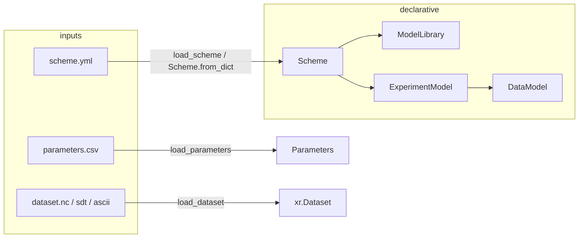
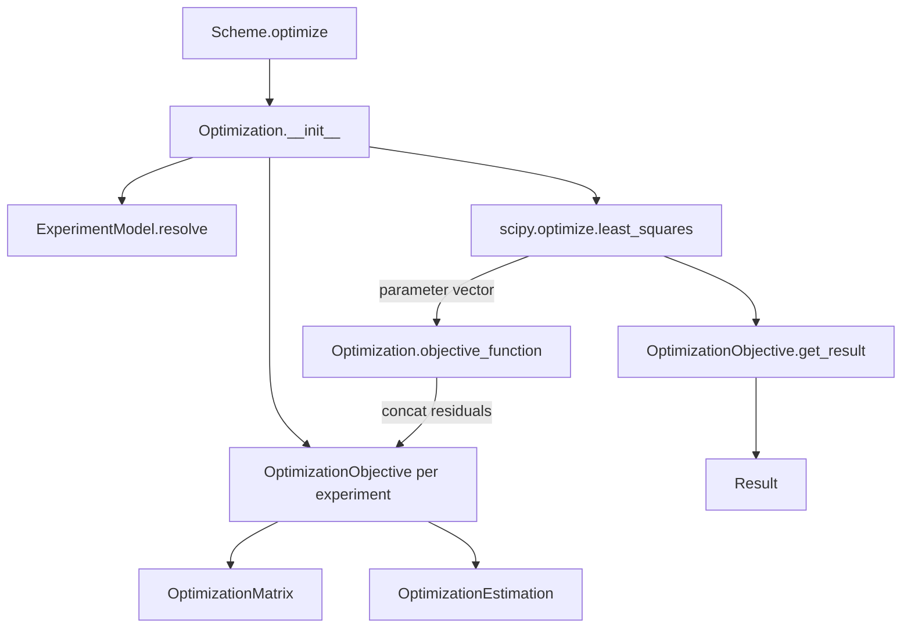
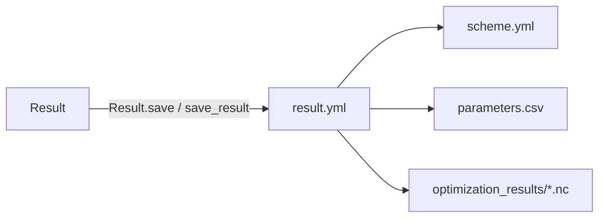

# pyglotaran Architecture Guide

Decision-oriented reference for engineers and coding agents working on the pyglotaran fitting engine (v0.8.0.dev0). Claims are grounded in the current source tree under `glotaran/` and `tests/` unless marked as inferred.

## Table of Contents

1. [System purpose and scope](#1-system-purpose-and-scope)
2. [Architectural center of gravity](#2-architectural-center-of-gravity)
3. [Main execution paths](#3-main-execution-paths)
4. [Core concepts and boundaries](#4-core-concepts-and-boundaries)
5. [Extension architecture](#5-extension-architecture)
6. [Persistence and compatibility](#6-persistence-and-compatibility)
7. [Repository map](#7-repository-map)
8. [Change guidance and risks](#8-change-guidance-and-risks)
9. [Before changing X, inspect Y](#9-before-changing-x-inspect-y)

---

## 1. System purpose and scope

### What pyglotaran solves

pyglotaran is a Python library for **global and target analysis** of time-resolved spectroscopy data. A typical workflow fits a kinetic model (time dimension) together with a spectral model (wavelength or similar dimension) to measured datasets, estimating nonlinear parameters and conditionally linear parameters (CLPs, often spectra or amplitudes).

Primary abstractions:

| Abstraction | Role |
|---|---|
| **Element** | Plugin model component that builds a model matrix and optional result diagnostics (`glotaran/model/element.py`) |
| **DataModel** | Per-dataset composition of elements, weights, and residual method (`glotaran/model/data_model.py`) |
| **ExperimentModel** | One optimization objective: one or more linked datasets, CLP relations/penalties (`glotaran/model/experiment_model.py`) |
| **Scheme** | Top-level declarative specification: shared `ModelLibrary` + named experiments (`glotaran/project/scheme.py`) |
| **Parameters** | Nonlinear fit parameters with bounds, expressions, and history (`glotaran/parameter/`) |
| **Optimization** | Numerical orchestration around SciPy `least_squares` (`glotaran/optimization/optimization.py`) |
| **Result** | Post-fit container: optimized parameters, per-dataset `OptimizationResult`, diagnostics (`glotaran/project/result.py`) |

Data lives in **xarray** `Dataset` / `DataArray` objects with two primary dimensions: a **model dimension** (e.g. time) and a **global dimension** (e.g. spectral).

### Outside project responsibility

- **Plotting and interactive analysis UI** — delegated to optional `pyglotaran-extras` (see `pyproject.toml` optional dependency `extras`).
- **Instrument control and raw data acquisition** — users load data via I/O plugins.
- **General-purpose ML / Bayesian inference** — the engine is least-squares / variable-projection oriented.
- **GUI project management** — there is no `Project` class in the current source tree (see §2).
- **Megacomplex legacy package** — `glotaran/builtin/megacomplexes/` has no `.py` sources on disk today; builtin physics lives under `glotaran/builtin/elements/`.

---

## 2. Architectural center of gravity

### Runtime spine (core API)

The numerical spine is **not** a high-level convenience class. The true execution chain is:

```
Optimization
  → ExperimentModel.resolve(library, parameters)
  → OptimizationObjective(experiment).calculate()   # residual vector
  → OptimizationObjective.get_result()              # fitted outputs
```

`Scheme.optimize()` in `glotaran/project/scheme.py` is a **workflow wrapper** that loads data, constructs `Optimization`, runs it, computes parameter errors, and returns `Result`. Tests use both paths:

- Convenience: `scheme.optimize(parameters, datasets)` — `tests/project/test_scheme.py`
- Core: `Optimization(models=[...], parameters=..., library=...).run()` — `tests/optimization/test_optimization.py`

### Public API layers

| Layer | Entry points | Nature |
|---|---|---|
| Package import | `import glotaran` → `load_plugins()` in `glotaran/__init__.py` | Side effect: registers all entry-point plugins |
| Project workflow | `Scheme`, `Result` from `glotaran/project/__init__.py` | Declarative + convenience |
| I/O | `glotaran.io` re-exports plugin dispatch (`load_scheme`, `save_result`, `load_dataset`, …) | Thin facade over `plugin_system/` |
| Core fitting | `Optimization`, `OptimizationObjective`, `OptimizationMatrix` | Algorithmic center |
| Simulation | `simulate()` in `glotaran/simulation/simulation.py` | Forward model without optimizer |
| Parameters | `Parameters`, `Parameter` | Shared mutable state during optimization |

### Evaluating legacy names

#### `Project`

**Not present in the current source tree.** `glotaran/project/project.py` is absent; only stale `.pyc` caches remain under `glotaran/project/__pycache__/`. The public project package exports only `Scheme` and `Result` (`glotaran/project/__init__.py`).

*Inferred:* Older tutorials and `pyproject.toml` CLI entry point (`glotaran.cli.main:main`) refer to removed code. New work should use `Scheme` + `glotaran.io` functions.

#### `Model`

**Not present as a single class.** Modeling is split:

- **`ModelLibrary`** (`glotaran/project/library.py`) — named, reusable element definitions with `extends` resolution.
- **`ExperimentModel`** — experiment-level settings (CLP linking, penalties, scales).
- **`DataModel`** — per-dataset element lists and weights.

There is no monolithic `Model` wrapper in current sources.

#### `Scheme`

**Primary declarative container.** Holds `library: ModelLibrary`, `experiments: dict[str, ExperimentModel]`, and optional `source_path`. Loaded via `Scheme.from_dict()` or `load_scheme()`. Owns the high-level `optimize()` method.

#### `optimize()`

Two meanings in the codebase history; only one exists today:

| Symbol | Status | Location |
|---|---|---|
| `Scheme.optimize()` | **Active** — main user-facing optimize entry | `glotaran/project/scheme.py` |
| Module-level `optimize(scheme, …)` | **Absent** — `glotaran/optimization/optimize.py` not on disk | — |
| `Optimization.run()` | **Active** — core optimizer | `glotaran/optimization/optimization.py` |

Agents should call `Scheme.optimize()` for end-to-end workflows or `Optimization(...).run()` when constructing experiments programmatically without a `Scheme`.

#### Plugin registration

**Mandatory at import.** `glotaran/__init__.py` calls `load_plugins()`, which loads setuptools entry points:

- `glotaran.plugins.elements`
- `glotaran.plugins.data_io`
- `glotaran.plugins.project_io`

Registries live in `glotaran/plugin_system/base_registry.py` (`__PluginRegistry.element`, `.data_io`, `.project_io`). Element subclasses self-register when `register_as` is set (`glotaran/model/element.py` → `register_element`).

Set `DEACTIVATE_GTA_PLUGINS=1` to skip plugin loading (used in tests).

#### Result objects

Two levels:

1. **`OptimizationResult`** (`glotaran/optimization/objective.py`) — per-dataset fit: `input_data`, `residuals`, `elements`, `activations`, `fit_decomposition`, `meta`.
2. **`Result`** (`glotaran/project/result.py`) — optimization run: `scheme`, `initial_parameters`, `optimized_parameters`, `optimization_info`, `optimization_results: dict[str, OptimizationResult]`.

`OptimizationInfo` (`glotaran/optimization/info.py`) holds SciPy termination data, covariance, chi-square, and histories.

---

## 3. Main execution paths

### 3.1 Construction and loading



**Data ownership:**

- `Scheme` owns the declarative spec. `data` fields in YAML are paths (strings) until `_load_data()` attaches `xr.Dataset` instances (`Scheme._load_data`, `Scheme.from_dict`).
- `Parameters` is passed in by the caller; optimization copies and mutates an internal `Parameters` container (`Optimization.__init__`).

### 3.2 Validation and model resolution

Before optimization, each `ExperimentModel` is resolved:

1. Element label strings → concrete `Element` instances from `ModelLibrary`.
2. Parameter label strings → live `Parameter` objects in the optimization `Parameters` container (`resolve_item_parameters` in `glotaran/model/item.py`).
3. `get_issues()` collects `ItemIssue` objects (missing parameters, exclusive/unique element violations, activation errors).

If any issues exist, `GlotaranModelIssues` is raised (`glotaran/optimization/optimization.py`).

### 3.3 Optimization loop



**Pseudocode — optimization orchestration**  
*Source: `glotaran/optimization/optimization.py`*

```
function Optimization.run():
    (labels, x0, lower, upper) = parameters.get_free_arrays()
    ls_result = least_squares(objective_function, x0, bounds=(lower, upper), ...)
    for each objective in objectives:
        objective.calculate()          // final residual snapshot
    optimization_results = merge(objective.get_result() for objective in objectives)
    optimization_info = OptimizationInfo.from_least_squares_result(ls_result, histories, ...)
    return (parameters, optimization_results, optimization_info)

function objective_function(free_values):
    parameters.set_from_arrays(free_labels, free_values)
    return concatenate(objective.calculate() for objective in objectives)
```

**Invariant:** The same `Parameters` instance is mutated on every objective evaluation and is the returned optimized parameters.

### 3.4 Residual construction

**Pseudocode — `OptimizationObjective.calculate()`**  
*Source: `glotaran/optimization/objective.py`*

```
function OptimizationObjective.calculate():
    if data is global (has global_elements):
        matrix = OptimizationMatrix.from_global_data(data)
        return OptimizationEstimation.calculate(full_matrix, flat_data, residual_function).residual

    matrices = calculate_matrices()                    // per global index or single
    reduced = calculate_reduced_matrices(matrices)     // CLP relations + constraints
    estimations = calculate_estimations(reduced)       // variable projection or NNLS
  penalties = [e.residual for e in estimations]
    if clp_penalties not empty:
        estimations = resolve_estimations(...)
        penalties.append(calculate_clp_penalties(...))
    return concatenate(penalties)
```

**Data transformations at boundaries:**

| Stage | Input | Output | Owner |
|---|---|---|---|
| `OptimizationData.__init__` | `DataModel.data` (xr.Dataset) | 2D numpy slices, weights applied | `OptimizationData` |
| `Element.calculate_matrix` | axes, resolved parameters | CLP labels + matrix | `Element` |
| `OptimizationMatrix.combine/link` | element matrices | combined model matrix | `OptimizationMatrix` |
| `OptimizationMatrix.reduce` | relations, constraints | smaller CLP basis | `OptimizationMatrix` |
| `OptimizationEstimation.calculate` | matrix, data slice | CLP vector + residual slice | `OptimizationEstimation` |

### 3.5 Model matrix generation

**Pseudocode — `OptimizationMatrix.from_data_model()`**  
*Source: `glotaran/optimization/matrix.py`*

```
function from_data_model(model, global_axis, model_axis, weight, global_matrix=False):
    iterator = global_elements if global_matrix else elements
    matrices = [from_element(scale, element, model, global_axis, model_axis)
                for scale, element in iterator(model)]
    matrix = matrices[0] if len(matrices)==1 else combine(matrices)
    if weight: matrix.weight(weight)
    return matrix

function from_element(scale, element, model, global_axis, model_axis):
    (clp_axis, array) = element.calculate_matrix(model, global_axis, model_axis)
    if scale: array *= scale
    return OptimizationMatrix(clp_axis, array, element.clp_constraints)
```

For multi-dataset experiments, `LinkedOptimizationData` aligns global axes and `OptimizationMatrix.from_linked_data` stacks dataset matrices (`glotaran/optimization/data.py`, `matrix.py`).

### 3.6 Variable projection (default residual algorithm)

**Pseudocode — `residual_variable_projection(matrix, data)`**  
*Source: `glotaran/optimization/variable_projection.py`*

```
function residual_variable_projection(matrix, data):
    (qr, tau, ...) = LAPACK.dgeqrf(matrix)           // QR factorization
    temp = LAPACK.dormqr(qr, tau, data)            // apply Q^T to data
    clp = LAPACK.dtrtrs(qr, temp)                  // back-substitution for CLPs
    zeroed = zeros_like(temp); zeroed[:n_clp] = 0
    residual = LAPACK.dormqr(qr, tau, zeroed)      // projected residual (Q2 block)
    return (clp[:n_clp], residual)
```

Alternative: `non_negative_least_squares` via `scipy.optimize.nnls` (`glotaran/optimization/nnls.py`), selected per `DataModel.residual_function` or `ExperimentModel.residual_function`.

### 3.7 Result creation and post-processing

`OptimizationObjective.get_result()` dispatches:

- Single dataset, non-global → `create_single_dataset_result()`
- Single dataset, global elements → `create_global_result()`
- Multiple datasets → `create_multi_dataset_result()`

Post-processing steps include:

- Unweighting residuals for display (`OptimizationData.unweight_result_dataset`)
- Optional SVD of data and residual (`add_svd_to_result_dataset`)
- Per-element `create_result_with_uid()` (`glotaran/model/element.py`)
- Activation-specific results via `ActivationDataModel.create_result()` (`glotaran/builtin/items/activation/data_model.py`)

`Scheme.optimize()` wraps with `calculate_parameter_errors()` and constructs `Result`.

### 3.8 Persistence



`Result.model_dump(mode="json", context={save_folder, saving_options})` replaces in-memory xarray objects with relative file paths (`glotaran/project/result.py`, `glotaran/optimization/objective.py`).

### 3.9 Simulation (forward path)

`simulate(model, library, parameters, coordinates, clp=...)` resolves the model, builds matrices, and multiplies model matrix × CLP without invoking the optimizer (`glotaran/simulation/simulation.py`). Used heavily in tests to generate synthetic data.

---

## 4. Core concepts and boundaries

### Declarative vs executable

| Object | Declarative (serializable spec) | Executable (runtime) |
|---|---|---|
| `Scheme`, `ExperimentModel`, `DataModel`, `Element` | Pydantic models, YAML/JSON round-trip | After `resolve()` + data load |
| `Parameters` | CSV/YAML/dict | Mutable during `least_squares` |
| `xr.Dataset` | Path string in scheme | In-memory arrays with `source_path` attrs |
| `OptimizationResult` | File paths in JSON dump | Live xarray in memory |

### Domain objects

#### `ModelLibrary` (`glotaran/project/library.py`)

- **Responsibility:** Registry of named elements; resolves `extends` chains at construction via `ExtendableElement.extend()`.
- **Lifecycle:** Built from scheme dict `library` section; immutable during optimization.
- **Collaborators:** `DataModel.from_dict` looks up elements by label.
- **Invariant:** Cyclic `extends` raises `GlotaranModelError`.

#### `Element` (`glotaran/model/element.py`)

- **Responsibility:** Physics/math for one model component: `calculate_matrix`, `create_result`.
- **Lifecycle:** Registered at class definition if `register_as` is set.
- **Flags:** `is_exclusive`, `is_unique`, optional `data_model_type` for specialized `DataModel` subclasses.
- **Invariant:** Subclasses must implement abstract matrix and result methods.

#### `DataModel` (`glotaran/model/data_model.py`)

- **Responsibility:** Binds elements to one dataset; validates exclusive/unique rules; optional `global_elements` for global fitting.
- **Lifecycle:** `from_dict` dynamically creates a subclass merging `data_model_type` from elements (`create_class_for_elements`).
- **Invariant:** All elements in one dataset share the same `dimension` (model axis name).

#### `ExperimentModel` (`glotaran/model/experiment_model.py`)

- **Responsibility:** Groups datasets; CLP relations, penalties, linking tolerance/method, per-dataset scales.
- **Lifecycle:** One `OptimizationObjective` per experiment.

#### `Parameters` / `Parameter` (`glotaran/parameter/`)

- **Responsibility:** Nonlinear parameters; expression evaluation via `asteval`; bounds; `vary` flag.
- **Lifecycle:** `Optimization` starts from empty container, seeds from initial parameters during `resolve`.
- **Invariant:** Free parameter vector order follows `get_label_value_and_bounds_arrays(exclude_non_vary=True)`.

#### `OptimizationData` / `LinkedOptimizationData` (`glotaran/optimization/data.py`)

- **Responsibility:** Normalize dataset orientation to `(model_dim, global_dim)`, apply weights, slice for non-global fits, align linked datasets.
- **Ownership:** Created inside `OptimizationObjective`; not persisted.

### Layer separation

| Layer | Packages | Must not depend on |
|---|---|---|
| Orchestration | `project/`, `optimization/optimization.py` | Specific element implementations |
| Model logic | `model/`, `builtin/elements/`, `builtin/items/` | SciPy optimizer details |
| Numerical kernels | `optimization/matrix.py`, `variable_projection.py`, `nnls.py`, numba in elements | I/O plugins |
| I/O | `io/`, `plugin_system/`, `builtin/io/` | Optimization internals (only types) |
| Diagnostics | `optimization/objective.py`, `optimization/info.py` | User plotting |

---

## 5. Extension architecture

### 5.1 Add a model component (Element)

1. Subclass `Element` (or `ExtendableElement`) in a new module.
2. Set `register_as = "my_type"`, `type: Literal["my_type"]`, implement `calculate_matrix` and `create_result`.
3. Optionally set `data_model_type` to a `DataModel` subclass for extra fields.
4. Register via **either**:
   - `@register_element` on import, or
   - Entry point in `pyproject.toml` under `glotaran.plugins.elements` (builtin pattern in `pyproject.toml` lines 89–94).
5. Reference by label in scheme `library` and dataset `elements` list.

**Files:** `glotaran/model/element.py`, `glotaran/plugin_system/element_registration.py`  
**Tests:** `tests/builtin/elements/` (pattern), `tests/optimization/elements.py` (minimal test elements)

### 5.2 Add a residual / optimization algorithm

Current design uses a **fixed map**, not a plugin registry:

```python
SUPPORTED_RESIDUAL_FUNCTIONS = {
    "variable_projection": residual_variable_projection,
    "non_negative_least_squares": residual_nnls,
}
```

(`glotaran/optimization/estimation.py`)

To add a method:

1. Implement `fn(matrix, data) -> (clp, residual)` in `glotaran/optimization/`.
2. Register in `SUPPORTED_RESIDUAL_FUNCTIONS`.
3. Extend `Literal` types on `DataModel.residual_function` and `ExperimentModel.residual_function`.

Changing the outer optimizer (SciPy method) only requires edits in `Optimization` (`SUPPORTED_OPTIMIZATION_METHODS`).

**Tests:** `tests/optimization/test_estimation.py`

### 5.3 Add a file format or serializer

**Measurement data (xr.Dataset):**

1. Subclass `DataIoInterface` (`glotaran/io/interface.py`).
2. Implement `load_dataset` / `save_dataset`.
3. Decorate with `@register_data_io("ext")` or add entry point `glotaran.plugins.data_io`.

**Project artifacts (scheme, parameters, result):**

1. Subclass `ProjectIoInterface`.
2. Implement subset of: `load_parameters`, `save_parameters`, `load_scheme`, `save_scheme`, `load_result`, `save_result`.
3. Decorate with `@register_project_io([...])`.

**Files:** `glotaran/plugin_system/data_io_registration.py`, `glotaran/plugin_system/project_io_registration.py`  
**Reference implementations:** `glotaran/builtin/io/yml/yml.py`, `glotaran/builtin/io/pandas/csv.py`, `glotaran/builtin/io/netCDF/netCDF.py`, `glotaran/builtin/io/sdt/sdt_file_reader.py`  
**Tests:** `tests/plugin_system/`, `tests/builtin/io/`

### 5.4 Add a result diagnostic

Options depend on diagnostic type:

| Approach | Hook | Example |
|---|---|---|
| Per-element output | `Element.create_result()` | `KineticElement`, `SpectralElement` |
| Per-dataset extra dicts | `DataModel.create_result()` static | `ActivationDataModel` |
| Top-level arrays | Extend `OptimizationObjective.create_*_result` | SVD in `add_svd_to_result_dataset` |
| Metadata | `OptimizationResultMetaData` fields | RMSE in `meta` |

Serialization: add field serializers on `OptimizationResult` if new xarray fields need NetCDF round-trip.

**Tests:** `tests/project/test_result.py`, `tests/optimization/test_objective.py`

### 5.5 Add a preprocessing step

1. Subclass `PreProcessor` in `glotaran/io/preprocessor/preprocessor.py`.
2. Add to `PipelineAction` discriminated union in `glotaran/io/preprocessor/pipeline.py`.
3. Call `PreProcessingPipeline.apply(data)` before optimization.

Preprocessors are **not** wired into `Scheme.optimize()` automatically; callers apply them when loading/preparing data.

**Tests:** `tests/io/preprocessor/test_preprocessor.py`

### 5.6 Add a high-level workflow helper

Preferred patterns in this codebase:

- **Simulated fixtures:** `glotaran/testing/simulated_data/` (e.g. `sequential_spectral_decay.py` builds `SCHEME`, `RESULT`).
- **Programmatic construction:** build `ModelLibrary`, `ExperimentModel`, `Scheme` in Python (see `tests/optimization/test_optimization.py`).
- **Do not** assume `Project` or `generators/` — those modules are not in the current source tree.

---

## 6. Persistence and compatibility

### Supported formats (builtin entry points)

| Kind | Formats | Plugin location |
|---|---|---|
| Scheme | `yml`, `yaml` | `glotaran/builtin/io/yml/yml.py` |
| Parameters | `csv`, `tsv`, `xlsx`, `ods` | `glotaran/builtin/io/pandas/` |
| Result index | `yml` (folder layout) | `YmlProjectIo.save_result` |
| Array data | `nc` (NetCDF4) | `glotaran/builtin/io/netCDF/netCDF.py` |
| Raw measurements | `sdt`, `ascii`, `nc` | `builtin/io/sdt/`, `ascii/`, `netCDF/` |

### Runtime vs persisted state

| In memory | On disk (default save) |
|---|---|
| Full `xr.Dataset` arrays | NetCDF files under `optimization_results/` |
| `Scheme` with loaded data | `scheme.yml` (data as paths or copied) |
| `Parameters` with all fields | `initial_parameters.csv`, `optimized_parameters.csv` |
| `OptimizationInfo` with numpy arrays | CSV histories + YAML metadata |
| Plugin full names in attrs | `io_plugin_name`, relative paths for reproducibility |

`SavingOptions` (`glotaran/io/interface.py`) controls filters (`data_filter`), formats, and plugin overrides. `SAVING_OPTIONS_MINIMAL` omits heavy arrays.

### Schema and versioning

- Pydantic models use `extra="forbid"` on core types — unknown YAML keys fail validation.
- `OptimizationInfo.glotaran_version` is stored in serialized results (`tests/project/test_result.py`).
- Element types are discriminated by `type` field (`TypedItem` pattern in `glotaran/model/item.py`).
- **Round-trip note:** `ExtendableElement` serializes the pre-extension copy (`ModelLibrary.serialize`).

### Compatibility constraints

- Plugin short names can collide; full import paths are also registered. Use `set_model_plugin`, `set_data_plugin`, `set_project_plugin` to pin implementations.
- Loading results requires `context={"save_folder": parent_of_result.yml}` for path resolution.
- NumPy `<2.1`, Python `>=3.10,<3.13` per `pyproject.toml`.

---

## 7. Repository map

```
glotaran/
├── __init__.py              # load_plugins() on import
├── project/                 # User-facing workflow types
│   ├── scheme.py            # Scheme + Scheme.optimize()
│   ├── result.py            # Result persistence orchestration
│   └── library.py           # ModelLibrary (element registry for a scheme)
├── model/                   # Declarative model composition (no I/O, no optimizer)
│   ├── element.py           # Element ABC, auto-registration
│   ├── data_model.py        # Per-dataset model, dynamic subclass creation
│   ├── experiment_model.py  # Multi-dataset experiment spec
│   ├── item.py              # Pydantic item base, parameter resolution
│   ├── clp_*.py, weight.py  # Constraints, relations, penalties, weights
│   └── errors.py            # GlotaranModelError, ItemIssue types
├── optimization/            # Numerical engine (center of gravity)
│   ├── optimization.py      # SciPy least_squares wrapper
│   ├── objective.py         # Residual assembly + OptimizationResult building
│   ├── matrix.py            # Model matrix algebra
│   ├── data.py              # Dataset preparation for fitting
│   ├── estimation.py        # CLP estimation dispatch
│   ├── variable_projection.py / nnls.py
│   ├── penalty.py           # CLP penalty residuals
│   └── info.py              # OptimizationInfo, parameter errors
├── parameter/               # Nonlinear parameters container + history
├── simulation/              # Forward model (simulate)
├── io/                      # Facade + interfaces + preprocessors
│   ├── interface.py         # DataIoInterface, ProjectIoInterface, SavingOptions
│   └── preprocessor/        # Optional data corrections (not auto-run)
├── plugin_system/           # Registry infrastructure + registration helpers
├── builtin/
│   ├── elements/            # Builtin Element plugins (kinetic, spectral, …)
│   ├── items/activation/    # Activation types + ActivationDataModel
│   └── io/                  # Builtin format plugins (yml, pandas, netCDF, sdt, ascii)
├── testing/simulated_data/  # Reference schemes/results for tests and examples
├── utils/                   # io helpers, pydantic serde, sanitization
├── deprecation/             # Backward-compat shims for moved modules
└── typing/                  # Shared type aliases (DatasetMappable, etc.)

tests/                       # Mirror of packages; primary architectural examples
```

**Intentionally thin or empty on disk today:** `glotaran/cli/`, `glotaran/analysis/`, `glotaran/builtin/megacomplexes/`, `glotaran/project/generators/` (only `__pycache__` remnants).

---

## 8. Change guidance and risks

### Where to place new behavior

| Change | Place |
|---|---|
| New physical model | New `Element` under `builtin/elements/` or external package with entry point |
| New dataset field on model | `DataModel` subclass via `data_model_type` |
| New experiment-level constraint | `ExperimentModel` field + handling in `OptimizationObjective` / `penalty.py` |
| New file format | I/O plugin, not changes to `Scheme` |
| Optimizer tuning | `Optimization` constructor kwargs only |

### Layer dependency rules

- `model/` must not import from `optimization/` or `builtin/elements/`.
- `builtin/elements/` may import `model/` but not `project/`.
- `plugin_system/base_registry.py` must not import glotaran packages at module level (circular import guard — type checking only).
- Elements should stay free of I/O except via xarray.

### Stable abstractions (avoid breaking without migration plan)

- `Element.calculate_matrix` / `create_result` contract
- `Scheme` YAML structure (`library` + `experiments`)
- `OptimizationResult` field names used in serialization
- Plugin entry point group names
- `Parameters` label.string resolution semantics

### Risks and hidden coupling

1. **Shared mutable `Parameters` during optimization** — objective evaluations mutate in place; side effects affect `ParameterHistory`.
2. **Plugin load order** — entry points load in discovery order; duplicate short names warn and fall back to full plugin name (`PluginOverwriteWarning`).
3. **Dynamic `DataModel` classes** — `create_class_for_elements` generates unique class names; type checks and isinstance across resolve boundaries can surprise.
4. **Linked dataset alignment** — `LinkedOptimizationData` can raise `AlignDatasetError` when tolerances are too tight.
5. **Global vs non-global code paths** — `OptimizationObjective.calculate()` and `get_result()` have separate branches; fixes must often touch both.
6. **Activation result creation** — `ActivationDataModel.create_result` is hard-coded for `MultiGaussianActivation` (TODO in source).
7. **Stale artifacts** — `.pyc` files and `pyproject.toml` references (CLI, megacomplexes mypy overrides) may not match the slimmed source tree.
8. **Weight application** — data is weighted before fit; results are unweighted for display — inconsistent if a new diagnostic uses the wrong array.

### Testing expectations

- Optimization correctness: `tests/optimization/` with `tests/optimization/library.py` test elements.
- Integration spectral-kinetic: `tests/builtin/elements/test_spectral_decay_*.py`.
- Scheme round-trip: `tests/project/test_scheme.py`.
- Result serde: `tests/project/test_result.py` (extensive path coverage).
- Plugin conflicts: `tests/plugin_system/test_base_registry.py`.
- New elements should get matrix tests (`tests/optimization/test_matrix.py` pattern) and at least one end-to-end optimize test.

---

## 9. Before changing X, inspect Y

| If you change… | Inspect first… |
|---|---|
| `Element.calculate_matrix` | `OptimizationMatrix.from_element`, element tests, `simulate()` parity |
| `DataModel` fields | `DataModel.from_dict`, `create_class_for_elements`, YAML examples in `tests/` |
| `ExperimentModel` linking fields | `LinkedOptimizationData`, `test_spectral_decay_linked_model.py` |
| CLP relations/constraints | `OptimizationMatrix.reduce`, `OptimizationEstimation.resolve_clp`, `test_relations_and_constraints.py` |
| Residual function map | `OptimizationEstimation.calculate`, `ExperimentModel.residual_function` default |
| `Optimization.objective_function` | `ParameterHistory`, `calculate_parameter_errors` in `info.py` |
| `OptimizationResult` fields | Pydantic serializers/validators in `objective.py`, `test_result.py` serde |
| `Result.save` / YAML layout | `YmlProjectIo.save_result`, `extract_paths_from_serialization` |
| Plugin registration | `base_registry.add_plugin_to_registry`, entry points in `pyproject.toml` |
| `Scheme.optimize` | `Optimization` constructor, `load_datasets` in `utils/io.py` |
| `ModelLibrary` extends | `ExtendableElement.extend`, `test_scheme.py` round-trip |
| Preprocessing | Not in optimize path — grep callers of `PreProcessingPipeline` |
| Parameter expressions | `Parameter` asteval symtable, `RESERVED_LABELS` |

---

*Document generated from repository inspection. Legacy names (`Project`, `Model`, `Megacomplex`, module-level `optimize`) are documented as removed or absent in the current source tree unless reintroduced.*
