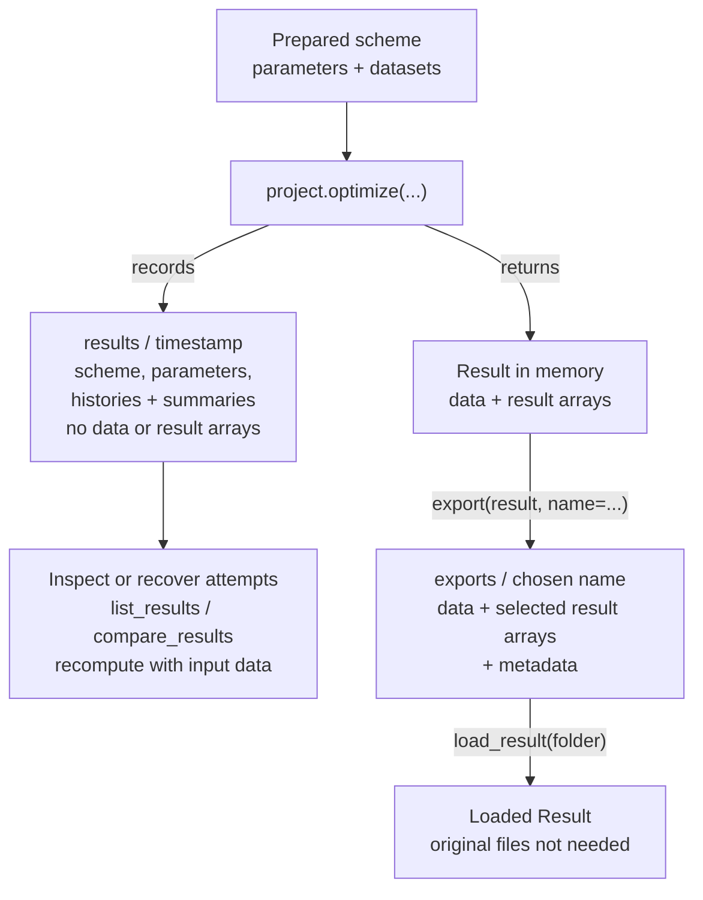
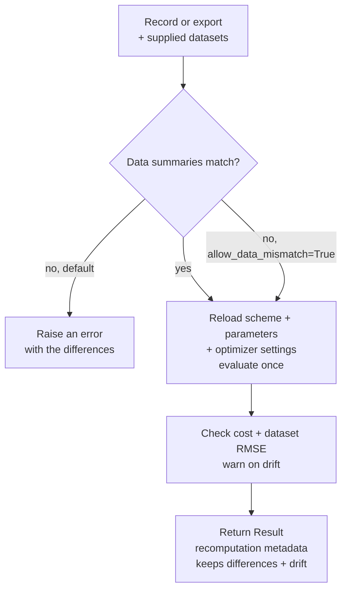
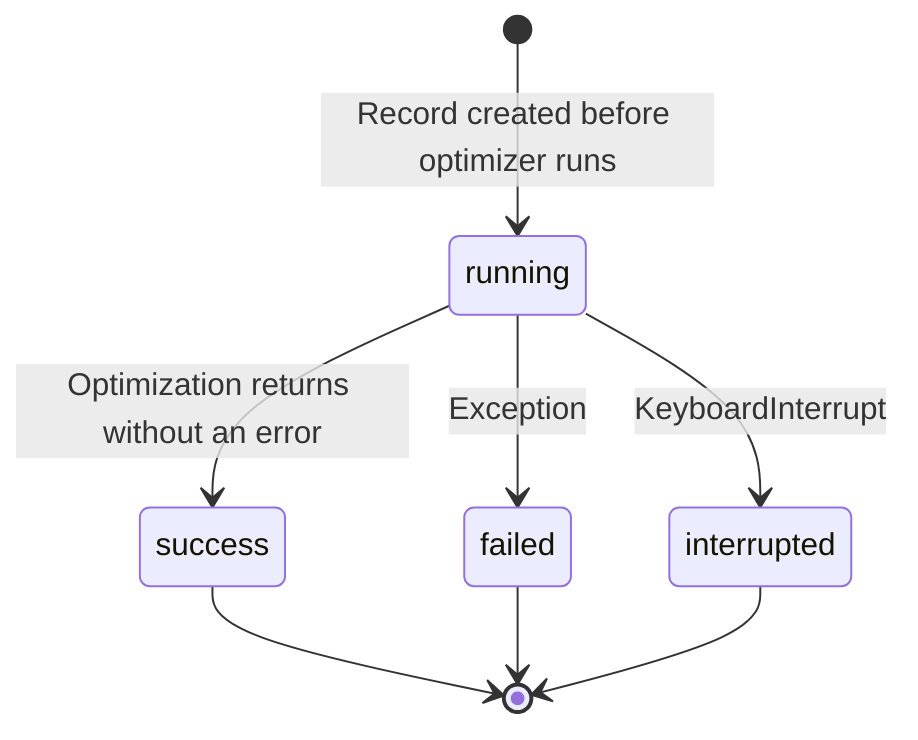

## Project API at a glance

This API makes it possible to keep a small record of each fit attempt, inspect and reconstruct earlier attempts, and deliberately export results for sharing. A `Project` owns the record and export folders; the scientific inputs remain a scheme, parameters and datasets prepared by the caller.

### Fit now, revisit later, export when ready



**Opt-in boundary:** `scheme.optimize(...)` still works as a library call and writes no record. `project.optimize(..., dry_run=True)` also writes no record. A full fit through `project.optimize` creates a record; exporting is a separate call.

### A typical review walkthrough

Assume `scheme`, `parameters` and `datasets` have already been loaded or built, including any preprocessing:

```python
from glotaran.io import load_result
from glotaran.project import Project

project = Project.start("my_project")

first = project.optimize(scheme, parameters, datasets, name="first attempt", verbose=False)
second = project.optimize(scheme, first.optimized_parameters, datasets, name="refinement")

attempts = project.list_results()
comparison = project.compare_results(first.record, second.record)
recovered = project.recompute(first.record, datasets)

export_folder = project.export(recovered, name="paper_fig3")
loaded = load_result(export_folder)
```

`first.record` contains the record id and absolute path. Listing returns a pandas DataFrame. Comparison returns a `FitComparison` that renders as Markdown: changed parameter fields, fit statistics, a scheme diff and data-summary differences. Neither operation refits the data. Record ids, record references, folder paths and in-memory results are accepted by comparison; recompute accepts record ids, references and record or export folders.

### What is saved where?

| | Automatic record: `results/<timestamp>/` | Deliberate export: `exports/<name>/` |
| --- | --- | --- |
| Purpose | Keep fit attempts inexpensive to retain and inspect | Keep or share a result without its original input files |
| Scheme and parameters | `scheme.yml`, initial parameters, optimized or last evaluated parameters when available | Scheme, initial and optimized parameters |
| Input data | Summaries of shape, numeric coordinates, signal and weights; source-file reference | Actual fitted input data, including weights and preprocessing |
| Result arrays | None | Arrays selected by `saving_options`; defaults include fitted data, residuals and element results |
| Histories | Cost per completed objective evaluation; parameter history with `verbose=True` | Result serialization, including available histories |
| Metadata | `record.yml`: status, errors, optimizer settings, environment, source and fit/data summaries | `result.yml`, `export.yml` and a verbatim copy of `project.gta` |
| How to recover arrays | Supply the input data to `project.recompute(...)` | Load the folder with `load_result(...)` |

Records are named by start time, for example `2026-10-04_14-28-05`; collisions get `_2`, `_3`, etc. `name=` labels the attempt without changing that id. `verbose=True` is the optimization default, so parameter history is enabled unless explicitly disabled; cost history is retained either way. These histories count **objective evaluations**, including finite-difference probes, rather than only optimizer iterations.

### What recompute actually does



Recompute writes no new record and does not run an optimizer search. It reconstructs the arrays at the saved parameter values; it does not rebuild the original Jacobian or covariance matrix. Recorded standard errors are carried forward as original-fit information.

The data check uses shape and min/max/mean/RMS statistics, with a tolerance of `1e-6` times the larger RMS for each summarized array. It is **a summary check, not an array identity check or a data hash**: different arrays can have the same summaries. The saved source path is an unchecked reference and can refer to raw data that differ from the preprocessed fit input. The caller must retain or regenerate the actual fitted input. Relative cost/RMSE drift above `1e-6` produces a warning; recompute is not a guarantee of identical results across environments.

<details>
<summary><strong>Reviewer notes: lifecycle, defaults and implementation map</strong></summary>

#### Record lifecycle



- `success` means the optimization returned without an error. Inspect the separate `converged` flag and termination reason to assess convergence; reaching the evaluation budget can still leave a `success` record.
- Failed/interrupted attempts retain the error and, if an objective evaluation completed, the last evaluated parameters without standard errors. If no evaluation completed, there is no `optimized_parameters.csv` to recompute from.
- A process or kernel that never returns to Python can leave a record at `running`; this is not a live progress monitor. Histories are written when the call finishes, rather than streamed to disk.
- Record-write failures warn without replacing the fit outcome. A raised optimizer exception or `KeyboardInterrupt` is recorded and re-raised; `raise_exception=False` keeps the underlying optimizer's handling of recoverable errors.

#### Folder and export behavior

- `Project.start()` uses the current working directory. An explicit folder is created if missing; a missing `project.gta` gets an empty metadata template. Existing metadata is preserved, parent folders are not searched, and paths are resolved once. `project.gta` describes the research project; its fields are not fitting configuration.
- `Project.start("my_project", results="alternative_results")` creates a separate record collection. Two instances in the same project share `project.gta` and `exports/`.
- `list_results` sorts records by start time and filters by source, scheme source, name and status. Old v0.7 result folders are ignored; damaged records are skipped with a warning.
- Export defaults to `name="last_result"`. If the destination exists, it warns and leaves it unchanged. `overwrite=True` replaces only a folder marked by `export.yml`.
- `saving_options` controls result arrays/formats, but fitted input data are always written, even if `input_data` appears in the data filter. `include_source_files=True` additionally copies original source-data files on a best-effort basis; missing files warn and are listed in metadata.
- Export saves the result as it is in memory. If optimized parameters were edited after fitting, it warns and lists them in metadata; it does not refit or update the arrays automatically.
- Notebook/script detection is best effort, with `unknown` as the fallback. Recording does not archive preprocessing or establish parent/child fit lineage.

#### Where to focus in the diff

Paths below are relative to `glotaran/`:

| Code | Responsibility |
| --- | --- |
| `project/project.py` | Public API and coordination of the operations above |
| `project/record.py` | Timestamp folders, status transitions, metadata and history files |
| `project/data_summary.py` | Data summaries and mismatch messages |
| `project/recompute.py` | Reload, evaluate once and report drift |
| `project/compare.py` | Record listing and Markdown fit comparisons |
| `project/export.py` | Export packaging, data inclusion and overwrite behavior |
| `project/scheme.py`, `project/result.py`, `optimization/` and IO code | Supporting changes: fit snapshots, optimizer settings, histories and serialization |

The supporting changes also affect library calls: fits snapshot the scheme/parameters/data, input weights survive serialization, histories use user parameter values, and dry runs report statistics for their one evaluation. Review these shared paths as well as the `Project` wrapper.

</details>
